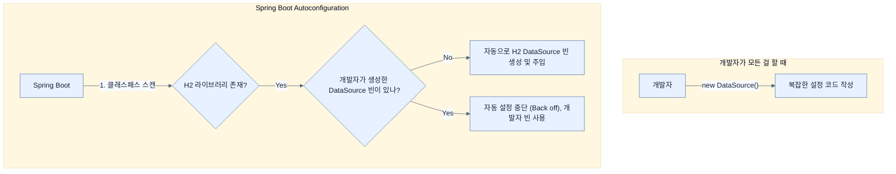

# Autoconfiguring Spring beans

## 한눈에 보기
| 항목 | 핵심 |
|------|------|
| Autoconfiguration | Spring Boot가 클래스패스와 상황을 보고 빈을 자동으로 등록해주는 기능 |
| Application Context | 빈(Bean)들을 생성하고 생명주기를 관리하는 컨테이너 |
| Dependency Injection (DI) | 객체가 필요한 의존성을 스스로 만들지 않고 컨테이너로부터 주입받는 패턴 |

## 1. 왜 이게 필요한가

### 이런 상황을 상상해 보자
애플리케이션을 만들 때 데이터베이스 연결이 필요하다고 가정해보자. 연결을 위해 `DataSource` 객체를 생성하고, 각종 설정(URL, 사용자명, 비밀번호, 커넥션 풀 등)을 직접 코드로 작성해야 한다. 웹 서버나 보안 같은 다른 기술을 추가할 때마다 이런 인프라 설정 코드가 계속 늘어난다.

### 여기서 뭐가 무너지나
개발자는 비즈니스 로직을 짜는 것보다 스프링에 각종 기반 기술들을 연결하고 설정하는 코드(boilerplate)를 작성하는 데 더 많은 시간을 쏟게 된다. 특정 데이터베이스나 서버를 설정하는 방대한 매뉴얼을 매번 찾아봐야 한다.

### 그래서 나온 생각
"개발자가 직접 설정 코드를 다 쓰지 말고, 포함된 라이브러리를 바탕으로 프레임워크가 알아서 기본 설정을 해주면 어떨까?"라는 발상이 **[[autoconfiguration]]**이다. 
개발자가 직접 `new` 키워드로 객체를 생성하는 대신, **[[application-context]]**라는 환경(컨테이너)이 알아서 객체(**[[spring-bean]]**)를 생성하고 조립해준다. 이렇게 조립된 객체를 알아서 넣어주는 방식을 **[[dependency-injection]]**(DI)이라고 부른다.

### 비유로 잡기
설정을 여러 겹의 투명 필름에 비유하면, 아래의 기본값 위에 환경별 필름을 겹쳐 최종 값을 읽는 셈이다.

→ 비유가 깨지는 지점: 실제 설정은 필름처럼 단순히 마지막 줄만 보는 것이 아니라 소스별 우선순위, 바인딩 규칙, 활성화 조건까지 함께 평가한다.

### 이 절의 언어
**[[autoconfiguration]]**(= 상황과 포함된 라이브러리에 맞게 스프링 빈을 자동 등록하는 기능), **[[application-context]]**(= 생성된 객체(빈)들을 담아두고 생명주기를 관리하는 컨테이너), **[[spring-bean]]**(= 애플리케이션 컨텍스트에 의해 관리되는 객체), **[[dependency-injection]]**(= 객체가 스스로 의존성을 만들지 않고 외부에서 주입받는 패턴)

## 2. 어떻게 동작하는가

먼저 다음 세 축으로 메커니즘을 읽는다.

1. **입력과 전제 확인** — 어떤 요청·설정·데이터가 들어오는지 확인한다. 잘못된 전제를 다음 계층으로 넘기지 않기 위해서다.
2. **Spring 추상화 적용** — 스타터와 자동 구성, 어노테이션 또는 명시적 빈이 실제 처리를 연결한다. 반복 배선보다 도메인 선택에 집중하기 위해서다.
3. **결과와 경계 검증** — 응답·저장 상태·운영 신호를 확인한다. 정상 경로만 보고 장애·버전·성능 차이를 놓치지 않기 위해서다.

1. **조건부 정책 평가**: 애플리케이션 시작 시 Spring Boot는 현재 클래스패스와 상황을 확인한다. (예: `DataSource.class`가 있는지, H2 라이브러리가 포함되어 있는지) — 이 조건에 맞을 때만 자동 설정을 가동하기 위해서다.
2. **자동 빈 등록**: 조건이 일치하면 관련된 빈(Bean)들을 애플리케이션 컨텍스트에 등록한다. — 개발자가 지루한 인프라 설정 코드를 작성하는 수고를 덜어주기 위해서다.
3. **개발자 설정 존중 (Backing off)**: 만약 개발자가 직접 `DataSource` 타입의 빈을 정의해서 등록했다면, Spring Boot의 자동 설정은 뒤로 물러나고(back off) 개발자의 빈을 사용한다. — 맹목적인 자동화가 아니라 개발자에게 유연한 제어권을 남겨두기 위해서다.

## 3. 그림으로 보기

## 4. 이 노트에 나온 용어
| 용어 | 한 줄 | 자세히 |
|------|-------|--------|
| autoconfiguration | 상황과 포함된 라이브러리에 맞게 스프링 빈을 자동 등록하는 기능 | [[_glossary#autoconfiguration]] |
| application-context | 생성된 객체(빈)들을 담아두고 생명주기를 관리하는 컨테이너 | [[_glossary#application-context]] |
| spring-bean | 애플리케이션 컨텍스트에 의해 관리되는 객체 | [[_glossary#spring-bean]] |
| dependency-injection | 객체가 스스로 의존성을 만들지 않고 외부에서 주입받는 패턴 | [[_glossary#dependency-injection]] |

## 5. 자주 헷갈리는 것
- 이 주제의 **Spring 추상화**와 그 아래에서 실제로 동작하는 라이브러리·프로토콜을 같은 것으로 보지 않는다. 추상화는 기본 배선을 줄이지만 하위 계층의 비용과 실패를 없애지 않는다.

## 6. 언제 안 쓰나 / 경계
- 책의 예제는 개념을 드러내기 위한 작은 애플리케이션이다. 운영 환경에서는 인증 정보, 장애 복구, 관측성, 부하와 데이터 규모를 별도로 검증한다.
- 이 노트의 API와 기본값은 책의 Spring Boot 4.1·Java 25 맥락을 따른다. 다른 마이너 버전에서는 공식 마이그레이션 문서와 실제 의존성 버전을 함께 확인한다.

## 7. 연결
- [[00-technical-requirements]] — JDK와 실행 환경이 맞아야 Application Context의 시작 동작을 같은 조건에서 관찰할 수 있다.
- [[02-adding-portfolio-components-using-spring-boot-starters]] — 같은 장의 학습 흐름에서 Autoconfiguring Spring beans의 전제 또는 다음 적용 단계와 연결된다.

## 8. 스스로 확인
1. 자동 설정(Autoconfiguration)은 개발자가 직접 설정한 빈(Bean)과 충돌할 때 어떻게 동작하는가?
2. `new` 키워드로 직접 객체를 생성하는 대신, Application Context를 통해 의존성을 주입(DI)받으면 얻는 가장 큰 이점(특히 유연성 측면에서)은 무엇인가?

<!-- ==== 아래는 내 영역 · 스킬 수정 금지 ==== -->

## 내 설명 시도

## 막혔던 지점

## 리뷰 이력
