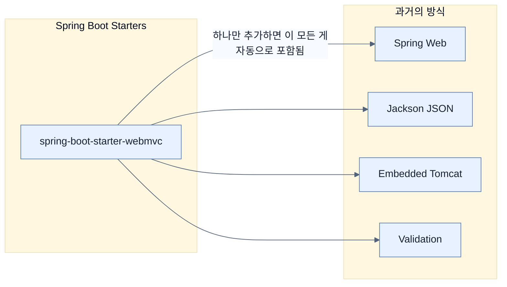

# Adding portfolio components using Spring Boot starters

## 한눈에 보기
| 항목 | 핵심 |
|------|------|
| Starters | 특정 기능을 사용하기 위해 필요한 의존성(라이브러리)들을 논리적으로 묶어놓은 패키지 |
| Architectural Intent | 선택한 스타터가 애플리케이션의 아키텍처 방향(예: Servlet vs Reactive)을 명확하게 보여줌 |

## 1. 왜 이게 필요한가

### 이런 상황을 상상해 보자
새로운 웹 애플리케이션 기능을 만들려고 한다. 웹 처리를 위해 Spring MVC, JSON 직렬화를 위한 Jackson, 내장 서버인 톰캣 같은 모듈들을 각각 찾아 빌드 파일(`pom.xml`이나 `build.gradle`)에 하나씩 추가해야 한다.

### 여기서 뭐가 무너지나
수십 개의 개별 라이브러리 좌표와 호환되는 버전을 기억하고 유지보수해야 한다. 어떤 라이브러리들끼리 버전이 잘 맞는지 일일이 테스트하다 보면, 정작 핵심 코드를 짜기도 전에 의존성 지옥에 빠져 지쳐버린다.

### 그래서 나온 생각
"웹 개발을 할 거면 거기에 필요한 부품들을 우리가 다 모아서 하나의 세트로 줄게!" 이것이 **[[spring-boot-starter]]**다. 
개별 의존성의 목록을 유지하는 대신, `spring-boot-starter-webmvc` 하나만 선언하면 관련된 모든 패키지와 설정이 한 번에 따라온다. (이 기반 기술들은 현재 Java EE의 후속작인 **[[jakarta-ee]]** 스펙을 따른다.)

### 비유로 잡기
웹 계층은 주문 창구와 비슷하다. 요청을 받아 형식을 확인하고, 알맞은 작업자에게 넘긴 뒤 HTML이나 JSON으로 결과를 돌려준다.

→ 비유가 깨지는 지점: 실제 HTTP 요청은 한 창구에서 끝나지 않는다. 필터, 보안, 직렬화, 예외 변환과 네트워크 경계가 함께 작동한다.

### 이 절의 언어
**[[spring-boot-starter]]**(= 특정 기능(웹, DB 등)을 구현할 때 필요한 라이브러리들을 하나로 묶어둔 패키지), **[[jakarta-ee]]**(= 엔터프라이즈 자바의 현대 표준 스펙 (Java EE의 후속작))

## 2. 어떻게 동작하는가

먼저 다음 세 축으로 메커니즘을 읽는다.

1. **입력과 전제 확인** — 어떤 요청·설정·데이터가 들어오는지 확인한다. 잘못된 전제를 다음 계층으로 넘기지 않기 위해서다.
2. **Spring 추상화 적용** — 스타터와 자동 구성, 어노테이션 또는 명시적 빈이 실제 처리를 연결한다. 반복 배선보다 도메인 선택에 집중하기 위해서다.
3. **결과와 경계 검증** — 응답·저장 상태·운영 신호를 확인한다. 정상 경로만 보고 장애·버전·성능 차이를 놓치지 않기 위해서다.

1. **의존성 묶음 제공**: 웹 기능이 필요하면 `spring-boot-starter-webmvc`, JPA가 필요하면 `spring-boot-starter-data-jpa`를 빌드 파일에 추가한다. — 필요한 수많은 라이브러리 목록을 단 한 줄로 압축하기 위해서다.
2. **자동 설정 가동**: 스타터를 추가하면 수많은 라이브러리들이 클래스패스에 올라오게 되고, 이는 곧 앞서 배운 자동 설정 기능이 가동되는 트리거가 된다. — 라이브러리를 가져오는 것뿐만 아니라 기반 설정까지 완료하기 위해서다.
3. **아키텍처의 명시화**: `webmvc`를 고르면 서블릿 기반으로, `webflux`를 고르면 리액티브 기반으로 앱이 구성된다. — 스타터 선택 자체가 이 앱이 어떤 아키텍처로 짜여졌는지 명확히 보여주는 지표가 되게 하기 위해서다.

## 3. 그림으로 보기

## 4. 이 노트에 나온 용어
| 용어 | 한 줄 | 자세히 |
|------|-------|--------|
| spring-boot-starter | 특정 기능(웹, DB 등)을 구현할 때 필요한 라이브러리들을 하나로 묶어둔 패키지 | [[_glossary#spring-boot-starter]] |
| jakarta-ee | 엔터프라이즈 자바의 현대 표준 스펙 (Java EE의 후속작) | [[_glossary#jakarta-ee]] |

## 5. 자주 헷갈리는 것
- 이 주제의 **Spring 추상화**와 그 아래에서 실제로 동작하는 라이브러리·프로토콜을 같은 것으로 보지 않는다. 추상화는 기본 배선을 줄이지만 하위 계층의 비용과 실패를 없애지 않는다.

## 6. 언제 안 쓰나 / 경계
- 책의 예제는 개념을 드러내기 위한 작은 애플리케이션이다. 운영 환경에서는 인증 정보, 장애 복구, 관측성, 부하와 데이터 규모를 별도로 검증한다.
- 이 노트의 API와 기본값은 책의 Spring Boot 4.1·Java 25 맥락을 따른다. 다른 마이너 버전에서는 공식 마이그레이션 문서와 실제 의존성 버전을 함께 확인한다.

## 7. 연결
- [[01-autoconfiguring-spring-beans]] — 같은 장의 학습 흐름에서 Adding portfolio components using Spring Boot starters의 전제 또는 다음 적용 단계와 연결된다.
- [[03-customizing-the-setup-with-configuration-properties]] — 같은 장의 학습 흐름에서 Adding portfolio components using Spring Boot starters의 전제 또는 다음 적용 단계와 연결된다.

## 8. 스스로 확인
1. 웹 애플리케이션을 만들 때 `spring-boot-starter-webmvc` 하나만 추가하면 내부적으로 어떤 것들이 함께 딸려 오는가?
2. `spring-boot-starter-webmvc`와 `spring-boot-starter-webflux` 중 어떤 것을 선택하느냐는 애플리케이션의 아키텍처에 어떤 의미를 갖는가?

<!-- ==== 아래는 내 영역 · 스킬 수정 금지 ==== -->

## 내 설명 시도

## 막혔던 지점

## 리뷰 이력
