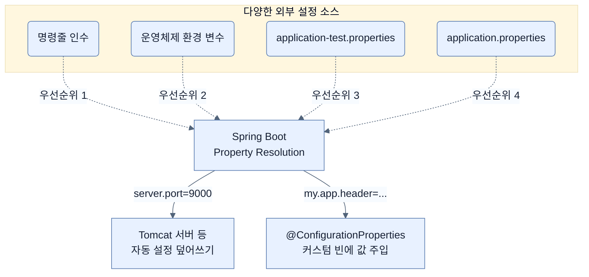

# Customizing the setup with configuration properties

## 한눈에 보기
| 항목 | 핵심 |
|------|------|
| Configuration properties | Spring Boot나 개발자가 만든 빈의 설정을 외부 설정(`application.properties` 등)에서 주입받는 기능 |
| Profiles | 실행 환경(dev, test, prod 등)에 따라 서로 다른 설정 묶음을 선택적으로 적용하는 기능 |

## 1. 왜 이게 필요한가

### 이런 상황을 상상해 보자
Spring Boot 스타터를 추가하면 내장 Tomcat 서버가 8080 포트로 자동 설정된다. 그런데 우리 회사는 이 포트를 9000번으로 바꾸어 사용해야 한다. 또한 애플리케이션에서 외부 API(예: GitHub)에 접근하기 위해 보안 토큰(passcode)이 필요한 상황이다.

### 여기서 뭐가 무너지나
포트 번호나 보안 토큰을 자바 소스 코드 안에 그대로 적어두면(하드코딩), 포트를 바꾸거나 토큰이 만료되어 변경될 때마다 애플리케이션 코드를 수정하고 다시 빌드해서 재배포해야 한다. 특히 개발 환경의 데이터베이스 주소와 실제 운영 환경의 데이터베이스 주소는 당연히 다를 텐데, 환경이 바뀔 때마다 코드를 고칠 수는 없다.

### 그래서 나온 생각
코드 안에 고정된 설정값을 빼내어 외부로 분리하자. 그리고 그 설정값들을 스프링 빈에 주입(**[[configuration-properties]]**)해서 사용하게 만들면 된다. 더 나아가 환경별로 설정 파일의 이름을 다르게 만들어 두고, 실행 시점에 어떤 환경(**[[profile]]**)인지 알려주기만 하면 소스 코드 변경 없이 유연하게 서버 주소나 포트를 덮어쓸 수 있다.

### 비유로 잡기
설정을 여러 겹의 투명 필름에 비유하면, 아래의 기본값 위에 환경별 필름을 겹쳐 최종 값을 읽는 셈이다.

→ 비유가 깨지는 지점: 실제 설정은 필름처럼 단순히 마지막 줄만 보는 것이 아니라 소스별 우선순위, 바인딩 규칙, 활성화 조건까지 함께 평가한다.

### 이 절의 언어
**[[configuration-properties]]**(= 외부 속성값을 읽어서 객체의 필드에 바인딩(주입)하는 기능), **[[profile]]**(= 개발/테스트/운영 등 환경에 따라 다른 설정을 묶어놓은 그룹 명칭)

## 2. 어떻게 동작하는가

먼저 다음 세 축으로 메커니즘을 읽는다.

1. **입력과 전제 확인** — 어떤 요청·설정·데이터가 들어오는지 확인한다. 잘못된 전제를 다음 계층으로 넘기지 않기 위해서다.
2. **Spring 추상화 적용** — 스타터와 자동 구성, 어노테이션 또는 명시적 빈이 실제 처리를 연결한다. 반복 배선보다 도메인 선택에 집중하기 위해서다.
3. **결과와 경계 검증** — 응답·저장 상태·운영 신호를 확인한다. 정상 경로만 보고 장애·버전·성능 차이를 놓치지 않기 위해서다.

1. **외부 설정 주입**: Spring Boot는 시작할 때 `application.properties`, 시스템 환경 변수, 커맨드라인 인수 등 다양한 외부 소스에서 속성을 읽어온다. — 애플리케이션 동작을 코드 수정 없이 외부에서 변경하기 위해서다. (예: `server.port=9000`)
2. **커스텀 빈에 바인딩**: `@ConfigurationProperties(prefix="my.app")`를 클래스에 붙이면, 접두사가 `my.app`인 속성값들을 찾아 객체의 필드에 자동으로 채워준다. — 연관된 여러 설정값들을 하나의 객체로 응집력 있게 다루기 위해서다.
3. **환경별 프로필 적용**: `application-{profile}.properties` 형식으로 파일을 만들고, 애플리케이션 실행 시 특정 프로필(예: `test`)을 활성화하면 해당 파일의 설정이 기본 설정을 덮어쓴다. — 테스트 서버나 운영 서버 등 각 배포 환경에 맞는 설정을 안전하게 스위칭하기 위해서다.
4. **조건부 빈 생성**: `@ConditionalOnProperty` 애노테이션을 사용하면 특정한 속성값이 존재하거나 특정 값과 일치할 때만 스프링 빈을 생성하도록 제어할 수 있다. — 설정에 따라 구현체(예: YouTubeService vs VimeoService)를 동적으로 선택하기 위해서다.

## 3. 그림으로 보기

## 4. 이 노트에 나온 용어
| 용어 | 한 줄 | 자세히 |
|------|-------|--------|
| configuration-properties | 외부 속성값을 읽어서 객체의 필드에 바인딩(주입)하는 기능 | [[_glossary#configuration-properties]] |
| profile | 개발/테스트/운영 등 환경에 따라 다른 설정을 묶어놓은 그룹 명칭 | [[_glossary#profile]] |

## 5. 자주 헷갈리는 것
- 이 주제의 **Spring 추상화**와 그 아래에서 실제로 동작하는 라이브러리·프로토콜을 같은 것으로 보지 않는다. 추상화는 기본 배선을 줄이지만 하위 계층의 비용과 실패를 없애지 않는다.

## 6. 언제 안 쓰나 / 경계
- 책의 예제는 개념을 드러내기 위한 작은 애플리케이션이다. 운영 환경에서는 인증 정보, 장애 복구, 관측성, 부하와 데이터 규모를 별도로 검증한다.
- 이 노트의 API와 기본값은 책의 Spring Boot 4.1·Java 25 맥락을 따른다. 다른 마이너 버전에서는 공식 마이그레이션 문서와 실제 의존성 버전을 함께 확인한다.

## 7. 연결
- [[02-adding-portfolio-components-using-spring-boot-starters]] — 같은 장의 학습 흐름에서 Customizing the setup with configuration properties의 전제 또는 다음 적용 단계와 연결된다.
- [[04-managing-application-dependencies]] — 같은 장의 학습 흐름에서 Customizing the setup with configuration properties의 전제 또는 다음 적용 단계와 연결된다.

## 8. 스스로 확인
1. 프로필을 활용할 때, 기본 설정 파일(`application.properties`)과 특정 환경 설정 파일(`application-test.properties`)에 같은 속성이 정의되어 있다면 어느 것이 우선순위를 갖는가?
2. 애플리케이션의 중요한 보안 키를 소스 코드가 아닌 외부의 `@ConfigurationProperties`를 통해 관리하면 얻을 수 있는 가장 큰 이점은 무엇인가?

<!-- ==== 아래는 내 영역 · 스킬 수정 금지 ==== -->

## 내 설명 시도

## 막혔던 지점

## 리뷰 이력
