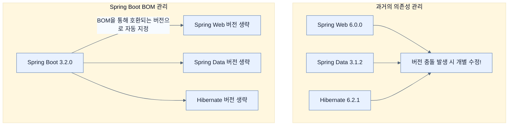

# Managing application dependencies

## 한눈에 보기
| 항목 | 핵심 |
|------|------|
| Dependency Management | 수많은 라이브러리들의 버전을 호환성 문제 없이 한 번에 관리해주는 기능 |
| BOM (Bill of Materials) | 함께 사용했을 때 충돌이 없는 라이브러리들의 버전 목록을 정의해둔 명세서 |

## 1. 왜 이게 필요한가

### 이런 상황을 상상해 보자
새로운 기능을 쓰기 위해 Spring Data JPA의 버전을 올리고 싶다. 그런데 내 프로젝트에는 Spring Web MVC, Spring Security, Hibernate 등 다른 라이브러리들도 잔뜩 얽혀 있다.

### 여기서 뭐가 무너지나
JPA 버전만 덜렁 올렸다가 MVC나 Security와 버전이 호환되지 않아(의존성 충돌) 애플리케이션이 뻗어버릴 수 있다. 어떤 버전끼리 잘 맞는지 알아내기 위해 개발자는 며칠 동안 구글링하며 오류 보고서를 뒤져야 하고, 최악의 경우 버전 롤백을 반복하는 '의존성 지옥'에 빠지게 된다. 스타터와 자동 설정이 아무리 훌륭해도 이 문제가 해결되지 않으면 무용지물이다.

### 그래서 나온 생각
"서로 호환되는 라이브러리들의 버전을 우리가 미리 전부 테스트해서 묶음으로 제공해줄게!" 
Spring Boot는 자체 코드뿐만 아니라, 가장 잘 맞는 외부 라이브러리들의 버전 목록인 **[[bill-of-materials]]**(BOM)을 함께 배포한다. 덕분에 개발자는 개별 라이브러리의 버전을 일일이 명시할 필요 없이, Spring Boot 버전 하나만 올리면 모든 라이브러리가 호환되는 새 버전으로 일괄 업데이트된다.

### 비유로 잡기
이 기능은 조립 라인의 한 공정과 비슷하다. 입력을 정해진 규칙으로 변환해 다음 공정이 사용할 결과를 만든다.

→ 비유가 깨지는 지점: 애플리케이션은 고정된 조립 라인이 아니다. 조건부 구성과 런타임 실패, 외부 시스템 변화 때문에 공정의 경계를 따로 검증해야 한다.

### 이 절의 언어
**[[bill-of-materials]]**(= (BOM) 호환성이 검증된 수많은 라이브러리들의 정확한 버전 목록을 담은 명세서), **[[cve]]**(= (Common Vulnerabilities and Exposures) 공개적으로 알려진 소프트웨어의 보안 취약점)

## 2. 어떻게 동작하는가

먼저 다음 세 축으로 메커니즘을 읽는다.

1. **입력과 전제 확인** — 어떤 요청·설정·데이터가 들어오는지 확인한다. 잘못된 전제를 다음 계층으로 넘기지 않기 위해서다.
2. **Spring 추상화 적용** — 스타터와 자동 구성, 어노테이션 또는 명시적 빈이 실제 처리를 연결한다. 반복 배선보다 도메인 선택에 집중하기 위해서다.
3. **결과와 경계 검증** — 응답·저장 상태·운영 신호를 확인한다. 정상 경로만 보고 장애·버전·성능 차이를 놓치지 않기 위해서다.

1. **버전 생략**: `pom.xml`이나 `build.gradle`에서 의존성을 추가할 때 버전을 적지 않는다. (예: `<version>` 태그 생략) — 버전을 개별적으로 고정하지 않고 Spring Boot의 관리에 전적으로 맡기기 위해서다.
2. **BOM을 통한 버전 결정**: 빌드 도구가 의존성을 다운로드할 때, Spring Boot가 제공하는 BOM(Spring Boot Dependencies)을 참조하여 호환성이 완벽히 검증된 버전을 찾아낸다. — 라이브러리 간의 버전 충돌을 원천 차단하기 위해서다.
3. **일괄 업데이트와 보안 패치**: 보안 취약점(**[[cve]]**)이 발견되거나 새 기능이 필요할 때, 단순히 Spring Boot의 버전만 살짝 올리면 BOM도 갱신되어 내부의 수많은 라이브러리들이 모두 안전한 최신 버전으로 함께 업그레이드된다. — 유지보수를 압도적으로 쉽게 만들기 위해서다.

## 3. 그림으로 보기

## 4. 이 노트에 나온 용어
| 용어 | 한 줄 | 자세히 |
|------|-------|--------|
| bill-of-materials | (BOM) 호환성이 검증된 수많은 라이브러리들의 정확한 버전 목록을 담은 명세서 | [[_glossary#bill-of-materials]] |
| cve | (Common Vulnerabilities and Exposures) 공개적으로 알려진 소프트웨어의 보안 취약점 | [[_glossary#cve]] |

## 5. 자주 헷갈리는 것
- 이 주제의 **Spring 추상화**와 그 아래에서 실제로 동작하는 라이브러리·프로토콜을 같은 것으로 보지 않는다. 추상화는 기본 배선을 줄이지만 하위 계층의 비용과 실패를 없애지 않는다.

## 6. 언제 안 쓰나 / 경계
- 책의 예제는 개념을 드러내기 위한 작은 애플리케이션이다. 운영 환경에서는 인증 정보, 장애 복구, 관측성, 부하와 데이터 규모를 별도로 검증한다.
- 이 노트의 API와 기본값은 책의 Spring Boot 4.1·Java 25 맥락을 따른다. 다른 마이너 버전에서는 공식 마이그레이션 문서와 실제 의존성 버전을 함께 확인한다.

## 7. 연결
- [[03-customizing-the-setup-with-configuration-properties]] — 같은 장의 학습 흐름에서 Managing application dependencies의 전제 또는 다음 적용 단계와 연결된다.
- [[02-adding-portfolio-components-using-spring-boot-starters]] — 같은 장의 학습 흐름에서 Managing application dependencies의 전제 또는 다음 적용 단계와 연결된다.

## 8. 스스로 확인
1. Spring Boot 프로젝트에서 새로운 라이브러리(예: `spring-boot-starter-web`)를 추가할 때 버전을 굳이 명시하지 않아도 잘 작동하는 이유는 무엇인가?
2. 특정 라이브러리에서 심각한 보안 취약점(CVE)이 발견되었을 때, 개별 라이브러리의 버전을 찾아서 수정하는 대신 가장 빠르고 안전하게 대처하는 방법은 무엇인가?

<!-- ==== 아래는 내 영역 · 스킬 수정 금지 ==== -->

## 내 설명 시도

## 막혔던 지점

## 리뷰 이력
