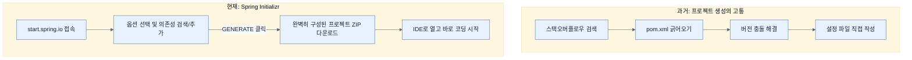

# Using start.spring.io to build apps

## 한눈에 보기
| 항목 | 핵심 |
|------|------|
| Spring Initializr | 웹 화면에서 클릭 몇 번으로 빌드 설정과 모듈이 완벽히 구성된 뼈대 프로젝트를 생성해 주는 도구 |
| Make JAR not WAR | 외부 서버(Tomcat 등)에 배포하는 방식(WAR) 대신, 애플리케이션 자체가 서버를 품고 스스로 실행되는 방식(JAR)을 권장 |

## 1. 왜 이게 필요한가

### 이런 상황을 상상해 보자
Spring Boot 이전 시대에는 새 프로젝트를 시작하려면 구글이나 스택오버플로우를 뒤져서 복잡한 XML 설정 파일 조각들을 복사해와야 했다. 아니면 기존 프로젝트를 통째로 복사한 뒤 불필요한 코드를 하나하나 지워가며 초기 설정을 억지로 맞춰야 했다.

### 여기서 뭐가 무너지나
프로젝트 셋업에만 수 시간에서 수 일이 걸린다. 오래된 블로그의 설정을 따라 하다가 이미 없어진 모듈을 참조하거나, 라이브러리 간 버전 충돌이 나서 코딩은 시작도 못 해보고 지치는 경우가 다반사였다. 

### 그래서 나온 생각
"처음 시작하는 그 지루하고 고통스러운 셋업 과정을 자동화하자!"
**[[spring-initializr]]**(start.spring.io)는 원하는 빌드 도구(Maven/Gradle), 언어(Java/Kotlin), Spring Boot 버전을 고르고, 필요한 모듈(Web, Data JPA 등)을 체크하기만 하면, 즉각적으로 오류 없이 실행 가능한 완성형 프로젝트 압축 파일을 만들어준다. 더불어 전통적인 WAS 배포 형태인 WAR 대신, 서버를 내장하여 독립 실행이 가능한 **[[executable-jar]]**(JAR) 방식을 기본 패키징으로 강력히 권장한다.

### 비유로 잡기
웹 계층은 주문 창구와 비슷하다. 요청을 받아 형식을 확인하고, 알맞은 작업자에게 넘긴 뒤 HTML이나 JSON으로 결과를 돌려준다.

→ 비유가 깨지는 지점: 실제 HTTP 요청은 한 창구에서 끝나지 않는다. 필터, 보안, 직렬화, 예외 변환과 네트워크 경계가 함께 작동한다.

### 이 절의 언어
**[[spring-initializr]]**(= (start.spring.io) 프로젝트 설정과 의존성을 선택해 초기 코드를 자동 생성해 주는 서비스), **[[executable-jar]]**(= 내장 서버(Tomcat 등)를 포함하여 독립적으로 런타임에 실행할 수 있게 만든 JAR 파일 포맷)

## 2. 어떻게 동작하는가

먼저 다음 세 축으로 메커니즘을 읽는다.

1. **입력과 전제 확인** — 어떤 요청·설정·데이터가 들어오는지 확인한다. 잘못된 전제를 다음 계층으로 넘기지 않기 위해서다.
2. **Spring 추상화 적용** — 스타터와 자동 구성, 어노테이션 또는 명시적 빈이 실제 처리를 연결한다. 반복 배선보다 도메인 선택에 집중하기 위해서다.
3. **결과와 경계 검증** — 응답·저장 상태·운영 신호를 확인한다. 정상 경로만 보고 장애·버전·성능 차이를 놓치지 않기 위해서다.

1. **웹 기반 설정**: start.spring.io에 접속하여 메타데이터(Group, Artifact 등)와 빌드 환경을 설정한다. — 템플릿 복사/붙여넣기 대신 항상 검증된 최신 설정으로 뼈대를 만들기 위해서다.
2. **모듈 의존성 선택**: `Web`, `Data JPA` 등 필요한 스타터(Starter)를 검색하여 추가한다. — 버전 충돌 걱정 없이 안전한 라이브러리 조합을 가져오기 위해서다.
3. **프로젝트 자동 생성**: `GENERATE` 버튼을 누르면 다운로드되는 ZIP 파일을 압축 해제하고 IDE(IntelliJ 등)로 열면 끝이다. — 환경 세팅 비용을 거의 '0'으로 만들기 위해서다.

## 3. 그림으로 보기

## 4. 이 노트에 나온 용어
| 용어 | 한 줄 | 자세히 |
|------|-------|--------|
| spring-initializr | (start.spring.io) 프로젝트 설정과 의존성을 선택해 초기 코드를 자동 생성해 주는 서비스 | [[_glossary#spring-initializr]] |
| executable-jar | 내장 서버(Tomcat 등)를 포함하여 독립적으로 런타임에 실행할 수 있게 만든 JAR 파일 포맷 | [[_glossary#executable-jar]] |

## 5. 자주 헷갈리는 것
- 이 주제의 **Spring 추상화**와 그 아래에서 실제로 동작하는 라이브러리·프로토콜을 같은 것으로 보지 않는다. 추상화는 기본 배선을 줄이지만 하위 계층의 비용과 실패를 없애지 않는다.

## 6. 언제 안 쓰나 / 경계
- 책의 예제는 개념을 드러내기 위한 작은 애플리케이션이다. 운영 환경에서는 인증 정보, 장애 복구, 관측성, 부하와 데이터 규모를 별도로 검증한다.
- 이 노트의 API와 기본값은 책의 Spring Boot 4.1·Java 25 맥락을 따른다. 다른 마이너 버전에서는 공식 마이그레이션 문서와 실제 의존성 버전을 함께 확인한다.

## 7. 연결
- [[02-creating-a-spring-mvc-web-controller]] — 같은 장의 학습 흐름에서 Using start.spring.io to build apps의 전제 또는 다음 적용 단계와 연결된다.
- [[03-leveraging-templates-to-create-content]] — 같은 장의 학습 흐름에서 Using start.spring.io to build apps의 전제 또는 다음 적용 단계와 연결된다.

## 8. 스스로 확인
1. 새로운 Spring 프로젝트를 시작할 때 검색엔진을 통해 `pom.xml`을 복사해 오는 방식과 비교했을 때, start.spring.io를 사용하면 얻는 가장 큰 이점은 무엇인가?
2. Spring Boot 커뮤니티에서 "Make JAR not WAR"라고 부르며 WAR 파일 대신 JAR 방식을 권장하는 핵심적인 이유는 무엇인가?

<!-- ==== 아래는 내 영역 · 스킬 수정 금지 ==== -->

## 내 설명 시도

## 막혔던 지점

## 리뷰 이력
