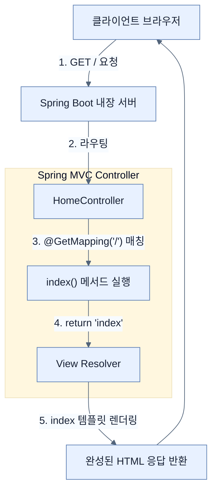

# Creating a Spring MVC web controller

## 한눈에 보기
| 항목 | 핵심 |
|------|------|
| Spring MVC | 서블릿(Servlet) 기반의 웹 애플리케이션을 구축하기 위한 스프링의 모듈 |
| Web Controller | 들어오는 HTTP 요청(예: `GET /`)을 받아서 처리하고, 결과(화면이나 데이터)를 반환하는 진입점 |

## 1. 왜 이게 필요한가

### 이런 상황을 상상해 보자
사용자가 브라우저 주소창에 `http://localhost:8080/`을 입력했다. 서버는 이 요청을 받아서 "안녕하세요"라는 글자가 담긴 웹 페이지를 보여주어야 한다.

### 여기서 뭐가 무너지나
과거에는 이 단순한 일을 처리하기 위해 `web.xml`이라는 복잡한 환경 설정 파일에 요청 경로와 자바 클래스(Servlet)를 일일이 매핑해야 했다. 코드를 짤 때마다 XML 설정 파일도 함께 수정해야 하니 번거롭고 실수하기 쉬웠다.

### 그래서 나온 생각
"XML 파일 없이, 자바 클래스 위에 간단한 이름표(Annotation)만 붙이면 프레임워크가 알아서 요청을 연결해주면 어떨까?"
스프링 부트에서 `spring-boot-starter-webmvc`를 추가하면 **[[spring-mvc]]**가 활성화된다. 개발자는 그저 클래스 위에 `@Controller`를 붙이고, 메서드 위에 `@GetMapping("/")`을 붙이기만 하면 된다. 이렇게 만들어진 **[[controller]]**는 사용자의 HTTP 요청을 받아 템플릿(화면) 이름이나 데이터를 반환하는 완벽한 웹 진입점 역할을 수행한다.

### 비유로 잡기
웹 계층은 주문 창구와 비슷하다. 요청을 받아 형식을 확인하고, 알맞은 작업자에게 넘긴 뒤 HTML이나 JSON으로 결과를 돌려준다.

→ 비유가 깨지는 지점: 실제 HTTP 요청은 한 창구에서 끝나지 않는다. 필터, 보안, 직렬화, 예외 변환과 네트워크 경계가 함께 작동한다.

### 이 절의 언어
**[[spring-mvc]]**(= Model-View-Controller 패턴을 사용하여 서블릿 기반 웹 애플리케이션을 만드는 스프링 프레임워크 핵심 모듈), **[[controller]]**(= 사용자(클라이언트)의 HTTP 요청을 받아서 적절한 로직으로 연결하고 응답을 돌려주는 컴포넌트), **[[get-mapping]]**(= 특정 HTTP GET 요청 경로를 컨트롤러의 특정 메서드와 연결해주는 애노테이션), **[[component-scanning]]**(= 스프링이 특정 패키지를 뒤져서 @Controller, @Service 등의 애노테이션이 붙은 클래스를 찾아 빈으로 자동 등록하는 기능)

## 2. 어떻게 동작하는가

먼저 다음 세 축으로 메커니즘을 읽는다.

1. **입력과 전제 확인** — 어떤 요청·설정·데이터가 들어오는지 확인한다. 잘못된 전제를 다음 계층으로 넘기지 않기 위해서다.
2. **Spring 추상화 적용** — 스타터와 자동 구성, 어노테이션 또는 명시적 빈이 실제 처리를 연결한다. 반복 배선보다 도메인 선택에 집중하기 위해서다.
3. **결과와 경계 검증** — 응답·저장 상태·운영 신호를 확인한다. 정상 경로만 보고 장애·버전·성능 차이를 놓치지 않기 위해서다.

1. **의존성 추가**: `pom.xml`에 `spring-boot-starter-webmvc` 스타터를 선언한다. — 웹 처리에 필요한 모듈과 내장 Tomcat 서버를 한 번에 가져오기 위해서다.
2. **Component Scanning**: 애플리케이션 시작 시, 스프링 부트는 **[[component-scanning]]**을 통해 패키지 내부를 뒤져 `@Controller` 애노테이션이 붙은 클래스를 찾아 스프링 빈(Bean)으로 등록한다. — 개발자가 직접 객체를 생성하지 않고 프레임워크가 빈 생명주기를 관리하도록 하기 위해서다.
3. **요청 매핑(Routing)**: 사용자가 `GET /` 요청을 보내면, 스프링 MVC의 라우터가 `@GetMapping("/")`(**[[get-mapping]]**)이 붙은 메서드를 찾아 실행시킨다. — 특정 URL 요청을 정확한 자바 코드로 쉽게 연결하기 위해서다.
4. **뷰(View) 반환**: 메서드가 `"index"`라는 문자열을 리턴하면, 스프링 MVC는 이를 '논리적 뷰 이름'으로 해석하여 `index.mustache`나 `index.html` 같은 템플릿 파일을 찾아 화면을 렌더링한다. — 컨트롤러와 실제 화면을 그리는 로직을 깔끔하게 분리하기 위해서다.

## 3. 그림으로 보기

## 4. 이 노트에 나온 용어
| 용어 | 한 줄 | 자세히 |
|------|-------|--------|
| spring-mvc | Model-View-Controller 패턴을 사용하여 서블릿 기반 웹 애플리케이션을 만드는 스프링 프레임워크 핵심 모듈 | [[_glossary#spring-mvc]] |
| controller | 사용자(클라이언트)의 HTTP 요청을 받아서 적절한 로직으로 연결하고 응답을 돌려주는 컴포넌트 | [[_glossary#controller]] |
| get-mapping | 특정 HTTP GET 요청 경로를 컨트롤러의 특정 메서드와 연결해주는 애노테이션 | [[_glossary#get-mapping]] |
| component-scanning | 스프링이 특정 패키지를 뒤져서 `@Controller`, `@Service` 등의 애노테이션이 붙은 클래스를 찾아 빈으로 자동 등록하는 기능 | [[_glossary#component-scanning]] |

## 5. 자주 헷갈리는 것
- 이 주제의 **Spring 추상화**와 그 아래에서 실제로 동작하는 라이브러리·프로토콜을 같은 것으로 보지 않는다. 추상화는 기본 배선을 줄이지만 하위 계층의 비용과 실패를 없애지 않는다.

## 6. 언제 안 쓰나 / 경계
- 책의 예제는 개념을 드러내기 위한 작은 애플리케이션이다. 운영 환경에서는 인증 정보, 장애 복구, 관측성, 부하와 데이터 규모를 별도로 검증한다.
- 이 노트의 API와 기본값은 책의 Spring Boot 4.1·Java 25 맥락을 따른다. 다른 마이너 버전에서는 공식 마이그레이션 문서와 실제 의존성 버전을 함께 확인한다.

## 7. 연결
- [[01-using-start-spring-io-to-build-apps]] — 같은 장의 학습 흐름에서 Creating a Spring MVC web controller의 전제 또는 다음 적용 단계와 연결된다.
- [[03-leveraging-templates-to-create-content]] — 같은 장의 학습 흐름에서 Creating a Spring MVC web controller의 전제 또는 다음 적용 단계와 연결된다.

## 8. 스스로 확인
1. 자바 클래스가 스프링 부트의 웹 컨트롤러로 작동하기 위해 클래스 수준과 메서드 수준에 각각 어떤 애노테이션을 붙여야 하는가?
2. `Component Scanning` 메커니즘이 존재하지 않는다면, 우리가 작성한 `HomeController` 클래스를 스프링이 인식하게 만들기 위해 어떤 번거로운 작업을 직접 해야 했을까?

<!-- ==== 아래는 내 영역 · 스킬 수정 금지 ==== -->

## 내 설명 시도

## 막혔던 지점

## 리뷰 이력
