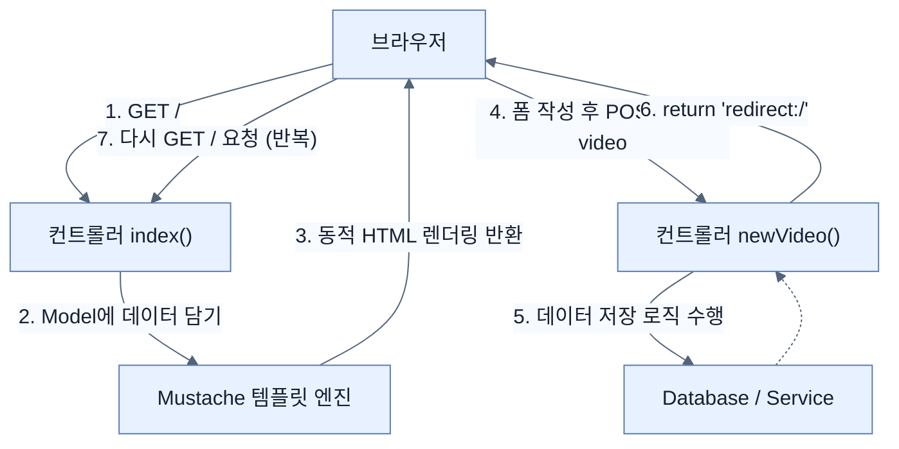

# Leveraging templates to create content

## 한눈에 보기
| 항목 | 핵심 |
|------|------|
| Template Engine | 서버 측 데이터를 끼워 넣어 동적인 HTML 화면을 만들어내는 도구 (예: Mustache) |
| `@PostMapping` & Redirect | HTML 폼 데이터를 서버로 전송하고 처리한 뒤, 새로운 경로로 브라우저를 이동시키는 PRG 흐름 |

## 1. 왜 이게 필요한가

### 이런 상황을 상상해 보자
앞서 만든 컨트롤러에서 단순히 정적인 웹 화면만 보여주었다. 그런데 이제 데이터베이스나 서비스에서 가져온 '비디오 목록' 데이터를 화면에 예쁘게 표출하고 싶다. 또한, 사용자가 직접 화면의 폼(Form)에 비디오 제목을 입력해서 새 데이터를 추가할 수 있게 만들어야 한다.

### 여기서 뭐가 무너지나
자바 코드 안에서 `out.println("<html><body>" + video.getName() + ...)` 식으로 문자열을 더해가며 HTML을 그리면 코드가 지저분해지고 유지보수가 불가능해진다. 화면 디자인을 조금만 바꿔도 자바 코드를 다시 컴파일해야 한다.

### 그래서 나온 생각
HTML 뼈대는 따로 파일(`.mustache` 등)로 빼두고, 자바 코드는 데이터(Model)만 템플릿 엔진(**[[template-engine]]**)에게 넘겨주자! 스프링 부트는 **[[mustache]]**와 같은 템플릿 엔진이 추가되면 알아서 `src/main/resources/templates` 폴더를 기본 경로로 설정한다. (참고로, 기존 프로젝트에 모듈을 추가하고 싶다면 Initializr 사이트의 `EXPLORE` 버튼을 눌러 `pom.xml` 조각만 복사해 올 수도 있다.)

### 비유로 잡기
AI 애플리케이션을 사서와 대화하는 과정에 비유하면, 모델은 답을 만들고 검색기는 관련 책을 찾으며 도구는 실제 업무를 수행한다.

→ 비유가 깨지는 지점: 사서는 출처와 권한을 스스로 보장하지만 모델은 그럴 수 없다. 검색 결과와 도구 인자는 반드시 애플리케이션이 검증해야 한다.

### 이 절의 언어
**[[template-engine]]**(= 템플릿 파일과 서버의 데이터를 결합하여 최종 HTML을 생성하는 도구), **[[mustache]]**(= 로직이 없는(Logic-less) 단순하고 가벼운 템플릿 엔진), **[[model-attribute]]**(= 뷰로 데이터를 전달하거나, 폼 요청 데이터를 자바 객체로 바인딩할 때 사용하는 애노테이션), **[[post-mapping]]**(= HTTP POST 요청을 특정 컨트롤러 메서드에 매핑하는 애노테이션), **[[redirect]]**(= 클라이언트(브라우저)에게 다른 URL로 다시 요청하라고 지시하는 HTTP 응답 방식)

## 2. 어떻게 동작하는가

먼저 다음 세 축으로 메커니즘을 읽는다.

1. **입력과 전제 확인** — 어떤 요청·설정·데이터가 들어오는지 확인한다. 잘못된 전제를 다음 계층으로 넘기지 않기 위해서다.
2. **Spring 추상화 적용** — 스타터와 자동 구성, 어노테이션 또는 명시적 빈이 실제 처리를 연결한다. 반복 배선보다 도메인 선택에 집중하기 위해서다.
3. **결과와 경계 검증** — 응답·저장 상태·운영 신호를 확인한다. 정상 경로만 보고 장애·버전·성능 차이를 놓치지 않기 위해서다.

1. **Model을 통한 데이터 전달**: 컨트롤러 메서드의 파라미터로 `Model` 객체를 받고, `model.addAttribute("videos", videos)` 형태로 뷰에 보여줄 데이터를 담는다. — 컨트롤러와 뷰 사이의 안전한 데이터 운반책을 쓰기 위해서다.
2. **템플릿 바인딩**: Mustache는 `{{#videos}} {{name}} {{/videos}}` 구문을 통해 전달받은 리스트를 순회하며 동적으로 HTML 요소(`<li>`)를 찍어낸다. — 복잡한 자바 코드 없이도 뷰에서 반복문과 변수를 처리하기 위해서다.
3. **폼 전송과 @PostMapping**: 사용자가 웹 화면에서 `<form>`을 전송하면, 컨트롤러의 **[[post-mapping]]** 메서드가 이를 가로챈다. 이때 **[[model-attribute]]** 애노테이션을 통해 들어온 폼 데이터를 자바 객체(`Video`)로 즉시 변환받을 수 있다. — 클라이언트의 입력값을 자바 객체로 손쉽게 맵핑하기 위해서다.
4. **PRG(Post-Redirect-Get) 패턴**: 새 데이터를 저장한 직후 템플릿을 반환하지 않고 `return "redirect:/";`를 호출한다. — 브라우저가 첫 화면을 다시 GET 방식으로 재요청(**[[redirect]]**)하게 만들어, 브라우저 새로고침 시 폼 데이터가 중복 전송되는 불상사를 막기 위해서다.

## 3. 그림으로 보기

![[_assets/learning-spring-boot-4-simplify-the-deve-p59-fig2-7.png]]
> 출처: *Learning Spring Boot 4*, 책 p.34 (그림 2.7). Mustache 템플릿이 브라우저에 렌더링된 실제 결과.

## 4. 이 노트에 나온 용어
| 용어 | 한 줄 | 자세히 |
|------|-------|--------|
| template-engine | 템플릿 파일과 서버의 데이터를 결합하여 최종 HTML을 생성하는 도구 | [[_glossary#template-engine]] |
| mustache | 로직이 없는(Logic-less) 단순하고 가벼운 템플릿 엔진 | [[_glossary#mustache]] |
| model-attribute | 뷰로 데이터를 전달하거나, 폼 요청 데이터를 자바 객체로 바인딩할 때 사용하는 애노테이션 | [[_glossary#model-attribute]] |
| post-mapping | HTTP POST 요청을 특정 컨트롤러 메서드에 매핑하는 애노테이션 | [[_glossary#post-mapping]] |
| redirect | 클라이언트(브라우저)에게 다른 URL로 다시 요청하라고 지시하는 HTTP 응답 방식 | [[_glossary#redirect]] |

## 5. 자주 헷갈리는 것
- 이 주제의 **Spring 추상화**와 그 아래에서 실제로 동작하는 라이브러리·프로토콜을 같은 것으로 보지 않는다. 추상화는 기본 배선을 줄이지만 하위 계층의 비용과 실패를 없애지 않는다.

## 6. 언제 안 쓰나 / 경계
- 책의 예제는 개념을 드러내기 위한 작은 애플리케이션이다. 운영 환경에서는 인증 정보, 장애 복구, 관측성, 부하와 데이터 규모를 별도로 검증한다.
- 이 노트의 API와 기본값은 책의 Spring Boot 4.1·Java 25 맥락을 따른다. 다른 마이너 버전에서는 공식 마이그레이션 문서와 실제 의존성 버전을 함께 확인한다.

## 7. 연결
- [[02-creating-a-spring-mvc-web-controller]] — 같은 장의 학습 흐름에서 Leveraging templates to create content의 전제 또는 다음 적용 단계와 연결된다.
- [[04-creating-json-based-apis]] — 같은 장의 학습 흐름에서 Leveraging templates to create content의 전제 또는 다음 적용 단계와 연결된다.

## 8. 스스로 확인
1. 브라우저에서 HTML `<form>`을 통해 데이터를 전송할 때, 이를 처리하는 컨트롤러 메서드는 왜 `return "index";` 대신 `return "redirect:/";`를 사용하는가?
2. 컨트롤러 메서드의 파라미터로 선언된 `Model` 객체는 템플릿 엔진(Mustache)과 어떤 방식으로 상호작용하는가?

<!-- ==== 아래는 내 영역 · 스킬 수정 금지 ==== -->

## 내 설명 시도

## 막혔던 지점

## 리뷰 이력
