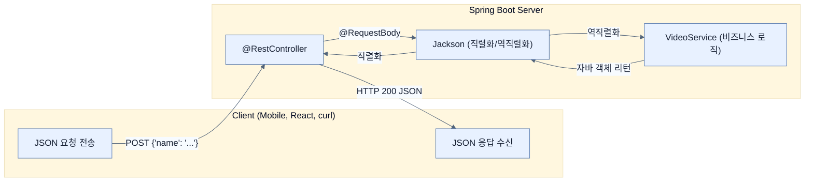

# Creating JSON-based APIs

## 한눈에 보기
| 항목 | 핵심 |
|------|------|
| `@RestController` | 반환값을 템플릿(화면)으로 해석하지 않고, 데이터(JSON) 자체로 직렬화하여 HTTP 응답에 담는 컨트롤러 |
| Jackson | 자바 객체와 JSON 데이터를 양방향으로 자동 변환해 주는 기본 라이브러리 |

## 1. 왜 이게 필요한가

### 이런 상황을 상상해 보자
이전 노트까지는 사용자가 웹 브라우저로 접속할 때 서버가 HTML 화면(Mustache 템플릿)을 렌더링해서 응답했다. 그런데 모바일 앱(iOS/Android)이나 리액트(React) 같은 프론트엔드 애플리케이션에서 우리 서버의 비디오 목록을 요청한다면 어떻게 될까? 모바일 앱은 서버가 준 HTML 화면을 그대로 띄우기 어렵기 때문에, 순수한 데이터 그 자체만 원할 것이다.

### 여기서 뭐가 무너지나
기존의 `@Controller`는 리턴하는 문자열을 무조건 "어떤 템플릿을 렌더링할까?"로 고민한다. 데이터를 순수하게 텍스트나 JSON 형태로 클라이언트에게 건네주려면 복잡한 수동 변환 과정과 부가적인 설정이 필요했다.

### 그래서 나온 생각
화면 렌더링을 완전히 배제하고, 클래스 위에 **[[rest-controller]]**(`@RestController`)를 붙이자! 
이 애노테이션이 붙은 컨트롤러는 자바 객체(예: `List<Video>`)를 반환하면 템플릿 엔진을 거치지 않는다. 대신 스프링 부트 내장된 **[[jackson]]** 라이브러리를 사용해 자바 객체를 즉시 JSON 문자열로 직렬화(Serialization)하여 클라이언트에게 응답한다.

### 비유로 잡기
웹 계층은 주문 창구와 비슷하다. 요청을 받아 형식을 확인하고, 알맞은 작업자에게 넘긴 뒤 HTML이나 JSON으로 결과를 돌려준다.

→ 비유가 깨지는 지점: 실제 HTTP 요청은 한 창구에서 끝나지 않는다. 필터, 보안, 직렬화, 예외 변환과 네트워크 경계가 함께 작동한다.

### 이 절의 언어
**[[rest-controller]]**(= 메서드의 반환값을 뷰(템플릿)가 아닌 데이터(JSON 등) 자체로 HTTP 응답 본문에 쓰는 애노테이션), **[[jackson]]**(= 자바 객체와 JSON 데이터 간의 양방향 자동 변환을 처리하는 강력한 기본 라이브러리), **[[request-body]]**(= 클라이언트가 보낸 HTTP 요청 본문(JSON 등)을 자바 객체로 변환하여 주입받는 애노테이션)

## 2. 어떻게 동작하는가

먼저 다음 세 축으로 메커니즘을 읽는다.

1. **입력과 전제 확인** — 어떤 요청·설정·데이터가 들어오는지 확인한다. 잘못된 전제를 다음 계층으로 넘기지 않기 위해서다.
2. **Spring 추상화 적용** — 스타터와 자동 구성, 어노테이션 또는 명시적 빈이 실제 처리를 연결한다. 반복 배선보다 도메인 선택에 집중하기 위해서다.
3. **결과와 경계 검증** — 응답·저장 상태·운영 신호를 확인한다. 정상 경로만 보고 장애·버전·성능 차이를 놓치지 않기 위해서다.

1. **의존성 자동 구성**: 처음에 `spring-boot-starter-webmvc`를 추가했을 때, JSON 처리의 사실상 표준인 Jackson 라이브러리도 조용히 클래스패스에 포함되었다. — 개발자가 번거로운 JSON 직렬화 셋업을 피하게 하기 위해서다.
2. **데이터 조회 (GET)**: `@GetMapping` 메서드에서 `List<Video>` 객체를 반환하면, Jackson이 이를 `[{"name": "비디오1"}, ...]` 형태의 JSON 배열로 자동 변환해 응답한다. — UI 껍데기 없이 순수 데이터만 제공하는 API를 만들기 위해서다.
3. **데이터 추가 (POST)**: 클라이언트가 JSON 데이터를 담아 POST 요청을 보낼 때, 컨트롤러 메서드 파라미터에 **[[request-body]]**(`@RequestBody`)를 붙인다. 그러면 Jackson이 들어온 JSON 문자열을 즉시 자바 객체(`Video`)로 역직렬화(Deserialization)해 준다. — 요청으로 들어온 원시 문자열 데이터를 안전하고 다루기 쉬운 자바 객체로 맵핑하기 위해서다.

## 3. 그림으로 보기

## 4. 이 노트에 나온 용어
| 용어 | 한 줄 | 자세히 |
|------|-------|--------|
| rest-controller | 메서드의 반환값을 뷰(템플릿)가 아닌 데이터(JSON 등) 자체로 HTTP 응답 본문에 쓰는 애노테이션 | [[_glossary#rest-controller]] |
| jackson | 자바 객체와 JSON 데이터 간의 양방향 자동 변환을 처리하는 강력한 기본 라이브러리 | [[_glossary#jackson]] |
| request-body | 클라이언트가 보낸 HTTP 요청 본문(JSON 등)을 자바 객체로 변환하여 주입받는 애노테이션 | [[_glossary#request-body]] |

## 5. 자주 헷갈리는 것
- 이 주제의 **Spring 추상화**와 그 아래에서 실제로 동작하는 라이브러리·프로토콜을 같은 것으로 보지 않는다. 추상화는 기본 배선을 줄이지만 하위 계층의 비용과 실패를 없애지 않는다.

## 6. 언제 안 쓰나 / 경계
- 책의 예제는 개념을 드러내기 위한 작은 애플리케이션이다. 운영 환경에서는 인증 정보, 장애 복구, 관측성, 부하와 데이터 규모를 별도로 검증한다.
- 이 노트의 API와 기본값은 책의 Spring Boot 4.1·Java 25 맥락을 따른다. 다른 마이너 버전에서는 공식 마이그레이션 문서와 실제 의존성 버전을 함께 확인한다.

## 7. 연결
- [[03-leveraging-templates-to-create-content]] — 같은 장의 학습 흐름에서 Creating JSON-based APIs의 전제 또는 다음 적용 단계와 연결된다.
- [[05-nodejs-react-frontend-integration]] — JSON 응답은 React 화면이 목록을 읽고 폼 데이터를 쓰는 계약이 된다.

## 8. 스스로 확인
1. `@Controller`를 사용한 메서드에서 `return "index";`를 했을 때와, `@RestController`를 사용한 메서드에서 `return "index";`를 했을 때 클라이언트가 받게 되는 최종 응답은 각각 어떻게 다른가?
2. 클라이언트가 새 데이터를 생성하기 위해 JSON 포맷의 텍스트를 POST로 보냈다. 컨트롤러는 이 문자열을 어떤 애노테이션을 통해 자바 객체로 안전하게 변환받을 수 있는가?

<!-- ==== 아래는 내 영역 · 스킬 수정 금지 ==== -->

## 내 설명 시도

## 막혔던 지점

## 리뷰 이력
