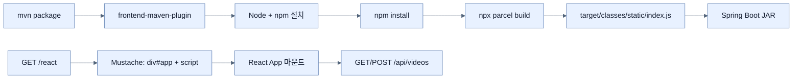

# Hooking Node.js and React into a Spring Boot web app

## 한눈에 보기

| 경계 | 역할 |
|---|---|
| Maven ↔ Node.js | `frontend-maven-plugin`이 Node/npm/npx 설치와 번들 빌드를 Maven 생명주기에 연결한다 |
| Parcel ↔ Spring Boot | 결과물을 `target/classes/static`에 출력해 정적 리소스로 패키징한다 |
| React ↔ JSON API | React 컴포넌트가 `/api/videos`를 GET/POST하고 상태 변경으로 화면을 다시 그린다 |
| Mustache ↔ React | Mustache가 마운트 지점과 번들 `<script>`를 제공하고 실제 UI는 React가 담당한다 |

## 1. 왜 이게 필요한가

같은 백엔드가 사람에게는 HTML 페이지를, 다른 애플리케이션에는 JSON API를 제공하게 되면 화면이 복잡해질수록 서버 템플릿만으로 상태 변화를 관리하기 어렵다. 반대로 JavaScript 빌드를 별도 저장소와 별도 명령으로 운영하면 Maven으로 만든 JAR에 최신 번들이 빠지는 문제가 생긴다. 이 절은 두 도구 체계를 하나의 재현 가능한 빌드로 묶는다.

**[[nodejs]]**(= 브라우저 밖에서 JavaScript 도구를 실행하는 런타임), **[[frontend-maven-plugin]]**(= Node/npm/npx 작업을 Maven 단계에 연결하는 플러그인), **[[parcel]]**(= JavaScript 모듈과 의존성을 브라우저용 파일로 묶는 번들러), **[[react]]**(= 상태로부터 UI 컴포넌트를 렌더링하는 라이브러리), **[[static-resource]]**(= Spring Boot가 가공 없이 HTTP로 제공하는 파일)가 빌드 경계를 이룬다.

### 비유로 잡기

Maven을 전체 공연의 무대 감독, Node 도구를 조명 팀이라고 보면 `frontend-maven-plugin`은 두 팀의 큐시트를 하나로 합친다. Java 빌드가 시작되면 정해진 순간에 프런트엔드 번들도 만들어진다.

→ 비유가 깨지는 지점: 실제 빌드는 한 번의 공연이 아니다. 캐시, 네트워크 의존성, 운영체제별 Node 바이너리, 개발 서버의 빠른 갱신과 배포 빌드의 최적화가 서로 다른 경로를 만들 수 있다.

## 2. 어떻게 동작하는가

1. **Node와 npm을 프로젝트 로컬에 설치한다** — 개발자마다 전역 Node 버전이 달라도 동일한 빌드를 재현하기 위해서다. 책은 Maven의 `generate-resources` 단계에 설치 작업을 연결한다.
2. **`package.json`에 Parcel을 개발 의존성으로 둔다** — JavaScript 모듈의 버전과 빌드 명령을 프로젝트 안에서 고정하기 위해서다.
3. **입력과 출력 경로를 연결한다** — `src/main/javascript/index.js`를 입력으로, `target/classes/static`을 출력으로 지정해 Maven `clean`과 JAR 패키징에 자연스럽게 포함시키기 위해서다.
4. **React 루트를 마운트한다** — Mustache 페이지의 `id="app"` 요소에 최상위 `App` 컴포넌트를 렌더링해 서버가 초기 문서, React가 동적 UI를 맡도록 경계를 나눈다.
5. **JSON API로 상태를 읽고 쓴다** — 목록 컴포넌트는 GET 결과를 상태에 저장하고, 폼 컴포넌트는 JSON POST 후 화면을 갱신한다. 같은 백엔드를 HTML과 SPA가 함께 쓰기 위해서다.
6. **생성물은 버전 관리에서 제외한다** — `node`, `node_modules`, `target`은 소스가 아니라 다시 만들 수 있는 중간 산출물이기 때문이다.

> 책의 `fetch()` 예시는 개념 흐름을 보여준다. 실제 코드에서는 먼저 `const response = await fetch(...)`로 응답을 받은 뒤 `await response.json()`을 호출하고, 실패 상태도 검사하는 편이 안전하다.

## 3. 그림으로 보기

## 4. 이 노트에 나온 용어

| 용어 | 한 줄 | 자세히 |
|---|---|---|
| nodejs | 브라우저 밖의 JavaScript 런타임 | [[_glossary#nodejs]] |
| frontend-maven-plugin | Node 도구 작업을 Maven 생명주기에 연결하는 플러그인 | [[_glossary#frontend-maven-plugin]] |
| parcel | JavaScript 모듈을 배포 가능한 번들로 만드는 도구 | [[_glossary#parcel]] |
| react | 상태 변화에 따라 컴포넌트 UI를 다시 계산하는 라이브러리 | [[_glossary#react]] |
| static-resource | Spring Boot가 애플리케이션 루트 아래에서 그대로 제공하는 파일 | [[_glossary#static-resource]] |

## 5. 자주 헷갈리는 것

- **`src/main/resources/static` vs `target/classes/static`** — 전자는 직접 작성한 정적 소스 위치이고, 후자는 빌드가 만든 출력 위치다. 생성 파일을 소스 폴더에 덮어쓰면 오래된 번들과 소스가 섞인다.
- **React state vs props** — state는 컴포넌트 내부에서 바뀌며 재렌더링을 일으키고, props는 부모가 내려주는 입력으로 취급한다.

## 6. 언제 안 쓰나 / 경계

- 화면이 단순하고 서버 렌더링만으로 충분하면 Node·번들러·React를 추가하는 비용이 이득보다 크다.
- 큰 프런트엔드 조직은 별도 배포 파이프라인과 CDN을 선택할 수 있다. 이 절의 방식은 하나의 Spring Boot 산출물에 프런트엔드를 함께 넣고 싶을 때 특히 유용하다.
- 프런트엔드가 다른 출처(origin)에서 서비스되면 같은 출처를 전제로 한 예제와 달리 CORS·CSRF·인증 토큰 정책을 별도로 설계해야 한다.

## 7. 연결

- [[04-creating-json-based-apis]] — React 컴포넌트가 읽고 쓰는 `/api/videos` JSON 계약을 제공한다.
- [[06-versioning-api-with-spring-boot-4]] — 프런트엔드와 백엔드를 독립적으로 배포하기 시작하면 API 계약의 버전 관리가 필요해진다.

## 8. 스스로 확인

1. Parcel의 출력 경로를 `target/classes/static`으로 둔 이유를 Maven `clean`과 JAR 패키징 관점에서 설명할 수 있는가?
2. 프런트엔드 개발자가 전역 Node를 설치했더라도 프로젝트 로컬 Node 설치를 유지할 이유는 무엇인가?
3. React 앱을 별도 도메인에서 배포한다면 이 책의 동일 출처 구조에 비해 어떤 보안·배포 문제가 새로 생기는가?

<!-- ==== 아래는 내 영역 · 스킬 수정 금지 ==== -->

## 내 설명 시도

## 막혔던 지점

## 리뷰 이력
