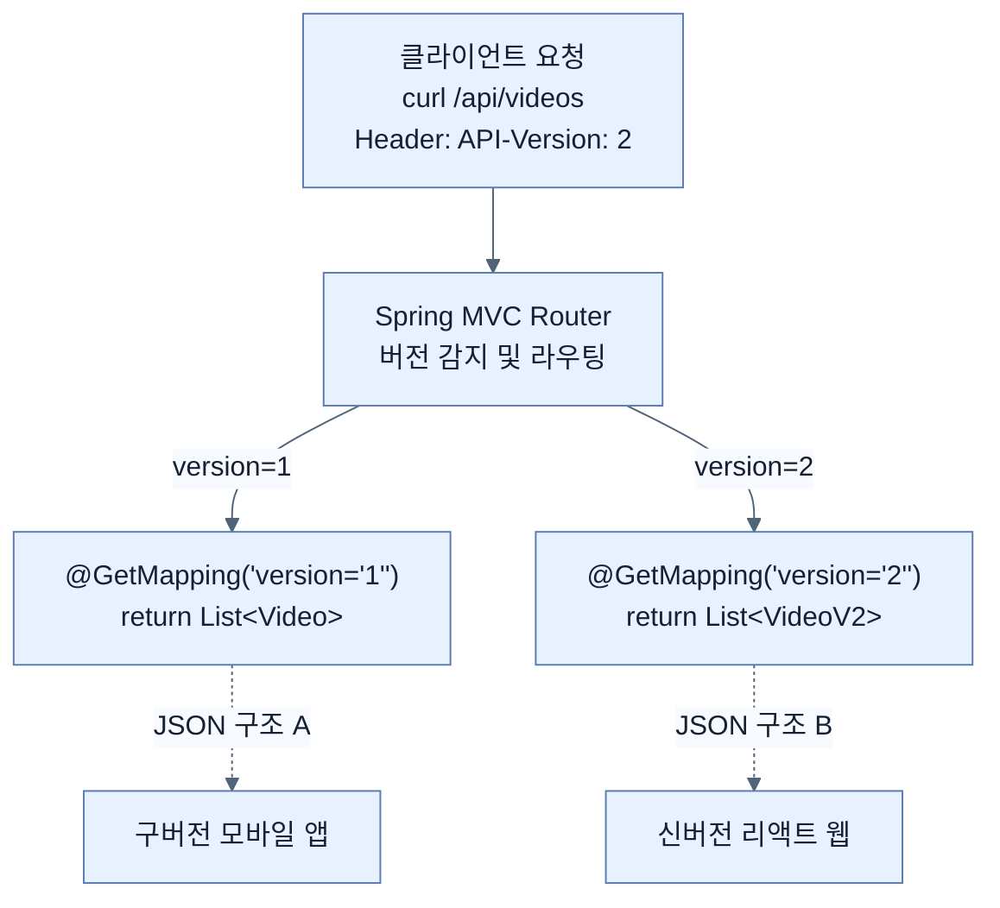

# Versioning API with Spring Boot 4

## 한눈에 보기
| 항목 | 핵심 |
|------|------|
| API Versioning | 클라이언트와의 계약(Contract)을 깨지 않고 API를 안전하게 진화시키기 위해 버전을 나누어 제공하는 기법 |
| Spring Boot 4 Versioning | 과거처럼 개발자가 직접 URL이나 헤더를 파싱할 필요 없이, 프레임워크 차원(`version="1"`)에서 통합 지원하는 API 버저닝 |

## 1. 왜 이게 필요한가

### 이런 상황을 상상해 보자
우리 서버가 외부 모바일 앱에게 `[{"name": "비디오1"}]` 형태의 API를 제공하고 있었다. 그런데 비즈니스 요구사항이 바뀌어서 비디오 이름뿐만 아니라 `{"id": 1, "name": "비디오1", "desc": "설명"}` 형태로 데이터 구조를 완전히 바꾸려고 한다. 

### 여기서 뭐가 무너지나
서버의 API 구조를 무턱대고 신형으로 바꿔버리면, 이미 앱스토어에 배포되어 기존 API 구조에 맞춰 작동하던 구버전 모바일 앱들은 데이터를 제대로 읽지 못해 앱이 뻗어버리거나(Crash) 화면이 깨지게 된다. API는 외부(클라이언트)와의 강한 '계약'이므로, 사소한 변경이라도 기존 생태계를 붕괴시킬 위험이 있다.

### 그래서 나온 생각
기존 사용자들을 위한 구버전 API는 그대로 살려두고, 새로운 규격의 신버전 API를 별도로 추가하자! 이것이 **[[api-versioning]]**이다. 
Spring Boot 4 이전에는 이런 버저닝을 하려면 개발자가 직접 URL 경로를 하드코딩(`/api/v1/videos`)하거나 요청 헤더 값을 if문으로 뜯어보는 등 지저분하게 해결해야 했다. 하지만 Spring Boot 4부터는 API 버저닝을 일급 시민(First-class citizen)으로 공식 지원하여, 단순히 `@GetMapping(version = "1")`만 적어주면 프레임워크가 알아서 요청을 우아하게 분기해 준다.

### 비유로 잡기
웹 계층은 주문 창구와 비슷하다. 요청을 받아 형식을 확인하고, 알맞은 작업자에게 넘긴 뒤 HTML이나 JSON으로 결과를 돌려준다.

→ 비유가 깨지는 지점: 실제 HTTP 요청은 한 창구에서 끝나지 않는다. 필터, 보안, 직렬화, 예외 변환과 네트워크 경계가 함께 작동한다.

### 이 절의 언어
**[[api-versioning]]**(= 호환성을 깨지 않고 서비스를 발전시키기 위해 API 엔드포인트에 버전을 부여하고 나누는 기법), **[[http-service-interface-client]]**(= 복잡한 HTTP 통신 코드 없이 자바 인터페이스 선언만으로 외부 REST API를 호출하게 해주는 기능), **[[get-exchange]]**(= HTTP Service Interface 내부에서 GET 방식의 API 호출을 선언하고 버전을 명시할 수 있는 애노테이션)

## 2. 어떻게 동작하는가

먼저 다음 세 축으로 메커니즘을 읽는다.

1. **입력과 전제 확인** — 어떤 요청·설정·데이터가 들어오는지 확인한다. 잘못된 전제를 다음 계층으로 넘기지 않기 위해서다.
2. **Spring 추상화 적용** — 스타터와 자동 구성, 어노테이션 또는 명시적 빈이 실제 처리를 연결한다. 반복 배선보다 도메인 선택에 집중하기 위해서다.
3. **결과와 경계 검증** — 응답·저장 상태·운영 신호를 확인한다. 정상 경로만 보고 장애·버전·성능 차이를 놓치지 않기 위해서다.

1. **버저닝 전략 선택**: 외부 설정(`application.properties`)을 통해 클라이언트가 버전을 어디에 담아 보낼지 결정한다. 
   - `use.path-segment=1` (경로에 포함: `/api/v1/videos`)
   - `use.header=API-Version` (헤더에 포함: `API-Version: 1`)
   - `use.query-parameter=version` (파라미터 포함: `?version=1`)
2. **버전별 엔드포인트 분리**: 컨트롤러 메서드의 애노테이션 속성에 응답할 버전을 명시한다.
   - 구버전: `@GetMapping(value="/api/...", version="1")`
   - 신버전: `@GetMapping(value="/api/...", version="2")`
   요청이 들어오면 설정된 전략에 따라 버전을 추출한 뒤 알맞은 메서드로 자동 라우팅된다.
3. **클라이언트 측 호출**: Spring의 **[[http-service-interface-client]]** 기능을 사용하면, 복잡한 통신 코드 없이 자바 인터페이스에 **[[get-exchange]]**(`@GetExchange(version = "1")`) 애노테이션을 붙이는 것만으로 외부의 버전화된 API를 손쉽게 호출할 수 있다.

## 3. 그림으로 보기

## 4. 이 노트에 나온 용어
| 용어 | 한 줄 | 자세히 |
|------|-------|--------|
| api-versioning | 호환성을 깨지 않고 서비스를 발전시키기 위해 API 엔드포인트에 버전을 부여하고 나누는 기법 | [[_glossary#api-versioning]] |
| http-service-interface-client | 복잡한 HTTP 통신 코드 없이 자바 인터페이스 선언만으로 외부 REST API를 호출하게 해주는 기능 | [[_glossary#http-service-interface-client]] |
| get-exchange | HTTP Service Interface 내부에서 GET 방식의 API 호출을 선언하고 버전을 명시할 수 있는 애노테이션 | [[_glossary#get-exchange]] |

## 5. 자주 헷갈리는 것
- 이 주제의 **Spring 추상화**와 그 아래에서 실제로 동작하는 라이브러리·프로토콜을 같은 것으로 보지 않는다. 추상화는 기본 배선을 줄이지만 하위 계층의 비용과 실패를 없애지 않는다.

## 6. 언제 안 쓰나 / 경계
- 책의 예제는 개념을 드러내기 위한 작은 애플리케이션이다. 운영 환경에서는 인증 정보, 장애 복구, 관측성, 부하와 데이터 규모를 별도로 검증한다.
- 이 노트의 API와 기본값은 책의 Spring Boot 4.1·Java 25 맥락을 따른다. 다른 마이너 버전에서는 공식 마이그레이션 문서와 실제 의존성 버전을 함께 확인한다.

## 7. 연결
- [[05-nodejs-react-frontend-integration]] — 독립적으로 변하는 프런트엔드가 기존 계약을 계속 호출할 수 있도록 API 버전을 분리한다.
- [[07-writing-null-safe-applications-with-spring-boot-4]] — 같은 장의 학습 흐름에서 Versioning API with Spring Boot 4의 전제 또는 다음 적용 단계와 연결된다.

## 8. 스스로 확인
1. URL 경로를 전혀 바꾸지 않고도(예: 항상 `/api/videos`로 요청) API 버전을 식별할 수 있는 스프링 부트 4의 버저닝 전략에는 어떤 것들이 있는가?
2. Spring Boot 4 이전처럼 `/api/v1/videos`와 같이 URL 경로 문자열에 버전을 직접 하드코딩하는 방식과 비교하여, 설정 파일과 `@GetMapping(version="1")`을 조합하는 방식의 아키텍처적 이점은 무엇인가?

<!-- ==== 아래는 내 영역 · 스킬 수정 금지 ==== -->

## 내 설명 시도

## 막혔던 지점

## 리뷰 이력
