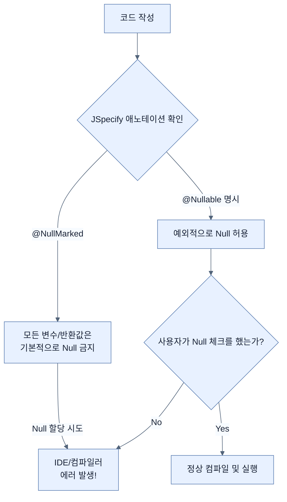

# Writing null-safe applications with Spring Boot 4

## 한눈에 보기
| 항목 | 핵심 |
|------|------|
| Null-Safety | 런타임에 발생하는 치명적인 `NullPointerException`을 컴파일 시점이나 개발 도구(IDE)에서 미리 잡아내기 위한 기법 |
| JSpecify | 스프링 부트 4(Spring Framework 7)가 채택한 표준 Null 애노테이션 집합으로, Null 정책을 명시적으로 선언할 수 있게 함 |

## 1. 왜 이게 필요한가

### 이런 상황을 상상해 보자
자바로 개발하다 보면 어떤 메서드가 객체를 반환할 때, 그 값이 정상적인 객체인지 아니면 `null`일 수 있는지 메서드 시그니처만 보고는 알 길이 없다. 

### 여기서 뭐가 무너지나
개발자는 반환값이 무조건 있다고 짐작하고 메서드를 호출(`video.getName()`)했지만, 실제로는 `null`이 넘어오는 바람에 서비스 운영 중에 갑자기 `NullPointerException(NPE)`이 발생하며 앱이 뻗어버리는 일이 비일비재했다. 오류를 잡으려면 코드를 실행해 보는 수밖에 없었다.

### 그래서 나온 생각
자바 진영에는 이 문제를 돕기 위한 여러 종류의 `@Nullable` 애노테이션들이 난립해 있었다. 이를 통일하고 명확한 규약을 만들기 위해 **[[jspecify]]**라는 표준이 등장했다. Spring Boot 4는 자체 API 전반에 JSpecify를 도입하여, "이 값은 `null`이 될 수 있는가?"라는 모호한 상황을 타입 시스템과 정적 분석 도구(IDE)가 코드 작성 시점에 족집게처럼 찾아내 경고할 수 있도록 만들었다.

### 비유로 잡기
이 기능은 조립 라인의 한 공정과 비슷하다. 입력을 정해진 규칙으로 변환해 다음 공정이 사용할 결과를 만든다.

→ 비유가 깨지는 지점: 애플리케이션은 고정된 조립 라인이 아니다. 조건부 구성과 런타임 실패, 외부 시스템 변화 때문에 공정의 경계를 따로 검증해야 한다.

### 이 절의 언어
**[[jspecify]]**(= 자바 진영의 여러 Null 관련 애노테이션을 통합한 표준 명세), **[[null-marked]]**(= 해당 영역(패키지/클래스)의 기본 상태를 'Null 금지'로 설정하는 애노테이션), **[[null-unmarked]]**(= 기본 상태를 강제하지 않아 레거시 코드와 혼용할 수 있게 해주는 애노테이션), **[[non-null]]**(= 특정 요소가 절대 Null이 아님을 명시하는 애노테이션), **[[nullable]]**(= 특정 요소가 Null이 될 수 있음을 명시하여, 호출자가 반드시 방어 코드를 짜도록 유도하는 애노테이션)

## 2. 어떻게 동작하는가

먼저 다음 세 축으로 메커니즘을 읽는다.

1. **입력과 전제 확인** — 어떤 요청·설정·데이터가 들어오는지 확인한다. 잘못된 전제를 다음 계층으로 넘기지 않기 위해서다.
2. **Spring 추상화 적용** — 스타터와 자동 구성, 어노테이션 또는 명시적 빈이 실제 처리를 연결한다. 반복 배선보다 도메인 선택에 집중하기 위해서다.
3. **결과와 경계 검증** — 응답·저장 상태·운영 신호를 확인한다. 정상 경로만 보고 장애·버전·성능 차이를 놓치지 않기 위해서다.

JSpecify는 코드를 명확히 제어하기 위해 4가지 핵심 애노테이션을 제공한다:
1. **[[null-marked]] (`@NullMarked`)**: 패키지나 클래스에 붙이면, "이 안의 모든 것은 기본적으로 Null이 될 수 없다(non-null-by-default)"는 엄격한 규칙을 선언한다.
2. **[[null-unmarked]] (`@NullUnmarked`)**: 기존 레거시 코드처럼 Null 가능성이 모호한 영역에 붙여, 점진적으로 JSpecify를 도입할 때 사용한다.
3. **[[non-null]] (`@NonNull`)**: `@NullMarked` 스코프 안에서는 기본값이므로 생략되지만, 마이그레이션 중이거나 예외적으로 '절대 Null이 아님'을 콕 집어 강조할 때 쓴다.
4. **[[nullable]] (`@Nullable`)**: "이 값은 예외적으로 Null이 될 수 있음"을 명시한다. 이 애노테이션이 붙은 반환값을 호출하는 쪽에서 `if (val != null)` 체크를 누락하면, IDE나 빌드 도구가 즉시 경고를 띄워 실수를 막아준다.

> [!NOTE] 
> JSpecify는 자바의 `Optional`을 대체하기 위해 나온 것이 아니다. `Optional`은 주로 메서드 반환 타입으로 쓰이는 추상화 객체이며, JSpecify는 타입 시스템 전반에 Null 정책을 명시하는 역할을 하므로 서로 상호보완적이다.

## 3. 그림으로 보기

## 4. 이 노트에 나온 용어
| 용어 | 한 줄 | 자세히 |
|------|-------|--------|
| jspecify | 자바 진영의 여러 Null 관련 애노테이션을 통합한 표준 명세 | [[_glossary#jspecify]] |
| null-marked | 해당 영역(패키지/클래스)의 기본 상태를 'Null 금지'로 설정하는 애노테이션 | [[_glossary#null-marked]] |
| null-unmarked | 기본 상태를 강제하지 않아 레거시 코드와 혼용할 수 있게 해주는 애노테이션 | [[_glossary#null-unmarked]] |
| non-null | 특정 요소가 절대 Null이 아님을 명시하는 애노테이션 | [[_glossary#non-null]] |
| nullable | 특정 요소가 Null이 될 수 있음을 명시하여, 호출자가 반드시 방어 코드를 짜도록 유도하는 애노테이션 | [[_glossary#nullable]] |

## 5. 자주 헷갈리는 것
- 이 주제의 **Spring 추상화**와 그 아래에서 실제로 동작하는 라이브러리·프로토콜을 같은 것으로 보지 않는다. 추상화는 기본 배선을 줄이지만 하위 계층의 비용과 실패를 없애지 않는다.

## 6. 언제 안 쓰나 / 경계
- 책의 예제는 개념을 드러내기 위한 작은 애플리케이션이다. 운영 환경에서는 인증 정보, 장애 복구, 관측성, 부하와 데이터 규모를 별도로 검증한다.
- 이 노트의 API와 기본값은 책의 Spring Boot 4.1·Java 25 맥락을 따른다. 다른 마이너 버전에서는 공식 마이그레이션 문서와 실제 의존성 버전을 함께 확인한다.

## 7. 연결
- [[06-versioning-api-with-spring-boot-4]] — 같은 장의 학습 흐름에서 Writing null-safe applications with Spring Boot 4의 전제 또는 다음 적용 단계와 연결된다.
- [[04-creating-json-based-apis]] — 같은 장의 학습 흐름에서 Writing null-safe applications with Spring Boot 4의 전제 또는 다음 적용 단계와 연결된다.

## 8. 스스로 확인
1. Spring Boot 4에서 JSpecify의 `@NullMarked`를 클래스에 선언했을 때, 내부의 메서드 반환값들은 기본적으로 어떤 Null 정책을 따르게 되는가?
2. 자바 8부터 제공된 `Optional` 타입이 있음에도 불구하고 JSpecify 애노테이션(`@Nullable` 등)이 별도로 필요한 이유는 무엇인가?

<!-- ==== 아래는 내 영역 · 스킬 수정 금지 ==== -->

## 내 설명 시도

## 막혔던 지점

## 리뷰 이력
