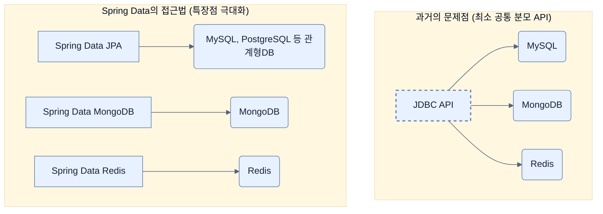

# Adding Spring Data to an existing Spring Boot application

## 한눈에 보기
| 항목 | 핵심 |
|------|------|
| 데이터 저장소 선택 | 성숙도와 강력한 트랜잭션이 필요한 관계형 DB(SQL)와 유연한 확장성을 가진 NoSQL 중 선택 |
| Spring Data | 모든 DB를 아우르는 공통 API를 강제하지 않고, 각 저장소의 특장점을 살린 전용 모듈(`Template`)을 제공 |

## 1. 왜 이게 필요한가

### 이런 상황을 상상해 보자
웹 페이지를 띄우고 JSON API를 만들었다. 이제 사용자가 작성한 데이터를 메모리가 아닌 실제 데이터베이스에 저장하고 조회해야 한다.

### 여기서 뭐가 무너지나
자바 표준 기술인 JDBC만 사용해 데이터베이스에 접근하려고 하면, 드라이버 연결부터 SQL 작성, 예외 처리, 자원 반납까지 반복적인 보일러플레이트 코드를 수백 줄씩 작성해야 한다. 또한 모든 DB에 공통으로 적용되는 "최소 공통 분모 API"를 억지로 쓰려다 보니, 특정 DB만이 가진 고유한 장점(예: Redis의 키 만료, MongoDB의 파이프라인)을 전혀 활용할 수 없게 된다.

### 그래서 나온 생각
각 데이터베이스의 매력을 깎아내리지 않고 그대로 살려주는 통합 데이터 접근 프레임워크를 만들자! 
이것이 **[[spring-data]]**의 철학이다. Spring Data는 여러 DB를 동일한 인터페이스로 묶는 대신, 각 저장소의 특화된 기능에 접근하기 쉬운 '템플릿(Template)'을 독립적으로 제공한다. 이 장에서는 가장 널리 쓰이는 관계형 DB 기술인 **[[spring-data-jpa]]**와 프로토타이핑에 유용한 내장형 인메모리 DB인 **[[h2-database]]**를 프로젝트에 추가해 본다.

### 비유로 잡기
데이터 계층은 창고와 같다. 요청자는 원하는 물건의 조건을 말하고, 저장소 추상화가 실제 선반과 운반 방식을 감춘다.

→ 비유가 깨지는 지점: 데이터베이스는 단순 창고와 달리 트랜잭션, 동시성, 지연, 스키마 제약이 있어 추상화만 믿고 비용을 무시할 수 없다.

### 이 절의 언어
**[[spring-data]]**(= 다양한 데이터 저장소 접근을 단순화하고, 각 DB의 특성을 극대화할 수 있도록 지원하는 스프링 모듈), **[[spring-data-jpa]]**(= 자바의 관계형 데이터베이스 표준(JPA)을 기반으로 리포지토리 추상화 등을 제공하는 Spring Data 모듈), **[[h2-database]]**(= 자바로 작성되어 설정 없이 바로 쓸 수 있고, 앱 종료 시 데이터가 휘발되어 프로토타이핑에 적합한 내장형 관계형 DB)

## 2. 어떻게 동작하는가

먼저 다음 세 축으로 메커니즘을 읽는다.

1. **입력과 전제 확인** — 어떤 요청·설정·데이터가 들어오는지 확인한다. 잘못된 전제를 다음 계층으로 넘기지 않기 위해서다.
2. **Spring 추상화 적용** — 스타터와 자동 구성, 어노테이션 또는 명시적 빈이 실제 처리를 연결한다. 반복 배선보다 도메인 선택에 집중하기 위해서다.
3. **결과와 경계 검증** — 응답·저장 상태·운영 신호를 확인한다. 정상 경로만 보고 장애·버전·성능 차이를 놓치지 않기 위해서다.

1. **저장소 선택**: 관계형 DB(MySQL, PostgreSQL)를 쓸지, NoSQL(Redis, MongoDB, Cassandra)을 쓸지 결정한다. 기업 환경에서는 트랜잭션(ACID)과 성숙도 덕분에 아직 80% 이상이 관계형 DB를 선택한다.
2. **Spring Data 모듈화**: Spring Data는 `RedisTemplate`, `MongoTemplate` 등 각 DB에 맞는 핵심 템플릿을 제공하여 DB 고유 기능을 쉽게 쓰게 해준다. 또한 리포지토리(Repository) 추상화를 통해 기본적인 CRUD 쿼리는 코드 없이 메서드 이름만으로 생성할 수 있게 돕는다.
3. **기존 프로젝트에 모듈 추가하기**: Chapter 2에서 배운 것처럼 `start.spring.io`의 `EXPLORE` 기능을 활용해 `spring-boot-starter-data-jpa`, `spring-boot-h2console`, `h2` 의존성 설정을 복사하여 기존 `pom.xml`에 손쉽게 붙여넣는다.

## 3. 그림으로 보기

## 4. 이 노트에 나온 용어
| 용어 | 한 줄 | 자세히 |
|------|-------|--------|
| spring-data | 다양한 데이터 저장소 접근을 단순화하고, 각 DB의 특성을 극대화할 수 있도록 지원하는 스프링 모듈 | [[_glossary#spring-data]] |
| spring-data-jpa | 자바의 관계형 데이터베이스 표준(JPA)을 기반으로 리포지토리 추상화 등을 제공하는 Spring Data 모듈 | [[_glossary#spring-data-jpa]] |
| h2-database | 자바로 작성되어 설정 없이 바로 쓸 수 있고, 앱 종료 시 데이터가 휘발되어 프로토타이핑에 적합한 내장형 관계형 DB | [[_glossary#h2-database]] |

## 5. 자주 헷갈리는 것
- 이 주제의 **Spring 추상화**와 그 아래에서 실제로 동작하는 라이브러리·프로토콜을 같은 것으로 보지 않는다. 추상화는 기본 배선을 줄이지만 하위 계층의 비용과 실패를 없애지 않는다.

## 6. 언제 안 쓰나 / 경계
- 책의 예제는 개념을 드러내기 위한 작은 애플리케이션이다. 운영 환경에서는 인증 정보, 장애 복구, 관측성, 부하와 데이터 규모를 별도로 검증한다.
- 이 노트의 API와 기본값은 책의 Spring Boot 4.1·Java 25 맥락을 따른다. 다른 마이너 버전에서는 공식 마이그레이션 문서와 실제 의존성 버전을 함께 확인한다.

## 7. 연결
- [[02-dtos-entities-and-pojos-oh-my]] — 같은 장의 학습 흐름에서 Adding Spring Data to an existing Spring Boot application의 전제 또는 다음 적용 단계와 연결된다.
- [[03-creating-repositories-and-declarative-queries-with-spring-data]] — 같은 장의 학습 흐름에서 Adding Spring Data to an existing Spring Boot application의 전제 또는 다음 적용 단계와 연결된다.

## 8. 스스로 확인
1. Spring Data가 JDBC처럼 모든 데이터베이스를 단일 API(최소 공통 분모)로 묶지 않고, 각 모듈(예: Spring Data JPA, Spring Data MongoDB)을 분리하여 설계한 이유는 무엇인가?
2. 프로토타이핑 단계에서 MySQL 같은 외부 데이터베이스 서버 대신 H2 데이터베이스를 사용할 때 얻을 수 있는 장점은 무엇인가?

<!-- ==== 아래는 내 영역 · 스킬 수정 금지 ==== -->

## 내 설명 시도

## 막혔던 지점

## 리뷰 이력
