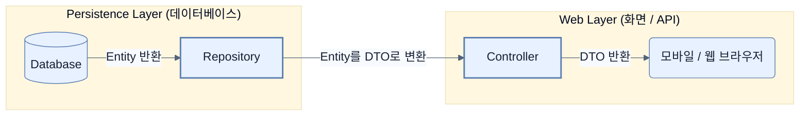

# DTOs, entities, and POJOs, oh my!

## 한눈에 보기
| 항목 | 핵심 |
|------|------|
| Entity | 데이터베이스와 소통하여 데이터를 저장/조회하는 것이 유일한 목적인 클래스 |
| DTO | 서버와 클라이언트(웹, API 등) 간에 렌더링될 데이터를 전달하기 위한 객체 |
| POJO | 특정 프레임워크의 코드를 상속받지 않는, 순수하고 가벼운 자바 객체 |

## 1. 왜 이게 필요한가

### 이런 상황을 상상해 보자
우리 서버에 '회원(User)' 정보가 있다. 비밀번호, 가입일자, 권한 등 데이터베이스(DB)에 저장해야 할 민감한 항목이 10개쯤 있다. 그런데 화면(Web)에서는 회원의 '이름'과 '프로필 사진' 두 개만 보여주면 된다. 

### 여기서 뭐가 무너지나
귀찮다는 이유로 데이터베이스에 저장할 때 쓰는 `User` 객체를 하나만 만들어 두고, 이를 조회해서 그대로 웹 응답(JSON)으로 클라이언트에게 던져버렸다. 당장은 작동하겠지만 다음과 같은 재앙이 일어난다.
- 클라이언트에게 보여주지 말아야 할 '비밀번호'가 JSON에 노출된다.
- DB 구조가 바뀌어서 테이블의 컬럼명을 수정했는데, 이 객체를 쓰고 있던 웹 화면도 동시에 깨져버린다.
- 이 객체가 DB 레이어의 요구사항(JPA 애노테이션 등)과 웹 레이어의 요구사항(Jackson JSON 파싱 애노테이션 등)을 모두 덕지덕지 달고 있어서 끔찍하게 무거워진다.

### 그래서 나온 생각
역할을 나누자! 단일 책임 원칙(**[[single-responsibility-principle]]**)에 따라 데이터베이스 전담 요원인 **[[entity]]**와, 외부에 데이터를 배달하는 전담 요원인 **[[dto]]**를 분리하는 패러다임이 등장했다. 이를 순수 자바 객체인 **[[pojo]]**로 구현하고 스프링이 제공하는 편리한 기능들을 프록시로 감싸서(Proxy) 적용함으로써, 프레임워크에 종속되지 않은 가볍고 유지보수하기 쉬운 코드를 만들 수 있다.

### 비유로 잡기
데이터 계층은 창고와 같다. 요청자는 원하는 물건의 조건을 말하고, 저장소 추상화가 실제 선반과 운반 방식을 감춘다.

→ 비유가 깨지는 지점: 데이터베이스는 단순 창고와 달리 트랜잭션, 동시성, 지연, 스키마 제약이 있어 추상화만 믿고 비용을 무시할 수 없다.

### 이 절의 언어
**[[entity]]**(= JPA 등 영속성 계층에서 관리되며, 데이터베이스와 직접 연결되어 데이터를 저장하고 조회하는 목적의 클래스), **[[dto]]**(= Data Transfer Object, 계층 간(특히 서버-클라이언트 간)에 필요한 데이터만 모아서 전송하기 위한 불변 데이터 객체), **[[pojo]]**(= Plain Old Java Object, 복잡한 프레임워크 코드를 상속받지 않아 가볍고 테스트하기 쉬운 평범한 자바 객체), **[[single-responsibility-principle]]**(= 단일 책임 원칙(SRP), 하나의 클래스는 단 하나의 책임을 져야 하며 클래스가 변경될 이유도 오직 하나뿐이어야 한다는 객체지향 원칙)

## 2. 어떻게 동작하는가

먼저 다음 세 축으로 메커니즘을 읽는다.

1. **입력과 전제 확인** — 어떤 요청·설정·데이터가 들어오는지 확인한다. 잘못된 전제를 다음 계층으로 넘기지 않기 위해서다.
2. **Spring 추상화 적용** — 스타터와 자동 구성, 어노테이션 또는 명시적 빈이 실제 처리를 연결한다. 반복 배선보다 도메인 선택에 집중하기 위해서다.
3. **결과와 경계 검증** — 응답·저장 상태·운영 신호를 확인한다. 정상 경로만 보고 장애·버전·성능 차이를 놓치지 않기 위해서다.

1. **Entity (데이터베이스 전담)**: JPA와 같은 데이터 접근 계층에서 관리한다. 
   - `@Entity`, `@Id` 등의 애노테이션이 붙는다.
   - DB 테이블의 제약조건이나 1:1 매핑 규칙을 최우선으로 따른다.
   - 식별자(Identity)와 상태 변경(Mutability) 추적이 필수적이므로 Java `record`보다는 일반 클래스로 만드는 것이 낫다.
2. **DTO (데이터 전달 전담)**: 웹(컨트롤러) 계층에서 클라이언트와 소통한다.
   - 화면에 노출될 데이터만 정제해서 담는다.
   - 불변(Immutable) 상태로 데이터를 한 번에 담아 옮기는 것이 목적이므로 최신 자바의 `record`를 사용하는 것이 아주 적합하다.
3. **POJO (순수 자바 객체)**: 예전 EJB 시절처럼 특정 프레임워크의 클래스를 상속(`extends`)받아 코딩하는 낡은 방식을 탈피했다. 
   - 개발자는 순수한 자바 객체를 짠다.
   - Spring이 이 객체를 Application Context(빈)로 관리하며 런타임에 트랜잭션, 의존성 주입 등을 알아서 입혀준다. 테스트하기가 매우 쉽다.

> [!TIP]
> 아주 간단한 단기 프로젝트(CTO 데모용 등)에서는 Entity와 DTO를 분리하지 않고 하나로 퉁치는 것이 빠를 수 있다. 하지만 실무(Production)처럼 장기적으로 유지보수할 프로젝트라면 둘을 분리하는 것이 정석이다.

## 3. 그림으로 보기

## 4. 이 노트에 나온 용어
| 용어 | 한 줄 | 자세히 |
|------|-------|--------|
| entity | JPA 등 영속성 계층에서 관리되며, 데이터베이스와 직접 연결되어 데이터를 저장하고 조회하는 목적의 클래스 | [[_glossary#entity]] |
| dto | Data Transfer Object, 계층 간(특히 서버-클라이언트 간)에 필요한 데이터만 모아서 전송하기 위한 불변 데이터 객체 | [[_glossary#dto]] |
| pojo | Plain Old Java Object, 복잡한 프레임워크 코드를 상속받지 않아 가볍고 테스트하기 쉬운 평범한 자바 객체 | [[_glossary#pojo]] |
| single-responsibility-principle | 단일 책임 원칙(SRP), 하나의 클래스는 단 하나의 책임을 져야 하며 클래스가 변경될 이유도 오직 하나뿐이어야 한다는 객체지향 원칙 | [[_glossary#single-responsibility-principle]] |

## 5. 자주 헷갈리는 것
- 이 주제의 **Spring 추상화**와 그 아래에서 실제로 동작하는 라이브러리·프로토콜을 같은 것으로 보지 않는다. 추상화는 기본 배선을 줄이지만 하위 계층의 비용과 실패를 없애지 않는다.

## 6. 언제 안 쓰나 / 경계
- 책의 예제는 개념을 드러내기 위한 작은 애플리케이션이다. 운영 환경에서는 인증 정보, 장애 복구, 관측성, 부하와 데이터 규모를 별도로 검증한다.
- 이 노트의 API와 기본값은 책의 Spring Boot 4.1·Java 25 맥락을 따른다. 다른 마이너 버전에서는 공식 마이그레이션 문서와 실제 의존성 버전을 함께 확인한다.

## 7. 연결
- [[01-adding-spring-data-to-an-existing-spring-boot-application]] — 같은 장의 학습 흐름에서 DTOs, entities, and POJOs, oh my!의 전제 또는 다음 적용 단계와 연결된다.
- [[03-creating-repositories-and-declarative-queries-with-spring-data]] — 같은 장의 학습 흐름에서 DTOs, entities, and POJOs, oh my!의 전제 또는 다음 적용 단계와 연결된다.

## 8. 스스로 확인
1. JPA를 사용할 때 `Entity` 객체를 최신 자바 문법인 `record`로 구현하는 것이 권장되지 않는 핵심 이유는 무엇인가?
2. Entity 클래스 하나를 DTO 용도로 혼용했을 때, 1년 뒤 비즈니스가 확장되면서 겪게 될 가장 심각한 문제점은 무엇인가?

<!-- ==== 아래는 내 영역 · 스킬 수정 금지 ==== -->

## 내 설명 시도

## 막혔던 지점

## 리뷰 이력
