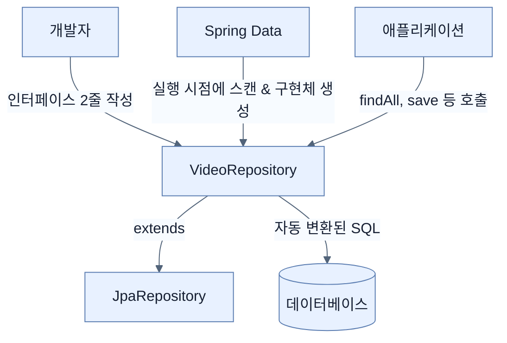

# Creating repositories and declarative queries with Spring Data

## 한눈에 보기
| 항목 | 핵심 |
|------|------|
| 세상에서 가장 좋은 쿼리 | "내가 직접 작성하지 않은 쿼리" |
| Repository Pattern | 특정 도메인(Entity)에 대한 모든 데이터 연산을 한 곳에 모아두는 디자인 패턴 |
| JpaRepository | 스프링 데이터가 제공하는 인터페이스로, 상속받기만 하면 즉시 수십 개의 쿼리 메서드가 자동 생성됨 |

## 1. 왜 이게 필요한가

### 이런 상황을 상상해 보자
데이터베이스의 `video_entity` 테이블에서 비디오 데이터를 조회하고 싶다. 예전에는 데이터베이스와 연결을 맺고, `SELECT * FROM video_entity` 문자열을 타이핑한 뒤, 결과를 한 줄씩 읽어서 자바 객체(`VideoEntity`)로 변환하는 코드를 손으로 직접 짜야 했다. 이를 모든 테이블마다 반복해야 했다.

### 여기서 뭐가 무너지나
SQL을 하드코딩하면 개발 시간이 오래 걸릴 뿐만 아니라, 오타로 인한 런타임 에러, SQL 인젝션 보안 취약점, 그리고 데이터베이스 변경 시 모든 쿼리문을 고쳐야 하는 끔찍한 유지보수 문제가 뒤따른다. 

### 그래서 나온 생각
도메인 객체(Entity)와 DB 사이에 다리를 놓아줄 전담 객체를 하나 두자. 이것이 마틴 파울러(Martin Fowler)가 주창한 **[[repository-pattern]]**이다. Spring Data는 여기서 한 발 더 나아가, 개발자가 **[[jpa-repository]]**라는 껍데기(인터페이스)만 만들어 두면 실행 시점(Runtime)에 스프링 부트가 빈(Bean) 스캐닝을 통해 **[[crud-operations]]**(생성, 조회, 수정, 삭제) 쿼리를 전부 알아서 만들어 내는 흑마법(Query Derivation)을 부린다.

### 비유로 잡기
데이터 계층은 창고와 같다. 요청자는 원하는 물건의 조건을 말하고, 저장소 추상화가 실제 선반과 운반 방식을 감춘다.

→ 비유가 깨지는 지점: 데이터베이스는 단순 창고와 달리 트랜잭션, 동시성, 지연, 스키마 제약이 있어 추상화만 믿고 비용을 무시할 수 없다.

### 이 절의 언어
**[[repository-pattern]]**(= 애플리케이션 계층이 데이터 저장소 기술에 종속되지 않도록, 도메인 객체의 저장/조회를 전담하는 객체를 두는 패턴), **[[jpa-repository]]**(= 스프링 데이터 JPA가 제공하며, 페이징과 정렬을 포함한 핵심 CRUD 메서드들을 미리 정의해 둔 인터페이스), **[[query-derivation]]**(= Spring Data가 리포지토리 인터페이스를 분석하여 실행 시점에 데이터베이스 쿼리를 자동으로 파생(생성)해 내는 기술), **[[crud-operations]]**(= 소프트웨어가 가지는 기본적인 데이터 처리 기능인 Create(생성), Read(조회), Update(수정), Delete(삭제))

## 2. 어떻게 동작하는가

먼저 다음 세 축으로 메커니즘을 읽는다.

1. **입력과 전제 확인** — 어떤 요청·설정·데이터가 들어오는지 확인한다. 잘못된 전제를 다음 계층으로 넘기지 않기 위해서다.
2. **Spring 추상화 적용** — 스타터와 자동 구성, 어노테이션 또는 명시적 빈이 실제 처리를 연결한다. 반복 배선보다 도메인 선택에 집중하기 위해서다.
3. **결과와 경계 검증** — 응답·저장 상태·운영 신호를 확인한다. 정상 경로만 보고 장애·버전·성능 차이를 놓치지 않기 위해서다.

1. **리포지토리 인터페이스 생성**:
   ```java
   public interface VideoRepository extends JpaRepository<VideoEntity, Long> {
   }
   ```
   단 2줄이면 끝난다! 제네릭 타입으로는 매핑할 **도메인 타입**(`VideoEntity`)과 그 엔티티의 **기본키(ID) 타입**(`Long`)을 지정한다.
   
2. **무료로 제공되는 메서드들**:
   저 인터페이스를 선언하는 순간, 다음과 같은 메서드들을 즉시 사용할 수 있다.
   - `save(entity)`: 데이터 저장/수정
   - `findById(id)`: PK를 통한 단건 조회
   - `findAll()`: 전체 조회
   - `deleteById(id)`: 데이터 삭제
   - `count()`: 데이터 개수 파악

3. **내부 원리**:
   `JpaRepository`를 깊게 따라가 보면 결국 최상위에는 메서드가 하나도 없는 비어있는 `Repository` 인터페이스가 존재한다. Spring Boot는 구동될 때 이 마커(Marker) 인터페이스를 상속받은 모든 자식들을 스캔하고, JPA 기술을 활용하여 자동으로 구현체 프록시 객체를 만들어 애플리케이션 컨텍스트(Application Context)에 등록해 준다.

## 3. 그림으로 보기



## 4. 이 노트에 나온 용어
| 용어 | 한 줄 | 자세히 |
|------|-------|--------|
| repository-pattern | 애플리케이션 계층이 데이터 저장소 기술에 종속되지 않도록, 도메인 객체의 저장/조회를 전담하는 객체를 두는 패턴 | [[_glossary#repository-pattern]] |
| jpa-repository | 스프링 데이터 JPA가 제공하며, 페이징과 정렬을 포함한 핵심 CRUD 메서드들을 미리 정의해 둔 인터페이스 | [[_glossary#jpa-repository]] |
| query-derivation | Spring Data가 리포지토리 인터페이스를 분석하여 실행 시점에 데이터베이스 쿼리를 자동으로 파생(생성)해 내는 기술 | [[_glossary#query-derivation]] |
| crud-operations | 소프트웨어가 가지는 기본적인 데이터 처리 기능인 Create(생성), Read(조회), Update(수정), Delete(삭제) | [[_glossary#crud-operations]] |

## 5. 자주 헷갈리는 것
- 이 주제의 **Spring 추상화**와 그 아래에서 실제로 동작하는 라이브러리·프로토콜을 같은 것으로 보지 않는다. 추상화는 기본 배선을 줄이지만 하위 계층의 비용과 실패를 없애지 않는다.

## 6. 언제 안 쓰나 / 경계
- 책의 예제는 개념을 드러내기 위한 작은 애플리케이션이다. 운영 환경에서는 인증 정보, 장애 복구, 관측성, 부하와 데이터 규모를 별도로 검증한다.
- 이 노트의 API와 기본값은 책의 Spring Boot 4.1·Java 25 맥락을 따른다. 다른 마이너 버전에서는 공식 마이그레이션 문서와 실제 의존성 버전을 함께 확인한다.

## 7. 연결
- [[02-dtos-entities-and-pojos-oh-my]] — 같은 장의 학습 흐름에서 Creating repositories and declarative queries with Spring Data의 전제 또는 다음 적용 단계와 연결된다.
- [[04-using-custom-finders]] — 같은 장의 학습 흐름에서 Creating repositories and declarative queries with Spring Data의 전제 또는 다음 적용 단계와 연결된다.

## 8. 스스로 확인
1. `JpaRepository`를 사용할 때 제네릭 매개변수 두 개(`T`, `ID`)는 각각 무엇을 의미하는가?
2. Spring Data 프로젝트에서 개발자가 리포지토리의 인터페이스만 만들고 실제 구현체 클래스(`implements ...`)를 작성하지 않아도 프로그램이 정상 작동하는 이유는 무엇인가?

<!-- ==== 아래는 내 영역 · 스킬 수정 금지 ==== -->

## 내 설명 시도

## 막혔던 지점

## 리뷰 이력
