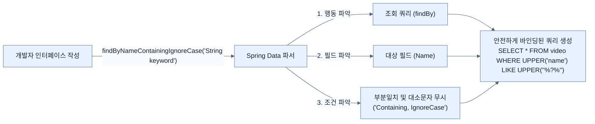

# Using custom finders

## 한눈에 보기
| 항목 | 핵심 |
|------|------|
| Custom Finders | `findByName`처럼 규칙에 맞춰 메서드 이름만 지어주면 Spring Data가 알아서 SQL을 만들어주는 기능 |
| 보안성 | 메서드 파라미터로 넘어온 값은 자동 바인딩(Binding)되어 SQL 인젝션 공격을 원천 차단함 |

## 1. 왜 이게 필요한가

### 이런 상황을 상상해 보자
앞선 노트에서 `JpaRepository`가 널리 쓰이는 기본 쿼리(`findById`, `findAll` 등)를 전부 만들어 준다는 것을 배웠다. 그런데 서비스가 커지면서 "비디오 제목으로 검색하기", "특정 단어가 포함된 설명 찾기"처럼 비즈니스 로직에 특화된 세밀한 검색 기능이 필요해졌다.

### 여기서 뭐가 무너지나
기본 쿼리만으로는 이런 세밀한 검색이 불가능하다. 그래서 직접 `SELECT * FROM video_entity WHERE name = ? AND description LIKE ?` 같은 SQL 문자열을 작성하고 파라미터를 세팅하는 코드를 만들어야 한다. 
문제는 개발자가 이런 쿼리를 작성할 때 실수로 사용자의 검색어 입력을 쿼리 문자열에 그대로 이어 붙이게(String concatenation) 되면, 해커가 악의적인 문자열을 넣어 데이터베이스를 파괴하는 **[[sql-injection]]** 공격에 뻥 뚫리게 된다.

### 그래서 나온 생각
복잡한 쿼리도 웬만하면 메서드 이름만으로 선언하게 만들자! Spring Data의 **[[query-derivation]]** 능력을 응용한 **[[custom-finders]]** 기능을 사용하면, 리포지토리 인터페이스에 `List<VideoEntity> findByName(String name);` 이라고 메서드 이름만 적어주어도 프레임워크가 이를 분석해 내부적으로 안전한 파라미터 바인딩이 적용된 쿼리를 대신 생성해 준다.

### 비유로 잡기
이 기능은 조립 라인의 한 공정과 비슷하다. 입력을 정해진 규칙으로 변환해 다음 공정이 사용할 결과를 만든다.

→ 비유가 깨지는 지점: 애플리케이션은 고정된 조립 라인이 아니다. 조건부 구성과 런타임 실패, 외부 시스템 변화 때문에 공정의 경계를 따로 검증해야 한다.

### 이 절의 언어
**[[custom-finders]]**(= 규칙에 맞춰 명명된 메서드 시그니처만으로 Spring Data가 자동 생성해주는 커스텀 조회 쿼리), **[[sql-injection]]**(= 외부 입력값을 검증 없이 쿼리에 붙여 넣을 때 발생하는 보안 취약점으로, 악의적인 SQL이 실행되게 만드는 공격 기법), **[[query-derivation]]**(= Spring Data가 메서드 이름을 분석하여 쿼리로 번역(파생)해 주는 기능), **[[jpql]]**(= 자바 영속성 쿼리 언어(Jakarta Persistence Query Language)로, 데이터베이스 테이블이 아닌 '엔티티 객체'를 대상으로 작성하는 쿼리 언어)

## 2. 어떻게 동작하는가

먼저 다음 세 축으로 메커니즘을 읽는다.

1. **입력과 전제 확인** — 어떤 요청·설정·데이터가 들어오는지 확인한다. 잘못된 전제를 다음 계층으로 넘기지 않기 위해서다.
2. **Spring 추상화 적용** — 스타터와 자동 구성, 어노테이션 또는 명시적 빈이 실제 처리를 연결한다. 반복 배선보다 도메인 선택에 집중하기 위해서다.
3. **결과와 경계 검증** — 응답·저장 상태·운영 신호를 확인한다. 정상 경로만 보고 장애·버전·성능 차이를 놓치지 않기 위해서다.

1. **이름 규칙 파싱**:
   Spring Data는 `findBy`로 시작하는 메서드를 보면 "아, 쿼리를 만들어야 하구나"라고 플래그를 세운다. 그다음 엔티티의 필드명(예: `Name`)을 찾아 조건문(`WHERE name = ?`)을 구성한다.
2. **다양한 연산자(Operators) 지원**:
   단순한 일치 검색을 넘어 다양한 조건과 키워드를 조합할 수 있다.
   - `And` / `Or`: `findByNameAndDescription(String name, String desc)`
   - 문자열 검색: `StartsWith`, `EndsWith`, `Containing` (자동으로 `%` 와일드카드 삽입)
   - 세밀한 조건: `Between`, `LessThan`, `GreaterThan`
   - 대소문자 무시 및 정렬: `IgnoreCase`, `AllIgnoreCase`, `OrderByNameDesc`
3. **관계형 탐색(Navigating relationships)**:
   엔티티 안에 또 다른 엔티티가 포함되어 있는 경우(예: `Person` 안의 `Address`), `findByAddressZipCode` 처럼 꼬리를 물고 탐색할 수 있다. 만약 이름이 모호하다면 밑줄(`_`)을 명시하여 탐색 경로를 지정할 수 있다(`findByAddress_ZipCode`).
4. **보안과 호환성**:
   개발자가 직접 데이터베이스별 방언(Dialect)을 고려할 필요가 없다. Spring Data가 밑단에서 **[[jpql]]**과 메타데이터를 활용하여 현재 연결된 DB(MySQL, PostgreSQL 등)에 맞는 최적의 쿼리를 뽑아내고, 파라미터를 안전하게 바인딩한다.

## 3. 그림으로 보기

## 4. 이 노트에 나온 용어
| 용어 | 한 줄 | 자세히 |
|------|-------|--------|
| custom-finders | 규칙에 맞춰 명명된 메서드 시그니처만으로 Spring Data가 자동 생성해주는 커스텀 조회 쿼리 | [[_glossary#custom-finders]] |
| sql-injection | 외부 입력값을 검증 없이 쿼리에 붙여 넣을 때 발생하는 보안 취약점으로, 악의적인 SQL이 실행되게 만드는 공격 기법 | [[_glossary#sql-injection]] |
| query-derivation | Spring Data가 메서드 이름을 분석하여 쿼리로 번역(파생)해 주는 기능 | [[_glossary#query-derivation]] |
| jpql | 자바 영속성 쿼리 언어(Jakarta Persistence Query Language)로, 데이터베이스 테이블이 아닌 '엔티티 객체'를 대상으로 작성하는 쿼리 언어 | [[_glossary#jpql]] |

## 5. 자주 헷갈리는 것
- 이 주제의 **Spring 추상화**와 그 아래에서 실제로 동작하는 라이브러리·프로토콜을 같은 것으로 보지 않는다. 추상화는 기본 배선을 줄이지만 하위 계층의 비용과 실패를 없애지 않는다.

## 6. 언제 안 쓰나 / 경계
- 책의 예제는 개념을 드러내기 위한 작은 애플리케이션이다. 운영 환경에서는 인증 정보, 장애 복구, 관측성, 부하와 데이터 규모를 별도로 검증한다.
- 이 노트의 API와 기본값은 책의 Spring Boot 4.1·Java 25 맥락을 따른다. 다른 마이너 버전에서는 공식 마이그레이션 문서와 실제 의존성 버전을 함께 확인한다.

## 7. 연결
- [[03-creating-repositories-and-declarative-queries-with-spring-data]] — 같은 장의 학습 흐름에서 Using custom finders의 전제 또는 다음 적용 단계와 연결된다.
- [[05-using-query-by-example-to-find-tricky-answers]] — 같은 장의 학습 흐름에서 Using custom finders의 전제 또는 다음 적용 단계와 연결된다.

## 8. 스스로 확인
1. Spring Data JPA의 커스텀 파인더를 사용할 때, 사용자의 입력값을 그대로 쿼리에 사용할 경우 발생할 수 있는 보안 문제(SQL 인젝션)를 프레임워크가 어떻게 방지하는가?
2. `Person` 엔티티가 `Address` 객체를 멤버로 가지고 있고, 그 안에 `zipCode`라는 필드가 있을 때, 이를 조회하기 위한 커스텀 파인더의 올바른 네이밍 규칙 두 가지는 무엇인가?

<!-- ==== 아래는 내 영역 · 스킬 수정 금지 ==== -->

## 내 설명 시도

## 막혔던 지점

## 리뷰 이력
