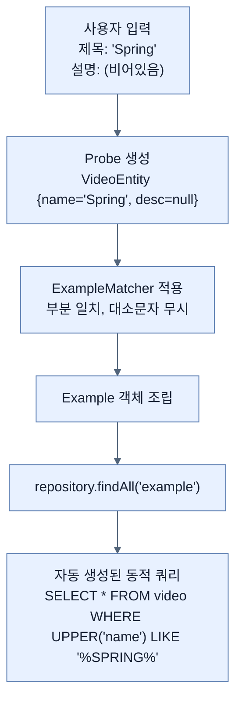

# Using Query By Example to find tricky answers

## 한눈에 보기
| 항목 | 핵심 |
|------|------|
| 동적 쿼리의 딜레마 | 사용자가 '이름'만 검색할지, '설명'만 검색할지, 둘 다 검색할지 모르는 상황에서 쿼리를 어떻게 유연하게 짤 것인가? |
| Query By Example (QBE) | 내가 원하는 조건만 채워 넣은 '샘플 객체(Probe)'를 던져주면, Spring Data가 알아서 똑같이 생긴 데이터를 찾아주는 기능 |

## 1. 왜 이게 필요한가

### 이런 상황을 상상해 보자
비디오 검색 웹 페이지에 검색창이 3개(제목, 설명, 태그) 있다. 사용자는 제목만 입력할 수도 있고, 설명만 입력할 수도 있으며, 아무것도 입력하지 않을 수도 있다. 

### 여기서 뭐가 무너지나
이전 노트에서 배운 '커스텀 파인더(`findByNameAndDescriptionAndTags`)'로 이 문제를 해결하려면 지옥이 펼쳐진다. 
- 이름만 입력했을 때 쓸 `findByName`
- 설명만 입력했을 때 쓸 `findByDescription`
- 이름과 설명을 입력했을 때 쓸 `findByNameAndDescription`
경우의 수만큼 끝도 없이 메서드를 만들어야 하며, 컨트롤러에서 수많은 `if` 문을 통해 어떤 메서드를 호출할지 분기 처리해야 한다. 심지어 SQL 구조상 `null`은 데이터베이스의 `null`과 다르게 취급되기 때문에 메서드 파라미터로 `null`을 넘겨서 무시하게 만들 수도 없다.

### 그래서 나온 생각
그냥 "이런 모양의 데이터를 찾아줘"라고 예시 객체 하나만 보여주고 끝내자! 이것이 **[[query-by-example]]** 기법이다. 검색하고자 하는 필드만 값을 채워 넣고 나머지 필드는 비워둔 엔티티 객체(이를 **[[probe]]**라 부름)를 만들어서 Spring Data에게 넘기면, 비어있는(Null) 필드는 무시하고 값이 채워진 필드만 모아서 동적인 쿼리를 알아서 조립해 준다.

### 비유로 잡기
데이터 계층은 창고와 같다. 요청자는 원하는 물건의 조건을 말하고, 저장소 추상화가 실제 선반과 운반 방식을 감춘다.

→ 비유가 깨지는 지점: 데이터베이스는 단순 창고와 달리 트랜잭션, 동시성, 지연, 스키마 제약이 있어 추상화만 믿고 비용을 무시할 수 없다.

### 이 절의 언어
**[[query-by-example]]**(= QBE, 찾고자 하는 데이터의 조건을 '엔티티 샘플 객체' 형태로 만들어 전달하여 동적으로 데이터를 조회하는 방식), **[[probe]]**(= 검색 조건을 담고 있는 도메인 엔티티의 실제 인스턴스 (비어있는 필드는 무시됨)), **[[example-matcher]]**(= Probe에 담긴 값들을 정확히 일치시킬지(Exact), 부분 일치시킬지(Containing), 대소문자를 무시할지 등 검색 규칙을 정의하는 객체)

## 2. 어떻게 동작하는가

먼저 다음 세 축으로 메커니즘을 읽는다.

1. **입력과 전제 확인** — 어떤 요청·설정·데이터가 들어오는지 확인한다. 잘못된 전제를 다음 계층으로 넘기지 않기 위해서다.
2. **Spring 추상화 적용** — 스타터와 자동 구성, 어노테이션 또는 명시적 빈이 실제 처리를 연결한다. 반복 배선보다 도메인 선택에 집중하기 위해서다.
3. **결과와 경계 검증** — 응답·저장 상태·운영 신호를 확인한다. 정상 경로만 보고 장애·버전·성능 차이를 놓치지 않기 위해서다.

1. **Probe 생성하기**:
   ```java
   VideoEntity probe = new VideoEntity();
   probe.setName("Spring"); // 이것만 검색하고 싶다!
   // description과 tags는 세팅하지 않음 (null 상태)
   ```
   내가 찾고 싶은 데이터의 '샘플'을 만든다.

2. **매칭 규칙(Matcher) 설정하기**:
   기본적으로 QBE는 입력된 모든 필드가 정확히 일치(Exact Match, AND 연산)하는 것만 찾는다. 하지만 "대소문자 무시"나 "부분 일치" 같은 세밀한 조건을 주려면 **[[example-matcher]]**를 사용한다.
   ```java
   ExampleMatcher matcher = ExampleMatcher.matchingAny() // 하나라도 맞으면(OR)
       .withIgnoreCase() // 대소문자 무시
       .withStringMatcher(StringMatcher.CONTAINING); // 부분 일치(LIKE %...%)
   ```

3. **Example 래핑 및 실행**:
   만들어진 샘플(Probe)과 규칙(Matcher)을 합쳐서 `Example` 객체를 만들고 리포지토리에 넘긴다.
   ```java
   Example<VideoEntity> example = Example.of(probe, matcher);
   return repository.findAll(example);
   ```
   `JpaRepository`는 부모 인터페이스로부터 `findAll(Example<S>)` 메서드를 물려받았기 때문에 이 객체를 던져주기만 하면 상황에 딱 맞는 쿼리가 실행된다.

## 3. 그림으로 보기



## 4. 이 노트에 나온 용어
| 용어 | 한 줄 | 자세히 |
|------|-------|--------|
| query-by-example | QBE, 찾고자 하는 데이터의 조건을 '엔티티 샘플 객체' 형태로 만들어 전달하여 동적으로 데이터를 조회하는 방식 | [[_glossary#query-by-example]] |
| probe | 검색 조건을 담고 있는 도메인 엔티티의 실제 인스턴스 (비어있는 필드는 무시됨) | [[_glossary#probe]] |
| example-matcher | Probe에 담긴 값들을 정확히 일치시킬지(Exact), 부분 일치시킬지(Containing), 대소문자를 무시할지 등 검색 규칙을 정의하는 객체 | [[_glossary#example-matcher]] |

## 5. 자주 헷갈리는 것
- 이 주제의 **Spring 추상화**와 그 아래에서 실제로 동작하는 라이브러리·프로토콜을 같은 것으로 보지 않는다. 추상화는 기본 배선을 줄이지만 하위 계층의 비용과 실패를 없애지 않는다.

## 6. 언제 안 쓰나 / 경계
- 책의 예제는 개념을 드러내기 위한 작은 애플리케이션이다. 운영 환경에서는 인증 정보, 장애 복구, 관측성, 부하와 데이터 규모를 별도로 검증한다.
- 이 노트의 API와 기본값은 책의 Spring Boot 4.1·Java 25 맥락을 따른다. 다른 마이너 버전에서는 공식 마이그레이션 문서와 실제 의존성 버전을 함께 확인한다.

## 7. 연결
- [[04-using-custom-finders]] — 같은 장의 학습 흐름에서 Using Query By Example to find tricky answers의 전제 또는 다음 적용 단계와 연결된다.
- [[06-using-the-custom-java-persistence-api-jpa]] — 같은 장의 학습 흐름에서 Using Query By Example to find tricky answers의 전제 또는 다음 적용 단계와 연결된다.

## 8. 스스로 확인
1. 데이터베이스에서 조건부 검색을 할 때, 커스텀 파인더(`findByNameAndDescription...`) 대신 Query By Example(QBE)을 사용하면 해결되는 가장 큰 아키텍처적 문제점은 무엇인가?
2. `ExampleMatcher`의 `matchingAny()`와 `matchingAll()`은 쿼리가 생성될 때 각각 SQL의 어떤 논리 연산자로 변환되는가?

<!-- ==== 아래는 내 영역 · 스킬 수정 금지 ==== -->

## 내 설명 시도

## 막혔던 지점

## 리뷰 이력
