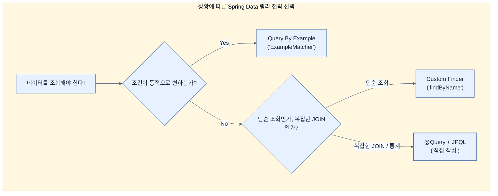

# Using the custom Java Persistence API (JPA)

## 한눈에 보기
| 항목 | 핵심 |
|------|------|
| @Query 애노테이션 | Spring Data의 흑마법(Query Derivation, QBE)으로 해결 안 되는 매우 복잡한 쿼리를 개발자가 직접 작성하게 해주는 탈출구 |
| JPQL (Jakarta Persistence Query Language) | 데이터베이스의 실제 테이블이나 컬럼 이름이 아닌, 자바의 '엔티티 객체'와 '필드명'을 대상으로 작성하는 객체지향 쿼리 언어 |

## 1. 왜 이게 필요한가

### 이런 상황을 상상해 보자
우리 서비스에 비디오 데이터뿐만 아니라 시청 기록, 사용자 좋아요 수, 댓글 테이블이 추가되었다. "조회수가 10회 미만이거나 좋아요가 5개 미만인 비디오"를 찾기 위해 여러 테이블을 JOIN해서 데이터를 가져와야 한다.

### 여기서 뭐가 무너지나
지금까지 배운 커스텀 파인더(`findByName...`)나 Query By Example(QBE)은 단일 테이블 조회나 단순한 조건 검색에는 매우 강력하다. 하지만 3~4개의 테이블을 복잡하게 얽어서 JOIN해야 하거나 아주 특이한 통계 쿼리를 짜야 할 때, 커스텀 파인더로 이를 해결하려면 메서드 이름이 우주 끝까지 길어지거나 아예 생성이 불가능해진다. 프레임워크의 편의성이 오히려 독이 되는 순간이다.

### 그래서 나온 생각
결국 최후의 보루는 개발자가 쿼리를 직접 작성하는 것이다! Spring Data는 이를 위해 리포지토리 인터페이스 메서드 위에 붙일 수 있는 **[[query-annotation]]**(`@Query`)을 제공한다. 여기에 SQL과 비슷하지만 데이터베이스에 독립적인 **[[jpql]]**을 직접 작성하면, 스프링 데이터의 자동 생성 규칙을 무시하고 개발자가 의도한 대로 쿼리가 실행된다.

### 비유로 잡기
데이터 계층은 창고와 같다. 요청자는 원하는 물건의 조건을 말하고, 저장소 추상화가 실제 선반과 운반 방식을 감춘다.

→ 비유가 깨지는 지점: 데이터베이스는 단순 창고와 달리 트랜잭션, 동시성, 지연, 스키마 제약이 있어 추상화만 믿고 비용을 무시할 수 없다.

### 이 절의 언어
**[[query-annotation]]**(= 개발자가 스프링 데이터의 자동 생성 기능을 무시하고 직접 쿼리를 주입할 수 있게 해주는 애노테이션), **[[jpql]]**(= Jakarta Persistence Query Language, 물리적 DB 테이블이 아닌 자바 엔티티 객체를 대상으로 쿼리를 작성하여 DB 종속성을 없앤 객체지향 쿼리 언어), **[[parameter-binding]]**(= SQL 인젝션을 막기 위해 외부에서 들어온 값을 쿼리의 특정 위치(?1)나 이름(:name)에 안전하게 매핑하는 기술), **[[pagination-and-sorting]]**(= 대량의 데이터를 페이지 단위로 끊어서 가져오고 정렬 순서를 지정하는 기능으로, 커스텀 쿼리에서도 Spring Data가 이를 자동 지원함)

## 2. 어떻게 동작하는가

먼저 다음 세 축으로 메커니즘을 읽는다.

1. **입력과 전제 확인** — 어떤 요청·설정·데이터가 들어오는지 확인한다. 잘못된 전제를 다음 계층으로 넘기지 않기 위해서다.
2. **Spring 추상화 적용** — 스타터와 자동 구성, 어노테이션 또는 명시적 빈이 실제 처리를 연결한다. 반복 배선보다 도메인 선택에 집중하기 위해서다.
3. **결과와 경계 검증** — 응답·저장 상태·운영 신호를 확인한다. 정상 경로만 보고 장애·버전·성능 차이를 놓치지 않기 위해서다.

1. **@Query와 JPQL 작성하기**:
   ```java
   @Query("select v from VideoEntity v where v.name = ?1")
   List<VideoEntity> findCustomerReport(String name);
   ```
   이 방식을 쓰면 메서드 이름(`findCustomerReport`)은 쿼리 생성에 아무런 영향을 주지 않으므로, 개발자가 비즈니스 의도를 가장 잘 나타내는 멋진 이름을 마음대로 지을 수 있다.

2. **파라미터 바인딩 (Parameter Binding)**:
   외부 입력값을 쿼리에 안전하게 넣기 위해 두 가지 방식을 쓴다.
   - **순서 기반**: `?1`을 쓰면 메서드의 첫 번째 파라미터 값이 들어간다.
   - **이름 기반**: `:minimumViews` 처럼 변수명을 적어주고, 메서드 파라미터에 `@Param("minimumViews") Long views`를 붙여 명확하게 연결한다. (유지보수에 더 좋다)

3. **복잡한 JOIN 처리**:
   ```java
   @Query("select v FROM VideoEntity v "
        + "JOIN v.metrics m "
        + "JOIN m.activity a "
        + "JOIN v.engagement e "
        + "WHERE a.views < :minimumViews OR e.likes < :minimumLikes")
   List<VideoEntity> findVideosThatArentPopular(
         @Param("minimumViews") Long minimumViews,
         @Param("minimumLikes") Long minimumLikes);
   ```
   여러 테이블이 엮이더라도 JPQL은 객체 간의 관계를 탐색(Navigation)하는 방식으로 조인을 쉽게 표현한다.

4. **여전히 누리는 혜택**:
   개발자가 쿼리를 직접 짰다 하더라도 Spring Data는 매정하게 돌아서지 않는다. 이 커스텀 메서드에 **[[pagination-and-sorting]]** (정렬과 페이징) 파라미터(`Sort`, `Pageable`)를 넘겨주면, Spring Data가 우리가 짠 쿼리 뒤에 몰래 `ORDER BY`나 `LIMIT/OFFSET` 구문을 덧붙여서 실행해 주는 마법은 계속 유지된다.

## 3. 그림으로 보기



## 4. 이 노트에 나온 용어
| 용어 | 한 줄 | 자세히 |
|------|-------|--------|
| query-annotation | 개발자가 스프링 데이터의 자동 생성 기능을 무시하고 직접 쿼리를 주입할 수 있게 해주는 애노테이션 | [[_glossary#query-annotation]] |
| jpql | Jakarta Persistence Query Language, 물리적 DB 테이블이 아닌 자바 엔티티 객체를 대상으로 쿼리를 작성하여 DB 종속성을 없앤 객체지향 쿼리 언어 | [[_glossary#jpql]] |
| parameter-binding | SQL 인젝션을 막기 위해 외부에서 들어온 값을 쿼리의 특정 위치(`?1`)나 이름(`:name`)에 안전하게 매핑하는 기술 | [[_glossary#parameter-binding]] |
| pagination-and-sorting | 대량의 데이터를 페이지 단위로 끊어서 가져오고 정렬 순서를 지정하는 기능으로, 커스텀 쿼리에서도 Spring Data가 이를 자동 지원함 | [[_glossary#pagination-and-sorting]] |

## 5. 자주 헷갈리는 것
- 이 주제의 **Spring 추상화**와 그 아래에서 실제로 동작하는 라이브러리·프로토콜을 같은 것으로 보지 않는다. 추상화는 기본 배선을 줄이지만 하위 계층의 비용과 실패를 없애지 않는다.

## 6. 언제 안 쓰나 / 경계
- 책의 예제는 개념을 드러내기 위한 작은 애플리케이션이다. 운영 환경에서는 인증 정보, 장애 복구, 관측성, 부하와 데이터 규모를 별도로 검증한다.
- 이 노트의 API와 기본값은 책의 Spring Boot 4.1·Java 25 맥락을 따른다. 다른 마이너 버전에서는 공식 마이그레이션 문서와 실제 의존성 버전을 함께 확인한다.

## 7. 연결
- [[05-using-query-by-example-to-find-tricky-answers]] — 같은 장의 학습 흐름에서 Using the custom Java Persistence API (JPA)의 전제 또는 다음 적용 단계와 연결된다.
- [[04-using-custom-finders]] — 같은 장의 학습 흐름에서 Using the custom Java Persistence API (JPA)의 전제 또는 다음 적용 단계와 연결된다.

## 8. 스스로 확인
1. `@Query`를 사용하여 JPQL을 직접 작성할 때, 메서드 이름이 `findByName`처럼 규칙을 따르지 않고 `findCustomerReport`처럼 지어져도 정상 작동하는 이유는 무엇인가?
2. 개발자가 `@Query`로 작성한 커스텀 JPQL 쿼리라도, 메서드의 파라미터로 `Sort`나 `Pageable` 객체를 넘기면 어떤 마법이 일어나는가?

<!-- ==== 아래는 내 영역 · 스킬 수정 금지 ==== -->

## 내 설명 시도

## 막혔던 지점

## 리뷰 이력
