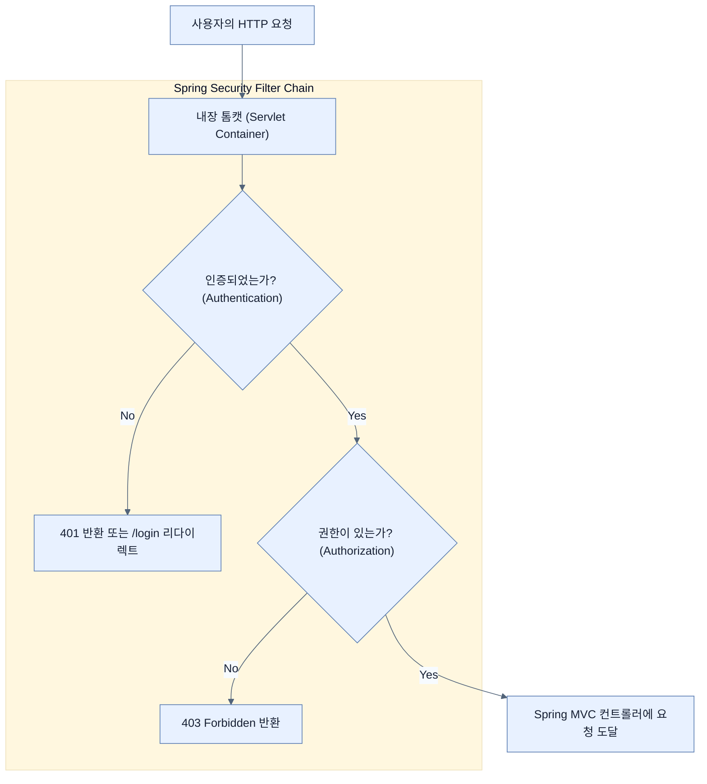

# Adding Spring Security to our project

## 한눈에 보기
| 항목 | 핵심 |
|------|------|
| 기본 동작 | `spring-boot-starter-security`를 추가하면 즉시 모든 엔드포인트가 잠기고 매번 랜덤 비밀번호가 생성됨 |
| 커스텀 계정 생성 | 하드코딩된 'user'와 'admin' 같은 고정 계정을 만들기 위해 `UserDetailsService` 빈(Bean)을 정의해야 함 |

## 1. 왜 이게 필요한가

### 이런 상황을 상상해 보자
이전 장들에서 비디오 데이터를 추가하고 검색하는 훌륭한 웹 애플리케이션을 만들었다. 하지만 지금 상태라면 인터넷에 연결된 누구나 들어와서 모든 데이터를 지워버리거나 쓰레기 데이터를 무한정 추가할 수 있다.

### 여기서 뭐가 무너지나
애플리케이션을 방치하면 악의적인 공격자에 의해 데이터베이스가 파괴된다. 하지만 개발자가 직접 세션(Session) 관리, 쿠키(Cookie) 암호화, 비밀번호 해싱, 인가(Authorization) 필터 등을 바닥부터 구현하려면 수개월이 걸리고, 그마저도 보안 취약점 투성이일 확률이 매우 높다.

### 그래서 나온 생각
세계 최고의 보안 전문가들이 이미 만들어 둔 방패를 가져다 쓰자! **[[spring-security]]**를 프로젝트에 추가하면, 한 줄의 코드도 없이 즉시 애플리케이션의 모든 경로를 잠가버린다(Lockdown). 그 후, 개발자는 템플릿에 맞게 **[[user-details-service]]** 인터페이스를 구현하여 "우리 서비스의 사용자(User)는 누구누구인가?"만 스프링에게 알려주면 된다.

### 비유로 잡기
보안 계층은 건물의 출입 체계와 비슷하다. 신분 확인, 출입구별 권한, 내부 금고의 소유권 검사가 서로 다른 문에서 반복된다.

→ 비유가 깨지는 지점: 웹 보안은 물리 출입처럼 한 번 확인하고 끝나지 않는다. 요청마다 컨텍스트와 토큰, 세션, 데이터 소유권을 다시 판단한다.

### 이 절의 언어
**[[spring-security]]**(= 인증(Authentication)과 인가(Authorization)를 포함한 보안 기능을 스프링 애플리케이션에 제공하는 강력하고 유연한 프레임워크), **[[user-details-service]]**(= 스프링 시큐리티에서 사용자의 이름, 비밀번호, 권한 등의 정보를 가져오기 위해 정의된 핵심 인터페이스), **[[in-memory-user-details-manager]]**(= UserDetailsService의 구현체 중 하나로, 데이터베이스 없이 메모리 상에 사용자 정보를 하드코딩하여 보관하는 매니저 클래스)

## 2. 어떻게 동작하는가

먼저 다음 세 축으로 메커니즘을 읽는다.

1. **입력과 전제 확인** — 어떤 요청·설정·데이터가 들어오는지 확인한다. 잘못된 전제를 다음 계층으로 넘기지 않기 위해서다.
2. **Spring 추상화 적용** — 스타터와 자동 구성, 어노테이션 또는 명시적 빈이 실제 처리를 연결한다. 반복 배선보다 도메인 선택에 집중하기 위해서다.
3. **결과와 경계 검증** — 응답·저장 상태·운영 신호를 확인한다. 정상 경로만 보고 장애·버전·성능 차이를 놓치지 않기 위해서다.

1. **의존성 추가**:
   `pom.xml`에 `spring-boot-starter-security`를 추가한다. 스프링 부트는 클래스패스에 이 라이브러리가 있는 것을 감지하면 즉시 자동 구성(Auto-configuration)을 발동시켜 모든 웹 요청을 막고 기본 로그인 페이지(`/login`)를 띄운다. 콘솔에는 매번 실행할 때마다 랜덤하게 생성된 `password`가 출력된다.

2. **나만의 사용자 정의하기**:
   매번 바뀌는 랜덤 비밀번호로 개발할 수는 없으므로, 우리만의 고정된 테스트 계정을 만든다.
   ```java
   @Configuration
   public class SecurityConfig {
       @Bean
       public UserDetailsService userDetailsService() {
            UserDetailsManager userDetailsManager = new InMemoryUserDetailsManager();
            
            // 일반 사용자
            userDetailsManager.createUser(
                User.withDefaultPasswordEncoder()
                    .username("user")
                    .password("password")
                    .roles("USER").build());
            
            // 관리자
            userDetailsManager.createUser(
                User.withDefaultPasswordEncoder()
                    .username("admin")
                    .password("password")
                    .roles("ADMIN").build());
            
            return userDetailsManager;
       }
   }
   ```
   이와 같이 `SecurityConfig` 클래스를 만들고 **[[in-memory-user-details-manager]]**를 반환하는 `@Bean`을 등록하면, 스프링 부트는 기본 랜덤 패스워드 생성을 멈추고 우리가 정의한 계정을 사용하게 된다.

> [!WARNING]
> 예제에서 사용한 `withDefaultPasswordEncoder()`는 비밀번호를 평문(Clear text)으로 저장하므로 실제 프로덕션 환경에서는 **절대** 사용해서는 안 되며, 반드시 안전한 해시 함수(예: BCrypt)를 써야 한다.

## 3. 그림으로 보기



## 4. 이 노트에 나온 용어
| 용어 | 한 줄 | 자세히 |
|------|-------|--------|
| spring-security | 인증(Authentication)과 인가(Authorization)를 포함한 보안 기능을 스프링 애플리케이션에 제공하는 강력하고 유연한 프레임워크 | [[_glossary#spring-security]] |
| user-details-service | 스프링 시큐리티에서 사용자의 이름, 비밀번호, 권한 등의 정보를 가져오기 위해 정의된 핵심 인터페이스 | [[_glossary#user-details-service]] |
| in-memory-user-details-manager | `UserDetailsService`의 구현체 중 하나로, 데이터베이스 없이 메모리 상에 사용자 정보를 하드코딩하여 보관하는 매니저 클래스 | [[_glossary#in-memory-user-details-manager]] |

## 5. 자주 헷갈리는 것
- 이 주제의 **Spring 추상화**와 그 아래에서 실제로 동작하는 라이브러리·프로토콜을 같은 것으로 보지 않는다. 추상화는 기본 배선을 줄이지만 하위 계층의 비용과 실패를 없애지 않는다.

## 6. 언제 안 쓰나 / 경계
- 책의 예제는 개념을 드러내기 위한 작은 애플리케이션이다. 운영 환경에서는 인증 정보, 장애 복구, 관측성, 부하와 데이터 규모를 별도로 검증한다.
- 이 노트의 API와 기본값은 책의 Spring Boot 4.1·Java 25 맥락을 따른다. 다른 마이너 버전에서는 공식 마이그레이션 문서와 실제 의존성 버전을 함께 확인한다.

## 7. 연결
- [[02-swapping-hardcoded-users-with-a-spring-data-backed-set-of-users]] — 같은 장의 학습 흐름에서 Adding Spring Security to our project의 전제 또는 다음 적용 단계와 연결된다.
- [[03-securing-web-routes-and-http-verbs]] — 같은 장의 학습 흐름에서 Adding Spring Security to our project의 전제 또는 다음 적용 단계와 연결된다.

## 8. 스스로 확인
1. `spring-boot-starter-security`를 추가하고 어떠한 설정도 하지 않은 상태에서 애플리케이션을 실행하면 로그인 폼의 패스워드는 어떻게 결정되는가?
2. `UserDetailsService` 인터페이스가 반환해야 하는 핵심 객체(데이터)는 무엇이며, 이 객체에는 주로 어떤 정보들이 포함되는가?

<!-- ==== 아래는 내 영역 · 스킬 수정 금지 ==== -->

## 내 설명 시도

## 막혔던 지점

## 리뷰 이력
