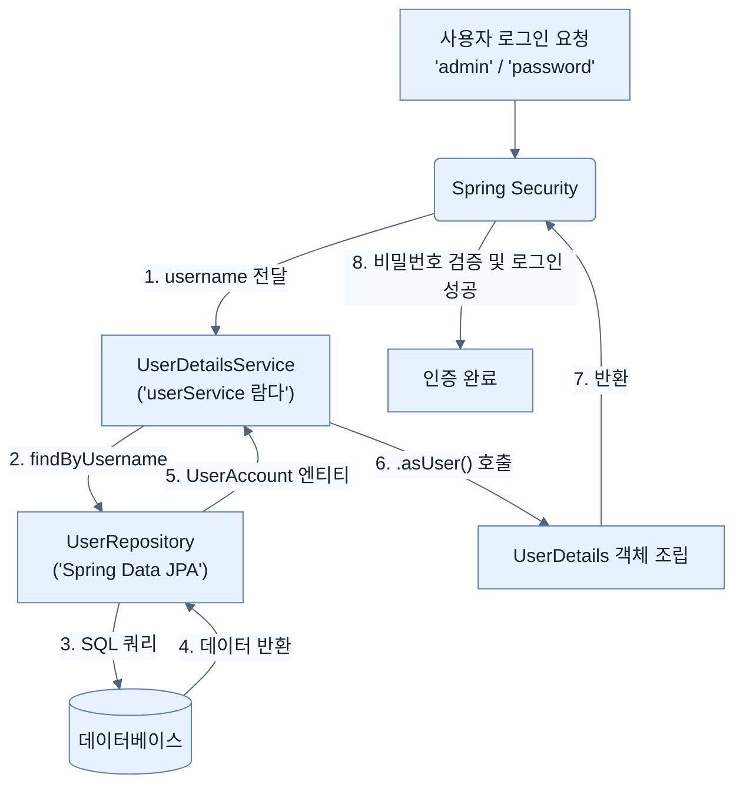

# Swapping hardcoded users with a Spring Data-backed set of users

## 한눈에 보기
| 항목 | 핵심 |
|------|------|
| 분리의 법칙 | 프로덕션 환경에서는 사용자 인증(Authentication)과 사용자 계정 데이터 관리(User Management)를 분리해야 한다. |
| 커스텀 UserDetailsService | 하드코딩된 메모리 대신, JPA 리포지토리에서 데이터를 읽어와 스프링 시큐리티의 `UserDetails` 객체로 변환해 반환한다. |

## 1. 왜 이게 필요한가

### 이런 상황을 상상해 보자
이전 노트에서 'alice'와 'admin'이라는 사용자를 코드 안에 하드코딩(In-memory)하여 로그인 기능을 구현했다. 성공적으로 작동하지만, 내일 회사에 'bob'이라는 새로운 직원이 입사했다.

### 여기서 뭐가 무너지나
사용자를 하드코딩해 두면, 새로운 사용자를 추가하거나 비밀번호를 변경할 때마다 개발자가 자바 코드를 직접 수정하고 서버를 재시작해야 한다. 데모용이나 책에서는 훌륭한 방법이지만, 실제 서비스(Production)에서는 말도 안 되는 방식이다. 사용자 관리는 애플리케이션 코드와 분리되어 데이터베이스(DB)에서 관리되어야 한다.

### 그래서 나온 생각
이전 장에서 배운 Spring Data JPA를 시큐리티에 결합하자! 
1. 사용자의 아이디와 비밀번호를 담을 **[[user-account-entity]]**를 정의하고 테이블에 저장한다.
2. 사용자가 로그인 창에 아이디를 입력하면, `UserRepository`를 통해 DB에서 해당 사용자를 찾는다.
3. 찾아낸 `UserAccount` 객체를 스프링 시큐리티가 이해할 수 있는 규격인 **[[user-details]]** 포맷으로 변환하여 건네준다.

### 비유로 잡기
보안 계층은 건물의 출입 체계와 비슷하다. 신분 확인, 출입구별 권한, 내부 금고의 소유권 검사가 서로 다른 문에서 반복된다.

→ 비유가 깨지는 지점: 웹 보안은 물리 출입처럼 한 번 확인하고 끝나지 않는다. 요청마다 컨텍스트와 토큰, 세션, 데이터 소유권을 다시 판단한다.

### 이 절의 언어
**[[user-account-entity]]**(= 시큐리티 시스템에서 사용자의 계정 정보(이름, 패스워드, 권한)를 실제 데이터베이스 테이블에 저장하기 위해 매핑된 JPA 클래스), **[[command-line-runner]]**(= 스프링 부트 애플리케이션이 구동될 때 특정 코드를 자동으로 실행하게 해주는 단일 추상 메서드(SAM) 인터페이스로, 람다식으로 쉽게 구현 가능함), **[[user-details]]**(= 스프링 시큐리티가 요구하는 사용자 정보의 표준 규격(인터페이스)으로, 애플리케이션의 고유 엔티티 객체를 이 규격으로 변환해야 시큐리티가 이해할 수 있음)

## 2. 어떻게 동작하는가

먼저 다음 세 축으로 메커니즘을 읽는다.

1. **입력과 전제 확인** — 어떤 요청·설정·데이터가 들어오는지 확인한다. 잘못된 전제를 다음 계층으로 넘기지 않기 위해서다.
2. **Spring 추상화 적용** — 스타터와 자동 구성, 어노테이션 또는 명시적 빈이 실제 처리를 연결한다. 반복 배선보다 도메인 선택에 집중하기 위해서다.
3. **결과와 경계 검증** — 응답·저장 상태·운영 신호를 확인한다. 정상 경로만 보고 장애·버전·성능 차이를 놓치지 않기 위해서다.

1. **엔티티(Entity) 설계**:
   JPA를 이용해 데이터베이스에 저장할 사용자 클래스를 만든다.
   ```java
   @Entity
   public class UserAccount {
       @Id @GeneratedValue private Long id;
       private String username;
       private String password;
       
       @ElementCollection(fetch = FetchType.EAGER)
       private List<GrantedAuthority> authorities = new ArrayList<>();
       // ... getters, setters, 생성자 ...
   }
   ```
   사용자가 가진 권한 목록(`authorities`)은 컬렉션이므로 JPA의 `@ElementCollection`을 이용해 별도 테이블로 매핑한다.

2. **초기 데이터 적재 (CommandLineRunner)**:
   데이터베이스가 텅 비어있으면 로그인 테스트를 할 수 없으므로, 애플리케이션 시작 시점에 람다(Lambda) 표현식으로 **[[command-line-runner]]** 빈을 등록하여 초기 계정을 강제로 밀어 넣는다.
   ```java
   @Bean
   CommandLineRunner initUsers(UserManagementRepository repository) {
       return args -> {
           repository.save(new UserAccount("user", "password", "ROLE_USER"));
           repository.save(new UserAccount("admin", "password", "ROLE_ADMIN"));
       };
   }
   ```

3. **DB 기반의 UserDetailsService 구현**:
   이제 `SecurityConfig`에 있던 기존 메모리 기반 코드를 지우고, JPA 리포지토리를 활용하는 람다 함수로 교체한다.
   ```java
   @Bean
   UserDetailsService userService(UserRepository repo) {
       // 사용자가 입력한 username을 받아 DB에서 찾은 뒤 Spring Security 객체로 변환
       return username -> repo.findByUsername(username).asUser();
   }
   ```
   이때 `UserAccount.asUser()` 메서드는 엔티티 객체의 정보를 빼내어 스프링 시큐리티의 `UserDetails` 객체를 조립(`build`)하여 반환하는 편리한 헬퍼 메서드다.

## 3. 그림으로 보기



## 4. 이 노트에 나온 용어
| 용어 | 한 줄 | 자세히 |
|------|-------|--------|
| user-account-entity | 시큐리티 시스템에서 사용자의 계정 정보(이름, 패스워드, 권한)를 실제 데이터베이스 테이블에 저장하기 위해 매핑된 JPA 클래스 | [[_glossary#user-account-entity]] |
| command-line-runner | 스프링 부트 애플리케이션이 구동될 때 특정 코드를 자동으로 실행하게 해주는 단일 추상 메서드(SAM) 인터페이스로, 람다식으로 쉽게 구현 가능함 | [[_glossary#command-line-runner]] |
| user-details | 스프링 시큐리티가 요구하는 사용자 정보의 표준 규격(인터페이스)으로, 애플리케이션의 고유 엔티티 객체를 이 규격으로 변환해야 시큐리티가 이해할 수 있음 | [[_glossary#user-details]] |

## 5. 자주 헷갈리는 것
- 이 주제의 **Spring 추상화**와 그 아래에서 실제로 동작하는 라이브러리·프로토콜을 같은 것으로 보지 않는다. 추상화는 기본 배선을 줄이지만 하위 계층의 비용과 실패를 없애지 않는다.

## 6. 언제 안 쓰나 / 경계
- 책의 예제는 개념을 드러내기 위한 작은 애플리케이션이다. 운영 환경에서는 인증 정보, 장애 복구, 관측성, 부하와 데이터 규모를 별도로 검증한다.
- 이 노트의 API와 기본값은 책의 Spring Boot 4.1·Java 25 맥락을 따른다. 다른 마이너 버전에서는 공식 마이그레이션 문서와 실제 의존성 버전을 함께 확인한다.

## 7. 연결
- [[01-adding-spring-security-to-our-project]] — 같은 장의 학습 흐름에서 Swapping hardcoded users with a Spring Data-backed set of users의 전제 또는 다음 적용 단계와 연결된다.
- [[03-securing-web-routes-and-http-verbs]] — 같은 장의 학습 흐름에서 Swapping hardcoded users with a Spring Data-backed set of users의 전제 또는 다음 적용 단계와 연결된다.

## 8. 스스로 확인
1. `UserAccount` 엔티티에서 권한(Authorities) 리스트에 `@ElementCollection` 애노테이션을 붙여야 하는 JPA 아키텍처상의 이유는 무엇인가?
2. `UserDetailsService` 인터페이스는 `loadUserByUsername`이라는 단 하나의 메서드만을 가진 함수형 인터페이스(SAM)다. 이것이 자바 8 이상의 환경에서 개발자에게 주는 문법적 이점은 무엇인가?

<!-- ==== 아래는 내 영역 · 스킬 수정 금지 ==== -->

## 내 설명 시도

## 막혔던 지점

## 리뷰 이력
