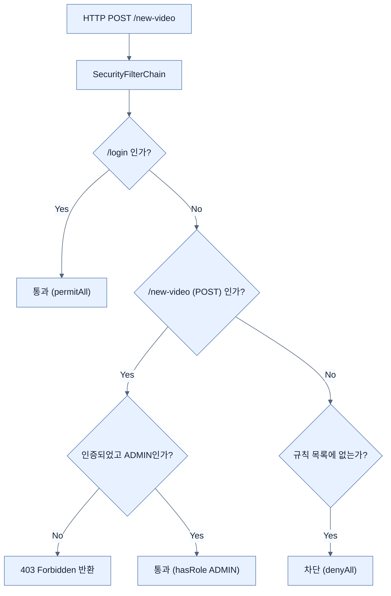

# Securing web routes and HTTP verbs

## 한눈에 보기
| 항목 | 핵심 |
|------|------|
| Authentication (인증) | "당신은 누구입니까?" - 신원을 증명하는 과정 |
| Authorization (인가) | "무엇을 할 수 있습니까?" - 증명된 신원을 바탕으로 권한을 통제하는 과정 |
| SecurityFilterChain | 스프링 시큐리티의 핵심으로, 모든 웹 요청이 통과하며 인증/인가 규칙이 적용되는 필터 체인 빈(Bean) |

## 1. 왜 이게 필요한가

### 이런 상황을 상상해 보자
이전 노트에서 데이터베이스 연동을 통해 사용자가 올바른 비밀번호를 입력해야만 접속할 수 있도록 로그인 기능을 완성했다. 하지만 누구나 로그인만 하면 비디오를 지우거나 관리자 페이지에 마음대로 들어갈 수 있다. 

### 여기서 뭐가 무너지나
애플리케이션을 잠가두기만(Authentication) 하는 것은 절반의 성공에 불과하다. '일반 사용자'가 로그인했다고 해서 '관리자'만 해야 하는 위험한 데이터 삭제 작업까지 허용해서는 안 된다. 즉, 인증된 사용자가 어떤 행동을 할 수 있는지에 대한 통제(Authorization)가 빠져있으면 심각한 권한 탈취 사고가 발생한다.

### 그래서 나온 생각
요청이 들어오는 주소(URL 경로)와 행동(HTTP 메서드)마다 허용할 수 있는 권한(Role)을 꼼꼼하게 정의하자! 스프링 시큐리티의 **[[security-filter-chain]]** 빈을 재정의하고 **[[authorize-http-requests]]** DSL을 사용하여, "이 경로는 모두 허용", "이 경로는 관리자만 접근 가능", "그 외의 모든 경로는 차단" 같은 세밀한 보안 정책을 선언적으로 작성할 수 있다.

### 비유로 잡기
웹 계층은 주문 창구와 비슷하다. 요청을 받아 형식을 확인하고, 알맞은 작업자에게 넘긴 뒤 HTML이나 JSON으로 결과를 돌려준다.

→ 비유가 깨지는 지점: 실제 HTTP 요청은 한 창구에서 끝나지 않는다. 필터, 보안, 직렬화, 예외 변환과 네트워크 경계가 함께 작동한다.

### 이 절의 언어
**[[authentication]]**(= 사용자가 자신이 누구인지(아이디/비밀번호 등)를 시스템에 증명하는 과정 (인증)), **[[authorization]]**(= 인증된 사용자가 특정 자원이나 기능에 접근할 수 있는 권한이 있는지를 검사하고 통제하는 과정 (인가)), **[[security-filter-chain]]**(= 스프링 시큐리티 아키텍처의 핵심으로, 서블릿 컨테이너로 들어온 요청이 컨트롤러에 도달하기 전 인증 및 인가 검사를 수행하는 필터들의 묶음), **[[authorize-http-requests]]**(= 최신 스프링 시큐리티에서 제공하는 람다 기반의 DSL로, HTTP 요청의 경로와 메서드에 따라 세밀한 인가(Authorization) 규칙을 설정하는 설정 메서드)

## 2. 어떻게 동작하는가

먼저 다음 세 축으로 메커니즘을 읽는다.

1. **입력과 전제 확인** — 어떤 요청·설정·데이터가 들어오는지 확인한다. 잘못된 전제를 다음 계층으로 넘기지 않기 위해서다.
2. **Spring 추상화 적용** — 스타터와 자동 구성, 어노테이션 또는 명시적 빈이 실제 처리를 연결한다. 반복 배선보다 도메인 선택에 집중하기 위해서다.
3. **결과와 경계 검증** — 응답·저장 상태·운영 신호를 확인한다. 정상 경로만 보고 장애·버전·성능 차이를 놓치지 않기 위해서다.

1. **커스텀 SecurityFilterChain 정의**:
   스프링 부트가 기본으로 제공하는 '모든 요청 차단' 정책을 덮어쓰기 위해, `SecurityConfig`에 다음과 같은 빈을 등록한다.
   ```java
   @Bean
   SecurityFilterChain configureSecurity(HttpSecurity http) throws Exception {
       http
           .authorizeHttpRequests(auth -> auth
               .requestMatchers("/login").permitAll()
               .requestMatchers("/", "/search").authenticated()
               .requestMatchers(HttpMethod.POST, "/new-video").hasRole("ADMIN")
               .anyRequest().denyAll()
           )
           .formLogin(Customizer.withDefaults())
           .httpBasic(Customizer.withDefaults());
       
       return http.build();
   }
   ```
2. **권한 매칭 규칙 (`requestMatchers`)**:
   - `.permitAll()`: 로그인 여부와 관계없이 누구나 접근할 수 있다. (예: `/login`, 정적 리소스)
   - `.authenticated()`: 로그인한 사용자라면 누구나 접근할 수 있다.
   - `.hasRole("ADMIN")`: 사용자 권한 중에 `ROLE_ADMIN`을 가진 사람만 통과시킨다. HTTP 메서드(예: `POST`)를 지정하여 동일한 경로라도 읽기(GET)와 쓰기(POST)의 권한을 다르게 줄 수 있다.
   - `.anyRequest().denyAll()`: 위에서 나열한 규칙에 해당하지 않는 '나머지 모든 요청'은 무조건 차단한다. (가장 훌륭한 방어 패턴)
3. **복합 권한 검사**:
   만약 "ADMIN이면서 동시에 DBA"여야만 접근할 수 있는 경로가 있다면, `AuthorizationManagers.allOf(hasRole("ADMIN"), hasRole("DBA"))`처럼 규칙을 엮어서(Compose) 검사할 수도 있다.

## 3. 그림으로 보기



## 4. 이 노트에 나온 용어
| 용어 | 한 줄 | 자세히 |
|------|-------|--------|
| authentication | 사용자가 자신이 누구인지(아이디/비밀번호 등)를 시스템에 증명하는 과정 (인증) | [[_glossary#authentication]] |
| authorization | 인증된 사용자가 특정 자원이나 기능에 접근할 수 있는 권한이 있는지를 검사하고 통제하는 과정 (인가) | [[_glossary#authorization]] |
| security-filter-chain | 스프링 시큐리티 아키텍처의 핵심으로, 서블릿 컨테이너로 들어온 요청이 컨트롤러에 도달하기 전 인증 및 인가 검사를 수행하는 필터들의 묶음 | [[_glossary#security-filter-chain]] |
| authorize-http-requests | 최신 스프링 시큐리티에서 제공하는 람다 기반의 DSL로, HTTP 요청의 경로와 메서드에 따라 세밀한 인가(Authorization) 규칙을 설정하는 설정 메서드 | [[_glossary#authorize-http-requests]] |

## 5. 자주 헷갈리는 것
- 이 주제의 **Spring 추상화**와 그 아래에서 실제로 동작하는 라이브러리·프로토콜을 같은 것으로 보지 않는다. 추상화는 기본 배선을 줄이지만 하위 계층의 비용과 실패를 없애지 않는다.

## 6. 언제 안 쓰나 / 경계
- 책의 예제는 개념을 드러내기 위한 작은 애플리케이션이다. 운영 환경에서는 인증 정보, 장애 복구, 관측성, 부하와 데이터 규모를 별도로 검증한다.
- 이 노트의 API와 기본값은 책의 Spring Boot 4.1·Java 25 맥락을 따른다. 다른 마이너 버전에서는 공식 마이그레이션 문서와 실제 의존성 버전을 함께 확인한다.

## 7. 연결
- [[02-swapping-hardcoded-users-with-a-spring-data-backed-set-of-users]] — 같은 장의 학습 흐름에서 Securing web routes and HTTP verbs의 전제 또는 다음 적용 단계와 연결된다.
- [[04-to-csrf-or-not-to-csrf]] — 같은 장의 학습 흐름에서 Securing web routes and HTTP verbs의 전제 또는 다음 적용 단계와 연결된다.

## 8. 스스로 확인
1. 스프링 시큐리티의 설정에서 `anyRequest().denyAll()`을 가장 마지막에 선언하는 것이 권장되는 보안 설계상의 이유는 무엇인가?
2. `Authentication`(인증)과 `Authorization`(인가)의 근본적인 차이점은 무엇인가? "로그인을 하는 행위"와 "게시물을 삭제하는 행위"를 각각 매칭하여 설명해보자.

<!-- ==== 아래는 내 영역 · 스킬 수정 금지 ==== -->

## 내 설명 시도

## 막혔던 지점

## 리뷰 이력
