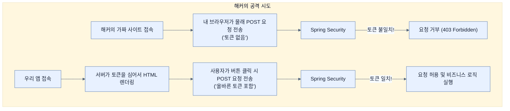

# To CSRF or not to CSRF, that is the question

## 한눈에 보기
| 항목 | 핵심 |
|------|------|
| CSRF 공격 | 해커가 만들어둔 가짜 사이트에 접속했을 뿐인데, 내 브라우저에 저장된 로그인 세션을 훔쳐서 원치 않는 동작(글 삭제, 결제 등)을 몰래 수행하는 해킹 기법 |
| 방어 수단 | 서버가 발급한 일회용 난수(Nonce)를 폼 데이터에 몰래 숨겨놓고, 요청이 들어올 때마다 그 난수 값이 맞는지 확인한다. |

## 1. 왜 이게 필요한가

### 이런 상황을 상상해 보자
우리 비디오 앱에 권한 설정을 잘 마쳤다. 사용자는 로그인을 한 상태에서 브라우저를 띄워놓고 다른 탭에서 웹 서핑을 하다가, 실수로 악성 링크(예: "당첨 확인하기")를 눌렀다. 그 악성 사이트 안에는 몰래 `<form action="http://우리앱/delete/videos/1" method="post">`가 숨어있었고, 접속하자마자 자동으로 폼이 전송되었다! 

### 여기서 뭐가 무너지나
사용자는 이미 우리 앱에 로그인된 상태(세션이 살아있음)이기 때문에, 브라우저는 악성 폼을 전송할 때 사용자의 인증 쿠키도 같이 서버로 보내버린다. 스프링 시큐리티는 "아! 정상적인 로그인 사용자구나!"라고 착각하고 비디오를 덜컥 지워버린다. 이 끔찍한 공격을 **[[csrf]]**(Cross-Site Request Forgery, 사이트 간 요청 위조)라고 부른다. 

### 그래서 나온 생각
스프링 시큐리티는 이런 사태를 막기 위해 기본적으로 CSRF 방어 기능을 켜둔다. 서버는 화면을 그려줄 때마다 매번 바뀌는 **[[nonce]]**(임의의 토큰 값)를 발급해서 HTML 폼 안에 몰래(hidden) 심어둔다. 해커는 남의 브라우저에서 요청을 쏘게 만들 수는 있어도, 서버가 매번 새로 발급하는 토큰 값을 알아맞힐 수는 없다. 따라서 토큰이 없거나 틀린 POST 요청이 들어오면 스프링 시큐리티가 가차 없이 쳐내어 공격을 방어한다.

### 비유로 잡기
보안 계층은 건물의 출입 체계와 비슷하다. 신분 확인, 출입구별 권한, 내부 금고의 소유권 검사가 서로 다른 문에서 반복된다.

→ 비유가 깨지는 지점: 웹 보안은 물리 출입처럼 한 번 확인하고 끝나지 않는다. 요청마다 컨텍스트와 토큰, 세션, 데이터 소유권을 다시 판단한다.

### 이 절의 언어
**[[csrf]]**(= 사용자가 자신의 의지와는 무관하게 공격자가 의도한 행위(수정, 삭제 등)를 서버에 요청하게 만드는 웹 해킹 기법), **[[nonce]]**(= Number Used Once의 약자로, CSRF 방어를 위해 서버가 폼을 렌더링할 때마다 발급하는 예측 불가능한 일회용 난수 토큰), **[[stateless-api]]**(= 브라우저 세션이나 쿠키에 의존하여 상태를 저장하지 않고, 토큰(예: JWT) 등을 주고받으며 통신하는 서버 환경)

## 2. 어떻게 동작하는가

먼저 다음 세 축으로 메커니즘을 읽는다.

1. **입력과 전제 확인** — 어떤 요청·설정·데이터가 들어오는지 확인한다. 잘못된 전제를 다음 계층으로 넘기지 않기 위해서다.
2. **Spring 추상화 적용** — 스타터와 자동 구성, 어노테이션 또는 명시적 빈이 실제 처리를 연결한다. 반복 배선보다 도메인 선택에 집중하기 위해서다.
3. **결과와 경계 검증** — 응답·저장 상태·운영 신호를 확인한다. 정상 경로만 보고 장애·버전·성능 차이를 놓치지 않기 위해서다.

1. **Mustache 설정 켜기**:
   Thymeleaf 같은 엔진은 CSRF 토큰을 알아서 폼에 넣어주지만, Mustache는 수동으로 넣어줘야 한다. `application.properties`에 속성을 추가해 템플릿에서 요청 속성에 접근할 수 있게 연다.
   ```properties
   spring.mustache.servlet.expose-request-attributes=true
   ```

2. **폼(Form)에 토큰 심기**:
   데이터를 변경하는 모든 `POST`, `PUT`, `DELETE` 폼 안에 `_csrf` 값을 히든 필드로 추가한다.
   ```html
   <form action="/new-video" method="post">
       <!-- 기타 입력 필드들 -->
       <input type="hidden" name="{{_csrf.parameterName}}" value="{{_csrf.token}}">
       <button type="submit">Submit</button>
   </form>
   ```

3. **끄는 경우도 있다? (REST API)**:
   이 방어법은 브라우저의 '세션 쿠키'를 사용할 때만 유효하다. 만약 브라우저를 전혀 쓰지 않고 상태를 저장하지 않는(Stateless) 순수 서버 간 통신 **[[stateless-api]]**(예: 모바일 앱 연동 API)를 구축한다면 CSRF 공격 자체가 성립하지 않는다. 이런 경우에는 방어막이 오히려 정상적인 API 호출을 방해하므로, `SecurityFilterChain`에서 명시적으로 기능을 끈다.
   ```java
   http.csrf(csrf -> csrf.disable());
   ```

## 3. 그림으로 보기



## 4. 이 노트에 나온 용어
| 용어 | 한 줄 | 자세히 |
|------|-------|--------|
| csrf | 사용자가 자신의 의지와는 무관하게 공격자가 의도한 행위(수정, 삭제 등)를 서버에 요청하게 만드는 웹 해킹 기법 | [[_glossary#csrf]] |
| nonce | Number Used Once의 약자로, CSRF 방어를 위해 서버가 폼을 렌더링할 때마다 발급하는 예측 불가능한 일회용 난수 토큰 | [[_glossary#nonce]] |
| stateless-api | 브라우저 세션이나 쿠키에 의존하여 상태를 저장하지 않고, 토큰(예: JWT) 등을 주고받으며 통신하는 서버 환경 | [[_glossary#stateless-api]] |

## 5. 자주 헷갈리는 것
- 이 주제의 **Spring 추상화**와 그 아래에서 실제로 동작하는 라이브러리·프로토콜을 같은 것으로 보지 않는다. 추상화는 기본 배선을 줄이지만 하위 계층의 비용과 실패를 없애지 않는다.

## 6. 언제 안 쓰나 / 경계
- 책의 예제는 개념을 드러내기 위한 작은 애플리케이션이다. 운영 환경에서는 인증 정보, 장애 복구, 관측성, 부하와 데이터 규모를 별도로 검증한다.
- 이 노트의 API와 기본값은 책의 Spring Boot 4.1·Java 25 맥락을 따른다. 다른 마이너 버전에서는 공식 마이그레이션 문서와 실제 의존성 버전을 함께 확인한다.

## 7. 연결
- [[03-securing-web-routes-and-http-verbs]] — 같은 장의 학습 흐름에서 To CSRF or not to CSRF, that is the question의 전제 또는 다음 적용 단계와 연결된다.
- [[05-securing-spring-data-methods]] — 같은 장의 학습 흐름에서 To CSRF or not to CSRF, that is the question의 전제 또는 다음 적용 단계와 연결된다.

## 8. 스스로 확인
1. 단순 데이터를 조회하는 `GET` 방식의 폼(Form) 전송에는 CSRF 토큰을 첨부하지 않아도 스프링 시큐리티가 차단하지 않는 이유는 무엇인가?
2. SPA(React, Vue) 방식이나 모바일 앱에서 서버와 순수 REST API(세션 쿠키 미사용)로 통신할 때, CSRF 기능을 `disable()` 해도 보안상 큰 문제가 없는 이유는 무엇인가?

<!-- ==== 아래는 내 영역 · 스킬 수정 금지 ==== -->

## 내 설명 시도

## 막혔던 지점

## 리뷰 이력
