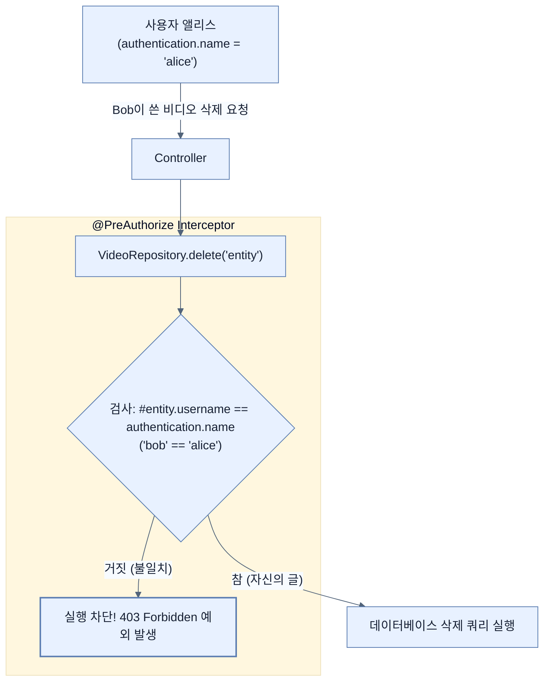

# Securing Spring Data methods

## 한눈에 보기
| 항목 | 핵심 |
|------|------|
| 데이터 소유권 (Ownership) | 비디오 객체에 작성자(username) 정보를 기록하여 "내 데이터는 나만 지울 수 있다"는 규칙을 확립한다. |
| 메서드 수준 보안 | URL 경로 단위가 아닌, 리포지토리나 서비스의 특정 '자바 메서드'가 실행되기 직전에 권한을 검사하여 차단하는 기법 |

## 1. 왜 이게 필요한가

### 이런 상황을 상상해 보자
이전 노트에서 "로그인한 사용자면 누구나 `/delete/videos/{id}` 경로로 POST 요청을 보낼 수 있다"고 `SecurityFilterChain`에 정의했다. 사용자 앨리스(Alice)가 로그인해서 열심히 자기가 올린 비디오를 지우고 있다. 그런데 앨리스가 심심해서 URL의 숫자만 1에서 2로 슬쩍 바꿔서 요청을 보냈더니, 밥(Bob)이 올린 비디오가 삭제되어 버렸다!

### 여기서 뭐가 무너지나
URL 기반의 보안(`authorizeHttpRequests`)은 **"이 경로에 접근할 수 있는 등급(Role)인가?"**만 검사할 뿐, **"지우려는 대상이 진짜 네 것이 맞니?"** 같은 도메인 객체 수준의 정밀한 소유권 검사는 수행할 수 없다. 

### 그래서 나온 생각
그렇다면 데이터베이스에서 진짜 데이터를 지우기 직전, 즉 리포지토리의 `delete()` 메서드가 호출되는 바로 그 찰나에 검사관을 세우자! 이것이 스프링 시큐리티의 **[[method-level-security]]**(메서드 수준 보안)다. **[[pre-authorize]]** 애노테이션을 메서드 위에 달아두면, 삭제하려는 비디오 객체의 작성자 이름과 현재 로그인한 사람의 이름이 정확히 일치할 때만 메서드 실행을 허락하도록 만들 수 있다.

### 비유로 잡기
데이터 계층은 창고와 같다. 요청자는 원하는 물건의 조건을 말하고, 저장소 추상화가 실제 선반과 운반 방식을 감춘다.

→ 비유가 깨지는 지점: 데이터베이스는 단순 창고와 달리 트랜잭션, 동시성, 지연, 스키마 제약이 있어 추상화만 믿고 비용을 무시할 수 없다.

### 이 절의 언어
**[[method-level-security]]**(= URL 기반 보안의 한계를 넘어, 특정 서비스나 리포지토리의 자바 메서드가 호출될 때 인자값을 검사하거나 반환값을 필터링하는 세밀한 보안 기법), **[[pre-authorize]]**(= 메서드가 실제 실행되기 직전에 SpEL(Spring Expression Language)을 평가하여, 결과가 참일 때만 실행을 허용하는 애노테이션), **[[principal]]**(= 시스템을 사용하기 위해 인증을 거친 사용자, 디바이스, 또는 시스템 자체를 뜻하는 자바 보안 표준 용어)

## 2. 어떻게 동작하는가

먼저 다음 세 축으로 메커니즘을 읽는다.

1. **입력과 전제 확인** — 어떤 요청·설정·데이터가 들어오는지 확인한다. 잘못된 전제를 다음 계층으로 넘기지 않기 위해서다.
2. **Spring 추상화 적용** — 스타터와 자동 구성, 어노테이션 또는 명시적 빈이 실제 처리를 연결한다. 반복 배선보다 도메인 선택에 집중하기 위해서다.
3. **결과와 경계 검증** — 응답·저장 상태·운영 신호를 확인한다. 정상 경로만 보고 장애·버전·성능 차이를 놓치지 않기 위해서다.

1. **소유권 기록하기**:
   우선, `VideoEntity` 클래스에 `username` 필드를 추가한다. 
   컨트롤러에서는 현재 로그인한 사람의 정보를 얻기 위해 파라미터로 스프링 시큐리티의 `Authentication` 객체(이 안의 주체를 **[[principal]]**이라 부름)를 주입받아 비디오 저장 시 작성자 이름을 함께 기록한다.
   ```java
   @PostMapping("/new-video")
   public String newVideo(@ModelAttribute NewVideo newVideo, Authentication authentication) {
       videoService.create(newVideo, authentication.getName());
       return "redirect:/";
   }
   ```

2. **기능 활성화**:
   메서드 보안은 기본적으로 꺼져 있으므로, 설정 클래스에 `@EnableMethodSecurity`를 달아 엔진을 켠다. (구버전의 `@EnableGlobalMethodSecurity`는 폐기되었다.)
   ```java
   @Configuration
   @EnableMethodSecurity
   public class SecurityConfig { ... }
   ```

3. **메서드 실행 전 검사 (@PreAuthorize)**:
   Spring Data 리포지토리에서 `delete` 메서드를 재정의(`@Override`)하고 그 위에 보안 검사식을 적는다.
   ```java
   @PreAuthorize("#entity.username == authentication.name")
   @Override
   void delete(VideoEntity entity);
   ```
   이 한 줄의 식(SpEL)은 다음과 같이 해석된다. "이 메서드로 넘어온 인자인 `entity`의 `username` 필드 값이, 현재 시큐리티 컨텍스트에 있는 `authentication.name`(로그인한 사람)과 똑같을 때만 통과시켜라!" 일치하지 않으면 즉각 `403 Forbidden` 에러를 뱉어내고 튕겨낸다.

## 3. 그림으로 보기



## 4. 이 노트에 나온 용어
| 용어 | 한 줄 | 자세히 |
|------|-------|--------|
| method-level-security | URL 기반 보안의 한계를 넘어, 특정 서비스나 리포지토리의 자바 메서드가 호출될 때 인자값을 검사하거나 반환값을 필터링하는 세밀한 보안 기법 | [[_glossary#method-level-security]] |
| pre-authorize | 메서드가 실제 실행되기 직전에 SpEL(Spring Expression Language)을 평가하여, 결과가 참일 때만 실행을 허용하는 애노테이션 | [[_glossary#pre-authorize]] |
| principal | 시스템을 사용하기 위해 인증을 거친 사용자, 디바이스, 또는 시스템 자체를 뜻하는 자바 보안 표준 용어 | [[_glossary#principal]] |

## 5. 자주 헷갈리는 것
- 이 주제의 **Spring 추상화**와 그 아래에서 실제로 동작하는 라이브러리·프로토콜을 같은 것으로 보지 않는다. 추상화는 기본 배선을 줄이지만 하위 계층의 비용과 실패를 없애지 않는다.

## 6. 언제 안 쓰나 / 경계
- 책의 예제는 개념을 드러내기 위한 작은 애플리케이션이다. 운영 환경에서는 인증 정보, 장애 복구, 관측성, 부하와 데이터 규모를 별도로 검증한다.
- 이 노트의 API와 기본값은 책의 Spring Boot 4.1·Java 25 맥락을 따른다. 다른 마이너 버전에서는 공식 마이그레이션 문서와 실제 의존성 버전을 함께 확인한다.

## 7. 연결
- [[04-to-csrf-or-not-to-csrf]] — 같은 장의 학습 흐름에서 Securing Spring Data methods의 전제 또는 다음 적용 단계와 연결된다.
- [[06-displaying-user-details-on-the-site]] — 같은 장의 학습 흐름에서 Securing Spring Data methods의 전제 또는 다음 적용 단계와 연결된다.

## 8. 스스로 확인
1. `@EnableMethodSecurity`를 달지 않은 상태에서 리포지토리 메서드에 `@PreAuthorize`를 달아두면 실행 시 어떤 결과가 발생하는가?
2. 컨트롤러의 메서드 파라미터에 `Authentication authentication`을 적어두기만 해도 현재 로그인한 사용자의 정보가 주입되는 마법은 스프링의 어떤 기술 덕분인가?

<!-- ==== 아래는 내 영역 · 스킬 수정 금지 ==== -->

## 내 설명 시도

## 막혔던 지점

## 리뷰 이력
