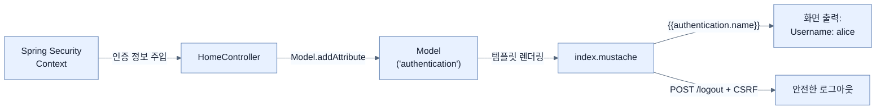

# Displaying user details on the site

## 한눈에 보기
| 항목 | 핵심 |
|------|------|
| 화면에 정보 띄우기 | 컨트롤러에서 `Authentication` 객체를 받아 Model에 담으면, 템플릿(Mustache)에서 접속자의 이름과 권한을 그릴 수 있다. |
| 안전한 로그아웃 | 로그아웃은 단순히 세션을 끊는 것이 아니라 상태를 변화시키는 작업이므로, 반드시 `POST`로 요청하고 CSRF 토큰을 동봉해야 한다. |

## 1. 왜 이게 필요한가

### 이런 상황을 상상해 보자
우리 웹사이트에 로그인 기능이 생겨서 앨리스(Alice)가 무사히 접속했다. 그런데 화면 어디에도 "Alice님 환영합니다"라는 문구가 없고, 로그아웃 버튼조차 없다. 앨리스는 브라우저를 껐다 켜기 전까지는 다른 계정으로 로그인할 방법이 없다.

### 여기서 뭐가 무너지나
백엔드 서버는 사용자가 누구인지 완벽하게 알고 통제하고 있지만, 그 정보를 뷰(웹 브라우저)로 넘겨주지 않으면 사용자 경험(UX)은 최악이 된다. 사용자에게 현재 자신의 접속 상태와 권한을 투명하게 보여주고, 언제든 세션을 종료할 수 있는 탈출구(Logout)를 제공해야 한다.

### 그래서 나온 생각
컨트롤러에 약간의 코드만 추가하자! 스프링 MVC가 자동으로 주입해주는 현재 접속자 객체(**[[authentication]]**)를 뷰 템플릿으로 전달할 **[[model-attribute]]**에 얹어주기만 하면 끝이다. 화면에서는 이 속성값을 읽어서 프로필을 예쁘게 출력하고, 안전한 **[[logout]]** 버튼을 만들어 폼(POST)으로 전송하게 하면 된다.

### 비유로 잡기
보안 계층은 건물의 출입 체계와 비슷하다. 신분 확인, 출입구별 권한, 내부 금고의 소유권 검사가 서로 다른 문에서 반복된다.

→ 비유가 깨지는 지점: 웹 보안은 물리 출입처럼 한 번 확인하고 끝나지 않는다. 요청마다 컨텍스트와 토큰, 세션, 데이터 소유권을 다시 판단한다.

### 이 절의 언어
**[[authentication]]**(= 스프링 시큐리티에서 현재 접속 중인 사용자의 인증 상태(이름, 권한, 자격 증명)를 캡슐화한 핵심 인터페이스), **[[model-attribute]]**(= 스프링 MVC 컨트롤러가 처리한 데이터를 뷰(템플릿 엔진)가 꺼내어 쓸 수 있도록 연결해 주는 저장 바구니(모델)의 항목), **[[logout]]**(= 사용자의 현재 세션을 파기하고 인증 정보를 삭제하는 행위로, 보안상 GET이 아닌 POST로 요청하는 것이 표준)

## 2. 어떻게 동작하는가

먼저 다음 세 축으로 메커니즘을 읽는다.

1. **입력과 전제 확인** — 어떤 요청·설정·데이터가 들어오는지 확인한다. 잘못된 전제를 다음 계층으로 넘기지 않기 위해서다.
2. **Spring 추상화 적용** — 스타터와 자동 구성, 어노테이션 또는 명시적 빈이 실제 처리를 연결한다. 반복 배선보다 도메인 선택에 집중하기 위해서다.
3. **결과와 경계 검증** — 응답·저장 상태·운영 신호를 확인한다. 정상 경로만 보고 장애·버전·성능 차이를 놓치지 않기 위해서다.

1. **컨트롤러에서 Model에 담기**:
   ```java
   @GetMapping
   public String index(Model model, Authentication authentication) {
       model.addAttribute("videos", videoService.getVideos());
       model.addAttribute("authentication", authentication); // 핵심!
       return "index";
   }
   ```
   이전 노트에서 소유권을 확인할 때 사용했던 `Authentication` 객체를 그대로 모델에 추가하여 "index.mustache" 템플릿으로 넘긴다.

2. **Mustache 템플릿에서 출력하기**:
   ```html
   <h3>User Profile</h3>
   <ul>
       <li>Username: {{authentication.name}}</li>
       <li>Authorities: {{authentication.authorities}}</li>
   </ul>
   ```
   넘겨받은 객체의 `getName()`, `getAuthorities()` 메서드가 호출되어 화면에 "Username: alice", "Authorities: [ROLE_USER]" 와 같이 렌더링된다.

3. **로그아웃(Logout) 버튼 추가**:
   ```html
   <form action="/logout" method="post">
       <input type="hidden" name="{{_csrf.parameterName}}" value="{{_csrf.token}}">
       <button type="submit">Logout</button>
   </form>
   ```
   로그아웃 요청은 상태를 변경(세션 파기)하므로 반드시 `POST` 방식으로 보내야 하며, 이전에 배운 CSRF 토큰을 반드시 숨겨서(hidden) 함께 보내야 스프링 시큐리티가 허락한다.

> [!TIP]
> Mustache는 매우 가벼운 템플릿 엔진이라 이런 속성과 토큰을 일일이 수동으로 넘겨야 합니다. 만약 스프링 공식 권장 엔진인 Thymeleaf(타임리프)를 사용한다면, 스프링 시큐리티 확장팩을 통해 컨트롤러 수정 없이 템플릿 내장 태그만으로 로그인 정보 확인, 권한별 UI 가리기, CSRF 토큰 자동 삽입 등을 전부 알아서 해줍니다.

## 3. 그림으로 보기



## 4. 이 노트에 나온 용어
| 용어 | 한 줄 | 자세히 |
|------|-------|--------|
| authentication | 스프링 시큐리티에서 현재 접속 중인 사용자의 인증 상태(이름, 권한, 자격 증명)를 캡슐화한 핵심 인터페이스 | [[_glossary#authentication]] |
| model-attribute | 스프링 MVC 컨트롤러가 처리한 데이터를 뷰(템플릿 엔진)가 꺼내어 쓸 수 있도록 연결해 주는 저장 바구니(모델)의 항목 | [[_glossary#model-attribute]] |
| logout | 사용자의 현재 세션을 파기하고 인증 정보를 삭제하는 행위로, 보안상 GET이 아닌 POST로 요청하는 것이 표준 | [[_glossary#logout]] |

## 5. 자주 헷갈리는 것
- 이 주제의 **Spring 추상화**와 그 아래에서 실제로 동작하는 라이브러리·프로토콜을 같은 것으로 보지 않는다. 추상화는 기본 배선을 줄이지만 하위 계층의 비용과 실패를 없애지 않는다.

## 6. 언제 안 쓰나 / 경계
- 책의 예제는 개념을 드러내기 위한 작은 애플리케이션이다. 운영 환경에서는 인증 정보, 장애 복구, 관측성, 부하와 데이터 규모를 별도로 검증한다.
- 이 노트의 API와 기본값은 책의 Spring Boot 4.1·Java 25 맥락을 따른다. 다른 마이너 버전에서는 공식 마이그레이션 문서와 실제 의존성 버전을 함께 확인한다.

## 7. 연결
- [[05-securing-spring-data-methods]] — 같은 장의 학습 흐름에서 Displaying user details on the site의 전제 또는 다음 적용 단계와 연결된다.
- [[07-understanding-oauth-2-1]] — 같은 장의 학습 흐름에서 Displaying user details on the site의 전제 또는 다음 적용 단계와 연결된다.

## 8. 스스로 확인
1. 프로덕션 환경의 템플릿 코드에서 `{{authentication.password}}` 같은 값을 노출하면 절대 안 되는 이유는 무엇인가?
2. 스프링 시큐리티에서 기본 설정 시 로그아웃을 `GET` 방식(`<a href="/logout">`)이 아닌 `POST` 폼으로 구현해야만 작동하는 보안상의 이유는 무엇인가?

<!-- ==== 아래는 내 영역 · 스킬 수정 금지 ==== -->

## 내 설명 시도

## 막혔던 지점

## 리뷰 이력
