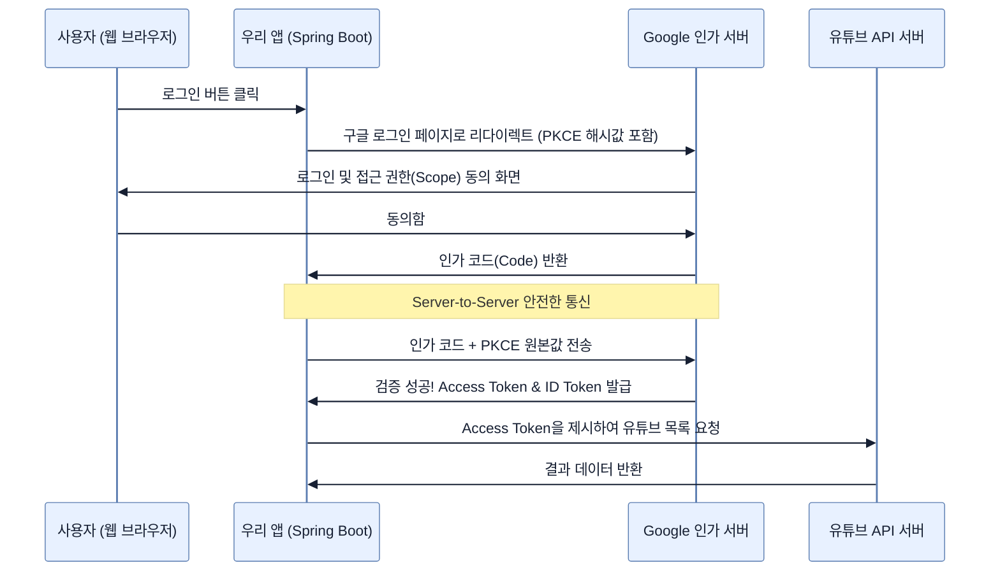

# Understanding OAuth 2.1

## 한눈에 보기
| 항목 | 핵심 |
|------|------|
| OAuth 2.1 | "내 비밀번호를 주지 않고도, 저 앱이 내 구글 캘린더나 유튜브 채널에 접근할 수 있게 허락해 주는" 표준 위임 인가 프레임워크 |
| OIDC (OpenID Connect) | 인가 기능인 OAuth 위에 얹혀져, "그래서 로그인한 사람이 누구인데?"라는 신원 확인(인증) 기능을 더해주는 확장 프로토콜 |

## 1. 왜 이게 필요한가

### 이런 상황을 상상해 보자
여러분(사용자)이 우리 비디오 앱을 처음 방문했다. 우리 앱이 여러분의 유튜브 계정에 있는 동영상 목록을 가져와서 대신 보여주고 싶다. 과거에는 우리 앱이 여러분에게 구글 아이디와 비밀번호를 직접 달라고 요구했다! 

### 여기서 뭐가 무너지나
비밀번호를 통째로 넘겨주는 방식은 미친 짓이다. 우리 앱이 해킹당하면 구글 비밀번호가 유출될 뿐만 아니라, 여러분은 유튜브 외에 지메일, 구글 포토 등 모든 구글 서비스의 권한을 통째로 우리 앱에 줘버린 꼴이 된다.

### 그래서 나온 생각
비밀번호 대신, 한정된 권한과 유효기간을 가진 특별한 '출입증(Access Token)'을 발급받아 쓰자! 이것이 **[[oauth]]**의 핵심이다. 구글이 사용자에게 "이 앱이 당신의 유튜브 목록만(Scope) 읽으려 하는데 허락할래?"라고 묻고, 허락하면 우리 앱은 비밀번호 없이 출입증만 받아서 유튜브 API에 접근한다. 여기에 덧붙여 최신 **[[oauth]]** 2.1은 중간에서 출입증 교환 코드를 가로채는 해킹을 막기 위해 **[[pkce]]**라는 보안 장치를 필수(Mandatory)로 강제한다.

### 비유로 잡기
보안 계층은 건물의 출입 체계와 비슷하다. 신분 확인, 출입구별 권한, 내부 금고의 소유권 검사가 서로 다른 문에서 반복된다.

→ 비유가 깨지는 지점: 웹 보안은 물리 출입처럼 한 번 확인하고 끝나지 않는다. 요청마다 컨텍스트와 토큰, 세션, 데이터 소유권을 다시 판단한다.

### 이 절의 언어
**[[oauth]]**(= 사용자가 자신의 비밀번호를 제3자 앱에 노출하지 않고도, 특정 리소스에 대한 접근 권한을 제한적으로 위임할 수 있게 하는 인가 프레임워크), **[[oidc]]**(= OAuth 위에 구축된 얇은 신원 확인 레이어로, 액세스 토큰 외에 ID 토큰을 추가로 발급하여 애플리케이션이 사용자가 누구인지 알 수 있게 해주는 프로토콜), **[[pkce]]**(= Proof Key for Code Exchange의 약자로, 인가 코드를 가로챈 악의적인 앱이 토큰을 탈취하지 못하도록 암호학적 난수 증명을 추가한 최신 필수 보안 매커니즘)

## 2. 어떻게 동작하는가

먼저 다음 세 축으로 메커니즘을 읽는다.

1. **입력과 전제 확인** — 어떤 요청·설정·데이터가 들어오는지 확인한다. 잘못된 전제를 다음 계층으로 넘기지 않기 위해서다.
2. **Spring 추상화 적용** — 스타터와 자동 구성, 어노테이션 또는 명시적 빈이 실제 처리를 연결한다. 반복 배선보다 도메인 선택에 집중하기 위해서다.
3. **결과와 경계 검증** — 응답·저장 상태·운영 신호를 확인한다. 정상 경로만 보고 장애·버전·성능 차이를 놓치지 않기 위해서다.

1. **OAuth vs OIDC**:
   - 흔히 말하는 '소셜 로그인'은 엄밀히 말해 OAuth 단독 기능이 아니다. OAuth는 권한 위임(인가) 프레임워크일 뿐 신원을 증명하진 않는다.
   - 여기에 **[[oidc]]**(OpenID Connect)가 더해져 `ID Token`이라는 명함이 추가로 발급된다. 즉, "권한 허락(OAuth)" + "신원 확인(OIDC)"의 조합이 현대의 소셜 로그인이다.

2. **인가 코드 흐름 (Authorization Code Flow) + PKCE**:
   최신 권장 흐름은 다음과 같다.
   - 우리 앱이 사용자를 구글 로그인 창으로 보낸다. (이때, 나만 알 수 있는 난수 해시값 `Code Challenge`를 보낸다 - **PKCE**)
   - 사용자가 구글에서 로그인 및 허락을 마치면, 구글은 '인가 코드(Authorization Code)'를 브라우저를 통해 우리 앱으로 돌려보낸다.
   - 브라우저에 코드가 노출되었더라도 괜찮다. 우리 앱 서버는 받은 코드와 아까 만들어둔 난수 원본(`Code Verifier`)을 서버 대 서버(Server-to-Server) 통신으로 구글에 제출한다.
   - 구글이 일치함을 확인하고 진짜 '액세스 토큰'을 발급해 준다.

3. **기타 흐름들**:
   - **Client Credentials Flow**: 사용자(사람) 개입 없이, 서버 간(Machine-to-Machine) 백그라운드 작업 등에서 자기 증명으로 토큰을 발급받을 때 쓴다.
   - **Implicit Flow**: 과거 모바일이나 SPA에서 쓰던 방식(토큰을 브라우저에 바로 던져줌)으로, 보안에 매우 취약해 OAuth 2.1에서는 완전히 **폐기(Removed)**되었다.

## 3. 그림으로 보기

## 4. 이 노트에 나온 용어
| 용어 | 한 줄 | 자세히 |
|------|-------|--------|
| oauth | 사용자가 자신의 비밀번호를 제3자 앱에 노출하지 않고도, 특정 리소스에 대한 접근 권한을 제한적으로 위임할 수 있게 하는 인가 프레임워크 | [[_glossary#oauth]] |
| oidc | OAuth 위에 구축된 얇은 신원 확인 레이어로, 액세스 토큰 외에 ID 토큰을 추가로 발급하여 애플리케이션이 사용자가 누구인지 알 수 있게 해주는 프로토콜 | [[_glossary#oidc]] |
| pkce | Proof Key for Code Exchange의 약자로, 인가 코드를 가로챈 악의적인 앱이 토큰을 탈취하지 못하도록 암호학적 난수 증명을 추가한 최신 필수 보안 매커니즘 | [[_glossary#pkce]] |

## 5. 자주 헷갈리는 것
- 이 주제의 **Spring 추상화**와 그 아래에서 실제로 동작하는 라이브러리·프로토콜을 같은 것으로 보지 않는다. 추상화는 기본 배선을 줄이지만 하위 계층의 비용과 실패를 없애지 않는다.

## 6. 언제 안 쓰나 / 경계
- 책의 예제는 개념을 드러내기 위한 작은 애플리케이션이다. 운영 환경에서는 인증 정보, 장애 복구, 관측성, 부하와 데이터 규모를 별도로 검증한다.
- 이 노트의 API와 기본값은 책의 Spring Boot 4.1·Java 25 맥락을 따른다. 다른 마이너 버전에서는 공식 마이그레이션 문서와 실제 의존성 버전을 함께 확인한다.

## 7. 연결
- [[06-displaying-user-details-on-the-site]] — 같은 장의 학습 흐름에서 Understanding OAuth 2.1의 전제 또는 다음 적용 단계와 연결된다.
- [[08-leveraging-google-to-authenticate-users]] — 같은 장의 학습 흐름에서 Understanding OAuth 2.1의 전제 또는 다음 적용 단계와 연결된다.

## 8. 스스로 확인
1. OAuth와 OIDC(OpenID Connect)의 근본적인 목적의 차이점을 인가(Authorization)와 인증(Authentication) 관점에서 설명해보자.
2. 예전 모바일 앱들에서 많이 쓰였던 암묵적 흐름(Implicit Flow)이 최신 OAuth 2.1 규격에서 완전히 퇴출된 보안상의 이유는 무엇인가?

<!-- ==== 아래는 내 영역 · 스킬 수정 금지 ==== -->

## 내 설명 시도

## 막혔던 지점

## 리뷰 이력
