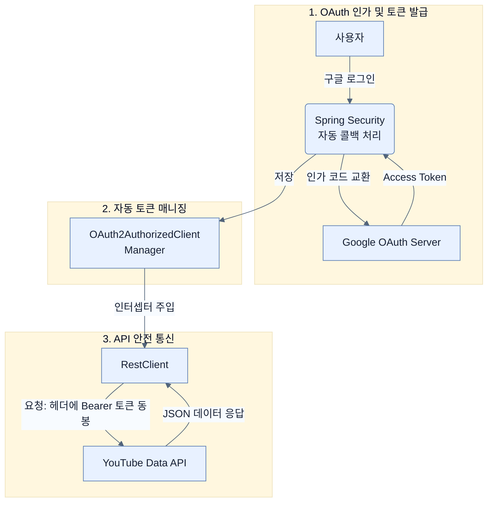

# Leveraging Google to authenticate users

## 한눈에 보기
| 항목 | 핵심 |
|------|------|
| 구글 콘솔 연동 | 구글 클라우드에서 OAuth 클라이언트를 발급받고(Client ID, Secret), 스프링 부트 설정(`application.yaml`)에 주입한다. |
| 토큰 기반 API 호출 | 발급받은 액세스 토큰을 `RestClient`에 인터셉터로 달아서 유튜브 같은 외부 API를 안전하게 호출한다. |

## 1. 왜 이게 필요한가

### 이런 상황을 상상해 보자
비디오 관리 앱을 만들었는데, 사용자들이 비밀번호를 자꾸 까먹어서 매일 "비밀번호 초기화해주세요" 메일을 보낸다. 심지어 비밀번호 해시 로직에 취약점이 생겨서 회원 정보가 털릴 위기에 처했다. 또한, 사용자가 좋아하는 유튜브 영상을 우리 앱으로 가져와서 저장하게 하고 싶다.

### 여기서 뭐가 무너지나
직접 회원가입, 로그인, 비밀번호 찾기, 세션 관리 등을 모두 완벽하게 개발하는 것은 너무나 고통스럽고 위험한 일이다. 게다가 유튜브 API 같은 구글의 자원을 쓰려면, 무조건 사용자의 인가(Authorization)를 얻어 합법적인 액세스 토큰을 가져와야만 구글이 데이터를 내어준다.

### 그래서 나온 생각
전 세계 1위 보안 기술을 가진 구글에게 사용자 관리를 전면 위임(Outsource)해 버리자! 앞선 노트에서 배운 OAuth 2.1 규격을 바탕으로 구글을 **[[client-registration]]** 설정에 등록해 두면, 스프링 부트가 알아서 복잡한 3자 간 토큰 교환 로직을 다 처리해 준다. 게다가 성공적으로 발급된 구글의 **[[oauth2-authorized-client]]**(인증된 클라이언트 토큰)를 스프링의 최신 HTTP 호출기인 **[[rest-client]]**에 얹어주기만 하면, 구글 API 통신까지 한 방에 해결된다.

### 비유로 잡기
보안 계층은 건물의 출입 체계와 비슷하다. 신분 확인, 출입구별 권한, 내부 금고의 소유권 검사가 서로 다른 문에서 반복된다.

→ 비유가 깨지는 지점: 웹 보안은 물리 출입처럼 한 번 확인하고 끝나지 않는다. 요청마다 컨텍스트와 토큰, 세션, 데이터 소유권을 다시 판단한다.

### 이 절의 언어
**[[client-registration]]**(= OAuth 통신을 위해 사용할 외부 제공자(Google, Github 등)의 클라이언트 ID, 시크릿, 스코프 등의 정보를 애플리케이션에 등록하는 설정 객체), **[[oauth2-authorized-client]]**(= 성공적으로 OAuth 인증을 마치고 발급받은 '액세스 토큰'과 해당 사용자의 정보, 클라이언트 정보를 모두 묶어서 관리하는 스프링의 컨테이너 객체), **[[rest-client]]**(= 스프링 프레임워크 최신 버전에서 도입된, 유창한(Fluent) 빌더 패턴 기반의 모던 동기 HTTP 클라이언트로 RestTemplate을 대체하는 객체)

## 2. 어떻게 동작하는가

먼저 다음 세 축으로 메커니즘을 읽는다.

1. **입력과 전제 확인** — 어떤 요청·설정·데이터가 들어오는지 확인한다. 잘못된 전제를 다음 계층으로 넘기지 않기 위해서다.
2. **Spring 추상화 적용** — 스타터와 자동 구성, 어노테이션 또는 명시적 빈이 실제 처리를 연결한다. 반복 배선보다 도메인 선택에 집중하기 위해서다.
3. **결과와 경계 검증** — 응답·저장 상태·운영 신호를 확인한다. 정상 경로만 보고 장애·버전·성능 차이를 놓치지 않기 위해서다.

1. **구글 클라우드 콘솔 설정**:
   - 새 프로젝트를 만들고, "YouTube Data API v3"를 활성화한다.
   - OAuth 동의 화면을 구성하고 웹 애플리케이션용 Credentials를 생성하여 **Client ID**와 **Client Secret**을 받는다.
   - 중요: Redirect URI에 `http://localhost:8080/login/oauth2/code/google`를 반드시 추가해야 스프링 부트의 기본 콜백 경로와 일치한다.

2. **application.yaml 설정**:
   ```yaml
   spring:
     security:
       oauth2:
         client:
           registration:
             google:
               clientId: **발급받은 ID**
               clientSecret: **발급받은 Secret**
               scope: openid,profile,email,https://www.googleapis.com/auth/youtube.readonly
   ```
   스프링 부트는 위 설정만으로 구글 로그인 연동의 90%를 자동화한다.

3. **OAuth2AuthorizedClientManager 등록**:
   받아온 토큰을 관리하고 HTTP 통신 시 중개(Broker) 역할을 해줄 매니저 빈을 등록한다. 이 매니저는 토큰 갱신(Refresh)이나 다양한 인증 흐름 처리를 담당한다.

4. **RestClient로 외부 API 호출하기**:
   전통적인 `RestTemplate`의 최신 대안인 `RestClient`를 빌드한다. 이때 인터셉터를 추가해, 구글로 통신이 나갈 때 알아서 헤더에 OAuth 토큰(`Bearer xxx`)이 박히도록 설정한다.
   ```java
   @Bean
   RestClient youtubeRestClient(OAuth2AuthorizedClientManager clientManager) {
       OAuth2ClientHttpRequestInterceptor oauth2 = new OAuth2ClientHttpRequestInterceptor(clientManager);
       oauth2.setClientRegistrationIdResolver(request -> "google"); // 'google' 설정 사용
       
       return RestClient.builder()
           .baseUrl("https://www.googleapis.com/youtube/v3")
           .requestInterceptor(oauth2) // 헤더에 토큰 자동 주입
           .build();
   }
   ```

## 3. 그림으로 보기



## 4. 이 노트에 나온 용어
| 용어 | 한 줄 | 자세히 |
|------|-------|--------|
| client-registration | OAuth 통신을 위해 사용할 외부 제공자(Google, Github 등)의 클라이언트 ID, 시크릿, 스코프 등의 정보를 애플리케이션에 등록하는 설정 객체 | [[_glossary#client-registration]] |
| oauth2-authorized-client | 성공적으로 OAuth 인증을 마치고 발급받은 '액세스 토큰'과 해당 사용자의 정보, 클라이언트 정보를 모두 묶어서 관리하는 스프링의 컨테이너 객체 | [[_glossary#oauth2-authorized-client]] |
| rest-client | 스프링 프레임워크 최신 버전에서 도입된, 유창한(Fluent) 빌더 패턴 기반의 모던 동기 HTTP 클라이언트로 `RestTemplate`을 대체하는 객체 | [[_glossary#rest-client]] |

## 5. 자주 헷갈리는 것
- 이 주제의 **Spring 추상화**와 그 아래에서 실제로 동작하는 라이브러리·프로토콜을 같은 것으로 보지 않는다. 추상화는 기본 배선을 줄이지만 하위 계층의 비용과 실패를 없애지 않는다.

## 6. 언제 안 쓰나 / 경계
- 책의 예제는 개념을 드러내기 위한 작은 애플리케이션이다. 운영 환경에서는 인증 정보, 장애 복구, 관측성, 부하와 데이터 규모를 별도로 검증한다.
- 이 노트의 API와 기본값은 책의 Spring Boot 4.1·Java 25 맥락을 따른다. 다른 마이너 버전에서는 공식 마이그레이션 문서와 실제 의존성 버전을 함께 확인한다.

## 7. 연결
- [[07-understanding-oauth-2-1]] — 같은 장의 학습 흐름에서 Leveraging Google to authenticate users의 전제 또는 다음 적용 단계와 연결된다.
- [[09-securing-data-in-transit-and-ssl-bundles]] — 같은 장의 학습 흐름에서 Leveraging Google to authenticate users의 전제 또는 다음 적용 단계와 연결된다.

## 8. 스스로 확인
1. 구글 클라우드 콘솔의 OAuth 클라이언트 설정에서 Redirect URI를 `http://localhost:8080/login/oauth2/code/google` 로 등록해야만 하는 이유는 무엇인가? (스프링 시큐리티의 동작 방식과 연관 지어 생각해보자)
2. `RestTemplate` 대신 새롭게 도입된 `RestClient`를 이용해 인터셉터(Interceptor) 패턴으로 토큰을 주입했을 때, 개발자가 비즈니스 로직(API 호출 코드)에서 얻는 이점은 무엇인가?

<!-- ==== 아래는 내 영역 · 스킬 수정 금지 ==== -->

## 내 설명 시도

## 막혔던 지점

## 리뷰 이력
