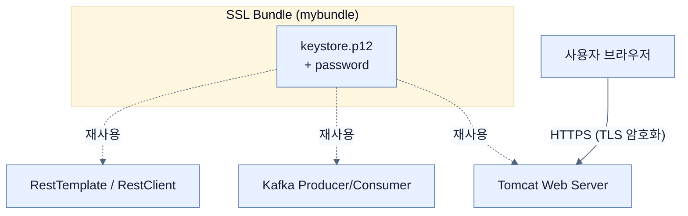

# Securing data in transit and SSL Bundles

## 한눈에 보기
| 항목 | 핵심 |
|------|------|
| HTTPS 강제 | 애플리케이션과 브라우저 사이를 오가는 모든 데이터를 암호화(TLS)하여, 중간에 누군가 패킷을 가로채도 읽을 수 없게 만든다 (Data in transit 보호). |
| SSL Bundles | 스프링 부트 3.1부터 도입된 기능으로, 인증서(Keystore) 설정을 한 곳에 모아두고 웹 서버, Kafka 등 여러 컴포넌트에서 재사용할 수 있게 해준다. |

## 1. 왜 이게 필요한가

### 이런 상황을 상상해 보자
우리 웹사이트에 완벽한 권한 관리와 OAuth 2.1 로그인을 구현했다. 하지만 웹 서버가 여전히 `http://`로 서비스되고 있다면?

### 여기서 뭐가 무너지나
카페의 공용 와이파이를 쓰는 사용자가 우리 웹사이트에 로그인하면, 와이파이 공유기를 장악한 해커가 사용자의 아이디, 비밀번호, 세션 쿠키, OAuth 토큰 등을 평문(Plain text)으로 고스란히 엿볼 수 있다. 전송 중인 데이터(Data in transit)가 암호화되지 않았기 때문이다. 

### 그래서 나온 생각
HTTP 통신을 TLS(Transport Layer Security)로 감싸서 **HTTPS**로 만들자! 서버에 디지털 인증서(**[[keystore]]**)를 설정하면 통신 구간이 암호화된다. 
더 나아가, 웹 서버뿐만 아니라 데이터베이스, Kafka 메세징 큐 등 외부 시스템과 통신할 때마다 인증서 비밀번호를 중복으로 복사해 적는 것은 위험하고 피곤하다. 따라서 스프링 부트가 제공하는 **[[ssl-bundle]]** 기능을 이용해 한 번만 정의해 놓고 여러 군데서 끌어다 쓰자!

### 비유로 잡기
보안 계층은 건물의 출입 체계와 비슷하다. 신분 확인, 출입구별 권한, 내부 금고의 소유권 검사가 서로 다른 문에서 반복된다.

→ 비유가 깨지는 지점: 웹 보안은 물리 출입처럼 한 번 확인하고 끝나지 않는다. 요청마다 컨텍스트와 토큰, 세션, 데이터 소유권을 다시 판단한다.

### 이 절의 언어
**[[data-in-transit]]**(= 네트워크를 통해 한 시스템에서 다른 시스템으로 이동 중인 데이터로, 스니핑(가로채기)을 막기 위해 반드시 TLS 등으로 암호화해야 한다.), **[[ssl-bundle]]**(= 스프링 부트 3.1에서 도입된 기능으로, 인증서(키스토어, 트러스트스토어) 설정을 논리적 묶음(번들)으로 정의하여 여러 프레임워크 컴포넌트에 걸쳐 재사용할 수 있게 하는 설정 메커니즘), **[[keystore]]**(= 자바 환경에서 서버의 개인 키(Private Key)와 디지털 인증서를 안전하게 보관하는 암호화된 파일(주로 PKCS#12 형식 사용))

## 2. 어떻게 동작하는가

먼저 다음 세 축으로 메커니즘을 읽는다.

1. **입력과 전제 확인** — 어떤 요청·설정·데이터가 들어오는지 확인한다. 잘못된 전제를 다음 계층으로 넘기지 않기 위해서다.
2. **Spring 추상화 적용** — 스타터와 자동 구성, 어노테이션 또는 명시적 빈이 실제 처리를 연결한다. 반복 배선보다 도메인 선택에 집중하기 위해서다.
3. **결과와 경계 검증** — 응답·저장 상태·운영 신호를 확인한다. 정상 경로만 보고 장애·버전·성능 차이를 놓치지 않기 위해서다.

1. **Keystore(인증서) 생성**:
   로컬 개발 환경에서는 공인 인증기관(CA)의 인증서를 받기 어려우므로, Java의 `keytool`을 이용해 자체 서명된(Self-signed) 인증서를 만들어 `src/main/resources/keystore.p12` 경로에 둔다.

2. **단순 HTTPS 설정 (기존 방식)**:
   ```properties
   server.port=8443
   server.ssl.enabled=true
   server.ssl.key-store=classpath:keystore.p12
   server.ssl.key-store-password=changeit
   server.ssl.key-store-type=PKCS12
   server.ssl.key-alias=myapp
   ```
   이 설정만으로 `http://localhost:8080` 대신 `https://localhost:8443`으로 접속해야만 웹 서버가 응답한다. (자체 서명 인증서라 브라우저가 "안전하지 않음" 경고를 띄우지만 로컬 개발 시에는 무시하고 넘어갈 수 있다.)

3. **SSL Bundles로 우아하게 설정하기 (Spring Boot 3.1+)**:
   위의 방식은 설정이 `server` 쪽에 종속된다. 이를 재사용 가능한 번들로 분리해보자.
   ```properties
   # 1. 'mybundle'이라는 이름의 SSL 번들 정의
   spring.ssl.bundle.pkcs12.mybundle.key.store=classpath:keystore.p12
   spring.ssl.bundle.pkcs12.mybundle.key.password=changeit
   
   # 2. 웹 서버(Tomcat)에 번들 적용
   server.ssl.bundle=mybundle
   
   # 3. Kafka 클라이언트에도 동일한 번들 적용 (재사용!)
   spring.kafka.ssl.bundle=mybundle
   ```
   이렇게 중앙 집중식으로 인증서를 관리하면, 추후 인증서를 교체(Rotation)할 때 단 한 곳만 수정하면 되어 오류를 획기적으로 줄일 수 있다.

## 3. 그림으로 보기



## 4. 이 노트에 나온 용어
| 용어 | 한 줄 | 자세히 |
|------|-------|--------|
| data-in-transit | 네트워크를 통해 한 시스템에서 다른 시스템으로 이동 중인 데이터로, 스니핑(가로채기)을 막기 위해 반드시 TLS 등으로 암호화해야 한다. | [[_glossary#data-in-transit]] |
| ssl-bundle | 스프링 부트 3.1에서 도입된 기능으로, 인증서(키스토어, 트러스트스토어) 설정을 논리적 묶음(번들)으로 정의하여 여러 프레임워크 컴포넌트에 걸쳐 재사용할 수 있게 하는 설정 메커니즘 | [[_glossary#ssl-bundle]] |
| keystore | 자바 환경에서 서버의 개인 키(Private Key)와 디지털 인증서를 안전하게 보관하는 암호화된 파일(주로 PKCS#12 형식 사용) | [[_glossary#keystore]] |

## 5. 자주 헷갈리는 것
- 이 주제의 **Spring 추상화**와 그 아래에서 실제로 동작하는 라이브러리·프로토콜을 같은 것으로 보지 않는다. 추상화는 기본 배선을 줄이지만 하위 계층의 비용과 실패를 없애지 않는다.

## 6. 언제 안 쓰나 / 경계
- 책의 예제는 개념을 드러내기 위한 작은 애플리케이션이다. 운영 환경에서는 인증 정보, 장애 복구, 관측성, 부하와 데이터 규모를 별도로 검증한다.
- 이 노트의 API와 기본값은 책의 Spring Boot 4.1·Java 25 맥락을 따른다. 다른 마이너 버전에서는 공식 마이그레이션 문서와 실제 의존성 버전을 함께 확인한다.

## 7. 연결
- [[08-leveraging-google-to-authenticate-users]] — 같은 장의 학습 흐름에서 Securing data in transit and SSL Bundles의 전제 또는 다음 적용 단계와 연결된다.
- [[10-securing-data-at-rest]] — 같은 장의 학습 흐름에서 Securing data in transit and SSL Bundles의 전제 또는 다음 적용 단계와 연결된다.

## 8. 스스로 확인
1. 로컬 환경에서 생성한 자체 서명(Self-signed) 인증서로 HTTPS를 띄웠을 때 브라우저가 보안 경고창을 띄우는 근본적인 이유는 무엇인가?
2. 스프링 부트에서 `server.ssl.*` 속성에 인증서를 직접 등록하는 것과 `spring.ssl.bundle.*`로 번들을 만들고 맵핑하는 것의 아키텍처 관점에서의 차이점은 무엇인가?

<!-- ==== 아래는 내 영역 · 스킬 수정 금지 ==== -->

## 내 설명 시도

## 막혔던 지점

## 리뷰 이력
