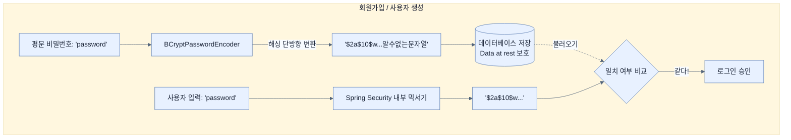

# Securing data at rest

## 한눈에 보기
| 항목 | 핵심 |
|------|------|
| 데이터 정지 상태 보안 | 네트워크가 아니라 하드디스크나 데이터베이스에 '가만히 저장되어 있는' 데이터 자체를 암호화하여 지키는 것 (Data at rest) |
| 비밀번호 해싱 (BCrypt) | 사용자의 비밀번호를 있는 그대로(평문) 저장하지 않고, 단방향 해시 함수를 통해 아무도 알아볼 수 없게 변환하여 저장한다. |

## 1. 왜 이게 필요한가

### 이런 상황을 상상해 보자
HTTPS와 SSL Bundles를 이용해 해커가 네트워크 통신을 가로채는 것은 완벽하게 막아냈다. 그런데 어느 날, 회사 내부망이 뚫려서 데이터베이스(DB) 파일 전체가 통째로 털려버렸다. 해커가 DB를 열어보니 `user_account` 테이블에 사용자들의 아이디와 비밀번호("password123")가 한글 문서 읽듯 그대로 쓰여 있었다.

### 여기서 뭐가 무너지나
통신 구간을 암호화(Data in transit)했더라도, 최종 목적지인 하드디스크에 데이터가 노출된 채로 기록되어 있으면(Data at rest), 저장 매체가 해킹되거나 심지어 백업 디스크를 분실하기만 해도 끔찍한 정보 유출 사태가 터진다. 특히 사용자가 여러 사이트에서 똑같은 비밀번호를 쓴다면 피해는 눈덩이처럼 커진다.

### 그래서 나온 생각
비밀번호는 **절대** 평문(Plain text)으로 저장해서는 안 된다! 비밀번호를 데이터베이스에 넣기 전에 아주 강력한 믹서기에 넣고 갈아버리자. 스프링 시큐리티의 **[[password-encoder]]** 인터페이스와 **[[bcrypt]]** 알고리즘을 사용하면, 비밀번호를 복구 불가능한 긴 문자열(해시)로 변환해 저장한다. 나중에 로그인할 때 사용자가 비밀번호를 입력하면, 그것을 똑같은 믹서기에 돌려보고 DB에 저장된 결과물과 일치하는지만 확인한다. 이렇게 하면 해커가 DB를 훔쳐 가도 원래 비밀번호가 무엇인지 알아낼 방법이 없다!

### 비유로 잡기
데이터 계층은 창고와 같다. 요청자는 원하는 물건의 조건을 말하고, 저장소 추상화가 실제 선반과 운반 방식을 감춘다.

→ 비유가 깨지는 지점: 데이터베이스는 단순 창고와 달리 트랜잭션, 동시성, 지연, 스키마 제약이 있어 추상화만 믿고 비용을 무시할 수 없다.

### 이 절의 언어
**[[data-at-rest]]**(= 데이터베이스, 파일 시스템, 백업 스토리지 등에 물리적으로 저장되어 머물러 있는 데이터. 유출 시 치명적이므로 반드시 암호화하여 저장해야 한다.), **[[password-encoder]]**(= 비밀번호를 단방향(해독 불가능)으로 안전하게 변환하고, 입력받은 값과 비교하는 기능을 제공하는 스프링 시큐리티의 핵심 인터페이스), **[[bcrypt]]**(= 비밀번호 저장 목적으로 특별히 설계된 해시 알고리즘. 임의의 난수(Salt)를 더하고 연산 속도를 의도적으로 늦춰서 해커의 무차별 대입 공격(Brute-force)을 지연시킨다.)

## 2. 어떻게 동작하는가

먼저 다음 세 축으로 메커니즘을 읽는다.

1. **입력과 전제 확인** — 어떤 요청·설정·데이터가 들어오는지 확인한다. 잘못된 전제를 다음 계층으로 넘기지 않기 위해서다.
2. **Spring 추상화 적용** — 스타터와 자동 구성, 어노테이션 또는 명시적 빈이 실제 처리를 연결한다. 반복 배선보다 도메인 선택에 집중하기 위해서다.
3. **결과와 경계 검증** — 응답·저장 상태·운영 신호를 확인한다. 정상 경로만 보고 장애·버전·성능 차이를 놓치지 않기 위해서다.

1. **PasswordEncoder 빈 등록**:
   스프링 시큐리티에게 "우리 시스템은 패스워드를 다룰 때 BCrypt 믹서기를 쓸 거야"라고 알려주기 위해 빈을 등록한다. BCrypt는 내부적으로 소금(Salt)을 치고 수차례 반복 연산을 수행해 무차별 대입 공격(Brute-force)을 방어하는 매우 강력한 알고리즘이다.
   ```java
   @Bean
   PasswordEncoder passwordEncoder() {
       return new BCryptPasswordEncoder();
   }
   ```

2. **저장할 때 암호화하기**:
   앞서 초기 데이터를 밀어 넣던 `CommandLineRunner` 코드를 수정하여, `encoder.encode("password")`를 호출한 결과값(알아볼 수 없는 긴 문자열)을 DB에 저장하도록 바꾼다.
   ```java
   @Bean
   CommandLineRunner initUsers(UserManagementRepository repository, PasswordEncoder encoder) {
       return args -> {
           repository.save(new UserAccount("alice", encoder.encode("password"), "ROLE_USER"));
       };
   }
   ```

3. **User 객체 생성 코드 변경**:
   과거(노트 2번)에는 임시방편으로 평문임을 감수하는 `User.withDefaultPasswordEncoder()`를 썼다. 하지만 이제 DB에 저장된 비밀번호가 안전하게 해싱되었으므로, 스프링 시큐리티에게 "이 비밀번호는 이미 믿을 수 있게 암호화된 거야"라고 알려주는 `User.withUsername()` 빌더로 교체한다.
   ```java
   public UserDetails asUser() {
       return User.withUsername(getUsername())
               .password(getPassword()) // DB에서 꺼낸 해싱된 비밀번호 그대로 삽입!
               .authorities(getAuthorities())
               .build();
   }
   ```
   이후 스프링 시큐리티는 사용자가 폼에 입력한 평문 비밀번호를 스스로 BCrypt로 변환해, 이 `UserDetails`의 비밀번호와 비교해 준다.

## 3. 그림으로 보기



## 4. 이 노트에 나온 용어
| 용어 | 한 줄 | 자세히 |
|------|-------|--------|
| data-at-rest | 데이터베이스, 파일 시스템, 백업 스토리지 등에 물리적으로 저장되어 머물러 있는 데이터. 유출 시 치명적이므로 반드시 암호화하여 저장해야 한다. | [[_glossary#data-at-rest]] |
| password-encoder | 비밀번호를 단방향(해독 불가능)으로 안전하게 변환하고, 입력받은 값과 비교하는 기능을 제공하는 스프링 시큐리티의 핵심 인터페이스 | [[_glossary#password-encoder]] |
| bcrypt | 비밀번호 저장 목적으로 특별히 설계된 해시 알고리즘. 임의의 난수(Salt)를 더하고 연산 속도를 의도적으로 늦춰서 해커의 무차별 대입 공격(Brute-force)을 지연시킨다. | [[_glossary#bcrypt]] |

## 5. 자주 헷갈리는 것
- 이 주제의 **Spring 추상화**와 그 아래에서 실제로 동작하는 라이브러리·프로토콜을 같은 것으로 보지 않는다. 추상화는 기본 배선을 줄이지만 하위 계층의 비용과 실패를 없애지 않는다.

## 6. 언제 안 쓰나 / 경계
- 책의 예제는 개념을 드러내기 위한 작은 애플리케이션이다. 운영 환경에서는 인증 정보, 장애 복구, 관측성, 부하와 데이터 규모를 별도로 검증한다.
- 이 노트의 API와 기본값은 책의 Spring Boot 4.1·Java 25 맥락을 따른다. 다른 마이너 버전에서는 공식 마이그레이션 문서와 실제 의존성 버전을 함께 확인한다.

## 7. 연결
- [[09-securing-data-in-transit-and-ssl-bundles]] — 같은 장의 학습 흐름에서 Securing data at rest의 전제 또는 다음 적용 단계와 연결된다.
- [[08-leveraging-google-to-authenticate-users]] — 같은 장의 학습 흐름에서 Securing data at rest의 전제 또는 다음 적용 단계와 연결된다.

## 8. 스스로 확인
1. `BCryptPasswordEncoder`는 해싱(Hashing) 기법을 사용한다. 해싱 기법이 양방향 암호화(AES 등) 기법과 비교했을 때, 비밀번호 저장에 있어서 가지는 결정적 차이점은 무엇인가?
2. `BCrypt` 알고리즘은 의도적으로 CPU 연산 자원을 많이 소모하도록 설계되어 있다. 인증 과정에서 서버를 느리게 만들면서까지 이렇게 설계한 보안상의 이유는 무엇인가?

<!-- ==== 아래는 내 영역 · 스킬 수정 금지 ==== -->

## 내 설명 시도

## 막혔던 지점

## 리뷰 이력
