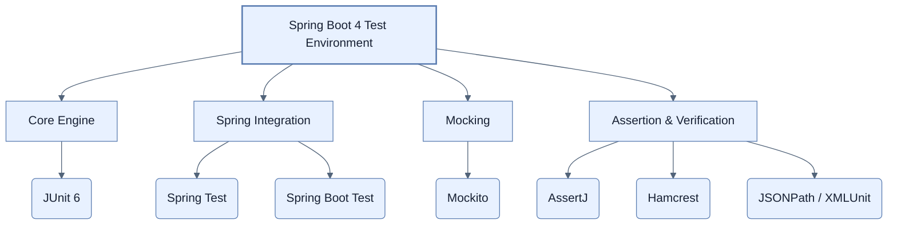

# Adding JUnit 6 and test toolkits to our application

## 한눈에 보기
| 항목 | 핵심 |
|------|------|
| 테스트 준비 | 스프링 부트 4에서는 프로젝트를 생성할 때 이미 완벽한 테스트 도구 세트가 준비되어 있으므로, 추가적인 의존성 설정 없이 바로 테스트 작성이 가능하다. |
| 세분화된 Starter | 과거의 거대한 단일 테스트 모듈에서 벗어나, 웹(Web), 데이터(Data), 보안(Security) 등 필요한 테스트 도구만 골라서 선언하는 방식으로 진화했다. |

## 1. 왜 이게 필요한가

### 이런 상황을 상상해 보자
우리 애플리케이션에 멋진 비즈니스 로직을 추가했다. "이게 잘 동작할까?" 코드를 실행하고, 브라우저를 열어 주소를 입력하고, 폼에 값을 채우고, 전송 버튼을 누른 뒤, 데이터베이스에 접속해서 값이 잘 들어갔는지 눈으로 확인한다. 코드를 고칠 때마다 이 짓을 수십 번 반복하고 있다.

### 여기서 뭐가 무너지나
수동 테스트는 너무 느리고 실수가 발생하기 쉽다. 기능이 많아지면 결국 귀찮아서 테스트를 건너뛰게 되고, 이는 곧 고객이 버그를 발견하게 되는 참사로 이어진다. 코드를 테스트하는 코드를 작성해야 한다. 하지만 처음 테스트 환경을 세팅하려고 보면, 프레임워크 선택부터 라이브러리 조합, 버전 충돌 해결까지 너무 복잡해서 시작도 하기 전에 지쳐버린다.

### 그래서 나온 생각
테스트는 '선택'이 아니라 애플리케이션의 '핵심'이다! 스프링 부트는 당신이 고민할 필요 없이 최고의 테스트 도구들을 모두 미리 준비해 두었다. **[[junit-6]]**를 기반으로 객체를 가짜로 만들어주는 **[[mockito]]**, 유창하게 결과를 검증하는 **[[assertj]]** 등이 기본 탑재되어 있다. 우리는 그저 `src/test/java` 폴더에 들어가서 코드를 짜기만 하면 된다!

### 비유로 잡기
테스트를 공연 전 리허설에 비유할 수 있다. 작은 장면부터 실제 무대와 가까운 통합 리허설까지 범위를 넓혀 실패 위치를 좁힌다.

→ 비유가 깨지는 지점: 리허설이 실제 운영과 완전히 같지는 않다. 모의 객체와 임베디드 DB는 실제 네트워크·드라이버·컨테이너의 차이를 숨길 수 있다.

### 이 절의 언어
**[[junit-6]]**(= 스프링 부트 4의 기본 테스팅 프레임워크로, 테스트를 정의하고 실행하는 가장 필수적인 자바 표준 도구), **[[mockito]]**(= 실제 동작하는 객체 대신, "이 메서드를 부르면 무조건 A를 반환해라"라고 조작할 수 있는 가짜(Mock) 객체를 만들어주는 프레임워크), **[[assertj]]**(= 테스트의 결과가 예상과 일치하는지 확인할 때, 메서드 체이닝을 이용해 사람이 읽기 쉬운 유창한(Fluent) 문법을 제공하는 검증 라이브러리)

## 2. 어떻게 동작하는가

먼저 다음 세 축으로 메커니즘을 읽는다.

1. **입력과 전제 확인** — 어떤 요청·설정·데이터가 들어오는지 확인한다. 잘못된 전제를 다음 계층으로 넘기지 않기 위해서다.
2. **Spring 추상화 적용** — 스타터와 자동 구성, 어노테이션 또는 명시적 빈이 실제 처리를 연결한다. 반복 배선보다 도메인 선택에 집중하기 위해서다.
3. **결과와 경계 검증** — 응답·저장 상태·운영 신호를 확인한다. 정상 경로만 보고 장애·버전·성능 차이를 놓치지 않기 위해서다.

1. **아무것도 할 필요가 없다 (Out of the box)**:
   Spring Initializr(`start.spring.io`)에서 프로젝트를 만들면, 기본적인 테스트 환경이 자동으로 구성된다. `pom.xml`이나 `build.gradle`에 별도의 `junit` 라이브러리를 일일이 찾아서 넣을 필요가 없다.

2. **단일 모놀리식에서 세분화된 Starter로의 진화**:
   스프링 부트 4부터는 무겁고 모든 것을 다 가져오는 하나의 테스트 스타터(Starter) 대신, 목적에 맞는 얇은 스타터들을 사용한다.
   - 데이터 계층 테스트용 스타터
   - 웹 MVC 테스트용 스타터
   - 시큐리티 테스트용 스타터 등
   내가 필요한 기능에 맞춰 최적화된 도구만 쏙쏙 골라 쓸 수 있다.

3. **스프링 부트 4가 제공하는 꿈의 도구 상자**:
   - **[[junit-6]]**: 테스트 실행의 기반이 되는 자바 표준 테스팅 프레임워크 (JUnit 5의 프로그래밍 모델 유지)
   - **Spring Boot Test & Spring Test**: 스프링 컨텍스트를 테스트 환경에 띄워주는 핵심 유틸리티
   - **[[mockito]]**: 실제 객체 대신 가짜(Mock) 객체를 만들어, 다른 컴포넌트의 방해 없이 내가 원하는 부분만 고립시켜 테스트하게 해주는 도구
   - **[[assertj]]**: `assertThat(result).isEqualTo(expected)` 처럼 영어 문장을 읽듯 자연스럽고 강력하게 값을 검증(Assertion)하게 해주는 라이브러리
   - 기타: **JSONPath**, **Hamcrest**, **XMLUnit** 등

## 3. 그림으로 보기

## 4. 이 노트에 나온 용어
| 용어 | 한 줄 | 자세히 |
|------|-------|--------|
| junit-6 | 스프링 부트 4의 기본 테스팅 프레임워크로, 테스트를 정의하고 실행하는 가장 필수적인 자바 표준 도구 | [[_glossary#junit-6]] |
| mockito | 실제 동작하는 객체 대신, "이 메서드를 부르면 무조건 A를 반환해라"라고 조작할 수 있는 가짜(Mock) 객체를 만들어주는 프레임워크 | [[_glossary#mockito]] |
| assertj | 테스트의 결과가 예상과 일치하는지 확인할 때, 메서드 체이닝을 이용해 사람이 읽기 쉬운 유창한(Fluent) 문법을 제공하는 검증 라이브러리 | [[_glossary#assertj]] |

## 5. 자주 헷갈리는 것
- 이 주제의 **Spring 추상화**와 그 아래에서 실제로 동작하는 라이브러리·프로토콜을 같은 것으로 보지 않는다. 추상화는 기본 배선을 줄이지만 하위 계층의 비용과 실패를 없애지 않는다.

## 6. 언제 안 쓰나 / 경계
- 책의 예제는 개념을 드러내기 위한 작은 애플리케이션이다. 운영 환경에서는 인증 정보, 장애 복구, 관측성, 부하와 데이터 규모를 별도로 검증한다.
- 이 노트의 API와 기본값은 책의 Spring Boot 4.1·Java 25 맥락을 따른다. 다른 마이너 버전에서는 공식 마이그레이션 문서와 실제 의존성 버전을 함께 확인한다.

## 7. 연결
- [[02-creating-tests-for-your-domain-objects]] — 같은 장의 학습 흐름에서 Adding JUnit 6 and test toolkits to our application의 전제 또는 다음 적용 단계와 연결된다.
- [[03-testing-web-controllers-with-mockmvc]] — 같은 장의 학습 흐름에서 Adding JUnit 6 and test toolkits to our application의 전제 또는 다음 적용 단계와 연결된다.

## 8. 스스로 확인
1. 스프링 부트 4가 과거처럼 모든 테스트 도구를 담은 거대한 단일 Starter 대신, 목적별로 세분화된 여러 개의 Starter를 제공하는 이유는 무엇인가?
2. `Mockito`를 사용해 데이터베이스 접근 객체(Repository)를 가짜(Mock)로 만들면, 해당 비즈니스 로직(Service)을 테스트할 때 얻을 수 있는 가장 큰 이점은 무엇인가?

<!-- ==== 아래는 내 영역 · 스킬 수정 금지 ==== -->

## 내 설명 시도

## 막혔던 지점

## 리뷰 이력
