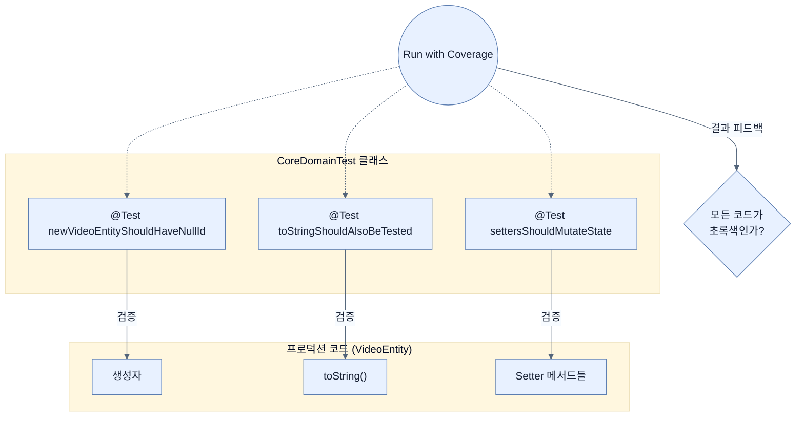

# Creating tests for your domain objects

## 한눈에 보기
| 항목 | 핵심 |
|------|------|
| 도메인 객체 테스트 | 컨트롤러나 서비스를 테스트하기 전에, 시스템의 가장 핵심 뼈대인 도메인 객체(`VideoEntity`)가 정상 작동하는지 가장 먼저 검증한다. |
| Test Coverage | 작성한 테스트 코드가 실제 프로덕션 코드의 몇 퍼센트를 실행(커버)했는지 시각적으로 확인하여 빈틈을 찾아내는 분석 도구. |

## 1. 왜 이게 필요한가

### 이런 상황을 상상해 보자
여러분은 웹 요청을 받아서 데이터베이스에 저장하는 복잡한 로직을 모두 완성했다. 그런데 왠지 모르게 비디오의 제목(Title)이 자꾸 빈 값으로 저장된다. 컨트롤러를 뒤지고, 서비스를 뒤지고, 리포지토리 쿼리를 며칠 밤낮으로 분석했다. 그런데 알고 보니 도메인 객체(`VideoEntity`)의 생성자에서 매개변수 할당을 실수로 빠뜨린 것이었다!

### 여기서 뭐가 무너지나
애플리케이션의 핵심인 **도메인 모델**이 무너지면, 그 위에 쌓아 올린 컨트롤러, 서비스, 데이터베이스 로직이 전부 모래성처럼 무너진다. 아무리 화려한 기능이라도 뼈대가 흔들리면 소용이 없다.

### 그래서 나온 생각
가장 기본적이고 단순해 보이는 도메인 객체부터 완벽하게 검증(Unit Test)하고 넘어가자! 객체를 생성해 보고, `getter/setter`가 제대로 동작하는지, `toString()`이 예쁘게 문자열을 뽑아내는지 확인한다. 또한 IDE가 제공하는 **[[test-coverage]]** 기능을 활용해, 내가 짠 테스트 코드가 도메인 객체의 모든 줄(Line)을 다 훑고 지나갔는지 시각적으로 확인(초록색/빨간색)하면 완벽하다.

### 비유로 잡기
테스트를 공연 전 리허설에 비유할 수 있다. 작은 장면부터 실제 무대와 가까운 통합 리허설까지 범위를 넓혀 실패 위치를 좁힌다.

→ 비유가 깨지는 지점: 리허설이 실제 운영과 완전히 같지는 않다. 모의 객체와 임베디드 DB는 실제 네트워크·드라이버·컨테이너의 차이를 숨길 수 있다.

### 이 절의 언어
**[[test-suite]]**(= 연관된 여러 개의 테스트 케이스(메서드)들을 논리적으로 묶어놓은 클래스나 모듈 단위. 주로 클래스명 끝에 Test를 붙인다.), **[[assertion]]**(= 테스트를 수행한 후, 예상했던 결과(Expected)와 실제 결과(Actual)가 똑같은지 단언(확인)하는 행위 및 그 메서드들.), **[[test-coverage]]**(= 전체 애플리케이션 코드 중에서, 자동화된 테스트 코드가 실제로 실행해 본 코드의 비율(줄 수, 브랜치 등)을 시각적으로 나타내는 품질 지표.)

## 2. 어떻게 동작하는가

먼저 다음 세 축으로 메커니즘을 읽는다.

1. **입력과 전제 확인** — 어떤 요청·설정·데이터가 들어오는지 확인한다. 잘못된 전제를 다음 계층으로 넘기지 않기 위해서다.
2. **Spring 추상화 적용** — 스타터와 자동 구성, 어노테이션 또는 명시적 빈이 실제 처리를 연결한다. 반복 배선보다 도메인 선택에 집중하기 위해서다.
3. **결과와 경계 검증** — 응답·저장 상태·운영 신호를 확인한다. 정상 경로만 보고 장애·버전·성능 차이를 놓치지 않기 위해서다.

1. **단위 테스트(Unit Test) 작성하기**:
   클래스 이름은 관례에 따라 뒤에 `Test`를 붙인다(예: `CoreDomainTest`). 테스트할 메서드 위에는 `@Test` 애노테이션을 붙이며, 메서드 이름은 무엇을 검증하는지 명확히 적는다(예: `newVideoEntityShouldHaveNullId`).
   
   ```java
   public class CoreDomainTest {
       @Test
       void newVideoEntityShouldHaveNullId() {
           // 1. 객체 생성 (Given/When)
           VideoEntity entity = new VideoEntity("alice", "title", "description");
           
           // 2. 검증 (Then)
           assertThat(entity.getId()).isNull();
           assertThat(entity.getUsername()).isEqualTo("alice");
       }
   }
   ```

2. **작게 쪼개서 테스트하기**:
   객체의 상태를 변경하는 `setter`나, 상태를 출력하는 `toString()`도 각각 별도의 `@Test` 메서드로 분리해서 작성한다. 
   여러 가지 검증을 하나의 거대한 테스트 메서드에 다 때려 넣으면, 앞부분에서 에러가 났을 때 뒷부분은 실행조차 되지 않아 어디서 문제가 발생했는지 파악하기 힘들다. 작은 단위로 명확하게 테스트하는 것이 핵심이다.

3. **테스트 커버리지 (Test Coverage) 측정**:
   코드를 다 짰다면 IDE(IntelliJ 등)에서 일반 'Run'이 아니라 **'Run with Coverage'**를 실행한다.
   - **초록색 줄**: 테스트 코드가 이 라인을 실행하고 지나갔음 (안전)
   - **빨간색 줄**: 아직 이 라인을 실행해 본 테스트 코드가 없음 (위험, 추가 테스트 작성 필요)
   이렇게 하면 내가 깜빡하고 테스트하지 않은 생성자나 조건문을 한눈에 찾아낼 수 있다.

## 3. 그림으로 보기



## 4. 이 노트에 나온 용어
| 용어 | 한 줄 | 자세히 |
|------|-------|--------|
| test-suite | 연관된 여러 개의 테스트 케이스(메서드)들을 논리적으로 묶어놓은 클래스나 모듈 단위. 주로 클래스명 끝에 `Test`를 붙인다. | [[_glossary#test-suite]] |
| assertion | 테스트를 수행한 후, 예상했던 결과(Expected)와 실제 결과(Actual)가 똑같은지 단언(확인)하는 행위 및 그 메서드들. | [[_glossary#assertion]] |
| test-coverage | 전체 애플리케이션 코드 중에서, 자동화된 테스트 코드가 실제로 실행해 본 코드의 비율(줄 수, 브랜치 등)을 시각적으로 나타내는 품질 지표. | [[_glossary#test-coverage]] |

## 5. 자주 헷갈리는 것
- 이 주제의 **Spring 추상화**와 그 아래에서 실제로 동작하는 라이브러리·프로토콜을 같은 것으로 보지 않는다. 추상화는 기본 배선을 줄이지만 하위 계층의 비용과 실패를 없애지 않는다.

## 6. 언제 안 쓰나 / 경계
- 책의 예제는 개념을 드러내기 위한 작은 애플리케이션이다. 운영 환경에서는 인증 정보, 장애 복구, 관측성, 부하와 데이터 규모를 별도로 검증한다.
- 이 노트의 API와 기본값은 책의 Spring Boot 4.1·Java 25 맥락을 따른다. 다른 마이너 버전에서는 공식 마이그레이션 문서와 실제 의존성 버전을 함께 확인한다.

## 7. 연결
- [[01-adding-junit-6-to-the-application]] — 같은 장의 학습 흐름에서 Creating tests for your domain objects의 전제 또는 다음 적용 단계와 연결된다.
- [[03-testing-web-controllers-with-mockmvc]] — 같은 장의 학습 흐름에서 Creating tests for your domain objects의 전제 또는 다음 적용 단계와 연결된다.

## 8. 스스로 확인
1. 단위 테스트 메서드의 이름을 지을 때 `newVideoEntityShouldHaveNullId`처럼 매우 길고 서술적인 문장 형태로 작성하는 이유는 무엇인가? (에러 리포트를 보는 상황을 가정해 보자)
2. '테스트 커버리지(Test Coverage)'가 100%라고 해서 해당 코드에 버그가 전혀 없음을 완벽히 보장할 수 있는가? 보장할 수 없다면 그 이유는 무엇인가?

<!-- ==== 아래는 내 영역 · 스킬 수정 금지 ==== -->

## 내 설명 시도

## 막혔던 지점

## 리뷰 이력
