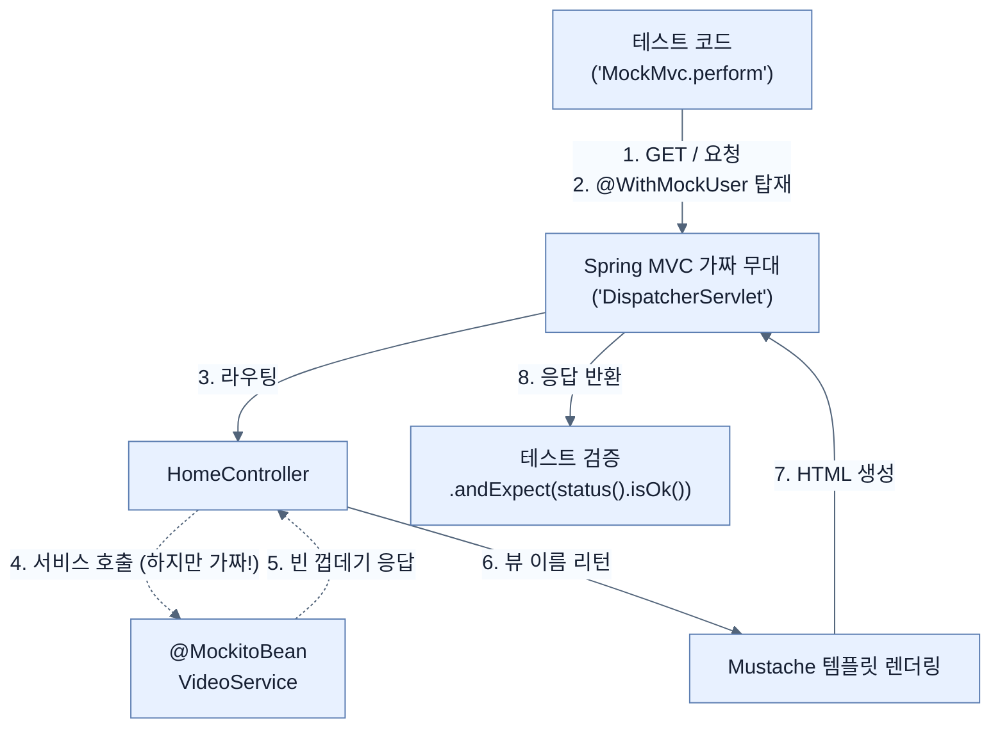

# Testing web controllers with MockMvc

## 한눈에 보기
| 항목 | 핵심 |
|------|------|
| @WebMvcTest | 전체 스프링 애플리케이션을 다 띄우지 않고, 웹 컨트롤러 테스트에 딱 필요한 껍데기(MVC 요소들)만 빠르게 띄워주는 슬라이스 테스트 애노테이션. |
| MockMvc | 진짜 브라우저나 톰캣 서버 없이도, 스프링 내부적으로 가짜 HTTP 요청(GET/POST)을 쏘고 응답을 검증하게 해주는 막강한 도구. |

## 1. 왜 이게 필요한가

### 이런 상황을 상상해 보자
도메인 객체(`VideoEntity`) 테스트를 성공적으로 마쳤다. 이제 `HomeController`를 테스트해야 한다. "컨트롤러도 자바 클래스니까 그냥 `new HomeController()` 해서 안에 있는 `index()` 메서드를 호출하면 되는 거 아냐?" 라고 생각할 수 있다.

### 여기서 뭐가 무너지나
컨트롤러는 단순한 자바 클래스가 아니다. 사용자가 브라우저에서 `/` 경로로 접속했을 때 스프링 MVC가 요청을 가로채고, 파라미터를 바인딩하고, 시큐리티가 보안 검사를 하고, 템플릿 엔진(Mustache)이 HTML을 렌더링하는 거대한 톱니바퀴의 일부다. 그냥 `new`로 객체를 만들어서 메서드만 호출해버리면, 정작 저 톱니바퀴들이 굴러가는 과정에서 발생하는 버그는 하나도 잡아낼 수 없다.

### 그래서 나온 생각
그렇다고 테스트할 때마다 무겁게 진짜 톰캣 서버를 다 띄우고 브라우저를 띄울 수는 없다. 그래서 스프링 부트는 **[[web-mvc-test]]**라는 마법을 제공한다. 이것을 쓰면 웹 환경과 똑같은 가짜 무대를 순식간에 차려준다. 그 무대 위에서 **[[mock-mvc]]**라는 녀석을 통해 가짜 HTTP 요청을 쏘고 결과를 확인한다. 컨트롤러가 의존하는 진짜 서비스(VideoService)는 굳이 부를 필요 없으니 **[[mockito-bean]]**으로 가짜(Mock)를 세워두고, 시큐리티 로그인 통과를 위해 **[[with-mock-user]]**로 가짜 신분증을 달아주면 완벽하다!

### 비유로 잡기
테스트를 공연 전 리허설에 비유할 수 있다. 작은 장면부터 실제 무대와 가까운 통합 리허설까지 범위를 넓혀 실패 위치를 좁힌다.

→ 비유가 깨지는 지점: 리허설이 실제 운영과 완전히 같지는 않다. 모의 객체와 임베디드 DB는 실제 네트워크·드라이버·컨테이너의 차이를 숨길 수 있다.

### 이 절의 언어
**[[web-mvc-test]]**(= 스프링 부트에서 제공하는 슬라이스 테스트 애노테이션으로, 전체 컨텍스트를 로드하지 않고 웹 컨트롤러 관련 빈(Bean)들만 골라서 빠르게 로드해 준다.), **[[mock-mvc]]**(= 톰캣 같은 진짜 웹 서버를 띄우지 않고도, 스프링 MVC 구조 내에서 HTTP 요청(GET, POST 등)과 응답을 흉내 내고 검증할 수 있게 해주는 핵심 유틸리티.), **[[mockito-bean]]**(= 테스트 컨텍스트에 등록된 기존 빈을 무시하고, Mockito를 이용해 만든 가짜(Mock) 객체를 스프링 컨텍스트에 주입해주는 애노테이션.), **[[with-mock-user]]**(= 스프링 시큐리티 테스트 라이브러리가 제공하며, 테스트 메서드 실행 시 가짜 인증 세션(Username, Role)을 강제로 만들어 시큐리티 필터를 통과하게 해준다.)

## 2. 어떻게 동작하는가

먼저 다음 세 축으로 메커니즘을 읽는다.

1. **입력과 전제 확인** — 어떤 요청·설정·데이터가 들어오는지 확인한다. 잘못된 전제를 다음 계층으로 넘기지 않기 위해서다.
2. **Spring 추상화 적용** — 스타터와 자동 구성, 어노테이션 또는 명시적 빈이 실제 처리를 연결한다. 반복 배선보다 도메인 선택에 집중하기 위해서다.
3. **결과와 경계 검증** — 응답·저장 상태·운영 신호를 확인한다. 정상 경로만 보고 장애·버전·성능 차이를 놓치지 않기 위해서다.

1. **무대 세팅하기 (@WebMvcTest)**:
   클래스 위에 `@WebMvcTest(controllers = HomeController.class)`를 붙이면, 스프링이 전체 앱을 띄우지 않고 `HomeController`와 관련된 MVC 인프라만 가볍게 띄운다.

2. **가짜 의존성 및 신분증 발급 (@MockitoBean, @WithMockUser)**:
   컨트롤러는 보통 `Service` 객체를 주입받는다. 하지만 지금은 컨트롤러만 테스트하고 싶으므로, 껍데기만 있는 가짜 서비스 객체를 `@MockitoBean`으로 주입한다. 그리고 스프링 시큐리티 때문에 튕겨 나가지 않도록 `@WithMockUser`를 붙여 "나 로그인한 사용자(user)야"라고 속인다.

3. **가짜 HTTP 요청 쏘기 (MockMvc)**:
   주입받은 `MockMvc` 객체를 사용해 GET 요청을 날리고 결과를 검증한다.
   ```java
   @Test
   @WithMockUser
   void indexPageHasSeveralHtmlForms() throws Exception {
       mvc.perform(get("/"))                     // 1. GET "/" 요청을 날린다.
          .andExpect(status().isOk())            // 2. 응답 상태코드가 200(OK)인지 확인!
          .andExpect(content().string(           // 3. 렌더링된 HTML 텍스트 안에
              containsString("Username: user"))); // 4. "Username: user" 글자가 있는지 확인!
   }
   ```

4. **POST 요청과 CSRF 방어 시뮬레이션**:
   폼 데이터를 제출하는 POST 요청을 테스트할 때는, 시큐리티의 CSRF 공격 방어 메커니즘도 통과해야 한다. `MockMvc`는 `.with(csrf())` 한 줄로 올바른 CSRF 토큰을 요청에 함께 실어 보낼 수 있다.
   ```java
   mvc.perform(post("/new-video")
       .param("name", "새 비디오")
       .param("description", "설명")
       .with(csrf()))                        // CSRF 토큰 동봉 (필수!)
       .andExpect(redirectedUrl("/"));       // POST 처리 후 "/" 로 리다이렉트 되는지 확인
       
   // Mockito를 이용해, 컨트롤러가 우리가 찔러준 가짜 서비스의 create()를 제대로 호출했는지 검증
   verify(videoService).create(new NewVideo("새 비디오", "설명"), "user");
   ```

## 3. 그림으로 보기



## 4. 이 노트에 나온 용어
| 용어 | 한 줄 | 자세히 |
|------|-------|--------|
| web-mvc-test | 스프링 부트에서 제공하는 슬라이스 테스트 애노테이션으로, 전체 컨텍스트를 로드하지 않고 웹 컨트롤러 관련 빈(Bean)들만 골라서 빠르게 로드해 준다. | [[_glossary#web-mvc-test]] |
| mock-mvc | 톰캣 같은 진짜 웹 서버를 띄우지 않고도, 스프링 MVC 구조 내에서 HTTP 요청(GET, POST 등)과 응답을 흉내 내고 검증할 수 있게 해주는 핵심 유틸리티. | [[_glossary#mock-mvc]] |
| mockito-bean | 테스트 컨텍스트에 등록된 기존 빈을 무시하고, Mockito를 이용해 만든 가짜(Mock) 객체를 스프링 컨텍스트에 주입해주는 애노테이션. | [[_glossary#mockito-bean]] |
| with-mock-user | 스프링 시큐리티 테스트 라이브러리가 제공하며, 테스트 메서드 실행 시 가짜 인증 세션(Username, Role)을 강제로 만들어 시큐리티 필터를 통과하게 해준다. | [[_glossary#with-mock-user]] |

## 5. 자주 헷갈리는 것
- 이 주제의 **Spring 추상화**와 그 아래에서 실제로 동작하는 라이브러리·프로토콜을 같은 것으로 보지 않는다. 추상화는 기본 배선을 줄이지만 하위 계층의 비용과 실패를 없애지 않는다.

## 6. 언제 안 쓰나 / 경계
- 책의 예제는 개념을 드러내기 위한 작은 애플리케이션이다. 운영 환경에서는 인증 정보, 장애 복구, 관측성, 부하와 데이터 규모를 별도로 검증한다.
- 이 노트의 API와 기본값은 책의 Spring Boot 4.1·Java 25 맥락을 따른다. 다른 마이너 버전에서는 공식 마이그레이션 문서와 실제 의존성 버전을 함께 확인한다.

## 7. 연결
- [[02-creating-tests-for-your-domain-objects]] — 같은 장의 학습 흐름에서 Testing web controllers with MockMvc의 전제 또는 다음 적용 단계와 연결된다.
- [[04-testing-data-repositories-with-mocks]] — 같은 장의 학습 흐름에서 Testing web controllers with MockMvc의 전제 또는 다음 적용 단계와 연결된다.

## 8. 스스로 확인
1. `@WebMvcTest`를 사용할 때 톰캣(Tomcat) 서버가 실제로 백그라운드에서 실행되는가? 만약 아니라면 그로 인해 얻는 테스트 관점에서의 장점은 무엇인가?
2. `POST` 요청을 `MockMvc`로 테스트할 때 `.with(csrf())`를 빼먹으면 어떤 HTTP 상태 코드 응답이 떨어지며, 그 이유는 무엇인가?

<!-- ==== 아래는 내 영역 · 스킬 수정 금지 ==== -->

## 내 설명 시도

## 막혔던 지점

## 리뷰 이력
