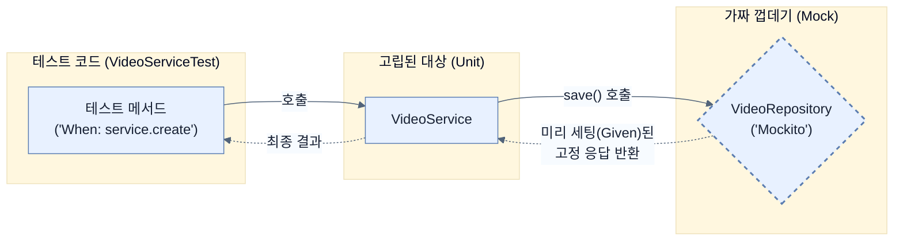

# Testing data repositories with mocks

## 한눈에 보기
| 항목 | 핵심 |
|------|------|
| @ExtendWith(MockitoExtension.class) | 스프링 컨텍스트를 아예 띄우지 않고, 순수 자바 환경에서 Mockito 라이브러리만 활성화하여 초고속으로 단위 테스트를 수행하게 해준다. |
| BDD 스타일 (Given/When/Then) | "이런 상황이 주어지고(Given), 이렇게 행동했을 때(When), 이런 결과가 나와야 한다(Then)"는 시나리오 흐름으로 테스트의 가독성을 극대화한다. |

## 1. 왜 이게 필요한가

### 이런 상황을 상상해 보자
이번엔 웹 껍데기가 아니라 핵심 비즈니스 로직이 들어있는 `VideoService`를 테스트하려고 한다. 그런데 `VideoService`는 생성자에서 `VideoRepository`를 요구한다. "아, 그러면 데이터베이스(PostgreSQL) 띄우고, 테이블 만들고, 테스트용 데이터 넣고 시작해야겠네?" 

### 여기서 뭐가 무너지나
데이터베이스까지 전부 연결해서 띄우는 테스트(통합 테스트)는 몹시 느리다. 만약 코드를 고칠 때마다 수십 초씩 걸리는 테스트를 백 개씩 돌려야 한다면, 개발 속도는 바닥을 치게 된다. 게다가 데이터베이스 접속 문제로 테스트가 실패한다면, 이게 내 `VideoService` 코드 문제인지 DB 세팅 문제인지 원인을 파악하기 힘들다.

### 그래서 나온 생각
비즈니스 로직(`VideoService`)만 고립시켜서 **빠르게** 단위 테스트(Unit Test)를 하자! 내가 만든 서비스가 데이터베이스와 소통하는 방법만 맞다면, 데이터베이스가 실제로 쿼리를 어떻게 실행하는지는 굳이 여기서 신경 쓸 필요가 없다. 
따라서 `VideoRepository`의 가짜(**[[mock]]**) 객체를 만들고, "findAll()을 부르면 무조건 내가 만든 가짜 리스트를 반환해!"라고 조작(Stubbing)해버리자. 이를 돕는 것이 **[[mockito-extension]]**과 가독성을 높인 **[[bdd-mockito]]** 기법이다.

### 비유로 잡기
테스트를 공연 전 리허설에 비유할 수 있다. 작은 장면부터 실제 무대와 가까운 통합 리허설까지 범위를 넓혀 실패 위치를 좁힌다.

→ 비유가 깨지는 지점: 리허설이 실제 운영과 완전히 같지는 않다. 모의 객체와 임베디드 DB는 실제 네트워크·드라이버·컨테이너의 차이를 숨길 수 있다.

### 이 절의 언어
**[[mockito-extension]]**(= 무거운 스프링 컨텍스트를 로드하지 않고 순수 JUnit 5/6 환경에서 Mockito의 애노테이션(@Mock, @InjectMocks)을 활성화해주는 확장 클래스.), **[[mock]]**(= 내부에 아무런 깡통 로직도 없이, 개발자가 테스트 시점에 "이렇게 물어보면 저렇게 대답해"라고 세팅한 대로만 동작하는 더미 객체.), **[[bdd-mockito]]**(= 기존 Mockito의 when() 키워드를 given()으로 바꾸어, 소프트웨어 개발 방법론인 행동 주도 개발(BDD)의 Given-When-Then 흐름에 자연스럽게 읽히도록 만든 API.)

## 2. 어떻게 동작하는가

먼저 다음 세 축으로 메커니즘을 읽는다.

1. **입력과 전제 확인** — 어떤 요청·설정·데이터가 들어오는지 확인한다. 잘못된 전제를 다음 계층으로 넘기지 않기 위해서다.
2. **Spring 추상화 적용** — 스타터와 자동 구성, 어노테이션 또는 명시적 빈이 실제 처리를 연결한다. 반복 배선보다 도메인 선택에 집중하기 위해서다.
3. **결과와 경계 검증** — 응답·저장 상태·운영 신호를 확인한다. 정상 경로만 보고 장애·버전·성능 차이를 놓치지 않기 위해서다.

1. **가짜 객체(Mock) 주입하기**:
   `@ExtendWith(MockitoExtension.class)`를 클래스 위에 붙이면 스프링 부트 전체를 띄우지 않고도 빠릿빠릿한 가짜 객체 환경을 쓸 수 있다.
   ```java
   @ExtendWith(MockitoExtension.class) // 빠르다! 스프링 부팅 안 함.
   public class VideoServiceTest {
       VideoService service; // 테스트할 대상
       
       @Mock VideoRepository repository; // 가짜 객체로 껍데기만 생성
       
       @BeforeEach // 각 테스트 직전에 실행됨
       void setUp() {
           // 가짜 리포지토리를 넣어서 서비스를 조립한다.
           this.service = new VideoService(repository);
       }
   }
   ```

2. **Given, When, Then (BDD 스타일 테스트)**:
   단순히 `when().thenReturn()`을 써도 되지만, 사람의 언어에 가까운 BDDMockito 패키지의 `given()`을 쓰면 시나리오를 읽기가 훨씬 편해진다.
   ```java
   @Test
   void creatingANewVideoShouldReturnTheSameData() {
       // 1. Given: 상황 설정 (조작)
       // 누군가 리포지토리의 saveAndFlush()에 아무 VideoEntity나 넣으면, 지정한 값을 뱉어내라.
       given(repository.saveAndFlush(any(VideoEntity.class)))
           .willReturn(new VideoEntity("alice", "이름", "설명"));
           
       // 2. When: 실제 행동 (테스트 대상 호출)
       VideoEntity newVideo = service.create(new NewVideo("이름", "설명"), "alice");
       
       // 3. Then: 결과 검증
       assertThat(newVideo.getName()).isEqualTo("이름");
   }
   ```

3. **단위 테스트 vs 통합 테스트 (Trade-offs)**:
   - **단위 테스트(Unit Test)**: 위처럼 전부 가짜(Mock)로 때우기 때문에 번개처럼 빠르다. 하지만 서로 다른 컴포넌트가 연결될 때 생기는 버그는 잡을 수 없다.
   - **통합 테스트(Integration Test)**: 진짜 컴포넌트들을 엮고 가짜 DB 등을 띄워서 테스트한다. 느리고 무겁지만, 실제 운영 환경과 비슷해 신뢰도가 높다.
   따라서 좋은 시스템은 두 가지 방식을 적절히 섞어 쓴다.

## 3. 그림으로 보기



## 4. 이 노트에 나온 용어
| 용어 | 한 줄 | 자세히 |
|------|-------|--------|
| mockito-extension | 무거운 스프링 컨텍스트를 로드하지 않고 순수 JUnit 5/6 환경에서 Mockito의 애노테이션(`@Mock`, `@InjectMocks`)을 활성화해주는 확장 클래스. | [[_glossary#mockito-extension]] |
| mock | 내부에 아무런 깡통 로직도 없이, 개발자가 테스트 시점에 "이렇게 물어보면 저렇게 대답해"라고 세팅한 대로만 동작하는 더미 객체. | [[_glossary#mock]] |
| bdd-mockito | 기존 Mockito의 `when()` 키워드를 `given()`으로 바꾸어, 소프트웨어 개발 방법론인 행동 주도 개발(BDD)의 Given-When-Then 흐름에 자연스럽게 읽히도록 만든 API. | [[_glossary#bdd-mockito]] |

## 5. 자주 헷갈리는 것
- 이 주제의 **Spring 추상화**와 그 아래에서 실제로 동작하는 라이브러리·프로토콜을 같은 것으로 보지 않는다. 추상화는 기본 배선을 줄이지만 하위 계층의 비용과 실패를 없애지 않는다.

## 6. 언제 안 쓰나 / 경계
- 책의 예제는 개념을 드러내기 위한 작은 애플리케이션이다. 운영 환경에서는 인증 정보, 장애 복구, 관측성, 부하와 데이터 규모를 별도로 검증한다.
- 이 노트의 API와 기본값은 책의 Spring Boot 4.1·Java 25 맥락을 따른다. 다른 마이너 버전에서는 공식 마이그레이션 문서와 실제 의존성 버전을 함께 확인한다.

## 7. 연결
- [[03-testing-web-controllers-with-mockmvc]] — 같은 장의 학습 흐름에서 Testing data repositories with mocks의 전제 또는 다음 적용 단계와 연결된다.
- [[05-testing-data-repositories-with-embedded-databases]] — 같은 장의 학습 흐름에서 Testing data repositories with mocks의 전제 또는 다음 적용 단계와 연결된다.

## 8. 스스로 확인
1. `@WebMvcTest`를 쓸 때는 가짜 빈을 만들기 위해 `@MockitoBean`을 사용했지만, 이번 `VideoServiceTest`에서는 `@Mock` 애노테이션을 사용했다. 이 두 애노테이션의 근본적인 차이는 스프링 부트 컨텍스트(Spring Context) 로딩 여부와 어떻게 연관되어 있는가?
2. BDD(Behavior-Driven Design) 패턴의 `Given`, `When`, `Then` 각각의 블록에는 어떤 성격의 코드들이 배치되어야 하는가?

<!-- ==== 아래는 내 영역 · 스킬 수정 금지 ==== -->

## 내 설명 시도

## 막혔던 지점

## 리뷰 이력
