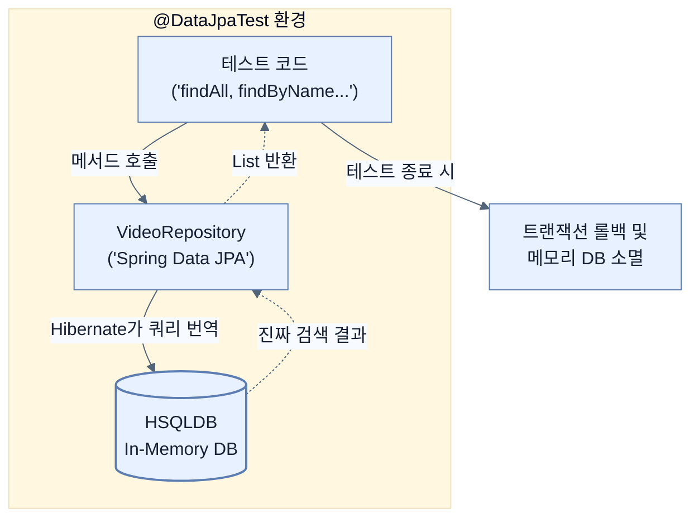

# Testing data repositories with embedded databases

## 한눈에 보기
| 항목 | 핵심 |
|------|------|
| @DataJpaTest | 스프링 부트에서 JPA 리포지토리와 엔티티 관련 설정만 쏙 뽑아서 가볍게 띄워주는 슬라이스 테스트 전용 애노테이션. |
| In-memory DB | 외부의 무거운 데이터베이스 서버를 띄울 필요 없이, 애플리케이션 메모리 위에서 임시로 생성되었다가 테스트가 끝나면 사라지는 가벼운 데이터베이스(HSQLDB, H2 등). |

## 1. 왜 이게 필요한가

### 이런 상황을 상상해 보자
`VideoRepository`에 "제목에 특정 단어가 포함된 비디오를 대소문자 무시하고 찾아줘"라는 복잡한 메서드(`findByNameContainsIgnoreCase`)를 만들었다. 이제 이 쿼리가 제대로 동작하는지 테스트해야 한다. 앞서 배운 `Mock`을 쓰려고 보니, 가짜 객체는 어차피 내가 정해준 대답만 할 뿐 진짜 쿼리를 실행해 주진 않는다.

### 여기서 뭐가 무너지나
그렇다고 테스트할 때마다 개발자가 직접 로컬 PC에 PostgreSQL을 깔고, 테이블을 만들고, 테스트 데이터를 밀어 넣고, 쿼리를 날려본 뒤 다시 데이터를 지우는 짓을 반복할 수는 없다. 이런 '무거운' 테스트는 실행 속도가 너무 느려서 하루에 몇 번 돌리기도 힘들고, 다른 팀원 PC에서는 DB 세팅이 달라서 실패하기 일쑤다.

### 그래서 나온 생각
테스트 코드가 실행될 때만 잠깐 메모리(RAM)에 나타났다가 테스트가 끝나면 흔적도 없이 사라지는 마법의 데이터베이스(**[[embedded-database]]**)를 쓰자! 스프링 부트는 `HSQLDB`나 `H2` 같은 **[[in-memory-database]]** 라이브러리만 추가해 두면, **[[data-jpa-test]]**라는 애노테이션 하나로 DB 셋업부터 스키마 생성, 트랜잭션 롤백까지 전부 자동으로 처리해 준다.

### 비유로 잡기
테스트를 공연 전 리허설에 비유할 수 있다. 작은 장면부터 실제 무대와 가까운 통합 리허설까지 범위를 넓혀 실패 위치를 좁힌다.

→ 비유가 깨지는 지점: 리허설이 실제 운영과 완전히 같지는 않다. 모의 객체와 임베디드 DB는 실제 네트워크·드라이버·컨테이너의 차이를 숨길 수 있다.

### 이 절의 언어
**[[data-jpa-test]]**(= 전체 애플리케이션을 띄우지 않고, JPA 엔티티와 리포지토리 구성 요소만 로드하여 데이터 액세스 계층을 초고속으로 테스트하게 해주는 슬라이스 테스트 애노테이션.), **[[embedded-database]]**(= 외부 서버에 별도로 설치할 필요 없이 애플리케이션과 동일한 JVM 내에서 실행되는 가벼운 데이터베이스 엔진 (예: H2, HSQLDB, Derby).), **[[in-memory-database]]**(= 디스크에 데이터를 영구 저장하지 않고 주 메모리(RAM)에만 데이터를 보관하여, 입출력 속도가 극단적으로 빠르며 앱 종료 시 데이터가 휘발되는 데이터베이스.)

## 2. 어떻게 동작하는가

먼저 다음 세 축으로 메커니즘을 읽는다.

1. **입력과 전제 확인** — 어떤 요청·설정·데이터가 들어오는지 확인한다. 잘못된 전제를 다음 계층으로 넘기지 않기 위해서다.
2. **Spring 추상화 적용** — 스타터와 자동 구성, 어노테이션 또는 명시적 빈이 실제 처리를 연결한다. 반복 배선보다 도메인 선택에 집중하기 위해서다.
3. **결과와 경계 검증** — 응답·저장 상태·운영 신호를 확인한다. 정상 경로만 보고 장애·버전·성능 차이를 놓치지 않기 위해서다.

1. **의존성 추가 (런타임에만!)**:
   `pom.xml`이나 `build.gradle`에 HSQLDB 의존성을 추가한다. 이때 스코프를 `runtime`으로 설정하면, 실제 프로덕션 코드에서는 이 DB를 쓸 수 없고 오직 앱이 켜질 때(테스트 런타임)만 몰래 끼어들어 작동한다.

2. **@DataJpaTest로 무대 세팅**:
   클래스 위에 `@DataJpaTest`를 붙이면 스프링이 컨트롤러나 서비스는 무시하고, 오직 엔티티(`@Entity`)와 리포지토리 관련 빈들만 메모리 DB와 연결해서 빠르게 띄워준다.
   ```java
   @DataJpaTest
   public class VideoRepositoryHsqlTest {
       @Autowired VideoRepository repository; // 진짜 리포지토리가 꽂힌다!
       
       @BeforeEach // 매 테스트 전에 기초 데이터 세팅
       void setUp() {
           repository.saveAll(List.of(
               new VideoEntity("alice", "Spring Boot 4 Intro", "설명 1"),
               new VideoEntity("bob", "Debugging Secrets", "설명 2")
           ));
       }
       // ...
   }
   ```
   *참고: 테스트 클래스에서는 JUnit이 생명주기를 관리하므로, 실무에서 꺼려지는 필드 주입(`@Autowired`)을 써도 무방하다.*

3. **실제 쿼리 검증하기 (AssertJ 활용)**:
   이제 진짜로 쿼리를 날려보고, 결과가 예상대로 나오는지 검증한다. 이때 데이터베이스가 자동 생성한 ID(PK) 값까지 맞추려 들면 피곤해지므로, 애플리케이션 관점에서 중요한 데이터(예: 이름, 설명)만 쏙 뽑아서 검증하는 것이 팁이다.
   ```java
   @Test
   void findByNameShouldRetrieveOneEntry() {
       // 1. 대소문자 섞어서 검색 (진짜 쿼리가 날아감!)
       List<VideoEntity> videos = repository.findByNameContainsIgnoreCase("sPriNg");
       
       // 2. 결과 개수 검증
       assertThat(videos).hasSize(1);
       
       // 3. 리스트에서 'name' 필드만 쏙 뽑아내서(extracting) 내용물 검증
       assertThat(videos).extracting(VideoEntity::getName)
           .containsExactlyInAnyOrder("Spring Boot 4 Intro");
   }
   ```

## 3. 그림으로 보기



## 4. 이 노트에 나온 용어
| 용어 | 한 줄 | 자세히 |
|------|-------|--------|
| data-jpa-test | 전체 애플리케이션을 띄우지 않고, JPA 엔티티와 리포지토리 구성 요소만 로드하여 데이터 액세스 계층을 초고속으로 테스트하게 해주는 슬라이스 테스트 애노테이션. | [[_glossary#data-jpa-test]] |
| embedded-database | 외부 서버에 별도로 설치할 필요 없이 애플리케이션과 동일한 JVM 내에서 실행되는 가벼운 데이터베이스 엔진 (예: H2, HSQLDB, Derby). | [[_glossary#embedded-database]] |
| in-memory-database | 디스크에 데이터를 영구 저장하지 않고 주 메모리(RAM)에만 데이터를 보관하여, 입출력 속도가 극단적으로 빠르며 앱 종료 시 데이터가 휘발되는 데이터베이스. | [[_glossary#in-memory-database]] |

## 5. 자주 헷갈리는 것
- 이 주제의 **Spring 추상화**와 그 아래에서 실제로 동작하는 라이브러리·프로토콜을 같은 것으로 보지 않는다. 추상화는 기본 배선을 줄이지만 하위 계층의 비용과 실패를 없애지 않는다.

## 6. 언제 안 쓰나 / 경계
- 책의 예제는 개념을 드러내기 위한 작은 애플리케이션이다. 운영 환경에서는 인증 정보, 장애 복구, 관측성, 부하와 데이터 규모를 별도로 검증한다.
- 이 노트의 API와 기본값은 책의 Spring Boot 4.1·Java 25 맥락을 따른다. 다른 마이너 버전에서는 공식 마이그레이션 문서와 실제 의존성 버전을 함께 확인한다.

## 7. 연결
- [[04-testing-data-repositories-with-mocks]] — 같은 장의 학습 흐름에서 Testing data repositories with embedded databases의 전제 또는 다음 적용 단계와 연결된다.
- [[06-testing-data-repositories-using-containerized-databases]] — 같은 장의 학습 흐름에서 Testing data repositories with embedded databases의 전제 또는 다음 적용 단계와 연결된다.

## 8. 스스로 확인
1. 단위 테스트(Unit Test)에서 리포지토리를 `@Mock`으로 가짜로 만들어 썼던 것과 비교할 때, `@DataJpaTest`와 인메모리 DB를 사용하면 어떤 종류의 버그를 새롭게 잡아낼 수 있는가?
2. 테스트 코드에서 `@Autowired`를 이용한 필드 주입(Field Injection)을 사용하는 것이 실무 프로덕션 코드에서 썼을 때보다 덜 위험한(허용되는) 근본적인 이유는 무엇인가?

<!-- ==== 아래는 내 영역 · 스킬 수정 금지 ==== -->

## 내 설명 시도

## 막혔던 지점

## 리뷰 이력
