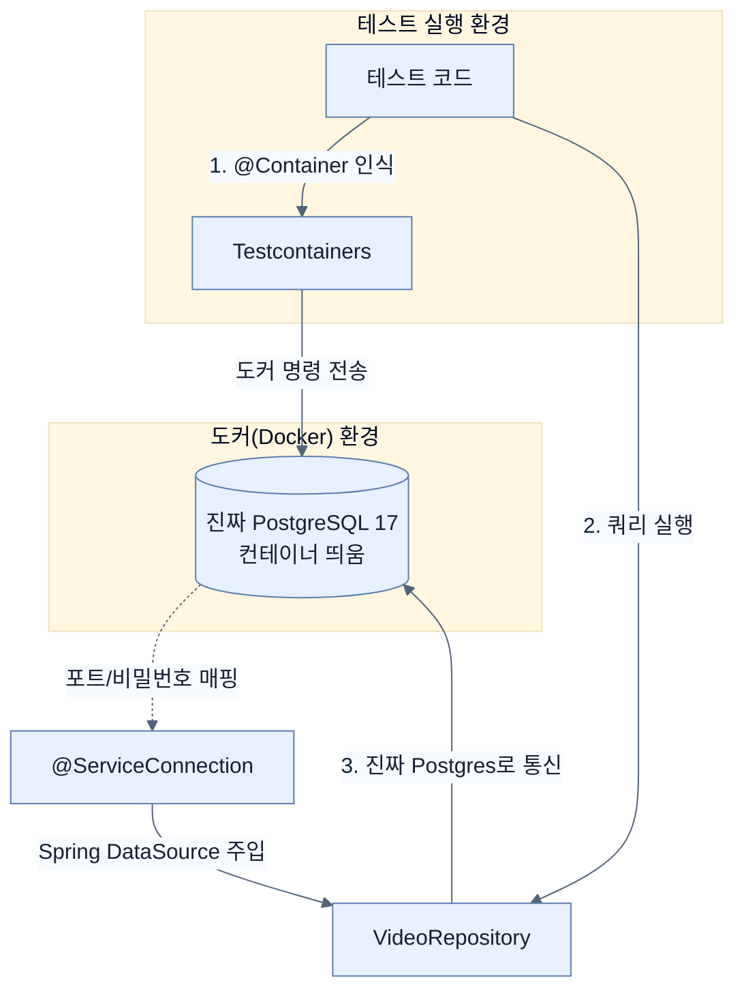

# Testing data repositories using containerized databases

## 한눈에 보기
| 항목 | 핵심 |
|------|------|
| Testcontainers | 내장형 DB(H2 등) 대신, 프로덕션 환경과 100% 동일한 진짜 데이터베이스(PostgreSQL 등)를 도커(Docker) 컨테이너로 띄워서 테스트하게 해주는 라이브러리. |
| @ServiceConnection | 스프링 부트 4의 마법 같은 기능으로, 띄워진 도커 컨테이너의 접속 정보(URL, 포트, 비밀번호)를 알아서 스프링 설정에 주입해 준다. |

## 1. 왜 이게 필요한가

### 이런 상황을 상상해 보자
`HSQLDB`(인메모리 DB) 환경에서 모든 테스트를 완벽하게 통과했다. "좋아, 완벽해!"를 외치며 실제 운영 서버(PostgreSQL)에 배포했다. 그런데 사용자가 검색 버튼을 누르자마자 에러가 터진다! 

### 여기서 뭐가 무너지나
SQL은 표준이지만, 각 데이터베이스 벤더(PostgreSQL, MySQL, Oracle 등)마다 방언(Dialect)이 있고 인덱싱 동작, 대소문자 구분 규칙, 트랜잭션 처리 방식이 미묘하게 다르다. 따라서 HSQLDB에서는 잘 돌아가던 쿼리가 PostgreSQL에서는 문법 오류를 뱉어내거나 전혀 다른 결과를 가져올 수 있다. "내 컴퓨터에선 되는데?"의 전형적인 함정이다.

### 그래서 나온 생각
그럼 운영 환경과 완벽히 똑같은 **진짜 PostgreSQL**을 띄워서 테스트하면 되지 않을까? 하지만 개발자 PC마다 버전을 맞춰서 설치하는 것은 너무 번거롭다. 그래서 등장한 것이 **[[testcontainers]]**다. 도커(Docker)만 깔려있다면, 테스트를 시작할 때 자동으로 진짜 PostgreSQL 컨테이너를 띄우고 테스트가 끝나면 알아서 삭제해 준다. 완벽한 운영 환경 복제본에서 테스트하면서도, 자동화의 편리함을 잃지 않는 것이다!

### 비유로 잡기
테스트를 공연 전 리허설에 비유할 수 있다. 작은 장면부터 실제 무대와 가까운 통합 리허설까지 범위를 넓혀 실패 위치를 좁힌다.

→ 비유가 깨지는 지점: 리허설이 실제 운영과 완전히 같지는 않다. 모의 객체와 임베디드 DB는 실제 네트워크·드라이버·컨테이너의 차이를 숨길 수 있다.

### 이 절의 언어
**[[testcontainers]]**(= 자바(JUnit) 환경에서 Docker를 프로그래밍 방식으로 제어하여, 테스트 시점에만 일회용으로 데이터베이스나 메시지 브로커 등을 띄워주는 라이브러리.), **[[auto-configure-test-database]]**(= @DataJpaTest 사용 시, 클래스패스에 H2 같은 인메모리 DB가 있으면 원래 설정된 DB를 무시하고 덮어쓰는 기능. replace = Replace.NONE으로 이 동작을 막을 수 있다.), **[[service-connection]]**(= 스프링 부트 3.1부터 도입된 애노테이션으로, 띄워진 Testcontainers의 동적 포트와 연결 정보를 수동 설정 없이 스프링의 DataSource 등에 자동으로 바인딩해 준다.)

## 2. 어떻게 동작하는가

먼저 다음 세 축으로 메커니즘을 읽는다.

1. **입력과 전제 확인** — 어떤 요청·설정·데이터가 들어오는지 확인한다. 잘못된 전제를 다음 계층으로 넘기지 않기 위해서다.
2. **Spring 추상화 적용** — 스타터와 자동 구성, 어노테이션 또는 명시적 빈이 실제 처리를 연결한다. 반복 배선보다 도메인 선택에 집중하기 위해서다.
3. **결과와 경계 검증** — 응답·저장 상태·운영 신호를 확인한다. 정상 경로만 보고 장애·버전·성능 차이를 놓치지 않기 위해서다.

1. **의존성(Dependencies) 추가하기**:
   - `postgresql`: 실제 운영과 통신할 드라이버 (런타임용)
   - `testcontainers-bom`, `testcontainers-postgresql`, `testcontainers-junit-jupiter`: Testcontainers 핵심 라이브러리들
   - `spring-boot-testcontainers`: 스프링 부트와 Testcontainers를 긴밀하게 이어주는 모듈

2. **테스트 클래스 세팅의 마법**:
   아래와 같이 설정하면, 스프링이 인메모리 DB로 바꿔치기 하려는 시도를 막고 진짜 도커 컨테이너를 띄워서 연결한다.
   ```java
   @Testcontainers // 1. Testcontainers 활성화 (JUnit 6)
   @DataJpaTest
   @AutoConfigureTestDatabase(replace = Replace.NONE) // 2. "인메모리 DB로 마음대로 바꾸지 마!"
   @TestPropertySource(properties = {"spring.jpa.hibernate.ddl-auto=create-drop"}) // 매 테스트마다 깔끔하게 스키마 재생성
   class VideoRepositoryTestcontainersTest {
       @Autowired VideoRepository repository;
       
       @Container // 3. 이 컨테이너의 생명주기를 JUnit이 관리함
       @ServiceConnection // 4. "DB가 뜨면 주소랑 비밀번호 알아서 스프링에 연결해!"
       static final PostgreSQLContainer database =
           new PostgreSQLContainer(DockerImageName.parse("postgres:17-alpine"))
               .withDatabaseName("testdb")
               .withUsername("postgres")
               .withPassword("postgres");
               
       @BeforeEach // 5. 진짜 PostgreSQL 컨테이너 안에 기초 데이터 밀어 넣기
       void setUp() {
           repository.saveAll(List.of(...));
       }
   }
   ```

3. **테스트 실행**:
   `findByNameContainsIgnoreCase` 같은 커스텀 쿼리 메서드 테스트를 그대로 실행하면 된다. 이제 이 쿼리는 HSQLDB가 아닌 띄워진 PostgreSQL 컨테이너 위에서 실행된다. 만약 PostgreSQL의 문법 규칙에 어긋나는 부분이 있다면 이 테스트에서 확실하게 실패하여 우리에게 경고해 줄 것이다.

## 3. 그림으로 보기



## 4. 이 노트에 나온 용어
| 용어 | 한 줄 | 자세히 |
|------|-------|--------|
| testcontainers | 자바(JUnit) 환경에서 Docker를 프로그래밍 방식으로 제어하여, 테스트 시점에만 일회용으로 데이터베이스나 메시지 브로커 등을 띄워주는 라이브러리. | [[_glossary#testcontainers]] |
| auto-configure-test-database | `@DataJpaTest` 사용 시, 클래스패스에 `H2` 같은 인메모리 DB가 있으면 원래 설정된 DB를 무시하고 덮어쓰는 기능. `replace = Replace.NONE`으로 이 동작을 막을 수 있다. | [[_glossary#auto-configure-test-database]] |
| service-connection | 스프링 부트 3.1부터 도입된 애노테이션으로, 띄워진 Testcontainers의 동적 포트와 연결 정보를 수동 설정 없이 스프링의 DataSource 등에 자동으로 바인딩해 준다. | [[_glossary#service-connection]] |

## 5. 자주 헷갈리는 것
- 이 주제의 **Spring 추상화**와 그 아래에서 실제로 동작하는 라이브러리·프로토콜을 같은 것으로 보지 않는다. 추상화는 기본 배선을 줄이지만 하위 계층의 비용과 실패를 없애지 않는다.

## 6. 언제 안 쓰나 / 경계
- 책의 예제는 개념을 드러내기 위한 작은 애플리케이션이다. 운영 환경에서는 인증 정보, 장애 복구, 관측성, 부하와 데이터 규모를 별도로 검증한다.
- 이 노트의 API와 기본값은 책의 Spring Boot 4.1·Java 25 맥락을 따른다. 다른 마이너 버전에서는 공식 마이그레이션 문서와 실제 의존성 버전을 함께 확인한다.

## 7. 연결
- [[05-testing-data-repositories-with-embedded-databases]] — 같은 장의 학습 흐름에서 Testing data repositories using containerized databases의 전제 또는 다음 적용 단계와 연결된다.
- [[07-testing-security-policies-with-spring-security-test]] — 같은 장의 학습 흐름에서 Testing data repositories using containerized databases의 전제 또는 다음 적용 단계와 연결된다.

## 8. 스스로 확인
1. `@AutoConfigureTestDatabase(replace = Replace.NONE)` 옵션을 켜지 않으면 Testcontainers를 띄우더라도 발생할 수 있는 치명적인 문제는 무엇인가?
2. `PostgreSQLContainer`를 선언할 때 `static` 제어자를 붙인 이유는 무엇인가? (힌트: 클래스 단위 테스트와 메서드 단위 테스트의 컨테이너 생명주기 차이)

<!-- ==== 아래는 내 영역 · 스킬 수정 금지 ==== -->

## 내 설명 시도

## 막혔던 지점

## 리뷰 이력
