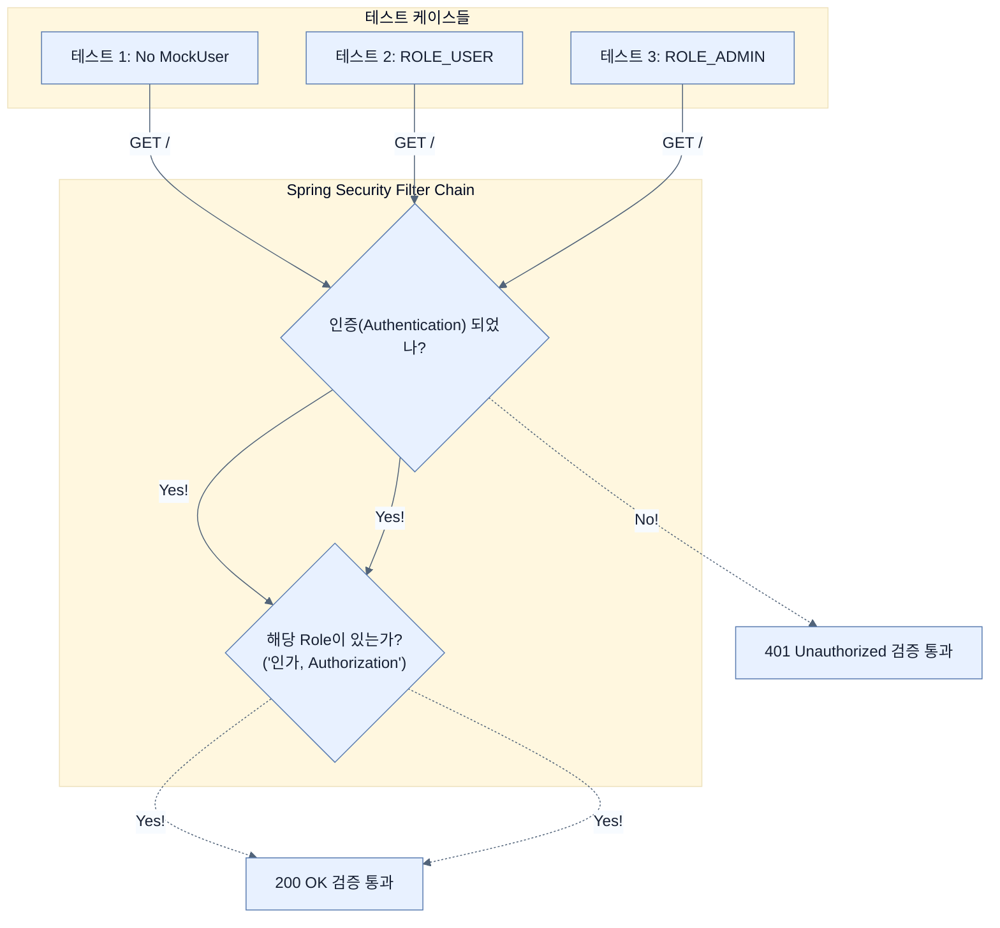

# Testing security policies with Spring Security Test

## 한눈에 보기
| 항목 | 핵심 |
|------|------|
| 네거티브 패스 (Negative path) | 로그인하지 않은 해커가 관리자 페이지에 접근했을 때, 시스템이 친절하게(?) 페이지를 보여주지 않고 단호하게 차단(401/403 에러)하는지를 검증하는 필수 테스트. |
| @WithMockUser 활용 | "나 관리자(ADMIN)야", "나 일반 유저(USER)야"라고 스프링 시큐리티를 속여서, 각 역할(Role)별로 인가(Authorization) 정책이 뚫리지 않고 잘 작동하는지 꼼꼼하게 확인한다. |

## 1. 왜 이게 필요한가

### 이런 상황을 상상해 보자
보안 설정(`SecurityConfig`)에 `"/delete/**" 경로에는 관리자(ADMIN)만 접근 가능`이라는 완벽한 규칙을 적어두었다. 그런데 누군가 코드를 실수로 만져서 이 설정이 지워졌다. 개발자는 당연히 보안이 잘 작동하는 줄 알고 앱을 배포했다가, 일반 사용자가 남의 게시물을 마구 삭제하는 대형 사고가 터졌다.

### 여기서 뭐가 무너지나
보안 설정은 한 번 짜놓고 눈으로만 검사(Manual Test)하면 언젠가 반드시 구멍이 뚫린다. 시큐리티 필터는 매우 복잡한 체인으로 엮여 있어서 사소한 오타 하나만 나도 시스템 전체가 무장 해제된다. 

### 그래서 나온 생각
이전에 웹 컨트롤러를 테스트하려고 붙였던 `@WebMvcTest`는 사실 스프링 시큐리티 설정까지 모두 끌고 와서 적용한다. 그렇다면 이를 십분 활용해 **[[spring-security-test]]** 라이브러리가 제공하는 기능으로 보안 검증을 자동화하자! 로그인 안 한 유저가 접근할 때(Negative Path), 로그인한 유저가 접근할 때(Positive Path), 그리고 권한이 다른 유저가 접근할 때 등 **모든 시나리오를 코드로 박아두면**, 누군가 실수로 보안 설정을 날려먹어도 테스트가 즉각 빨간불(실패)을 켜서 사고를 막아준다.

### 비유로 잡기
보안 계층은 건물의 출입 체계와 비슷하다. 신분 확인, 출입구별 권한, 내부 금고의 소유권 검사가 서로 다른 문에서 반복된다.

→ 비유가 깨지는 지점: 웹 보안은 물리 출입처럼 한 번 확인하고 끝나지 않는다. 요청마다 컨텍스트와 토큰, 세션, 데이터 소유권을 다시 판단한다.

### 이 절의 언어
**[[spring-security-test]]**(= 스프링 시큐리티의 인증 및 인가 과정을 모의(Mock)로 시뮬레이션할 수 있도록 @WithMockUser와 SecurityMockMvcRequestPostProcessors 등을 제공하는 전용 테스팅 툴킷.), **[[negative-path]]**(= 성공하는 정상적인 흐름(해피 패스)의 반대말로, 예외가 발생하거나 접근이 거부되어야 하는 상황이 우리가 의도한 대로 잘 실패(?)하는지 확인하는 테스트 경로.), **[[authorization]]**(= 사용자가 시스템에 들어온 후(인증 완료), '이 버튼을 누를 수 있는가', '이 데이터를 볼 수 있는가' 등의 접근 권한 유무를 검사하는 통제 행위(인가).)

## 2. 어떻게 동작하는가

먼저 다음 세 축으로 메커니즘을 읽는다.

1. **입력과 전제 확인** — 어떤 요청·설정·데이터가 들어오는지 확인한다. 잘못된 전제를 다음 계층으로 넘기지 않기 위해서다.
2. **Spring 추상화 적용** — 스타터와 자동 구성, 어노테이션 또는 명시적 빈이 실제 처리를 연결한다. 반복 배선보다 도메인 선택에 집중하기 위해서다.
3. **결과와 경계 검증** — 응답·저장 상태·운영 신호를 확인한다. 정상 경로만 보고 장애·버전·성능 차이를 놓치지 않기 위해서다.

1. **아무 권한 없이 접근해 보기 (네거티브 패스)**:
   테스트 코드에서 고의로 `@WithMockUser`를 빼고, 로그인해야 볼 수 있는 홈 화면(`/`)에 GET 요청을 날려본다.
   ```java
   @Test
   void unauthUserShouldNotAccessHomePage() throws Exception {
       mvc.perform(get("/"))
          .andExpect(status().isUnauthorized()); // 401 에러(인증 실패)가 떨어져야 정상!
   }
   ```

2. **역할(Role) 부여해서 접근해 보기**:
   이번에는 일반 유저와 관리자 계정을 번갈아가며 테스트해, 설정한 **[[authorization]]**(인가) 규칙이 정상적으로 돌아가는지 확인한다.
   ```java
   @Test
   @WithMockUser(username = "alice", roles = "USER") // 나 일반 유저야!
   void authUserShouldAccessHomePage() throws Exception {
       mvc.perform(get("/"))
          .andExpect(status().isOk()); // 일반 유저는 홈 화면 접근 가능 (200 OK)
   }
   
   @Test
   @WithMockUser(username = "admin", roles = "ADMIN") // 나 관리자야!
   void adminShouldAccessHomePage() throws Exception {
       mvc.perform(get("/"))
          .andExpect(status().isOk()); // 관리자도 물론 접근 가능
   }
   ```

3. **비인가된 POST 요청 방어 테스트**:
   비디오를 생성하는 `/new-video` POST 엔티티에도 로그인 안 한 유저가 데이터를 밀어 넣으려 하면 차단되어야 한다. (이때 CSRF 방어가 켜져 있다면, `.with(csrf())`로 정상적인 형태의 공격(요청)을 흉내 내야 시큐리티 필터의 정확한 판단을 검증할 수 있다.)
   ```java
   @Test
   void newVideoFromUnauthUserShouldFail() throws Exception {
       mvc.perform(post("/new-video")
           .param("name", "해킹 비디오")
           .with(csrf())) // CSRF 토큰은 줬지만
           .andExpect(status().isUnauthorized()); // 권한이 없으니 401 에러가 떠야 정상!
   }
   ```

## 3. 그림으로 보기



## 4. 이 노트에 나온 용어
| 용어 | 한 줄 | 자세히 |
|------|-------|--------|
| spring-security-test | 스프링 시큐리티의 인증 및 인가 과정을 모의(Mock)로 시뮬레이션할 수 있도록 `@WithMockUser`와 `SecurityMockMvcRequestPostProcessors` 등을 제공하는 전용 테스팅 툴킷. | [[_glossary#spring-security-test]] |
| negative-path | 성공하는 정상적인 흐름(해피 패스)의 반대말로, 예외가 발생하거나 접근이 거부되어야 하는 상황이 우리가 의도한 대로 잘 실패(?)하는지 확인하는 테스트 경로. | [[_glossary#negative-path]] |
| authorization | 사용자가 시스템에 들어온 후(인증 완료), '이 버튼을 누를 수 있는가', '이 데이터를 볼 수 있는가' 등의 접근 권한 유무를 검사하는 통제 행위(인가). | [[_glossary#authorization]] |

## 5. 자주 헷갈리는 것
- 이 주제의 **Spring 추상화**와 그 아래에서 실제로 동작하는 라이브러리·프로토콜을 같은 것으로 보지 않는다. 추상화는 기본 배선을 줄이지만 하위 계층의 비용과 실패를 없애지 않는다.

## 6. 언제 안 쓰나 / 경계
- 책의 예제는 개념을 드러내기 위한 작은 애플리케이션이다. 운영 환경에서는 인증 정보, 장애 복구, 관측성, 부하와 데이터 규모를 별도로 검증한다.
- 이 노트의 API와 기본값은 책의 Spring Boot 4.1·Java 25 맥락을 따른다. 다른 마이너 버전에서는 공식 마이그레이션 문서와 실제 의존성 버전을 함께 확인한다.

## 7. 연결
- [[06-testing-data-repositories-using-containerized-databases]] — 같은 장의 학습 흐름에서 Testing security policies with Spring Security Test의 전제 또는 다음 적용 단계와 연결된다.
- [[05-testing-data-repositories-with-embedded-databases]] — 같은 장의 학습 흐름에서 Testing security policies with Spring Security Test의 전제 또는 다음 적용 단계와 연결된다.

## 8. 스스로 확인
1. 테스트 코드에서 아무 권한이 없는 상태로 접근했을 때 기대하는 에러 코드인 `401 Unauthorized`와 권한이 모자랄 때 발생하는 `403 Forbidden`의 개념적인 차이(인증과 인가 관점)는 무엇인가?
2. 보안 테스트를 할 때 긍정적인 상황(해피 패스)뿐만 아니라 부정적인 상황(네거티브 패스)을 일일이 검증해야만 하는 보안상의 가장 큰 이유는 무엇인가?

<!-- ==== 아래는 내 영역 · 스킬 수정 금지 ==== -->

## 내 설명 시도

## 막혔던 지점

## 리뷰 이력
