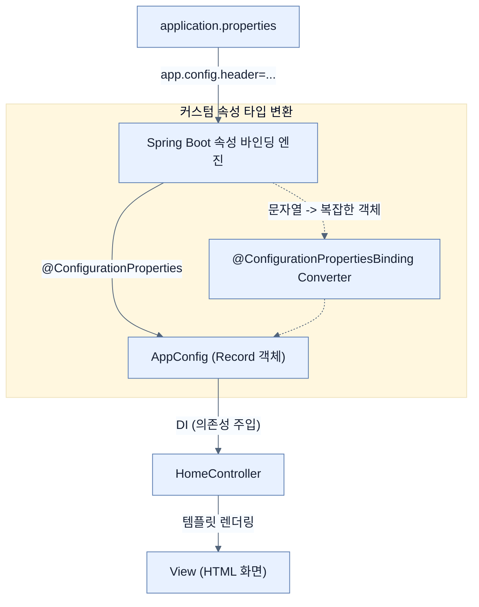

# Creating Custom Properties

## 한눈에 보기
| 관점 | 핵심 |
|---|---|
| 이 절의 질문 | 스프링 부트Spring Boot에서는 단순히 application.properties에 정의된 속성을 사용하는 것을 넘어, 우리가 직접 커스텀 프로퍼티Custom Properties를 만들고 타입 안전Type-safe한 객체로 매핑하여 사용할 수 있다. |
| 책에서의 역할 | Chapter 6의 앞뒤 예제를 연결하는 학습 단위 |

## 1. 왜 이게 필요한가

스프링 부트(Spring Boot)에서는 단순히 `application.properties`에 정의된 속성을 사용하는 것을 넘어, 우리가 직접 **커스텀 프로퍼티(Custom Properties)**를 만들고 타입 안전(Type-safe)한 객체로 매핑하여 사용할 수 있다.

### 비유로 잡기
설정을 여러 겹의 투명 필름에 비유하면, 아래의 기본값 위에 환경별 필름을 겹쳐 최종 값을 읽는 셈이다.

→ 비유가 깨지는 지점: 실제 설정은 필름처럼 단순히 마지막 줄만 보는 것이 아니라 소스별 우선순위, 바인딩 규칙, 활성화 조건까지 함께 평가한다.

### 이 절의 언어
**[[custom-properties]]**(= application.properties에 개발자가 독자적인 네임스페이스(접두어)를 설정하여 애플리케이션에 주입하는 설정값), **[[configuration-properties-binding]]**(= 외부 속성 파일의 텍스트(String) 값을 스프링 내부의 구체적인 자바 타입으로 바인딩할 때 사용하는 컨버터를 지칭하는 애노테이션)

## 2. 어떻게 동작하는가

먼저 다음 세 축으로 메커니즘을 읽는다.

1. **입력과 전제 확인** — 어떤 요청·설정·데이터가 들어오는지 확인한다. 잘못된 전제를 다음 계층으로 넘기지 않기 위해서다.
2. **Spring 추상화 적용** — 스타터와 자동 구성, 어노테이션 또는 명시적 빈이 실제 처리를 연결한다. 반복 배선보다 도메인 선택에 집중하기 위해서다.
3. **결과와 경계 검증** — 응답·저장 상태·운영 신호를 확인한다. 정상 경로만 보고 장애·버전·성능 차이를 놓치지 않기 위해서다.

### 2.1 커스텀 프로퍼티 생성
자바의 `record`를 사용하여 애플리케이션의 커스텀 프로퍼티를 담을 구조체를 정의할 수 있다.

```java
@ConfigurationProperties("app.config")
public record AppConfig(String header, String intro, List<UserAccount> users) {
}
```
- `@ConfigurationProperties("app.config")`: 이 레코드가 속성 값의 출처임을 나타낸다. 속성의 접두어(prefix)가 `app.config`가 된다.
- 자바 `record`를 사용하므로 매개변수를 매핑할 생성자가 자동으로 생성된다. 따라서 여러 생성자가 있는 특별한 경우가 아니라면 별도의 `@ConstructorBinding` 애노테이션이 필요하지 않다.

위 레코드를 정의한 후, `application.properties`에 속성값을 할당할 수 있다.
```properties
app.config.header=Greetings Learning Spring Boot 4.0 fans!
app.config.intro=In this chapter, we are learning how to make a web app
app.config.users[0].username=alice
app.config.users[0].password=password
app.config.users[0].authorities[0]=ROLE_USER
```
- 문자열 속성뿐만 아니라, `[]` 괄호 표기법을 통해 복잡한 리스트(`List<UserAccount>`)의 각 요소에도 매핑이 가능하다.

### 2.2 커스텀 프로퍼티 활성화 (Enable Configuration Properties)
생성한 속성을 애플리케이션 컨텍스트에서 사용하려면, 설정 객체를 스프링 빈으로 등록해야 한다. 가장 간단한 방법은 애플리케이션 진입점 클래스에 `@EnableConfigurationProperties` 애노테이션을 붙이는 것이다.

```java
@SpringBootApplication
@EnableConfigurationProperties(AppConfig.class) // AppConfig 활성화
public class Chapter6Application {
    public static void main(String[] args) {
        SpringApplication.run(Chapter6Application.class, args);
    }
}
```
> [!NOTE] 
> 특정 빈(Bean)에서만 사용되는 프로퍼티라면 해당 빈에 이 애노테이션을 선언하는 것이 권장된다. 전역에서 사용할 때는 진입점에 선언하는 것이 유용하다. `@ConfigurationPropertiesScan`을 사용하면 직접 명시하지 않고도 자동 검색되도록 할 수도 있다.

### 2.3 커스텀 컨버터 (Custom Converter) 활용
위 예제에서 `users` 리스트 안에 있는 권한(Authorities) 속성은 단순히 문자열이 아니라, `List<GrantedAuthority>` 같은 복잡한 타입일 수 있다.
문자열(String)을 `GrantedAuthority` 객체로 변환하기 위해 별도의 컨버터를 등록해야 할 수 있다.

```java
@Bean
@ConfigurationPropertiesBinding
Converter<String, GrantedAuthority> converter() {
    return new Converter<String, GrantedAuthority>() {
        @Override
        public GrantedAuthority convert(String source) {
            return new SimpleGrantedAuthority(source);
        }
    };
}
```
- `@ConfigurationPropertiesBinding`: 스프링 부트에게 이 빈(Bean)이 애플리케이션 속성(Properties)을 바인딩할 때 사용되는 컨버터임을 알려준다.

> [!WARNING]
> 자바의 람다(Lambda)나 메서드 참조(Method Reference)를 사용하면 **제네릭 타입 소거(Type Erasure)** 때문에 런타임에 어떤 타입의 컨버터인지 스프링이 식별하지 못하는 문제가 발생한다. 이를 피하기 위해 익명 클래스로 선언하거나 별도의 구체적인 인터페이스를 정의(예: `interface GrantedAuthorityCnv extends Converter<String, GrantedAuthority> {}`)해야 한다.

## 3. 그림으로 보기



## 4. 이 노트에 나온 용어
| 용어 | 한 줄 | 자세히 |
|------|-------|--------|
| custom-properties | `application.properties`에 개발자가 독자적인 네임스페이스(접두어)를 설정하여 애플리케이션에 주입하는 설정값 | [[_glossary#custom-properties]] |
| configuration-properties-binding | 외부 속성 파일의 텍스트(String) 값을 스프링 내부의 구체적인 자바 타입으로 바인딩할 때 사용하는 컨버터를 지칭하는 애노테이션 | [[_glossary#configuration-properties-binding]] |

## 5. 자주 헷갈리는 것
- 이 주제의 **Spring 추상화**와 그 아래에서 실제로 동작하는 라이브러리·프로토콜을 같은 것으로 보지 않는다. 추상화는 기본 배선을 줄이지만 하위 계층의 비용과 실패를 없애지 않는다.

## 6. 언제 안 쓰나 / 경계
- 책의 예제는 개념을 드러내기 위한 작은 애플리케이션이다. 운영 환경에서는 인증 정보, 장애 복구, 관측성, 부하와 데이터 규모를 별도로 검증한다.
- 이 노트의 API와 기본값은 책의 Spring Boot 4.1·Java 25 맥락을 따른다. 다른 마이너 버전에서는 공식 마이그레이션 문서와 실제 의존성 버전을 함께 확인한다.

## 7. 연결
- [[02-creating-profile-based-property-files]] — 같은 장의 학습 흐름에서 Creating Custom Properties의 전제 또는 다음 적용 단계와 연결된다.
- [[03-switching-to-yaml]] — 같은 장의 학습 흐름에서 Creating Custom Properties의 전제 또는 다음 적용 단계와 연결된다.

## 8. 스스로 확인
1. `@ConfigurationProperties`가 선언된 레코드(Record) 클래스에 명시적으로 `@ConstructorBinding`을 선언할 필요가 없는 이유는 무엇인가?
2. 람다식(Lambda)을 사용해 `Converter<String, GrantedAuthority>`를 생성할 때 발생할 수 있는 문제는 무엇이며, 이를 우회하는 방법은 무엇인가?

<!-- ==== 아래는 내 영역 · 스킬 수정 금지 ==== -->

## 내 설명 시도

## 막혔던 지점

## 리뷰 이력
