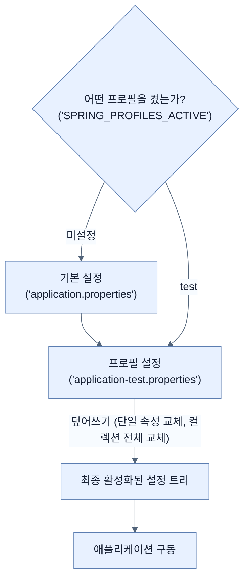

# Creating Profile-Based Property Files

## 한눈에 보기
| 관점 | 핵심 |
|---|---|
| 이 절의 질문 | 소프트웨어는 개발Development, 테스트Test, 스테이징Staging, 운영Production 등 다양한 환경Environment에서 실행되며 각 환경마다 데이터베이스, 포트 번호, 접속 계정 등 설정이 달라야 한다. 스프링 부트는 프로필Profile을 이용해 이러한 환경별 구성을 쉽게 분리하고 관리할 수 있게… |
| 책에서의 역할 | Chapter 6의 앞뒤 예제를 연결하는 학습 단위 |

## 1. 왜 이게 필요한가

소프트웨어는 개발(Development), 테스트(Test), 스테이징(Staging), 운영(Production) 등 다양한 **환경(Environment)**에서 실행되며 각 환경마다 데이터베이스, 포트 번호, 접속 계정 등 설정이 달라야 한다. 스프링 부트는 **프로필(Profile)**을 이용해 이러한 환경별 구성을 쉽게 분리하고 관리할 수 있게 해준다.

### 비유로 잡기
설정을 여러 겹의 투명 필름에 비유하면, 아래의 기본값 위에 환경별 필름을 겹쳐 최종 값을 읽는 셈이다.

→ 비유가 깨지는 지점: 실제 설정은 필름처럼 단순히 마지막 줄만 보는 것이 아니라 소스별 우선순위, 바인딩 규칙, 활성화 조건까지 함께 평가한다.

### 이 절의 언어
**[[spring-profile]]**(= 특정 환경에 맞는 빈 설정이나 프로퍼티 설정을 그룹화하여 활성화/비활성화할 수 있도록 돕는 기능), **[[twelve-factor-app]]**(= 클라우드 네이티브 애플리케이션을 구축하기 위한 12가지 방법론으로, 그중 설정(Config)은 코드에서 분리되어야 한다고 강조한다)

## 2. 어떻게 동작하는가

먼저 다음 세 축으로 메커니즘을 읽는다.

1. **입력과 전제 확인** — 어떤 요청·설정·데이터가 들어오는지 확인한다. 잘못된 전제를 다음 계층으로 넘기지 않기 위해서다.
2. **Spring 추상화 적용** — 스타터와 자동 구성, 어노테이션 또는 명시적 빈이 실제 처리를 연결한다. 반복 배선보다 도메인 선택에 집중하기 위해서다.
3. **결과와 경계 검증** — 응답·저장 상태·운영 신호를 확인한다. 정상 경로만 보고 장애·버전·성능 차이를 놓치지 않기 위해서다.

### 2.1 프로필 기반 설정 파일
별도의 파일 이름 규칙인 `application-{profile}.properties`를 사용하여 특정 환경 전용 속성을 분리할 수 있다. 예를 들어 테스트 환경 전용 설정은 `application-test.properties`로 정의한다.

```properties
app.config.header=Greetings Test Team!
app.config.intro=If you run into issues while testing, let me know!
app.config.users[0].username=test1
...
```
- 위 설정은 기본 `application.properties`와 충돌하는 키가 있을 경우, 덮어쓰기(Override) 역할을 한다.
- 프로필이 활성화되어야만 이 파일의 속성들이 주입된다.

### 2.2 프로필 활성화(Activation) 방법
특정 프로필을 적용하려면 다음과 같은 방법을 사용할 수 있다.

1. **JVM 환경 변수(인수) 추가**: `-Dspring.profiles.active=test`
2. **운영체제 환경 변수 사용**: (Unix/Linux) `export SPRING_PROFILES_ACTIVE=test`
3. **IDE 옵션 사용**: IntelliJ IDEA의 "Active profiles" 항목에 `test` 입력 등

> [!NOTE] 
> 프로필은 **추가(Additive)**된다. `test` 프로필을 켠다고 해서 `application.properties`가 무시되는 것이 아니라, 기본적으로 `application.properties`가 로드된 후 `application-test.properties`가 겹쳐지는 형태이다.

### 2.3 컬렉션 오버라이드 시 주의점
문자열(String) 같은 단일 속성은 동일한 키가 있으면 덮어쓰지만, **리스트(List)나 컬렉션(Collection)은 프로필 간에 병합(Merge)되지 않고 아예 교체**된다.
- 즉, `application.properties`에 5명의 사용자가 선언되어 있고 `application-test.properties`에 3명의 사용자가 선언되어 있다면, 결과는 3명으로 대체된다.

### 2.4 여러 개의 프로필 동시 적용
콤마(,)를 사용해 여러 개의 프로필을 함께 켤 수 있다.
```bash
$ SPRING_PROFILES_ACTIVE=test,alternate ./mvnw spring-boot:run
```
- 왼쪽에서 오른쪽 순서로 적용된다. 뒤에 위치한 `alternate` 프로필 설정이 `test` 프로필의 중복 설정을 덮어쓰게 된다.

### 2.5 외부 구성 및 Twelve-Factor App
운영(Production) 환경에서는 설정 정보(DB 비밀번호 등)를 애플리케이션 `JAR` 패키지 안에 포함하는 것은 보안상, 그리고 관리상 좋지 않다.
- 스프링 부트는 `spring.config.additional-location` 같은 옵션을 제공해 외부의 특정 디렉토리에서 프로퍼티를 추가로 불러오게 할 수 있다.
- 이러한 설정 외부화는 **Twelve-Factor App**의 3원칙(Configuration)에 부합하는 방식으로, 컨테이너나 클라우드 네이티브 아키텍처에 매우 적합하다.

## 3. 그림으로 보기



## 4. 이 노트에 나온 용어
| 용어 | 한 줄 | 자세히 |
|------|-------|--------|
| spring-profile | 특정 환경에 맞는 빈 설정이나 프로퍼티 설정을 그룹화하여 활성화/비활성화할 수 있도록 돕는 기능 | [[_glossary#spring-profile]] |
| twelve-factor-app | 클라우드 네이티브 애플리케이션을 구축하기 위한 12가지 방법론으로, 그중 설정(Config)은 코드에서 분리되어야 한다고 강조한다 | [[_glossary#twelve-factor-app]] |

## 5. 자주 헷갈리는 것
- 이 주제의 **Spring 추상화**와 그 아래에서 실제로 동작하는 라이브러리·프로토콜을 같은 것으로 보지 않는다. 추상화는 기본 배선을 줄이지만 하위 계층의 비용과 실패를 없애지 않는다.

## 6. 언제 안 쓰나 / 경계
- 책의 예제는 개념을 드러내기 위한 작은 애플리케이션이다. 운영 환경에서는 인증 정보, 장애 복구, 관측성, 부하와 데이터 규모를 별도로 검증한다.
- 이 노트의 API와 기본값은 책의 Spring Boot 4.1·Java 25 맥락을 따른다. 다른 마이너 버전에서는 공식 마이그레이션 문서와 실제 의존성 버전을 함께 확인한다.

## 7. 연결
- [[01-creating-custom-properties]] — 같은 장의 학습 흐름에서 Creating Profile-Based Property Files의 전제 또는 다음 적용 단계와 연결된다.
- [[03-switching-to-yaml]] — 같은 장의 학습 흐름에서 Creating Profile-Based Property Files의 전제 또는 다음 적용 단계와 연결된다.

## 8. 스스로 확인
1. 프로필 기반 속성에서 리스트(List) 형태의 값을 덮어쓸 때, 기존 리스트의 요소와 어떻게 결합(Merge)되는가?
2. 클라우드나 컨테이너 환경을 위한 애플리케이션을 만들 때, 왜 프로덕션 환경의 비밀번호를 `application-production.properties`에 하드코딩해서 빌드하면 안 되는가?

<!-- ==== 아래는 내 영역 · 스킬 수정 금지 ==== -->

## 내 설명 시도

## 막혔던 지점

## 리뷰 이력
