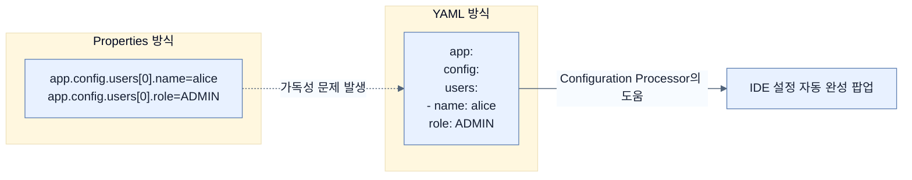

# Switching to YAML

## 한눈에 보기
| 관점 | 핵심 |
|---|---|
| 이 절의 질문 | 키-값Key-Value 형태의 기존 properties 파일은 계층이 깊어지거나 리스트List가 많아지면 중복 타이핑이 심해져 가독성이 떨어진다. YAMLyml 포맷을 사용하면 중복을 줄이고 계층 구조를 직관적으로 표현하여 설정을 더 우아하게 관리할 수 있다. |
| 책에서의 역할 | Chapter 6의 앞뒤 예제를 연결하는 학습 단위 |

## 1. 왜 이게 필요한가

키-값(Key-Value) 형태의 기존 `properties` 파일은 계층이 깊어지거나 리스트(List)가 많아지면 중복 타이핑이 심해져 가독성이 떨어진다. **YAML(yml)** 포맷을 사용하면 중복을 줄이고 계층 구조를 직관적으로 표현하여 설정을 더 우아하게 관리할 수 있다.

### 비유로 잡기
설정을 여러 겹의 투명 필름에 비유하면, 아래의 기본값 위에 환경별 필름을 겹쳐 최종 값을 읽는 셈이다.

→ 비유가 깨지는 지점: 실제 설정은 필름처럼 단순히 마지막 줄만 보는 것이 아니라 소스별 우선순위, 바인딩 규칙, 활성화 조건까지 함께 평가한다.

### 이 절의 언어
**[[yaml]]**(= 'YAML Ain't Markup Language'의 약자로 사람이 읽기 쉽게 만들어진 데이터 직렬화 언어), **[[spring-boot-configuration-processor]]**(= 사용자가 정의한 커스텀 프로퍼티의 메타데이터를 추출해 IDE에서 자동완성이나 유효성 검증을 돕는 애노테이션 프로세서 의존성)

## 2. 어떻게 동작하는가

먼저 다음 세 축으로 메커니즘을 읽는다.

1. **입력과 전제 확인** — 어떤 요청·설정·데이터가 들어오는지 확인한다. 잘못된 전제를 다음 계층으로 넘기지 않기 위해서다.
2. **Spring 추상화 적용** — 스타터와 자동 구성, 어노테이션 또는 명시적 빈이 실제 처리를 연결한다. 반복 배선보다 도메인 선택에 집중하기 위해서다.
3. **결과와 경계 검증** — 응답·저장 상태·운영 신호를 확인한다. 정상 경로만 보고 장애·버전·성능 차이를 놓치지 않기 위해서다.

### 2.1 YAML 포맷의 장점
계층이 깊은 속성을 정의할 때 `properties` 방식과 `yaml` 방식을 비교하면 YAML이 훨씬 간결하다.

**Properties 방식의 문제점 (중복 발생)**:
```properties
app.config.header=Greetings!
app.config.intro=Check out this page!
app.config.users[0].username=yaml1
app.config.users[0].password=password
app.config.users[0].authorities[0]=ROLE_USER
```

**YAML 방식으로 전환**:
```yaml
app:
  config:
    header: Greetings from YAML-based settings!
    intro: Check out this page hosted from YAML
    users:
      - username: yaml1
        password: password
        authorities:
          - ROLE_USER
      - username: yaml2
        password: password
        authorities:
          - ROLE_ADMIN
```
- **계층 구조화**: 하위 속성은 들여쓰기(Indentation)를 통해 관리되므로 `app.config`라는 접두어 반복을 없앨 수 있다.
- **배열(Array) 표현**: `[0]`, `[1]` 같은 인덱스 숫자 대신 대시(`-`)를 통해 직관적으로 아이템 목록을 표현할 수 있다.

### 2.2 YAML 작성 시 주의사항
> [!WARNING]
> YAML은 설정 파일이 커질 경우, 들여쓰기(스페이스)의 뎁스(Depth)로 구조를 판단하기 때문에 눈으로 오류를 찾기 매우 까다로울 수 있다. 탭(Tab) 사용이 금지되어 있으며 오직 스페이스바로 들여쓰기를 맞춰야 한다.

### 2.3 IDE의 자동완성 지원
스프링 부트는 개발자가 정의한 커스텀 프로퍼티(`@ConfigurationProperties` 레코드 등)에 대해서도 인텔리제이(IntelliJ) 같은 IDE에서 자동완성 기능을 제공한다.
이를 위해서는 프로젝트에 **Configuration Processor**가 추가되어 있어야 한다.

`pom.xml`에 추가 (보통 Spring Initializr에서 선택 시 자동 삽입됨):
```xml
<dependency>
    <groupId>org.springframework.boot</groupId>
    <artifactId>spring-boot-configuration-processor</artifactId>
    <optional>true</optional>
</dependency>
```
이 의존성을 추가하면 빌드 시 설정 메타데이터가 생성되어, 개발 중 오타를 방지하고 편하게 프로퍼티를 찾을 수 있다.

## 3. 그림으로 보기



## 4. 이 노트에 나온 용어
| 용어 | 한 줄 | 자세히 |
|------|-------|--------|
| yaml | 'YAML Ain't Markup Language'의 약자로 사람이 읽기 쉽게 만들어진 데이터 직렬화 언어 | [[_glossary#yaml]] |
| spring-boot-configuration-processor | 사용자가 정의한 커스텀 프로퍼티의 메타데이터를 추출해 IDE에서 자동완성이나 유효성 검증을 돕는 애노테이션 프로세서 의존성 | [[_glossary#spring-boot-configuration-processor]] |

## 5. 자주 헷갈리는 것
- 이 주제의 **Spring 추상화**와 그 아래에서 실제로 동작하는 라이브러리·프로토콜을 같은 것으로 보지 않는다. 추상화는 기본 배선을 줄이지만 하위 계층의 비용과 실패를 없애지 않는다.

## 6. 언제 안 쓰나 / 경계
- 책의 예제는 개념을 드러내기 위한 작은 애플리케이션이다. 운영 환경에서는 인증 정보, 장애 복구, 관측성, 부하와 데이터 규모를 별도로 검증한다.
- 이 노트의 API와 기본값은 책의 Spring Boot 4.1·Java 25 맥락을 따른다. 다른 마이너 버전에서는 공식 마이그레이션 문서와 실제 의존성 버전을 함께 확인한다.

## 7. 연결
- [[02-creating-profile-based-property-files]] — 같은 장의 학습 흐름에서 Switching to YAML의 전제 또는 다음 적용 단계와 연결된다.
- [[04-setting-properties-with-environment-variables]] — 같은 장의 학습 흐름에서 Switching to YAML의 전제 또는 다음 적용 단계와 연결된다.

## 8. 스스로 확인
1. 속성 파일이 매우 방대해질 때 YAML이 오히려 Properties 포맷보다 유지보수가 어려울 수 있는 원인은 무엇인가?
2. 직접 만든 `@ConfigurationProperties` 객체가 IDE에서 자동 완성(Code Completion)이 되게 하려면 어떤 의존성을 추가해야 하는가?

<!-- ==== 아래는 내 영역 · 스킬 수정 금지 ==== -->

## 내 설명 시도

## 막혔던 지점

## 리뷰 이력
