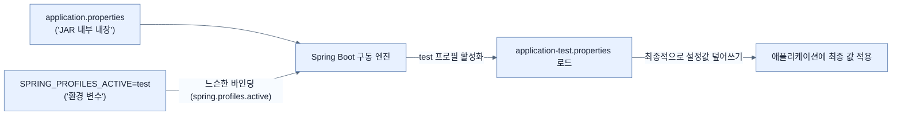

# Setting Properties with Environment Variables

## 한눈에 보기
| 관점 | 핵심 |
|---|---|
| 이 절의 질문 | 빌드되어 패키징된 애플리케이션JAR을 수정하지 않고도 운영 환경이나 CI/CD 파이프라인에서 커맨드 라인을 통해 설정을 손쉽게 주입하고 오버라이드Override할 수 있다. 환경 변수Environment Variables를 사용하면 소스 코드 변경 없이 유연한 구성 변경이 가능하다. |
| 책에서의 역할 | Chapter 6의 앞뒤 예제를 연결하는 학습 단위 |

## 1. 왜 이게 필요한가

빌드되어 패키징된 애플리케이션(`JAR`)을 수정하지 않고도 운영 환경이나 CI/CD 파이프라인에서 커맨드 라인을 통해 설정을 손쉽게 주입하고 오버라이드(Override)할 수 있다. **환경 변수(Environment Variables)**를 사용하면 소스 코드 변경 없이 유연한 구성 변경이 가능하다.

### 비유로 잡기
설정을 여러 겹의 투명 필름에 비유하면, 아래의 기본값 위에 환경별 필름을 겹쳐 최종 값을 읽는 셈이다.

→ 비유가 깨지는 지점: 실제 설정은 필름처럼 단순히 마지막 줄만 보는 것이 아니라 소스별 우선순위, 바인딩 규칙, 활성화 조건까지 함께 평가한다.

### 이 절의 언어
**[[relaxed-binding]]**(= SPRING_PROFILES_ACTIVE와 같은 대문자 및 언더스코어 환경변수명을 spring.profiles.active 같은 자바 프로퍼티 명으로 유연하게 매핑해주는 스프링 부트의 기능)

## 2. 어떻게 동작하는가

먼저 다음 세 축으로 메커니즘을 읽는다.

1. **입력과 전제 확인** — 어떤 요청·설정·데이터가 들어오는지 확인한다. 잘못된 전제를 다음 계층으로 넘기지 않기 위해서다.
2. **Spring 추상화 적용** — 스타터와 자동 구성, 어노테이션 또는 명시적 빈이 실제 처리를 연결한다. 반복 배선보다 도메인 선택에 집중하기 위해서다.
3. **결과와 경계 검증** — 응답·저장 상태·운영 신호를 확인한다. 정상 경로만 보고 장애·버전·성능 차이를 놓치지 않기 위해서다.

### 2.1 커맨드 라인에서 환경 변수로 오버라이드
스프링 부트 애플리케이션을 시작할 때 임시로 쉘(Shell) 명령줄에서 변수를 던져주어 설정을 덮어쓸 수 있다.

```bash
$ SPRING_PROFILES_ACTIVE=alternate ./mvnw spring-boot:run
```
- **느슨한 바인딩(Relaxed Binding)**: 리눅스/유닉스 환경 변수에서는 `.`(점)을 이름에 쓸 수 없는 경우가 많다. 따라서 스프링 부트는 대문자와 언더스코어(`_`)로 조합된 환경 변수를 알아서 변환하여 바인딩한다. `SPRING_PROFILES_ACTIVE`는 내부적으로 `spring.profiles.active` 속성으로 매핑된다.
- 이 방식은 현재 실행하는 1회성 명령어에만 한정하여 적용된다.

### 2.2 운영체제 전체에 영구 적용(Export)
특정 쉘 세션 동안 계속 해당 변수를 적용하려면 `export`를 사용한다.

```bash
$ export SPRING_PROFILES_ACTIVE=test
```

### 2.3 다중 프로필 적용과 우선순위 체계
앞서 배웠듯 여러 개의 프로필을 동시에 켤 수 있다.
```bash
$ SPRING_PROFILES_ACTIVE=test,alternate ./mvnw spring-boot:run
```
- **적용 순서**: 프로필 목록은 왼쪽에서 오른쪽 순으로 차례대로 로드되며, 나중에 로드된 파일(오른쪽)의 내용이 기존 내용을 덮어쓴다. 위 예시에서는 `alternate` 프로필의 설정이 최종적으로 가장 강하게 적용된다.

> [!WARNING]
> 과거에는 속성을 바꾸기 위해 이미 빌드된 `.jar` 파일을 풀어서 설정 파일을 수정한 뒤 다시 묶어서 배포하는 방식(Hack)을 쓰기도 했다. 현대의 파이프라인과 보안 환경에서는 절대 해서는 안 될 위험한 안티 패턴이며, 스프링 부트는 환경 변수를 통해 이런 문제를 완전히 제거했다.

## 3. 그림으로 보기



## 4. 이 노트에 나온 용어
| 용어 | 한 줄 | 자세히 |
|------|-------|--------|
| relaxed-binding | `SPRING_PROFILES_ACTIVE`와 같은 대문자 및 언더스코어 환경변수명을 `spring.profiles.active` 같은 자바 프로퍼티 명으로 유연하게 매핑해주는 스프링 부트의 기능 | [[_glossary#relaxed-binding]] |

## 5. 자주 헷갈리는 것
- 이 주제의 **Spring 추상화**와 그 아래에서 실제로 동작하는 라이브러리·프로토콜을 같은 것으로 보지 않는다. 추상화는 기본 배선을 줄이지만 하위 계층의 비용과 실패를 없애지 않는다.

## 6. 언제 안 쓰나 / 경계
- 책의 예제는 개념을 드러내기 위한 작은 애플리케이션이다. 운영 환경에서는 인증 정보, 장애 복구, 관측성, 부하와 데이터 규모를 별도로 검증한다.
- 이 노트의 API와 기본값은 책의 Spring Boot 4.1·Java 25 맥락을 따른다. 다른 마이너 버전에서는 공식 마이그레이션 문서와 실제 의존성 버전을 함께 확인한다.

## 7. 연결
- [[03-switching-to-yaml]] — 같은 장의 학습 흐름에서 Setting Properties with Environment Variables의 전제 또는 다음 적용 단계와 연결된다.
- [[05-ordering-property-overrides]] — 같은 장의 학습 흐름에서 Setting Properties with Environment Variables의 전제 또는 다음 적용 단계와 연결된다.

## 8. 스스로 확인
1. 유닉스 환경에서 `spring.datasource.password`라는 속성을 커맨드 라인 환경 변수로 주입하려면, 어떤 이름 규칙을 사용하여 정의해야 하는가?
2. 이미 패키징된 `jar` 파일의 내부 프로퍼티를 변경해야 할 경우, 압축을 풀어 수정하고 재포장하는 방식이 안 좋은 이유는 무엇인가?

<!-- ==== 아래는 내 영역 · 스킬 수정 금지 ==== -->

## 내 설명 시도

## 막혔던 지점

## 리뷰 이력
