# Ordering Property Overrides

## 한눈에 보기
| 관점 | 핵심 |
|---|---|
| 이 절의 질문 | 스프링 부트는 수많은 외부 구성Configuration 소스들을 읽어 들이며, 동일한 속성이 여러 소스에 존재할 경우 우선순위가 높은 설정이 이전 설정을 덮어쓰게 된다Override. 이 거대한 우선순위 목록을 이해하는 것은 의도치 않은 설정 충돌을 방지하는 핵심이다. |
| 책에서의 역할 | Chapter 6의 앞뒤 예제를 연결하는 학습 단위 |

## 1. 왜 이게 필요한가

스프링 부트는 수많은 외부 구성(Configuration) 소스들을 읽어 들이며, **동일한 속성이 여러 소스에 존재할 경우 우선순위가 높은 설정이 이전 설정을 덮어쓰게 된다(Override)**. 이 거대한 우선순위 목록을 이해하는 것은 의도치 않은 설정 충돌을 방지하는 핵심이다.

### 비유로 잡기
설정을 여러 겹의 투명 필름에 비유하면, 아래의 기본값 위에 환경별 필름을 겹쳐 최종 값을 읽는 셈이다.

→ 비유가 깨지는 지점: 실제 설정은 필름처럼 단순히 마지막 줄만 보는 것이 아니라 소스별 우선순위, 바인딩 규칙, 활성화 조건까지 함께 평가한다.

### 이 절의 언어
**[[property-override]]**(= 늦게 로드되거나 우선순위가 높은 구성 소스(Configuration Source)가 기존에 세팅된 값을 교체(덮어쓰기)하는 동작)

## 2. 어떻게 동작하는가

먼저 다음 세 축으로 메커니즘을 읽는다.

1. **입력과 전제 확인** — 어떤 요청·설정·데이터가 들어오는지 확인한다. 잘못된 전제를 다음 계층으로 넘기지 않기 위해서다.
2. **Spring 추상화 적용** — 스타터와 자동 구성, 어노테이션 또는 명시적 빈이 실제 처리를 연결한다. 반복 배선보다 도메인 선택에 집중하기 위해서다.
3. **결과와 경계 검증** — 응답·저장 상태·운영 신호를 확인한다. 정상 경로만 보고 장애·버전·성능 차이를 놓치지 않기 위해서다.

### 2.1 전체 설정 적용 순서 (낮은 우선순위 ➞ 높은 우선순위)
아래의 리스트는 아래로 갈수록 우선순위가 높아져 이전 값을 덮어쓴다.

1. `SpringApplication.setDefaultProperties()`로 설정한 기본 속성
2. `@PropertySource` 애노테이션이 붙은 `@Configuration` 클래스
3. **설정 데이터 파일 (예: `application.properties`, `application.yaml`)**
4. `random.*` 속성만 갖는 `RandomValuePropertySource`
5. **OS 환경 변수 (Environment Variables)**
6. **자바 시스템 프로퍼티 (`System.getProperties()`)**
7. JNDI 속성 (`java:comp/env`)
8. `ServletContext` 초기화 파라미터
9. `ServletConfig` 초기화 파라미터
10. `SPRING_APPLICATION_JSON` 인라인 JSON 데이터
11. **커맨드 라인 인자 (Command-line arguments)**
12. 테스트의 `properties` 속성 (`@SpringBootTest` 등)
13. 테스트의 `@DynamicPropertySource`
14. 테스트의 `@TestPropertySource`
15. DevTools 글로벌 설정 (`$HOME/.config/spring-boot`)

> [!NOTE] 
> 코드나 내장된(jar 내부) `application.properties`는 비교적 낮은 우선순위를 가지며, 런타임에 외부에서 주입하는 **OS 환경 변수**, **커맨드 라인 인자** 등이 강력한 우선순위를 가져 덮어쓰게 된다.

### 2.2 설정 파일(Config Data Files) 내부의 적용 순서
위 3번에 해당하는 설정 파일(Properties/YAML) 내에서도 디렉토리 위치와 프로필 적용 여부에 따라 우선순위가 나뉜다. (마찬가지로 아래로 갈수록 높다)

1. `JAR` 파일 내부에 패키징된 `application.properties` (가장 기본)
2. `JAR` 파일 내부에 패키징된 `application-{profile}.properties` (특정 프로필)
3. **`JAR` 파일 외부에 위치한** `application.properties`
4. **`JAR` 파일 외부에 위치한** `application-{profile}.properties`

이러한 특성 덕분에 배포된 `JAR` 파일을 건드리지 않고, **JAR 파일과 같은 폴더 위치에 `application.properties`를 만들어 두기만 해도 설정을 강력하게 덮어쓸 수 있다.**

## 3. 그림으로 보기

```mermaid
%%{init: {"theme": "base", "themeVariables": {"background": "#ffffff", "primaryColor": "#e8f1ff", "primaryTextColor": "#172033", "primaryBorderColor": "#5b7db1", "lineColor": "#52647a", "secondaryColor": "#f7fbff", "tertiaryColor": "#fff7df"}}}%%
flowchart TD
    subgraph subgraph_id ["가장 낮은 우선순위 (코드 내부/기본값)"]
        A["기본 Properties (코드에 하드코딩)"]
        B["JAR 내부의 application.properties"]
    end
    
    subgraph subgraph_id ["중간 우선순위 (환경별/외부 파일)"]
        C["JAR 외부의 application.properties"]
        D["OS 환경 변수 (export SPRING_...)"]
    end
    
    subgraph subgraph_id ["가장 높은 우선순위 (실행 시 주입/테스트)"]
        E["커맨드 라인 인자 (--server.port=8080)"]
        F["테스트 환경 (@TestPropertySource)"]
    end
    
    A -->|덮어쓰기| B
    B -->|덮어쓰기| C
    C -->|덮어쓰기| D
    D -->|덮어쓰기| E
    E -->|덮어쓰기| F
```

## 4. 이 노트에 나온 용어
| 용어 | 한 줄 | 자세히 |
|------|-------|--------|
| property-override | 늦게 로드되거나 우선순위가 높은 구성 소스(Configuration Source)가 기존에 세팅된 값을 교체(덮어쓰기)하는 동작 | [[_glossary#property-override]] |

## 5. 자주 헷갈리는 것
- 이 주제의 **Spring 추상화**와 그 아래에서 실제로 동작하는 라이브러리·프로토콜을 같은 것으로 보지 않는다. 추상화는 기본 배선을 줄이지만 하위 계층의 비용과 실패를 없애지 않는다.

## 6. 언제 안 쓰나 / 경계
- 책의 예제는 개념을 드러내기 위한 작은 애플리케이션이다. 운영 환경에서는 인증 정보, 장애 복구, 관측성, 부하와 데이터 규모를 별도로 검증한다.
- 이 노트의 API와 기본값은 책의 Spring Boot 4.1·Java 25 맥락을 따른다. 다른 마이너 버전에서는 공식 마이그레이션 문서와 실제 의존성 버전을 함께 확인한다.

## 7. 연결
- [[04-setting-properties-with-environment-variables]] — 같은 장의 학습 흐름에서 Ordering Property Overrides의 전제 또는 다음 적용 단계와 연결된다.
- [[03-switching-to-yaml]] — 같은 장의 학습 흐름에서 Ordering Property Overrides의 전제 또는 다음 적용 단계와 연결된다.

## 8. 스스로 확인
1. 패키징된 스프링 부트 애플리케이션에 `application.properties`가 포함되어 있을 때, JAR 파일이 위치한 디렉토리에 같은 이름의 `application.properties`를 만들어 두면 어떤 파일의 설정이 최종 적용되는가?
2. 커맨드 라인 인자(`--server.port=9000`)와 OS 환경변수(`SERVER_PORT=8000`)를 동시에 넘겨주며 애플리케이션을 실행했을 때, 서버는 몇 번 포트로 구동되는가? 그 이유는?

<!-- ==== 아래는 내 영역 · 스킬 수정 금지 ==== -->

## 내 설명 시도

## 막혔던 지점

## 리뷰 이력
