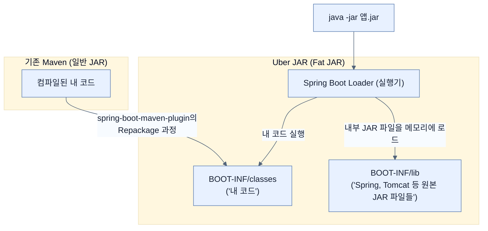

# Creating an Uber JAR

## 한눈에 보기
| 관점 | 핵심 |
|---|---|
| 이 절의 질문 | 스프링 부트가 가져온 가장 큰 혁신 중 하나는 외부 톰캣Tomcat 서버에 의존할 필요 없이, 애플리케이션 코드와 내장 서버Embedded Server, 모든 서드파티 라이브러리를 단 하나의 실행 가능한 파일로 묶는 Uber JAR 또는 Fat JAR 방식이다. 이를 통해 java -jar 명령어 하나만으로 어디서든 애… |
| 책에서의 역할 | Chapter 7의 앞뒤 예제를 연결하는 학습 단위 |

## 1. 왜 이게 필요한가

스프링 부트가 가져온 가장 큰 혁신 중 하나는 외부 톰캣(Tomcat) 서버에 의존할 필요 없이, 애플리케이션 코드와 내장 서버(Embedded Server), 모든 서드파티 라이브러리를 단 하나의 실행 가능한 파일로 묶는 **Uber JAR (또는 Fat JAR)** 방식이다. 이를 통해 `java -jar` 명령어 하나만으로 어디서든 애플리케이션을 구동할 수 있다.

### 비유로 잡기
배포 산출물은 제품을 포장해 운송하는 과정과 닮았다. 코드와 런타임을 어디까지 한 상자에 넣느냐에 따라 재현성과 크기가 달라진다.

→ 비유가 깨지는 지점: 소프트웨어 포장은 상자를 만들고 끝나지 않는다. 대상 CPU·OS, 보안 패치, 시작 시간, 런타임 진단 가능성까지 선택에 포함된다.

### 이 절의 언어
**[[uber-jar]]**(= 실행에 필요한 모든 의존성(톰캣 등)을 포함하여 단독 실행 가능한 거대한 JAR 파일 (Fat JAR라고도 함)), **[[shaded-jar]]**(= 기존 서드파티 JAR들의 압축을 풀어 하나로 합치는 방식의 패키징 방법)

## 2. 어떻게 동작하는가

먼저 다음 세 축으로 메커니즘을 읽는다.

1. **입력과 전제 확인** — 어떤 요청·설정·데이터가 들어오는지 확인한다. 잘못된 전제를 다음 계층으로 넘기지 않기 위해서다.
2. **Spring 추상화 적용** — 스타터와 자동 구성, 어노테이션 또는 명시적 빈이 실제 처리를 연결한다. 반복 배선보다 도메인 선택에 집중하기 위해서다.
3. **결과와 경계 검증** — 응답·저장 상태·운영 신호를 확인한다. 정상 경로만 보고 장애·버전·성능 차이를 놓치지 않기 위해서다.

### 2.1 Uber JAR 패키징 명령어
터미널에서 Maven 명령어를 통해 패키징을 수행한다.
```bash
$ ./mvnw clean package
```
- `clean`: 이전 빌드 결과물(target 폴더)을 삭제하여 깨끗한 상태에서 빌드한다.
- `package`: Maven의 빌드 라이프사이클을 실행하며 코드를 컴파일하고 테스트한 후 최종적으로 `.jar` 파일을 생성한다.

### 2.2 Spring Boot Maven Plugin의 역할
단순한 Maven 패키징을 넘어 실행 가능한 형태로 묶어주는 것은 `spring-boot-maven-plugin`의 역할이다. (Spring Initializr 사용 시 기본 포함됨)

동작 과정은 다음과 같다:
1. 기본 Maven `package`가 생성한 일반 `.jar` 파일을 가로채어 그 내용을 푼다.
2. 원본 `.jar` 파일은 `.jar.original` 이라는 이름으로 백업해둔다.
3. 원본과 동일한 이름으로 **새로운 JAR 파일**을 만든다.
4. 새로운 JAR에 스스로 실행되기 위한 **Spring Boot Loader** 코드를 삽입한다.
5. 개발자가 작성한 애플리케이션 코드를 `BOOT-INF/classes` 폴더에 넣는다.
6. 애플리케이션이 의존하는 모든 서드파티 라이브러리(Spring, 톰캣 등)를 `BOOT-INF/lib` 폴더에 넣는다.
7. 클래스패스 정보와 레이어 정보(Docker 캐싱을 위한 `classpath.idx`, `layers.idx`)를 메타데이터로 추가한다.

### 2.3 실행 방법
생성된 JAR 파일은 내부에 톰캣(Tomcat 11)을 포함하고 있으므로, JRE/JDK만 있다면 즉시 실행 가능하다.
```bash
$ java -jar target/ch7-0.0.1-SNAPSHOT.jar
```

### 2.4 기존 방식(Shade Plugin)과의 차별점
기존에도 Maven Shade 플러그인 등을 통해 여러 라이브러리의 압축을 풀어 하나의 거대한 코드로 합치는(Shaded JAR) 방식이 존재했다.
하지만 서드파티 라이브러리의 클래스 파일을 임의로 풀어서 섞게 되면 **라이선스 문제, 예기치 않은 버그, 파일 경로 충돌** 등이 발생할 수 있다.
스프링 부트의 방식은 서드파티 라이브러리를 "압축 풀지 않은 원본 상태 그대로" `BOOT-INF/lib` 안에 중첩된(Nested) 형태로 관리하며, 자체적인 클래스로더(Spring Boot Loader)가 이를 읽어 실행하므로 훨씬 안전하고 깔끔하다.

## 3. 그림으로 보기



## 4. 이 노트에 나온 용어
| 용어 | 한 줄 | 자세히 |
|------|-------|--------|
| uber-jar | 실행에 필요한 모든 의존성(톰캣 등)을 포함하여 단독 실행 가능한 거대한 JAR 파일 (Fat JAR라고도 함) | [[_glossary#uber-jar]] |
| shaded-jar | 기존 서드파티 JAR들의 압축을 풀어 하나로 합치는 방식의 패키징 방법 | [[_glossary#shaded-jar]] |

## 5. 자주 헷갈리는 것
- 이 주제의 **Spring 추상화**와 그 아래에서 실제로 동작하는 라이브러리·프로토콜을 같은 것으로 보지 않는다. 추상화는 기본 배선을 줄이지만 하위 계층의 비용과 실패를 없애지 않는다.

## 6. 언제 안 쓰나 / 경계
- 책의 예제는 개념을 드러내기 위한 작은 애플리케이션이다. 운영 환경에서는 인증 정보, 장애 복구, 관측성, 부하와 데이터 규모를 별도로 검증한다.
- 이 노트의 API와 기본값은 책의 Spring Boot 4.1·Java 25 맥락을 따른다. 다른 마이너 버전에서는 공식 마이그레이션 문서와 실제 의존성 버전을 함께 확인한다.

## 7. 연결
- [[02-baking-a-docker-container]] — 같은 장의 학습 흐름에서 Creating an Uber JAR의 전제 또는 다음 적용 단계와 연결된다.
- [[03-releasing-application-to-docker-hub]] — 같은 장의 학습 흐름에서 Creating an Uber JAR의 전제 또는 다음 적용 단계와 연결된다.

## 8. 스스로 확인
1. Spring Boot Maven 플러그인이 생성한 Uber JAR 파일 내부에서, 우리가 작성한 코드는 어떤 폴더 경로에 저장되는가?
2. Maven Shade 플러그인을 사용하여 라이브러리의 압축을 풀어 하나로 섞는 방식과 비교했을 때, Spring Boot가 사용하는 중첩된 JAR 구조의 장점은 무엇인가?

<!-- ==== 아래는 내 영역 · 스킬 수정 금지 ==== -->

## 내 설명 시도

## 막혔던 지점

## 리뷰 이력
