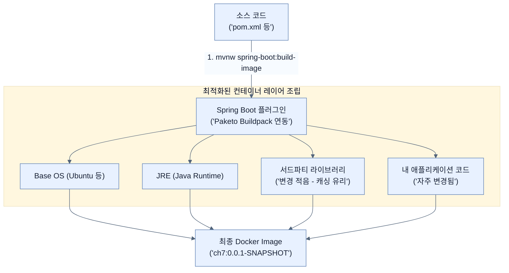

# Baking a Docker Container

## 한눈에 보기
| 관점 | 핵심 |
|---|---|
| 이 절의 질문 | Uber JAR는 실행을 위해 타겟 서버에 JDK가 설치되어 있어야 한다는 제약이 있다. 이를 극복하고 어떠한 환경에서도 일관되게 실행할 수 있도록 애플리케이션을 Docker 컨테이너 이미지Container Image로 패키징할 수 있다. 스프링 부트는 별도의 Dockerfile을 작성하지 않고도 최적화된 이미지를 생성… |
| 책에서의 역할 | Chapter 7의 앞뒤 예제를 연결하는 학습 단위 |

## 1. 왜 이게 필요한가

Uber JAR는 실행을 위해 타겟 서버에 JDK가 설치되어 있어야 한다는 제약이 있다. 이를 극복하고 어떠한 환경에서도 일관되게 실행할 수 있도록 애플리케이션을 **Docker 컨테이너 이미지(Container Image)**로 패키징할 수 있다. 스프링 부트는 별도의 `Dockerfile`을 작성하지 않고도 최적화된 이미지를 생성하는 기능을 내장하고 있다.

### 비유로 잡기
AI 애플리케이션을 사서와 대화하는 과정에 비유하면, 모델은 답을 만들고 검색기는 관련 책을 찾으며 도구는 실제 업무를 수행한다.

→ 비유가 깨지는 지점: 사서는 출처와 권한을 스스로 보장하지만 모델은 그럴 수 없다. 검색 결과와 도구 인자는 반드시 애플리케이션이 검증해야 한다.

### 이 절의 언어
**[[paketo-buildpacks]]**(= 개발자가 Dockerfile을 작성하지 않아도 소스 코드를 분석하여 최적화된 컨테이너 이미지를 생성해주는 오픈소스 프로젝트)

## 2. 어떻게 동작하는가

먼저 다음 세 축으로 메커니즘을 읽는다.

1. **입력과 전제 확인** — 어떤 요청·설정·데이터가 들어오는지 확인한다. 잘못된 전제를 다음 계층으로 넘기지 않기 위해서다.
2. **Spring 추상화 적용** — 스타터와 자동 구성, 어노테이션 또는 명시적 빈이 실제 처리를 연결한다. 반복 배선보다 도메인 선택에 집중하기 위해서다.
3. **결과와 경계 검증** — 응답·저장 상태·운영 신호를 확인한다. 정상 경로만 보고 장애·버전·성능 차이를 놓치지 않기 위해서다.

### 2.1 스프링 부트로 도커 이미지 굽기 (Baking)
개발용 PC나 CI/CD 파이프라인에 Docker 엔진이 설치되어 있다면, 단 한 줄의 명령어로 컨테이너 이미지를 생성할 수 있다.

```bash
$ ./mvnw spring-boot:build-image
```
- 내부적으로 Maven의 `package` 페이즈(테스트 수행 및 Uber JAR 생성)를 먼저 거친 뒤, 컨테이너 이미지를 조립한다.

### 2.2 클라우드 네이티브 빌드팩 (Paketo Buildpacks)
과거에는 개발자가 직접 `Dockerfile`을 작성하고 베이스 이미지를 선택해야 했지만, 스프링 부트는 **클라우드 네이티브 빌드팩 (Cloud Native Buildpacks)** 기술을 통해 이 과정을 자동화한다.
- 위 명령어를 실행하면 스프링 부트는 기본적으로 **Paketo Buildpacks** 엔진을 호출한다.
- Paketo는 코드가 '자바 애플리케이션'임을 자동 감지하고, 알맞은 JDK와 베이스 OS를 가져와 보안과 성능이 최적화된 이미지를 생성한다.

### 2.3 효율적인 도커 레이어링 (Layering)
도커 컨테이너는 변경 사항을 효율적으로 관리하기 위해 **레이어(Layer) 기반 캐싱**을 사용한다.
스프링 부트는 코드를 하나의 덩어리로 묶지 않고, 변경 빈도에 따라 영리하게 레이어를 분리(Layered JAR)하여 빌드팩에 전달한다.

- **안 바뀌는 레이어**: Spring Framework, 라이브러리, Tomcat 등 서드파티 의존성 
- **자주 바뀌는 레이어**: 개발자가 작성한 커스텀 애플리케이션 코드

이렇게 분리하면, 개발자가 코드 한 줄을 수정하고 다시 이미지를 구울 때 서드파티 라이브러리를 처음부터 다시 복사하지 않아도 되어 빌드와 배포 속도가 극적으로 단축된다.

### 2.4 컨테이너 실행하기
빌드가 완료된 이미지는 Docker CLI로 즉시 실행할 수 있다.

```bash
$ docker run -p 8080:8080 docker.io/library/ch7:0.0.1-SNAPSHOT

# 실행 중인 컨테이너 목록 확인
$ docker ps

# 컨테이너 종료 (ps로 확인한 이름 사용)
$ docker stop angry_cray
```

## 3. 그림으로 보기



## 4. 이 노트에 나온 용어
| 용어 | 한 줄 | 자세히 |
|------|-------|--------|
| paketo-buildpacks | 개발자가 Dockerfile을 작성하지 않아도 소스 코드를 분석하여 최적화된 컨테이너 이미지를 생성해주는 오픈소스 프로젝트 | [[_glossary#paketo-buildpacks]] |

## 5. 자주 헷갈리는 것
- 이 주제의 **Spring 추상화**와 그 아래에서 실제로 동작하는 라이브러리·프로토콜을 같은 것으로 보지 않는다. 추상화는 기본 배선을 줄이지만 하위 계층의 비용과 실패를 없애지 않는다.

## 6. 언제 안 쓰나 / 경계
- 책의 예제는 개념을 드러내기 위한 작은 애플리케이션이다. 운영 환경에서는 인증 정보, 장애 복구, 관측성, 부하와 데이터 규모를 별도로 검증한다.
- 이 노트의 API와 기본값은 책의 Spring Boot 4.1·Java 25 맥락을 따른다. 다른 마이너 버전에서는 공식 마이그레이션 문서와 실제 의존성 버전을 함께 확인한다.

## 7. 연결
- [[01-creating-an-uber-jar]] — 같은 장의 학습 흐름에서 Baking a Docker Container의 전제 또는 다음 적용 단계와 연결된다.
- [[03-releasing-application-to-docker-hub]] — 같은 장의 학습 흐름에서 Baking a Docker Container의 전제 또는 다음 적용 단계와 연결된다.

## 8. 스스로 확인
1. 개발자가 애플리케이션 소스 코드 일부를 수정한 뒤 `spring-boot:build-image`를 다시 실행했을 때, 빌드 속도가 빠른 이유는 무엇인가?
2. `Dockerfile`을 직접 작성하지 않아도 스프링 부트가 안전하고 최적화된 도커 이미지를 생성할 수 있도록 백그라운드에서 돕는 엔진의 이름은 무엇인가?

<!-- ==== 아래는 내 영역 · 스킬 수정 금지 ==== -->

## 내 설명 시도

## 막혔던 지점

## 리뷰 이력
