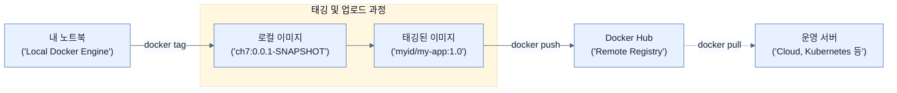

# Releasing Application to Docker Hub

## 한눈에 보기
| 관점 | 핵심 |
|---|---|
| 이 절의 질문 | 로컬에서 생성한 도커 이미지를 운영 서버나 다른 개발자가 가져다 쓸 수 있게 하려면, 이미지를 중앙 저장소Registry에 업로드Push해야 한다. 가장 대중적인 퍼블릭 레지스트리인 Docker Hub에 애플리케이션 이미지를 릴리스하는 과정을 알아본다. |
| 책에서의 역할 | Chapter 7의 앞뒤 예제를 연결하는 학습 단위 |

## 1. 왜 이게 필요한가

로컬에서 생성한 도커 이미지를 운영 서버나 다른 개발자가 가져다 쓸 수 있게 하려면, 이미지를 중앙 저장소(Registry)에 업로드(Push)해야 한다. 가장 대중적인 퍼블릭 레지스트리인 **Docker Hub**에 애플리케이션 이미지를 릴리스하는 과정을 알아본다.

### 비유로 잡기
배포 산출물은 제품을 포장해 운송하는 과정과 닮았다. 코드와 런타임을 어디까지 한 상자에 넣느냐에 따라 재현성과 크기가 달라진다.

→ 비유가 깨지는 지점: 소프트웨어 포장은 상자를 만들고 끝나지 않는다. 대상 CPU·OS, 보안 패치, 시작 시간, 런타임 진단 가능성까지 선택에 포함된다.

### 이 절의 언어
**[[docker-tag]]**(= 로컬 이미지를 특정 레지스트리 저장소 주소와 버전에 맞게 복제하여 이름을 짓는 과정)

## 2. 어떻게 동작하는가

먼저 다음 세 축으로 메커니즘을 읽는다.

1. **입력과 전제 확인** — 어떤 요청·설정·데이터가 들어오는지 확인한다. 잘못된 전제를 다음 계층으로 넘기지 않기 위해서다.
2. **Spring 추상화 적용** — 스타터와 자동 구성, 어노테이션 또는 명시적 빈이 실제 처리를 연결한다. 반복 배선보다 도메인 선택에 집중하기 위해서다.
3. **결과와 경계 검증** — 응답·저장 상태·운영 신호를 확인한다. 정상 경로만 보고 장애·버전·성능 차이를 놓치지 않기 위해서다.

### 2.1 도커 허브 로그인
터미널에서 Docker Hub 계정으로 로그인한다.
```bash
$ docker login -u <your_id>
Password: *********
```

### 2.2 이미지 태깅 (Tagging)
로컬에 구워진 이미지(예: `ch7:0.0.1-SNAPSHOT`)를 원격 레지스트리로 보내려면, 레지스트리가 요구하는 네이밍 규칙에 맞게 이름과 태그를 새로 부여해야 한다. 이를 **태깅(Tagging)**이라고 한다.

```bash
$ docker tag ch7:0.0.1-SNAPSHOT <your_id>/learning-spring-boot-4th-edition-ch7:0.0.1-SNAPSHOT
```
- **`<your_id>/` (Namespace)**: 도커 허브는 수많은 사용자가 이용하므로, 반드시 본인의 계정명(네임스페이스)을 접두어로 붙여야 한다.
- **`learning-spring-boot-4th-edition-ch7` (Repository Name)**: 저장소의 이름. 꼭 로컬 이미지 이름과 같을 필요는 없으며 더 직관적으로 변경할 수 있다.
- **`:0.0.1-SNAPSHOT` (Tag)**: 버전 정보. 관례적으로 `latest` 태그를 쓰기도 하지만, 스냅샷 버전이나 고유 버전을 명시하여 어떤 빌드인지 명확히 할 수 있다.

> [!NOTE]
> `latest` 태그는 단순히 "최근에 푸시된 것"을 의미하는 관례일 뿐, 자동으로 항상 최신 버전을 갱신하는 예약어는 아니다. 따라서 가져다 쓸 때는 해당 프로젝트의 태깅 전략을 확인해야 한다.

### 2.3 이미지 푸시 (Push)
태깅이 완료된 이미지를 원격 레지스트리로 업로드한다.
```bash
$ docker push <your_id>/learning-spring-boot-4th-edition-ch7:0.0.1-SNAPSHOT
```
명령이 완료되면 Docker Hub 웹사이트의 본인 리포지토리 목록에서 푸시된 컨테이너 이미지를 확인할 수 있다. 이후 운영팀이나 클라우드 프로바이더(AWS, Azure 등)가 이 주소를 통해 이미지를 다운로드(Pull)하여 실행하게 된다.

## 3. 그림으로 보기



## 4. 이 노트에 나온 용어
| 용어 | 한 줄 | 자세히 |
|------|-------|--------|
| docker-tag | 로컬 이미지를 특정 레지스트리 저장소 주소와 버전에 맞게 복제하여 이름을 짓는 과정 | [[_glossary#docker-tag]] |

## 5. 자주 헷갈리는 것
- 이 주제의 **Spring 추상화**와 그 아래에서 실제로 동작하는 라이브러리·프로토콜을 같은 것으로 보지 않는다. 추상화는 기본 배선을 줄이지만 하위 계층의 비용과 실패를 없애지 않는다.

## 6. 언제 안 쓰나 / 경계
- 책의 예제는 개념을 드러내기 위한 작은 애플리케이션이다. 운영 환경에서는 인증 정보, 장애 복구, 관측성, 부하와 데이터 규모를 별도로 검증한다.
- 이 노트의 API와 기본값은 책의 Spring Boot 4.1·Java 25 맥락을 따른다. 다른 마이너 버전에서는 공식 마이그레이션 문서와 실제 의존성 버전을 함께 확인한다.

## 7. 연결
- [[02-baking-a-docker-container]] — 같은 장의 학습 흐름에서 Releasing Application to Docker Hub의 전제 또는 다음 적용 단계와 연결된다.
- [[04-tweaking-application-in-production]] — 같은 장의 학습 흐름에서 Releasing Application to Docker Hub의 전제 또는 다음 적용 단계와 연결된다.

## 8. 스스로 확인
1. 로컬 환경에서 잘 동작하는 `my-app:1.0` 이라는 이미지를 Docker Hub에 푸시하려 할 때, `docker push my-app:1.0` 명령어는 왜 실패하는가?
2. 도커 생태계에서 `latest` 태그가 가지는 의미는 무엇이며 주의할 점은 무엇인가?

<!-- ==== 아래는 내 영역 · 스킬 수정 금지 ==== -->

## 내 설명 시도

## 막혔던 지점

## 리뷰 이력
