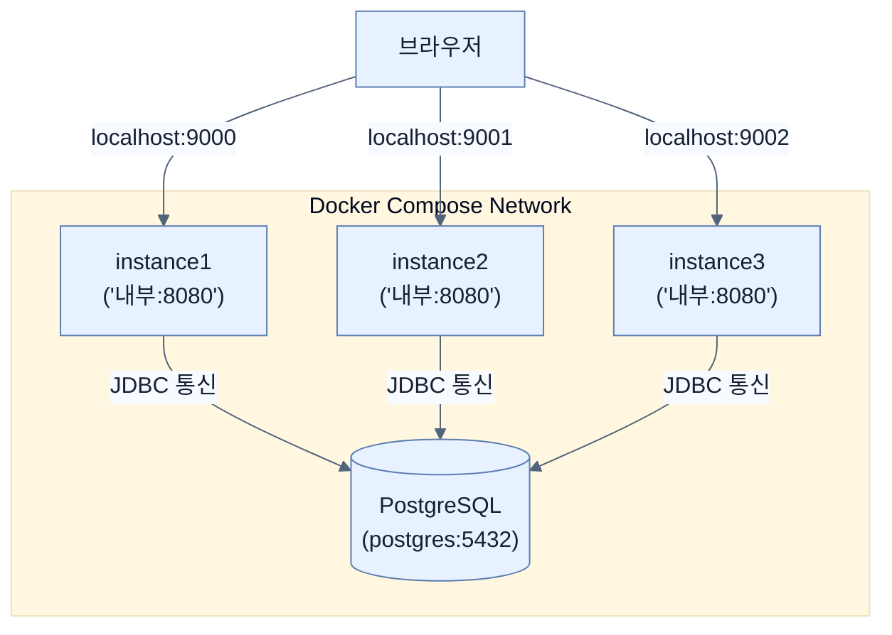

# Tweaking Application in Production

## 한눈에 보기
| 관점 | 핵심 |
|---|---|
| 이 절의 질문 | 애플리케이션을 운영 환경에 배포한 후에는, 트래픽을 감당하기 위해 여러 인스턴스로 확장Scaling하거나 외부 데이터베이스를 연결하는 등 구성Configuration을 즉석에서 재조정해야 한다. 이전 장에서 배운 환경 변수나 외부 properties 파일을 활용하면, 재빌드 없이 단일 애플리케이션을 다중 인스턴스로 분리… |
| 책에서의 역할 | Chapter 7의 앞뒤 예제를 연결하는 학습 단위 |

## 1. 왜 이게 필요한가

애플리케이션을 운영 환경에 배포한 후에는, 트래픽을 감당하기 위해 **여러 인스턴스로 확장(Scaling)**하거나 외부 데이터베이스를 연결하는 등 구성(Configuration)을 즉석에서 재조정해야 한다. 이전 장에서 배운 환경 변수나 외부 properties 파일을 활용하면, 재빌드 없이 단일 애플리케이션을 다중 인스턴스로 분리하여 운영할 수 있다.

### 비유로 잡기
이 기능은 조립 라인의 한 공정과 비슷하다. 입력을 정해진 규칙으로 변환해 다음 공정이 사용할 결과를 만든다.

→ 비유가 깨지는 지점: 애플리케이션은 고정된 조립 라인이 아니다. 조건부 구성과 런타임 실패, 외부 시스템 변화 때문에 공정의 경계를 따로 검증해야 한다.

### 이 절의 언어
**[[docker-compose]]**(= 여러 개의 Docker 컨테이너로 이루어진 복합 애플리케이션의 설정과 실행 순서를 하나의 YAML 파일로 정의하여 구동하게 해주는 도구), **[[orchestration]]**(= 복수의 컨테이너 자동 배치, 스케일링, 로드 밸런싱, 네트워킹 등을 중앙에서 통합 관리하는 프로세스나 도구)

## 2. 어떻게 동작하는가

먼저 다음 세 축으로 메커니즘을 읽는다.

1. **입력과 전제 확인** — 어떤 요청·설정·데이터가 들어오는지 확인한다. 잘못된 전제를 다음 계층으로 넘기지 않기 위해서다.
2. **Spring 추상화 적용** — 스타터와 자동 구성, 어노테이션 또는 명시적 빈이 실제 처리를 연결한다. 반복 배선보다 도메인 선택에 집중하기 위해서다.
3. **결과와 경계 검증** — 응답·저장 상태·운영 신호를 확인한다. 정상 경로만 보고 장애·버전·성능 차이를 놓치지 않기 위해서다.

### 2.1 인스턴스 확장을 위한 프로필(Profile) 오버라이드
단일 JAR 파일을 여러 포트에서 띄우기 위해 커맨드 라인 환경 변수를 사용할 수 있다.

```bash
$ SPRING_PROFILES_ACTIVE=instance1 java -jar target/ch7-0.0.1-SNAPSHOT.jar

# 두 번째 인스턴스 (포트 9001로 설정되었다고 가정)
$ SPRING_PROFILES_ACTIVE=instance2 java -jar target/ch7-0.0.1-SNAPSHOT.jar
```
미리 `application-instance1.properties`, `application-instance2.properties`를 만들어 포트를 분리해두면 위처럼 쉽게 서버 수를 늘릴 수 있다.

### 2.2 운영용 공유 데이터베이스 연결 설정
여러 애플리케이션 인스턴스가 동작한다면, 내장 H2 같은 메모리 DB가 아니라 독립된 원격 데이터베이스 인스턴스 하나를 공유해야 한다.
프로퍼티에 다음 설정들을 덮어써서 원격 DB로 가리키게 만든다.

```properties
# JDBC 연결 설정
spring.datasource.url=jdbc:postgresql://postgres:5432/postgres
spring.datasource.username=postgres
spring.datasource.password=mysecretpassword

# JPA 설정 (테이블 생성 등)
spring.jpa.hibernate.ddl-auto=update
spring.jpa.hibernate.show-sql=true
spring.jpa.properties.hibernate.dialect = org.hibernate.dialect.PostgreSQLDialect
```

### 2.3 Docker Compose로 복합 환경 띄우기
데이터베이스 컨테이너 1개와 애플리케이션 인스턴스 3개를 수동으로 띄우는 것은 번거롭다. 이를 하나의 스크립트로 오케스트레이션(Orchestration)하기 위해 **Docker Compose**를 사용한다.

`compose.yml` 예시:
```yaml
services:
  postgres:
    image: postgres:16
    container_name: my-postgres
    environment:
      POSTGRES_PASSWORD: mysecretpassword
    ports:
      - "5432:5432"

  instance1:
    image: ch7:0.0.1-SNAPSHOT
    container_name: ch7-instance1
    environment:
      SPRING_PROFILES_ACTIVE: instance1
    ports:
      - "9000:8080"
    depends_on:
      - postgres

  # instance2, instance3 동일하게 포트만 변경하여 구성...
```
- `ports`: `"호스트포트:컨테이너내부포트"` - 즉 `9000:8080`은 노트북의 9000번 포트로 들어오면 인스턴스의 8080으로 전달한다는 의미다. 이를 통해 스프링 부트 내부는 항상 8080으로 띄워지더라도 외부 접속 포트는 다르게 할 수 있다.
- `depends_on`: DB 컨테이너가 먼저 구동된 후에 앱 컨테이너가 실행되도록 순서를 제어한다.
- 위 환경에서는 `$ docker compose up -d` 한 줄로 4개의 컨테이너 생태계를 동시에 띄울 수 있다.

> [!WARNING]
> 운영 환경에서는 여러 인스턴스가 동시에 DDL(테이블 생성/초기화 데이터 삽입)을 수행하게 둬서는 안 된다. DB 초기화(스키마 변경)는 Flyway나 Liquibase 같은 전문 마이그레이션 도구나 DBA의 통제하에 별도로 이루어져야 하며, `spring.jpa.hibernate.ddl-auto=update`는 테스트나 단순 개발 시에만 제한적으로 사용해야 한다.

### 2.4 거대한 오케스트레이션 도구들
Docker Compose를 넘어선 엔터프라이즈 환경의 확장을 위해 다음과 같은 클러스터링 도구가 사용된다:
- **Kubernetes (k8s)**: 가장 지배적인 컨테이너 오케스트레이션 플랫폼
- **Argo CD / Flux**: 쿠버네티스를 위한 GitOps 툴
- **Spinnaker**: 복잡한 배포 파이프라인을 지원하는 CD 도구

## 3. 그림으로 보기



## 4. 이 노트에 나온 용어
| 용어 | 한 줄 | 자세히 |
|------|-------|--------|
| docker-compose | 여러 개의 Docker 컨테이너로 이루어진 복합 애플리케이션의 설정과 실행 순서를 하나의 YAML 파일로 정의하여 구동하게 해주는 도구 | [[_glossary#docker-compose]] |
| orchestration | 복수의 컨테이너 자동 배치, 스케일링, 로드 밸런싱, 네트워킹 등을 중앙에서 통합 관리하는 프로세스나 도구 | [[_glossary#orchestration]] |

## 5. 자주 헷갈리는 것
- 이 주제의 **Spring 추상화**와 그 아래에서 실제로 동작하는 라이브러리·프로토콜을 같은 것으로 보지 않는다. 추상화는 기본 배선을 줄이지만 하위 계층의 비용과 실패를 없애지 않는다.

## 6. 언제 안 쓰나 / 경계
- 책의 예제는 개념을 드러내기 위한 작은 애플리케이션이다. 운영 환경에서는 인증 정보, 장애 복구, 관측성, 부하와 데이터 규모를 별도로 검증한다.
- 이 노트의 API와 기본값은 책의 Spring Boot 4.1·Java 25 맥락을 따른다. 다른 마이너 버전에서는 공식 마이그레이션 문서와 실제 의존성 버전을 함께 확인한다.

## 7. 연결
- [[03-releasing-application-to-docker-hub]] — 같은 장의 학습 흐름에서 Tweaking Application in Production의 전제 또는 다음 적용 단계와 연결된다.
- [[02-baking-a-docker-container]] — 같은 장의 학습 흐름에서 Tweaking Application in Production의 전제 또는 다음 적용 단계와 연결된다.

## 8. 스스로 확인
1. Docker Compose 설정에서 `depends_on: - postgres` 구문을 추가하는 이유는 무엇인가?
2. 실무 운영 환경에서 3대의 스프링 부트 애플리케이션 인스턴스를 동시에 띄웠을 때, 각 애플리케이션에 내장된 기초 데이터 세팅 스크립트(DDL 및 DML)가 3번 동시에 실행되는 것을 방지하려면 어떻게 해야 하는가?

<!-- ==== 아래는 내 영역 · 스킬 수정 금지 ==== -->

## 내 설명 시도

## 막혔던 지점

## 리뷰 이력
