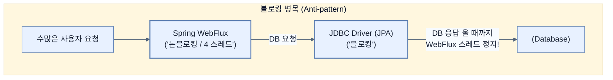

# Learning what it means to fetch data reactively

## 한눈에 보기
| 관점 | 핵심 |
|---|---|
| 이 절의 질문 | 웹 계층WebFlux을 완벽하게 논블로킹으로 구성했더라도, 데이터베이스 접근 계층에서 블로킹Blocking 호출을 사용한다면 리액티브 시스템의 장점은 순식간에 무너진다. 특히 자바 진영의 전통적인 DB 접근 표준인 JDBCJava Database Connectivity는 태생적으로 블로킹 방식으로 설계되었기 때문에 리액… |
| 책에서의 역할 | Chapter 10의 앞뒤 예제를 연결하는 학습 단위 |

## 1. 왜 이게 필요한가

웹 계층(WebFlux)을 완벽하게 논블로킹으로 구성했더라도, 데이터베이스 접근 계층에서 **블로킹(Blocking)** 호출을 사용한다면 리액티브 시스템의 장점은 순식간에 무너진다. 특히 자바 진영의 전통적인 DB 접근 표준인 **JDBC(Java Database Connectivity)**는 태생적으로 블로킹 방식으로 설계되었기 때문에 리액티브 환경에서는 사용할 수 없다.

### 비유로 잡기
동시성 처리를 식당 주문 흐름에 비유하면, 직원이 한 주문이 끝날 때까지 서 있는 방식과 번호표를 주고 다음 주문을 받는 방식의 차이다.

→ 비유가 깨지는 지점: 소프트웨어에서는 대기뿐 아니라 순서, 취소, 역압력, 재시도, 중복 처리까지 다뤄야 하므로 번호표 비유만으로 정확성을 설명할 수 없다.

### 이 절의 언어
**[[jdbc]]**(= Java Database Connectivity의 약자로, 자바 애플리케이션이 관계형 데이터베이스와 통신할 때 사용하는 표준 명세이나 태생적으로 동기/블로킹 방식이다.)

## 2. 어떻게 동작하는가

먼저 다음 세 축으로 메커니즘을 읽는다.

1. **입력과 전제 확인** — 어떤 요청·설정·데이터가 들어오는지 확인한다. 잘못된 전제를 다음 계층으로 넘기지 않기 위해서다.
2. **Spring 추상화 적용** — 스타터와 자동 구성, 어노테이션 또는 명시적 빈이 실제 처리를 연결한다. 반복 배선보다 도메인 선택에 집중하기 위해서다.
3. **결과와 경계 검증** — 응답·저장 상태·운영 신호를 확인한다. 정상 경로만 보고 장애·버전·성능 차이를 놓치지 않기 위해서다.

### 2.1 리액티브 시스템의 단일 병목점
웹 컨트롤러에서 백프레셔를 적용하고 Reactor Netty를 통해 수천 개의 비동기 연결을 유지하고 있다 하더라도, DB에서 데이터를 가져오는 행위 자체가 블로킹(Blocking)이라면 어떻게 될까?
Project Reactor는 CPU 코어 수만큼의 아주 적은 스레드 풀만 사용하도록 고도로 최적화되어 있다. 코어가 4개인 서버에서 1개의 스레드가 DB 응답을 기다리느라 멈춰버리면 시스템 처리량의 25%가 즉시 상실된다. **"시스템의 모든 구간이 논블로킹이어야만 리액티브 시스템이다."**

### 2.2 왜 JDBC는 안 되는가?
Hibernate(JPA), MyBatis, jOOQ 등 우리가 아는 대부분의 자바 ORM 및 쿼리 도구들은 내부적으로 **JDBC API**를 사용한다. JDBC 명세 자체가 스레드를 잠재우며(Block) DB 서버의 네트워크 응답을 기다리도록 설계되어 있기 때문에, 이 명세 위에 지어진 그 어떤 도구도 리액티브 런타임 위에서는 안전하게 동작할 수 없다.

### 2.3 단순 스레드 풀 격리는 해결책이 아니다
가끔 "그럼 JDBC 전용 스레드 풀을 따로 만들어서 Reactor 스레드가 블로킹되지 않게 넘겨주면 되지 않나?"라고 생각할 수 있다. 하지만 트래픽이 몰리면 결국 그 거대한 JDBC 스레드 풀마저 고갈될 것이고, 그 풀을 기다리는 또 다른 큐가 생기며, 궁극적으로 수많은 스레드가 발생시키는 컨텍스트 스위칭 오버헤드로 인해 시스템이 무너지는 것은 동일하다. 이는 리액티브 패러다임이 추구하는 "작업 양보(Yielding)"가 아니라 문제를 지연시키는 것에 불과하다.

## 3. 그림으로 보기

## 4. 이 노트에 나온 용어
| 용어 | 한 줄 | 자세히 |
|------|-------|--------|
| jdbc | Java Database Connectivity의 약자로, 자바 애플리케이션이 관계형 데이터베이스와 통신할 때 사용하는 표준 명세이나 태생적으로 동기/블로킹 방식이다. | [[_glossary#jdbc]] |

## 5. 자주 헷갈리는 것
- 이 주제의 **Spring 추상화**와 그 아래에서 실제로 동작하는 라이브러리·프로토콜을 같은 것으로 보지 않는다. 추상화는 기본 배선을 줄이지만 하위 계층의 비용과 실패를 없애지 않는다.

## 6. 언제 안 쓰나 / 경계
- 책의 예제는 개념을 드러내기 위한 작은 애플리케이션이다. 운영 환경에서는 인증 정보, 장애 복구, 관측성, 부하와 데이터 규모를 별도로 검증한다.
- 이 노트의 API와 기본값은 책의 Spring Boot 4.1·Java 25 맥락을 따른다. 다른 마이너 버전에서는 공식 마이그레이션 문서와 실제 의존성 버전을 함께 확인한다.

## 7. 연결
- [[02-picking-a-reactive-data-store]] — 같은 장의 학습 흐름에서 Learning what it means to fetch data reactively의 전제 또는 다음 적용 단계와 연결된다.
- [[03-creating-a-reactive-repository]] — 같은 장의 학습 흐름에서 Learning what it means to fetch data reactively의 전제 또는 다음 적용 단계와 연결된다.

## 8. 스스로 확인
1. Spring WebFlux 환경에서 기존에 사용하던 Spring Data JPA를 그대로 가져와 사용하면 시스템에 어떤 재앙이 발생하는가?
2. JDBC 전용 스레드 풀을 따로 파서 블로킹을 격리하는 전략이 대규모 트래픽에서 궁극적인 해결책이 되지 못하는 이유는 무엇인가?

<!-- ==== 아래는 내 영역 · 스킬 수정 금지 ==== -->

## 내 설명 시도

## 막혔던 지점

## 리뷰 이력
