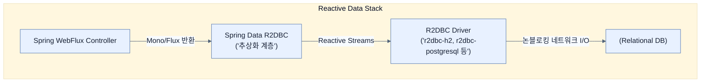

# Picking a Reactive data store

## 한눈에 보기
| 관점 | 핵심 |
|---|---|
| 이 절의 질문 | 블로킹 기반의 JDBC를 대체하기 위해 스프링 팀 주도하에 탄생한 리액티브 관계형 DB 연결 표준이 바로 R2DBCReactive Relational Database Connectivity다. 스프링 부트 환경에서는 Spring Data R2DBC 모듈을 사용하여 손쉽게 논블로킹 기반으로 관계형 데이터베이스H2, Pos… |
| 책에서의 역할 | Chapter 10의 앞뒤 예제를 연결하는 학습 단위 |

## 1. 왜 이게 필요한가

블로킹 기반의 JDBC를 대체하기 위해 스프링 팀 주도하에 탄생한 리액티브 관계형 DB 연결 표준이 바로 **R2DBC(Reactive Relational Database Connectivity)**다. 스프링 부트 환경에서는 **Spring Data R2DBC** 모듈을 사용하여 손쉽게 논블로킹 기반으로 관계형 데이터베이스(H2, PostgreSQL, MySQL 등)를 제어할 수 있다.

### 비유로 잡기
동시성 처리를 식당 주문 흐름에 비유하면, 직원이 한 주문이 끝날 때까지 서 있는 방식과 번호표를 주고 다음 주문을 받는 방식의 차이다.

→ 비유가 깨지는 지점: 소프트웨어에서는 대기뿐 아니라 순서, 취소, 역압력, 재시도, 중복 처리까지 다뤄야 하므로 번호표 비유만으로 정확성을 설명할 수 없다.

### 이 절의 언어
**[[r2dbc]]**(= Reactive Relational Database Connectivity의 약자로, 관계형 데이터베이스에 접근하기 위한 비동기/논블로킹 기반의 새로운 표준 스펙)

## 2. 어떻게 동작하는가

먼저 다음 세 축으로 메커니즘을 읽는다.

1. **입력과 전제 확인** — 어떤 요청·설정·데이터가 들어오는지 확인한다. 잘못된 전제를 다음 계층으로 넘기지 않기 위해서다.
2. **Spring 추상화 적용** — 스타터와 자동 구성, 어노테이션 또는 명시적 빈이 실제 처리를 연결한다. 반복 배선보다 도메인 선택에 집중하기 위해서다.
3. **결과와 경계 검증** — 응답·저장 상태·운영 신호를 확인한다. 정상 경로만 보고 장애·버전·성능 차이를 놓치지 않기 위해서다.

### 2.1 R2DBC (Reactive Relational Database Connectivity)
JDBC가 리액티브 스트림을 지원하도록 개조되는 것이 불가능하다는 것을 깨달은 개발 생태계는 2018년부터 완전히 새로운 논블로킹 DB 표준인 R2DBC를 구상했고, 2022년에 정식 1.0 사양을 발표했다.
MongoDB나 Redis, Cassandra 같은 NoSQL 데이터베이스들은 일찍부터 리액티브 드라이버를 자체적으로 제공했지만, R2DBC 덕분에 이제는 관계형 데이터베이스(RDB)에서도 완벽한 리액티브 스택을 구성할 수 있게 되었다.

### 2.2 Spring Data R2DBC 설정
R2DBC API 자체는 벤더(Driver 개발자)를 위해 저수준(Low-level)으로 작성되어 있어서 애플리케이션 개발자가 직접 다루기엔 복잡하다. 그래서 **Spring Data R2DBC**라는 추상화 계층을 사용한다.

Spring Initializr에서 다음 의존성을 추가하여 구성한다.
- `spring-boot-starter-data-r2dbc`: R2DBC의 핵심 인프라와 리액티브 리포지토리 지원
- `r2dbc-h2`: H2 데이터베이스용 R2DBC 통신 드라이버 (JDBC 드라이버가 아님에 주의)
- `h2`: H2 데이터베이스 엔진 그 자체 (인메모리)

> [!WARNING]
> WebFlux와 R2DBC를 사용하는 프로젝트에 `spring-boot-h2-console` (H2 웹 콘솔) 의존성을 추가하면 안 된다. H2 콘솔은 서블릿과 JDBC 스택을 가정한 도구이기 때문에, 순수 리액티브 앱에 추가하면 구동 환경에 충돌(서블릿 톰캣 서버 구동 등)이 발생한다. DB 데이터는 DBeaver 등의 외부 툴로 확인해야 한다.

## 3. 그림으로 보기

## 4. 이 노트에 나온 용어
| 용어 | 한 줄 | 자세히 |
|------|-------|--------|
| r2dbc | Reactive Relational Database Connectivity의 약자로, 관계형 데이터베이스에 접근하기 위한 비동기/논블로킹 기반의 새로운 표준 스펙 | [[_glossary#r2dbc]] |

## 5. 자주 헷갈리는 것
- 이 주제의 **Spring 추상화**와 그 아래에서 실제로 동작하는 라이브러리·프로토콜을 같은 것으로 보지 않는다. 추상화는 기본 배선을 줄이지만 하위 계층의 비용과 실패를 없애지 않는다.

## 6. 언제 안 쓰나 / 경계
- 책의 예제는 개념을 드러내기 위한 작은 애플리케이션이다. 운영 환경에서는 인증 정보, 장애 복구, 관측성, 부하와 데이터 규모를 별도로 검증한다.
- 이 노트의 API와 기본값은 책의 Spring Boot 4.1·Java 25 맥락을 따른다. 다른 마이너 버전에서는 공식 마이그레이션 문서와 실제 의존성 버전을 함께 확인한다.

## 7. 연결
- [[01-fetching-data-reactively]] — 같은 장의 학습 흐름에서 Picking a Reactive data store의 전제 또는 다음 적용 단계와 연결된다.
- [[03-creating-a-reactive-repository]] — 같은 장의 학습 흐름에서 Picking a Reactive data store의 전제 또는 다음 적용 단계와 연결된다.

## 8. 스스로 확인
1. NoSQL 데이터베이스들은 예전부터 리액티브 모델을 지원했는데, 왜 관계형 데이터베이스 진영은 R2DBC라는 새로운 표준이 나오기 전까지 리액티브 전환이 늦었는가?
2. WebFlux + R2DBC 스택으로 구성된 애플리케이션에서 `spring-boot-h2-console`을 추가하면 안 되는 기술적인 이유는 무엇인가?

<!-- ==== 아래는 내 영역 · 스킬 수정 금지 ==== -->

## 내 설명 시도

## 막혔던 지점

## 리뷰 이력
