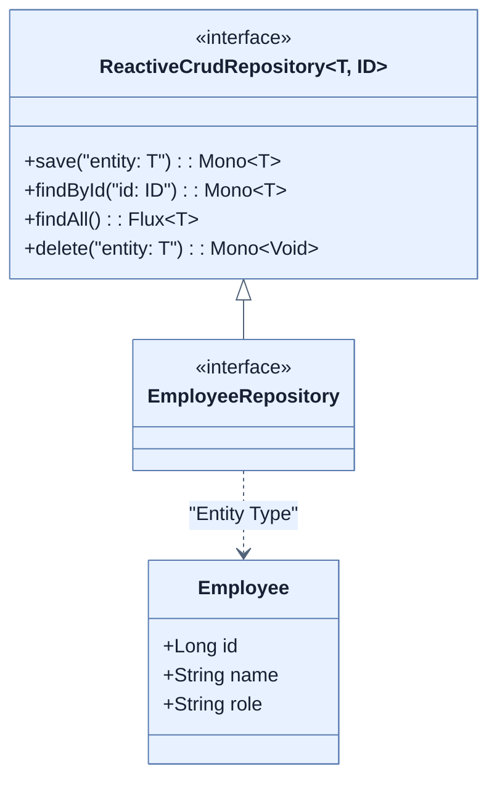

# Creating a Reactive data repository

## 한눈에 보기
| 관점 | 핵심 |
|---|---|
| 이 절의 질문 | Spring Data JPA에서 JpaRepository를 상속받아 레포지토리를 선언했듯, Spring Data R2DBC 환경에서는 ReactiveCrudRepository를 상속받아 리액티브 타입Mono, Flux을 반환하는 리포지토리를 선언한다. 또한 저장될 데이터 객체Entity에는 JPA의 애노테이션이 아닌 S… |
| 책에서의 역할 | Chapter 10의 앞뒤 예제를 연결하는 학습 단위 |

## 1. 왜 이게 필요한가

Spring Data JPA에서 `JpaRepository`를 상속받아 레포지토리를 선언했듯, Spring Data R2DBC 환경에서는 **`ReactiveCrudRepository`**를 상속받아 **리액티브 타입(`Mono`, `Flux`)**을 반환하는 리포지토리를 선언한다. 또한 저장될 데이터 객체(Entity)에는 JPA의 애노테이션이 아닌 Spring Data 패키지의 전용 식별자 애노테이션(`@Id`)을 부여해야 한다.

### 비유로 잡기
동시성 처리를 식당 주문 흐름에 비유하면, 직원이 한 주문이 끝날 때까지 서 있는 방식과 번호표를 주고 다음 주문을 받는 방식의 차이다.

→ 비유가 깨지는 지점: 소프트웨어에서는 대기뿐 아니라 순서, 취소, 역압력, 재시도, 중복 처리까지 다뤄야 하므로 번호표 비유만으로 정확성을 설명할 수 없다.

### 이 절의 언어
**[[reactive-crud-repository]]**(= 스프링 데이터 공통 모듈에서 제공하는 인터페이스로, 모든 CRUD 데이터 작업의 반환형을 블로킹 객체 대신 Mono나 Flux로 제공한다)

## 2. 어떻게 동작하는가

먼저 다음 세 축으로 메커니즘을 읽는다.

1. **입력과 전제 확인** — 어떤 요청·설정·데이터가 들어오는지 확인한다. 잘못된 전제를 다음 계층으로 넘기지 않기 위해서다.
2. **Spring 추상화 적용** — 스타터와 자동 구성, 어노테이션 또는 명시적 빈이 실제 처리를 연결한다. 반복 배선보다 도메인 선택에 집중하기 위해서다.
3. **결과와 경계 검증** — 응답·저장 상태·운영 신호를 확인한다. 정상 경로만 보고 장애·버전·성능 차이를 놓치지 않기 위해서다.

### 2.1 ReactiveCrudRepository 인터페이스
Spring Data 공통 프레임워크가 제공하는 리액티브 전용 인터페이스다.

```java
public interface EmployeeRepository extends
         ReactiveCrudRepository<Employee, Long> {}
```
이 인터페이스를 상속받으면, Spring Data가 런타임에 구현체를 자동으로 생성해준다. 기존 JPA 저장소와 겉보기엔 같아 보이지만, 반환 타입이 리액티브 객체라는 것이 핵심이다.
- `save(entity)` -> `Mono<T>` 반환
- `findById(id)` -> `Mono<T>` 반환
- `findAll()` -> `Flux<T>` 반환
- `delete(entity)` -> `Mono<Void>` 반환 (결과값이 없어도 완료 시점은 비동기로 통보받아야 하므로 Void Mono를 쓴다)

이 인터페이스는 R2DBC에만 종속된 것이 아니라, MongoDB나 Cassandra 같은 다른 리액티브 모듈에서도 공통으로 사용된다.

### 2.2 R2DBC 도메인 객체 (Entity) 구성
이전 장에서 단순한 데이터를 나르기 위해 만들었던 `Employee` 레코드(Java Record)를 데이터베이스 영속성(Persistence) 처리를 위해 확장해야 한다.
관계형 데이터베이스에 저장되려면 기본 키(Primary Key)에 매핑되는 식별자 필드가 반드시 필요하다.

```java
import org.springframework.data.annotation.Id;

public record Employee(
          @Id Long id,
          String name,
          String role
) {
      public Employee(String name, String role) {
          this(null, name, role);
      }
}
```

- **`@Id`**: 주의할 점은 이 애노테이션이 JPA 표준인 `jakarta.persistence.Id`가 아니라, **`org.springframework.data.annotation.Id`**라는 점이다. Spring Data R2DBC는 JPA 표준을 따르지 않고 독자적인 매핑 인프라를 사용한다.
- **추가 생성자**: 새로운 레코드를 DB에 삽입(Insert)할 때는 DB가 `id`를 자동 생성(Auto-increment 등)하도록 해야 하므로, `id` 자리에 `null`을 밀어 넣는 보조 생성자를 추가했다. Java Record 특성상 `equals`, `hashCode`, 접근자(getter) 등은 컴파일러가 자동 생성해주어 코드가 매우 간결해진다.

## 3. 그림으로 보기



## 4. 이 노트에 나온 용어
| 용어 | 한 줄 | 자세히 |
|------|-------|--------|
| reactive-crud-repository | 스프링 데이터 공통 모듈에서 제공하는 인터페이스로, 모든 CRUD 데이터 작업의 반환형을 블로킹 객체 대신 `Mono`나 `Flux`로 제공한다 | [[_glossary#reactive-crud-repository]] |

## 5. 자주 헷갈리는 것
- 이 주제의 **Spring 추상화**와 그 아래에서 실제로 동작하는 라이브러리·프로토콜을 같은 것으로 보지 않는다. 추상화는 기본 배선을 줄이지만 하위 계층의 비용과 실패를 없애지 않는다.

## 6. 언제 안 쓰나 / 경계
- 책의 예제는 개념을 드러내기 위한 작은 애플리케이션이다. 운영 환경에서는 인증 정보, 장애 복구, 관측성, 부하와 데이터 규모를 별도로 검증한다.
- 이 노트의 API와 기본값은 책의 Spring Boot 4.1·Java 25 맥락을 따른다. 다른 마이너 버전에서는 공식 마이그레이션 문서와 실제 의존성 버전을 함께 확인한다.

## 7. 연결
- [[02-picking-a-reactive-data-store]] — 같은 장의 학습 흐름에서 Creating a Reactive data repository의 전제 또는 다음 적용 단계와 연결된다.
- [[04-working-with-r2dbc]] — 같은 장의 학습 흐름에서 Creating a Reactive data repository의 전제 또는 다음 적용 단계와 연결된다.

## 8. 스스로 확인
1. Spring Data R2DBC 환경에서 도메인 클래스의 `id` 필드에 부여하는 `@Id` 애노테이션은 어느 패키지 소속의 것을 임포트해야 하는가?
2. `ReactiveCrudRepository.delete()` 메서드의 반환 타입은 왜 `void`가 아니라 `Mono<Void>`인가?

<!-- ==== 아래는 내 영역 · 스킬 수정 금지 ==== -->

## 내 설명 시도

## 막혔던 지점

## 리뷰 이력
