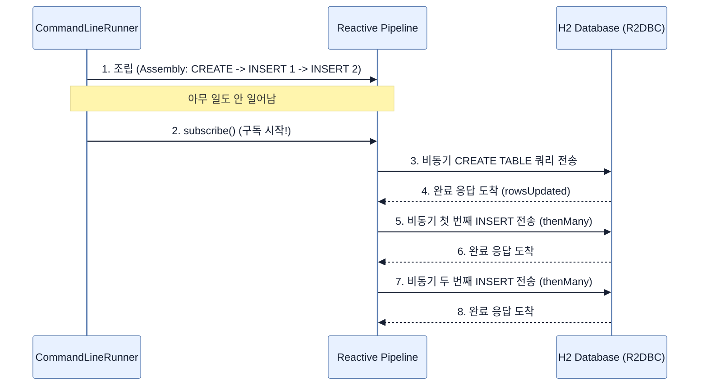

# Working with R2DBC

## 한눈에 보기
| 관점 | 핵심 |
|---|---|
| 이 절의 질문 | JPAHibernate와 달리 R2DBC 환경에서는 엔티티 클래스만 보고 데이터베이스 테이블 스키마DDL를 자동으로 생성해 주는 기능이 기본적으로 제공되지 않는다. 따라서 애플리케이션 시작 시 R2dbcEntityTemplate과 DatabaseClient를 활용하여 프로그래밍 방식으로Programmatically 리액… |
| 책에서의 역할 | Chapter 10의 앞뒤 예제를 연결하는 학습 단위 |

## 1. 왜 이게 필요한가

JPA(Hibernate)와 달리 R2DBC 환경에서는 엔티티 클래스만 보고 데이터베이스 테이블 스키마(DDL)를 자동으로 생성해 주는 기능이 기본적으로 제공되지 않는다. 따라서 애플리케이션 시작 시 **`R2dbcEntityTemplate`**과 **`DatabaseClient`**를 활용하여 프로그래밍 방식으로(Programmatically) 리액티브하게 스키마를 초기화하고 초기 데이터를 로딩해야 한다.

### 비유로 잡기
데이터 계층은 창고와 같다. 요청자는 원하는 물건의 조건을 말하고, 저장소 추상화가 실제 선반과 운반 방식을 감춘다.

→ 비유가 깨지는 지점: 데이터베이스는 단순 창고와 달리 트랜잭션, 동시성, 지연, 스키마 제약이 있어 추상화만 믿고 비용을 무시할 수 없다.

### 이 절의 언어
**[[r2dbc-entity-template]]**(= 원시 SQL 실행, 객체 매핑 삽입/수정 등 데이터베이스 작업을 수월하게 처리하도록 도와주는 리액티브 전용 템플릿 헬퍼 클래스), **[[database-client]]**(= Spring Framework R2DBC 모듈이 제공하는 코어 기능으로, 드라이버 레벨과 소통하여 네이티브 SQL 구문을 비동기적으로 실행하는 논블로킹 클라이언트)

## 2. 어떻게 동작하는가

먼저 다음 세 축으로 메커니즘을 읽는다.

1. **입력과 전제 확인** — 어떤 요청·설정·데이터가 들어오는지 확인한다. 잘못된 전제를 다음 계층으로 넘기지 않기 위해서다.
2. **Spring 추상화 적용** — 스타터와 자동 구성, 어노테이션 또는 명시적 빈이 실제 처리를 연결한다. 반복 배선보다 도메인 선택에 집중하기 위해서다.
3. **결과와 경계 검증** — 응답·저장 상태·운영 신호를 확인한다. 정상 경로만 보고 장애·버전·성능 차이를 놓치지 않기 위해서다.

### 2.1 CommandLineRunner를 이용한 초기화 컴포넌트
스프링 부트 애플리케이션 구동이 완료된 시점에 한 번 실행되는 `CommandLineRunner` 빈을 만들어 DB 초기화 로직을 담는다.

```java
@Configuration
public class Startup {
    @Bean
    CommandLineRunner initDatabase(R2dbcEntityTemplate template) {
        return args -> {
            // 초기화 로직
        };
    }
}
```
- **`R2dbcEntityTemplate`**: Spring Data R2DBC가 제공하는 리액티브 데이터베이스 조작 유틸리티 클래스다. (기존 JDBC 시절의 `JdbcTemplate`과 유사하지만 철저히 논블로킹으로 동작한다)

### 2.2 리액티브 파이프라인으로 SQL 실행 및 데이터 삽입
내장 데이터베이스(H2)에 테이블을 만들고(`CREATE TABLE`), 기초 데이터를 연달아 삽입(`INSERT`)하는 작업을 **하나의 거대한 리액티브 체인(Pipeline)**으로 엮어서 작성해야 한다.

```java
template.getDatabaseClient()
    .sql("""
        CREATE TABLE EMPLOYEE (
            id IDENTITY NOT NULL PRIMARY KEY,
            name VARCHAR(255),
            role VARCHAR(255)
        )
    """)
    .fetch()
    .rowsUpdated()
    // 테이블 생성이 완료된 후(thenMany), 순서대로 데이터 삽입 실행
    .thenMany(template.insert(Employee.class)
            .using(new Employee("Frodo Baggins", "ring bearer")))
    .thenMany(template.insert(Employee.class)
            .using(new Employee("Samwise Gamgee", "gardener")))
    .thenMany(template.insert(Employee.class)
            .using(new Employee("Bilbo Baggins", "burglar")))
    .subscribe(); // 명시적 구독을 해야 비로소 쿼리가 DB로 날아감!
```

- `getDatabaseClient().sql(...)`: 순수 텍스트 SQL 쿼리를 리액티브하게 실행하기 위해 R2DBC의 핵심인 `DatabaseClient` 객체를 꺼낸다.
- `fetch().rowsUpdated()`: 쿼리를 DB에 던지고 완료되면 영향받은(행이 추가/변경된) 개수를 반환하는 `Mono<Integer>` 스트림을 생성한다.
- `thenMany(...)`: **이전 작업(테이블 생성)이 무사히 완료되면** 그제야 괄호 안의 새로운 스트림(`insert`)을 이어받아 병합한다. DB 트랜잭션의 선후 관계를 리액티브 스택에서 보장하기 위한 아주 중요한 연산자다.
- `insert(Class).using(Entity)`: SQL 문을 직접 쓰지 않고 타입 안전하게(Type-safe) 특정 객체를 DB에 밀어 넣는 템플릿의 간편 메서드다.
- **`subscribe()`**: (매우 중요) Project Reactor의 게으른 실행(Lazy Execution) 원칙에 의해, 아무리 거창한 SQL 조립을 해두어도 `subscribe()`를 호출하여 방아쇠를 당기지 않으면 단 한 줄의 쿼리도 실행되지 않는다. 웹 요청 처리 중에는 프레임워크가 알아서 구독해주지만, 이처럼 스타트업 스크립트에서는 개발자가 직접 `subscribe()`를 호출해야 한다.

## 3. 그림으로 보기



## 4. 이 노트에 나온 용어
| 용어 | 한 줄 | 자세히 |
|------|-------|--------|
| r2dbc-entity-template | 원시 SQL 실행, 객체 매핑 삽입/수정 등 데이터베이스 작업을 수월하게 처리하도록 도와주는 리액티브 전용 템플릿 헬퍼 클래스 | [[_glossary#r2dbc-entity-template]] |
| database-client | Spring Framework R2DBC 모듈이 제공하는 코어 기능으로, 드라이버 레벨과 소통하여 네이티브 SQL 구문을 비동기적으로 실행하는 논블로킹 클라이언트 | [[_glossary#database-client]] |

## 5. 자주 헷갈리는 것
- 이 주제의 **Spring 추상화**와 그 아래에서 실제로 동작하는 라이브러리·프로토콜을 같은 것으로 보지 않는다. 추상화는 기본 배선을 줄이지만 하위 계층의 비용과 실패를 없애지 않는다.

## 6. 언제 안 쓰나 / 경계
- 책의 예제는 개념을 드러내기 위한 작은 애플리케이션이다. 운영 환경에서는 인증 정보, 장애 복구, 관측성, 부하와 데이터 규모를 별도로 검증한다.
- 이 노트의 API와 기본값은 책의 Spring Boot 4.1·Java 25 맥락을 따른다. 다른 마이너 버전에서는 공식 마이그레이션 문서와 실제 의존성 버전을 함께 확인한다.

## 7. 연결
- [[03-creating-a-reactive-repository]] — 같은 장의 학습 흐름에서 Working with R2DBC의 전제 또는 다음 적용 단계와 연결된다.
- [[05-returning-data-reactively]] — 같은 장의 학습 흐름에서 Working with R2DBC의 전제 또는 다음 적용 단계와 연결된다.

## 8. 스스로 확인
1. JPA에서는 `spring.jpa.hibernate.ddl-auto=update` 옵션만 켜면 테이블이 자동 생성되는데, R2DBC에서는 왜 직접 SQL 쿼리를 작성하여 테이블을 생성했는가?
2. 위 코드의 마지막 줄에서 `.subscribe()` 메서드 호출을 실수로 누락했다면 애플리케이션 기동 시 콘솔에는 어떤 에러가 찍히는가? (혹은 아무 에러도 안 찍히는가?)

<!-- ==== 아래는 내 영역 · 스킬 수정 금지 ==== -->

## 내 설명 시도

## 막혔던 지점

## 리뷰 이력
