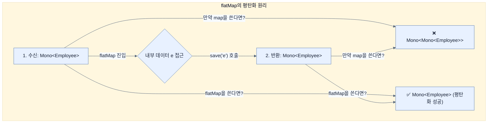

# Returning data reactively to an API controller

## 한눈에 보기
| 관점 | 핵심 |
|---|---|
| 이 절의 질문 | R2DBC로 데이터를 조회하고 저장하는 리포지토리를 준비했다면, 이를 WebFlux의 @RestController와 연결하는 과정은 매우 매끄럽다. 리포지토리의 반환 타입이 이미 Flux와 Mono로 맞춰져 있으므로, 중간에서 블로킹이나 별도의 스트림 변환가공 없이 곧바로 컨트롤러의 반환값으로 전달할 수 있다. 단, 데… |
| 책에서의 역할 | Chapter 10의 앞뒤 예제를 연결하는 학습 단위 |

## 1. 왜 이게 필요한가

R2DBC로 데이터를 조회하고 저장하는 리포지토리를 준비했다면, 이를 WebFlux의 `@RestController`와 연결하는 과정은 매우 매끄럽다. 리포지토리의 반환 타입이 이미 `Flux`와 `Mono`로 맞춰져 있으므로, 중간에서 블로킹이나 별도의 스트림 변환(가공) 없이 곧바로 컨트롤러의 반환값으로 전달할 수 있다. 단, 데이터를 새로 저장(POST)할 때는 스트림 중첩을 피하기 위해 **`flatMap`**의 역할이 중요해진다.

### 비유로 잡기
동시성 처리를 식당 주문 흐름에 비유하면, 직원이 한 주문이 끝날 때까지 서 있는 방식과 번호표를 주고 다음 주문을 받는 방식의 차이다.

→ 비유가 깨지는 지점: 소프트웨어에서는 대기뿐 아니라 순서, 취소, 역압력, 재시도, 중복 처리까지 다뤄야 하므로 번호표 비유만으로 정확성을 설명할 수 없다.

### 이 절의 언어
**[[flatmap]]**(= 리액티브 스트림 내부 콜백 연산의 결과가 또 다른 리액티브 타입(Mono, Flux)일 때, 두꺼워진 껍질을 한 꺼풀 벗겨내어 단일 스트림으로 평탄화(Flattening)해주는 필수 연산자)

## 2. 어떻게 동작하는가

먼저 다음 세 축으로 메커니즘을 읽는다.

1. **입력과 전제 확인** — 어떤 요청·설정·데이터가 들어오는지 확인한다. 잘못된 전제를 다음 계층으로 넘기지 않기 위해서다.
2. **Spring 추상화 적용** — 스타터와 자동 구성, 어노테이션 또는 명시적 빈이 실제 처리를 연결한다. 반복 배선보다 도메인 선택에 집중하기 위해서다.
3. **결과와 경계 검증** — 응답·저장 상태·운영 신호를 확인한다. 정상 경로만 보고 장애·버전·성능 차이를 놓치지 않기 위해서다.

### 2.1 단순 데이터 조회 (GET)
기존의 인메모리 `Map`을 사용할 때는 맵 안의 값들을 추출해 수동으로 `Flux.fromIterable()`로 변환해줘야 했다.
하지만 `EmployeeRepository`(ReactiveCrudRepository)를 사용하면 리포지토리 레이어에서부터 완벽히 비동기 파이프라인이 형성되어 코드가 획기적으로 짧아진다.

```java
@RestController
public class ApiController {
    private final EmployeeRepository repository;

    // 생성자 주입
    public ApiController(EmployeeRepository repository) {
        this.repository = repository;
    }

    @GetMapping("/api/employees")
    Flux<Employee> employees() {
        // 이미 Flux를 반환하므로 바로 넘기기만 하면 끝
        return repository.findAll();
    }
}
```
데이터베이스 조회부터 클라이언트 JSON 스트리밍 반환까지 전 구간(End-to-end)이 논블로킹으로 직결(Wire-through)되었다.

### 2.2 새로운 데이터 삽입 (POST)
클라이언트가 Body에 실어 보낸 새 데이터 역시 `Mono<Employee>`로 비동기적으로 수신된다. 이 데이터를 꺼내어 가공한 뒤 리포지토리에 넘겨 다시 저장(`save`)해야 하는데, 여기서 Reactor 연산자 중첩 문제가 발생한다.

```java
@PostMapping("/api/employees")
Mono<Employee> add(@RequestBody Mono<Employee> newEmployee) {
    // 주의: map()을 쓴다면 반환 타입이 Mono<Mono<Employee>>가 되어버린다.
    // flatMap()을 사용해야 겹겹이 쌓인 Mono 포장을 한 겹으로 평탄화(Flatten)할 수 있다.
    return newEmployee.flatMap(e -> {
        // 클라이언트가 보낸 데이터 중 이름과 역할만 뽑아서 새 객체 생성 (악의적인 id 주입 방지)
        Employee employeeToLoad = new Employee(e.name(), e.role());
        
        // save() 메서드 역시 Mono<Employee>를 반환한다.
        return repository.save(employeeToLoad);
    });
}
```

- **왜 `map` 대신 `flatMap`인가?**: 
  - `map`은 반환된 결과를 무조건 현재의 `Mono` 포장지 안에 구겨 넣는다. `repository.save()`의 결과가 `Mono<Employee>`인데, 이걸 다시 원본 포장지(newEmployee Mono)에 넣으니 `Mono<Mono<Employee>>`가 되어버린다.
  - `flatMap`은 안쪽 콜백이 반환한 `Mono` 껍데기를 해체하고 알맹이 스트림을 바깥 스트림과 평탄하게 합쳐주어 최종적으로 깔끔한 `Mono<Employee>` 1개만 남도록 해주는 마법 같은 연산자다.

> [!TIP]
> **리액티브 프로그래밍 꿀팁**: 타입이 자꾸 중첩되거나(예: `Flux<Flux<?>>`), 앞선 리액티브 작업이 끝난 후 후속 리액티브 작업을 체이닝해야 하는데 연산이 제대로 실행되지 않는 것 같다면 십중팔구 **`flatMap()`**을 써야 할 자리에 `map()`을 쓴 것이다.

### 2.3 Thymeleaf 템플릿(HTML) 폼 처리
HTML 폼을 받아 처리한 후 리다이렉트를 반환하는 컨트롤러(`@Controller`)에서도 `flatMap`과 `map`의 차이가 극명하게 드러난다.

```java
@PostMapping("/new-employee")
Mono<String> newEmployee(@ModelAttribute Mono<Employee> newEmployee) {
    return newEmployee
        .flatMap(e -> {
            Employee employeeToSave = new Employee(e.getName(), e.getRole());
            // save는 Mono 반환 비동기 작업이므로 flatMap 필수
            return repository.save(employeeToSave);
        })
        .map(employee -> "redirect:/"); // 단순 문자열 반환이므로 map으로 충분함
}
```

## 3. 그림으로 보기



## 4. 이 노트에 나온 용어
| 용어 | 한 줄 | 자세히 |
|------|-------|--------|
| flatMap | 리액티브 스트림 내부 콜백 연산의 결과가 또 다른 리액티브 타입(Mono, Flux)일 때, 두꺼워진 껍질을 한 꺼풀 벗겨내어 단일 스트림으로 평탄화(Flattening)해주는 필수 연산자 | [[_glossary#flatmap]] |

## 5. 자주 헷갈리는 것
- 이 주제의 **Spring 추상화**와 그 아래에서 실제로 동작하는 라이브러리·프로토콜을 같은 것으로 보지 않는다. 추상화는 기본 배선을 줄이지만 하위 계층의 비용과 실패를 없애지 않는다.

## 6. 언제 안 쓰나 / 경계
- 책의 예제는 개념을 드러내기 위한 작은 애플리케이션이다. 운영 환경에서는 인증 정보, 장애 복구, 관측성, 부하와 데이터 규모를 별도로 검증한다.
- 이 노트의 API와 기본값은 책의 Spring Boot 4.1·Java 25 맥락을 따른다. 다른 마이너 버전에서는 공식 마이그레이션 문서와 실제 의존성 버전을 함께 확인한다.

## 7. 연결
- [[04-working-with-r2dbc]] — 같은 장의 학습 흐름에서 Returning data reactively to an API controller의 전제 또는 다음 적용 단계와 연결된다.
- [[03-creating-a-reactive-repository]] — 같은 장의 학습 흐름에서 Returning data reactively to an API controller의 전제 또는 다음 적용 단계와 연결된다.

## 8. 스스로 확인
1. WebFlux `RestController`에서 R2DBC `ReactiveCrudRepository.findAll()` 메서드의 결과를 컨트롤러 밖으로 내보낼 때 `.subscribe()`를 개발자가 호출하지 않는 이유는 무엇인가?
2. `repository.save()` 연산을 수행하기 위해 클라이언트로부터 받은 데이터(`newEmployee`) 객체에서 `id`를 무시하고 `name`과 `role` 필드만 뽑아 새로운 `Employee` 객체를 인스턴스화하는 보안상/논리상의 이유는 무엇인가?

<!-- ==== 아래는 내 영역 · 스킬 수정 금지 ==== -->

## 내 설명 시도

## 막혔던 지점

## 리뷰 이력
