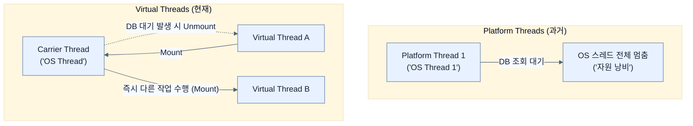

# Understanding Virtual Threads

## 한눈에 보기
| 관점 | 핵심 |
|---|---|
| 이 절의 질문 | Java 21Project Loom에서 정식 도입된 가상 스레드Virtual Threads는 기존의 무거운 운영체제OS 스레드를 대체하는 가벼운 JVM 관리 스레드다. 리액티브 프로그래밍WebFlux처럼 복잡한 비동기 코드를 배울 필요 없이, 우리가 오랫동안 써오던 익숙한 동기식/블로킹Blocking 코드를 그대로 작성… |
| 책에서의 역할 | Chapter 11의 앞뒤 예제를 연결하는 학습 단위 |

## 1. 왜 이게 필요한가

Java 21(Project Loom)에서 정식 도입된 **가상 스레드(Virtual Threads)**는 기존의 무거운 운영체제(OS) 스레드를 대체하는 가벼운 JVM 관리 스레드다. 리액티브 프로그래밍(WebFlux)처럼 복잡한 비동기 코드를 배울 필요 없이, 우리가 오랫동안 써오던 익숙한 동기식/블로킹(Blocking) 코드를 그대로 작성하면서도 수백만 개의 동시 접속을 가뿐하게 처리할 수 있는 혁신적인 동시성 모델이다.

### 비유로 잡기
동시성 처리를 식당 주문 흐름에 비유하면, 직원이 한 주문이 끝날 때까지 서 있는 방식과 번호표를 주고 다음 주문을 받는 방식의 차이다.

→ 비유가 깨지는 지점: 소프트웨어에서는 대기뿐 아니라 순서, 취소, 역압력, 재시도, 중복 처리까지 다뤄야 하므로 번호표 비유만으로 정확성을 설명할 수 없다.

### 이 절의 언어
**[[virtual-threads]]**(= OS 스레드와 1:1로 매핑되지 않고, JVM이 효율적으로 관리하여 블로킹 시 자원을 즉시 양보하는 자바 21의 초경량 스레드), **[[project-loom]]**(= 자바 언어의 동시성 모델을 혁신하기 위해 가상 스레드와 구조적 동시성(Structured Concurrency)을 도입한 OpenJDK 프로젝트), **[[carrier-thread]]**(= JVM 내부에서 가상 스레드를 얹어서 실제 CPU에서 실행시켜 주는 토대 역할을 하는 진짜(플랫폼) 스레드)

## 2. 어떻게 동작하는가

먼저 다음 세 축으로 메커니즘을 읽는다.

1. **입력과 전제 확인** — 어떤 요청·설정·데이터가 들어오는지 확인한다. 잘못된 전제를 다음 계층으로 넘기지 않기 위해서다.
2. **Spring 추상화 적용** — 스타터와 자동 구성, 어노테이션 또는 명시적 빈이 실제 처리를 연결한다. 반복 배선보다 도메인 선택에 집중하기 위해서다.
3. **결과와 경계 검증** — 응답·저장 상태·운영 신호를 확인한다. 정상 경로만 보고 장애·버전·성능 차이를 놓치지 않기 위해서다.

### 2.1 기존 플랫폼 스레드(Platform Threads)의 한계
전통적인 자바 애플리케이션은 스레드 하나를 만들 때마다 운영체제의 커널 스레드(OS Thread)를 1:1로 매핑하는 '플랫폼 스레드' 모델을 사용했다. 
- OS 스레드는 생성 비용이 비싸고 메모리 공간(Stack)을 많이 차지한다.
- 톰캣(Tomcat) 같은 서블릿 컨테이너는 보통 스레드 풀을 200개 정도로 제한한다.
- 수많은 스레드가 동시에 실행될 때 발생하는 컨텍스트 스위칭(Context Switching) 오버헤드는 CPU 성능을 갉아먹는다.

결과적으로 시스템 메모리와 CPU의 물리적 한계 때문에 스레드를 많이 늘릴 수 없어 병목(Bottleneck)이 발생한다. 이를 극복하기 위해 나온 것이 이전 장들에서 배운 비동기 리액티브(Reactive) 프로그래밍이었다.

### 2.2 가상 스레드(Virtual Threads)의 등장
Java 21부터 도입된 가상 스레드는 OS가 아닌 자바 가상 머신(JVM)이 직접 관리하는 초경량 스레드다. 
- 스레드 1개를 만드는 데 드는 비용이 거의 0에 가깝기 때문에 수백만 개를 띄워도 메모리가 부족하지 않다.
- DB 쿼리나 API 통신 등으로 **블로킹(I/O 대기)이 발생하면**, JVM은 즉시 해당 가상 스레드를 일시 중지(Suspend)하고, 기반이 되는 물리적 OS 스레드(Carrier Thread)를 다른 가상 스레드에게 양보(Unmount)한다.
- 응답이 도착하면 다시 가상 스레드를 깨워 이어서 실행(Resume)한다.

### 2.3 리액티브(Reactive) vs 가상 스레드(Virtual Threads)
WebFlux 기반의 리액티브 모델은 `Mono/Flux` 체인 안에서 모든 것을 설계해야 하는 극도의 복잡성을 요구한다. 
하지만 가상 스레드를 사용하면 기존 Spring MVC처럼 순차적으로 읽히는 단순한 명령형(Imperative) 코드를 작성하기만 해도, 내부적으로는 리액티브 스택에 버금가는 확장성(Scalability)을 거저 얻게 된다.

## 3. 그림으로 보기

## 4. 이 노트에 나온 용어
| 용어 | 한 줄 | 자세히 |
|------|-------|--------|
| virtual-threads | OS 스레드와 1:1로 매핑되지 않고, JVM이 효율적으로 관리하여 블로킹 시 자원을 즉시 양보하는 자바 21의 초경량 스레드 | [[_glossary#virtual-threads]] |
| project-loom | 자바 언어의 동시성 모델을 혁신하기 위해 가상 스레드와 구조적 동시성(Structured Concurrency)을 도입한 OpenJDK 프로젝트 | [[_glossary#project-loom]] |
| carrier-thread | JVM 내부에서 가상 스레드를 얹어서 실제 CPU에서 실행시켜 주는 토대 역할을 하는 진짜(플랫폼) 스레드 | [[_glossary#carrier-thread]] |

## 5. 자주 헷갈리는 것
- 이 주제의 **Spring 추상화**와 그 아래에서 실제로 동작하는 라이브러리·프로토콜을 같은 것으로 보지 않는다. 추상화는 기본 배선을 줄이지만 하위 계층의 비용과 실패를 없애지 않는다.

## 6. 언제 안 쓰나 / 경계
- 책의 예제는 개념을 드러내기 위한 작은 애플리케이션이다. 운영 환경에서는 인증 정보, 장애 복구, 관측성, 부하와 데이터 규모를 별도로 검증한다.
- 이 노트의 API와 기본값은 책의 Spring Boot 4.1·Java 25 맥락을 따른다. 다른 마이너 버전에서는 공식 마이그레이션 문서와 실제 의존성 버전을 함께 확인한다.

## 7. 연결
- [[02-enabling-virtual-threads]] — 같은 장의 학습 흐름에서 Understanding Virtual Threads의 전제 또는 다음 적용 단계와 연결된다.
- [[03-integrating-with-taskexecutor]] — 같은 장의 학습 흐름에서 Understanding Virtual Threads의 전제 또는 다음 적용 단계와 연결된다.

## 8. 스스로 확인
1. 가상 스레드 환경에서는 почему(왜) 더 이상 수백 개의 스레드 풀을 관리하거나 스레드 개수 제한을 둘 필요가 없는가?
2. 특정 로직이 DB 응답을 기다리며 `Thread.sleep()`이나 I/O 대기를 할 때, 가상 스레드와 플랫폼 스레드는 각각 OS 스레드를 어떻게 다루는가?

<!-- ==== 아래는 내 영역 · 스킬 수정 금지 ==== -->

## 내 설명 시도

## 막혔던 지점

## 리뷰 이력
