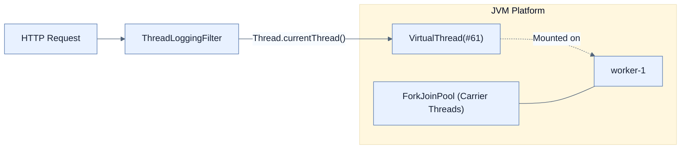

# Using Virtual Threads in a Spring Boot application

## 한눈에 보기
| 관점 | 핵심 |
|---|---|
| 이 절의 질문 | 스프링 부트Spring Boot에서 가상 스레드를 활성화하는 방법은 놀랍도록 단순하다. application.properties에 단 한 줄의 설정만 추가하면 톰캣Tomcat의 웹 요청 처리, 비동기 스케줄러@Async, @Scheduled 등이 모두 무거운 플랫폼 스레드 대신 초경량 가상 스레드를 사용하도록 자동 전환… |
| 책에서의 역할 | Chapter 11의 앞뒤 예제를 연결하는 학습 단위 |

## 1. 왜 이게 필요한가

스프링 부트(Spring Boot)에서 가상 스레드를 활성화하는 방법은 놀랍도록 단순하다. `application.properties`에 단 한 줄의 설정만 추가하면 톰캣(Tomcat)의 웹 요청 처리, 비동기 스케줄러(`@Async`, `@Scheduled`) 등이 모두 무거운 플랫폼 스레드 대신 초경량 가상 스레드를 사용하도록 자동 전환(Auto-configuration)된다.

### 비유로 잡기
동시성 처리를 식당 주문 흐름에 비유하면, 직원이 한 주문이 끝날 때까지 서 있는 방식과 번호표를 주고 다음 주문을 받는 방식의 차이다.

→ 비유가 깨지는 지점: 소프트웨어에서는 대기뿐 아니라 순서, 취소, 역압력, 재시도, 중복 처리까지 다뤄야 하므로 번호표 비유만으로 정확성을 설명할 수 없다.

### 이 절의 언어
**[[isvirtual]]**(= 자바 21의 Thread 클래스에 새로 추가된 메서드로, 현재 스레드가 플랫폼 스레드인지 가상 스레드인지를 boolean 값으로 반환한다), **[[fork-join-pool]]**(= 복잡한 작업을 쪼개서 병렬 처리하기 위한 자바의 내장 스레드 풀로, 가상 스레드 아키텍처에서는 가상 스레드를 마운트(Mount)하여 실행시키는 캐리어 스레드들의 집합소 역할을 한다)

## 2. 어떻게 동작하는가

먼저 다음 세 축으로 메커니즘을 읽는다.

1. **입력과 전제 확인** — 어떤 요청·설정·데이터가 들어오는지 확인한다. 잘못된 전제를 다음 계층으로 넘기지 않기 위해서다.
2. **Spring 추상화 적용** — 스타터와 자동 구성, 어노테이션 또는 명시적 빈이 실제 처리를 연결한다. 반복 배선보다 도메인 선택에 집중하기 위해서다.
3. **결과와 경계 검증** — 응답·저장 상태·운영 신호를 확인한다. 정상 경로만 보고 장애·버전·성능 차이를 놓치지 않기 위해서다.

### 2.1 가상 스레드 활성화 (application.properties)
기존 Spring MVC 코드를 한 줄도 뜯어고칠 필요가 없다. 단지 애플리케이션 프로퍼티 파일에 다음 줄을 추가하기만 하면 된다.

```properties
spring.threads.virtual.enabled=true
```
이 속성이 켜지면 스프링 부트는 내부 인프라(Embedded 웹 서버, 기본 스레드 풀 등)를 가상 스레드 기반으로 교체한다. 즉, 앞으로 들어오는 모든 HTTP 요청은 `tomcat-nio-xxx` 같은 무거운 플랫폼 스레드가 아니라, 즉석에서 생성되는 `VirtualThread`가 처리하게 된다. (단, 애플리케이션 개발자가 직접 만든 커스텀 스레드 풀까지 자동으로 바뀌지는 않음에 주의해야 한다)

### 2.2 가상 스레드 작동 여부 확인하기 (Filter)
정말로 내 요청이 가상 스레드로 처리되고 있는지 확인하려면, 간단한 서블릿 필터(Servlet Filter)를 만들어 로깅해보면 알 수 있다.

```java
@Component
public class ThreadLoggingFilter implements Filter {
    private static final Logger log = LoggerFactory.getLogger(ThreadLoggingFilter.class);

    @Override
    public void doFilter(ServletRequest request, ServletResponse response, FilterChain chain) 
            throws IOException, ServletException {
        Thread thread = Thread.currentThread();
        // 현재 스레드가 가상 스레드인지 확인하는 isVirtual() 메서드 (Java 21+)
        log.info("Thread: {}, isVirtual: {}", thread, thread.isVirtual());
        
        chain.doFilter(request, response);
    }
}
```

### 2.3 로그 출력 결과 해석
로그를 출력해보면 다음과 같은 형태의 메시지를 볼 수 있다.
> `Thread: VirtualThread[#61,tomcat-handler-0]/runnable@ForkJoinPool-1-worker-1, isVirtual: true`

- **`VirtualThread[#61,tomcat-handler-0]`**: 현재 실행 중인 논리적 가상 스레드의 식별자와 이름이다.
- **`runnable@ForkJoinPool-1-worker-1`**: 슬래시(`/`) 뒤에 붙는 정보는 이 가상 스레드를 업고 달리는 물리적인 **캐리어 스레드(Carrier Thread)**의 정체다. JVM 내부의 `ForkJoinPool` 워커 스레드가 이 가상 스레드를 일시적으로 맡아서 실행해주고 있음을 보여준다.
- **`isVirtual: true`**: 자바 21 스레드 API에서 제공하는 플래그로, 명확한 가상 스레드임을 증명한다.

## 3. 그림으로 보기



## 4. 이 노트에 나온 용어
| 용어 | 한 줄 | 자세히 |
|------|-------|--------|
| isVirtual | 자바 21의 `Thread` 클래스에 새로 추가된 메서드로, 현재 스레드가 플랫폼 스레드인지 가상 스레드인지를 boolean 값으로 반환한다 | [[_glossary#isvirtual]] |
| fork-join-pool | 복잡한 작업을 쪼개서 병렬 처리하기 위한 자바의 내장 스레드 풀로, 가상 스레드 아키텍처에서는 가상 스레드를 마운트(Mount)하여 실행시키는 캐리어 스레드들의 집합소 역할을 한다 | [[_glossary#fork-join-pool]] |

## 5. 자주 헷갈리는 것
- 이 주제의 **Spring 추상화**와 그 아래에서 실제로 동작하는 라이브러리·프로토콜을 같은 것으로 보지 않는다. 추상화는 기본 배선을 줄이지만 하위 계층의 비용과 실패를 없애지 않는다.

## 6. 언제 안 쓰나 / 경계
- 책의 예제는 개념을 드러내기 위한 작은 애플리케이션이다. 운영 환경에서는 인증 정보, 장애 복구, 관측성, 부하와 데이터 규모를 별도로 검증한다.
- 이 노트의 API와 기본값은 책의 Spring Boot 4.1·Java 25 맥락을 따른다. 다른 마이너 버전에서는 공식 마이그레이션 문서와 실제 의존성 버전을 함께 확인한다.

## 7. 연결
- [[01-understanding-virtual-threads]] — 같은 장의 학습 흐름에서 Using Virtual Threads in a Spring Boot application의 전제 또는 다음 적용 단계와 연결된다.
- [[03-integrating-with-taskexecutor]] — 같은 장의 학습 흐름에서 Using Virtual Threads in a Spring Boot application의 전제 또는 다음 적용 단계와 연결된다.

## 8. 스스로 확인
1. `spring.threads.virtual.enabled=true` 속성을 켰을 때, 내장 톰캣 서버의 스레드 풀 개수는 물리적 코어 수와 어떤 관계를 맺게 되는가?
2. 개발자가 명시적으로 `new Thread(() -> {}).start()`를 호출했다면, 이 스레드는 가상 스레드인가 플랫폼 스레드인가? 그 이유는 무엇인가?

<!-- ==== 아래는 내 영역 · 스킬 수정 금지 ==== -->

## 내 설명 시도

## 막혔던 지점

## 리뷰 이력
